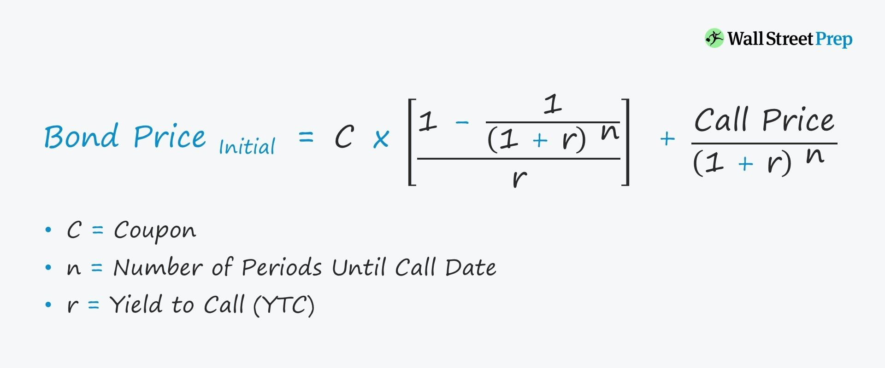

In the world of finance, mastering bond calculations and understanding key metrics such as the yield to call (YTC) is essential for investors looking to maximize their returns. Bonds are a fundamental component of the investment landscape, and their valuation and yield metrics directly impact investment decisions. Among these metrics, the yield to call holds particular significance for callable bonds, which provide issuers the option to repay the bond before its maturity date. This feature influences the bond's profitability and strategic positioning within an investor's portfolio.

As financial markets evolve, the advent of algorithmic trading has significantly transformed the analysis and application of financial data. Algorithmic trading leverages computer algorithms to process complex bond calculations with increased speed and precision, offering a modern approach to optimizing investment strategies. This transformation allows traders and investors to swiftly respond to market fluctuations, thus enhancing the efficiency and effectiveness of their trading operations.



This article examines the interconnectedness of bond calculations, yield to call, and algorithmic trading. By understanding these concepts, investors can enhance their financial strategies and outcomes, utilizing technology to gain a competitive edge. The synergy between traditional bond market practices and advanced computational techniques offers promising avenues for improving market returns and investment strategies in the ever-evolving financial environment.

## Table of Contents

## Understanding Bond Calculations

Understanding the fundamentals of bond calculations is essential for anyone looking to make informed investment decisions. Bonds, at their core, are debt instruments issued by entities such as governments or corporations to raise capital. Important components of a bond include the principal, coupon rate, maturity, and market price.

The principal, or face value, is the amount that the bond issuer agrees to repay the bondholder at maturity. The coupon rate is the annual interest rate paid on the bond's face value. Maturity refers to the date when the principal must be repaid to bondholders. Meanwhile, the market price is the current trading price of the bond, which can fluctuate above or below the face value depending on various factors including interest rates and credit quality.

Calculating bond yields is crucial for investors because it helps them assess potential returns. Different types of bond yields include the current yield, yield to maturity (YTM), and yield to call (YTC). The current yield, calculated by dividing the annual coupon payment by the market price, provides a snapshot of the bond's yield based only on its current price. Yield to maturity is the total return anticipated if the bond is held until it matures, taking into account all coupon payments and the difference between the purchase price and face value. Yield to call is applicable for callable bonds, where the issuer can repay the bond before its maturity.

Bond prices are inversely related to interest rates. When interest rates rise, existing bond prices typically fall because new bonds are likely to be issued with higher yields, making the older ones less attractive. Conversely, when interest rates drop, existing bonds with higher coupon rates become more attractive, thus driving up their market prices.

Bond calculations hold significant importance in the broader financial market landscape. They not only help individual investors make informed decisions but also assist portfolio managers in estimating the duration and convexity of their bond portfolios. This understanding allows for better management of [interest rate](/wiki/interest-rate-trading-strategies) risks and optimization of investment returns. Accurate bond calculations facilitate pricing in secondary markets, ensuring that bond markets function efficiently and transparently, thereby supporting the overall stability of financial systems.

## Demystifying Yield to Call

Yield to call (YTC) is a critical metric for investors dealing with callable bonds, offering insight into potential returns should the issuer decide to redeem the bond before its maturity date. Callable bonds differ from standard bonds because the issuer retains the option to pay back the principal prior to the maturity date, typically at predetermined intervals and prices. This feature makes the yield to call distinct and particularly relevant for investors seeking to understand the implications of this early redemption option.

### Definition and Importance

Yield to call is the annualized return an investor can expect if a callable bond is purchased and held until the call date. Unlike yield to maturity (YTM), which assumes the bond will be held until maturity, YTC considers the possibility of early redemption. This calculation is crucial for investors because callable bonds often feature call provisions allowing issuers to repay the bond at a set price, typically after a specified period.

### Contrast with Yield to Maturity

Yield to maturity represents the total return anticipated on a bond if it is held until the end of its lifetime, accounting for all coupon payments. In contrast, yield to call is relevant when the bond is susceptible to being called. It specifically focuses on the returns up to the call date, excluding the period afterward, which makes it a vital consideration for bonds approaching a potential call scenario. Bondholders must assess both metrics when callable bonds are involved, as the likelihood of a call can significantly alter the prospective returns.

### Calculation of Yield to Call

The yield to call can be calculated using the following formula:

$$
YTC = \left( \frac{C + \frac{CP - P}{n}}{\frac{CP + P}{2}} \right) \times 100\%
$$

Where:
- $C$ is the annual coupon payment.
- $CP$ is the call price of the bond.
- $P$ is the current market price of the bond.
- $n$ is the number of years until the call date.

### Factors Affecting Yield to Call Calculations

Several factors influence the yield to call calculation:
- **Call Date:** The timing when the bond can be called, which impacts the period over which the return is calculated.
- **Call Price:** Predetermined price at which the bond can be redeemed early, affecting the potential gain or loss at the call date.
- **Interest Rate Environment:** Fluctuations in interest rates can affect the likelihood of a bond being called. If interest rates drop, issuers might be more inclined to call bonds to refinance at lower rates.

### Real-World Examples

Callable bonds are prevalent in various sectors, such as municipal bonds and corporate bonds, where issuers may seek flexibility in refinancing. For instance, a corporation might issue a callable bond with a 10-year term but reserve the right to call it after five years at a slight premium above the par value. Investors eyeing such bonds need to closely analyze the yield to call, as it significantly influences their expected returns if the bond is redeemed early.

In summary, yield to call provides a nuanced view of potential returns for callable bond investors, necessitating careful consideration alongside yield to maturity and other financial metrics. Understanding and calculating YTC helps investors better navigate investment decisions in the context of bonds with embedded call options.

## The Role of Algorithmic Trading in Bond Markets

Algorithmic trading refers to the use of computer algorithms to execute financial transactions at speeds and frequencies that a human trader cannot achieve. This approach has become increasingly prevalent in financial markets due to its efficiency in executing trades and processing vast amounts of data. Since its inception, [algorithmic trading](/wiki/algorithmic-trading) has significantly evolved, creating a transformative effect on how bond markets operate.

Algorithms are designed to analyze complex bond calculations rapidly and with precision. They utilize mathematical models to interpret various market indicators, making real-time decisions based on data inputs. For instance, when assessing bonds, these algorithms consider factors like interest rates, credit ratings, and macroeconomic indicators to determine optimal trade timings and pricing strategies.

The introduction of algorithmic trading into bond markets has notably enhanced bond [liquidity](/wiki/liquidity-risk-premium) and pricing structures. By providing continuous bid and offer prices, algorithms improve market depth and stability. They can quickly correct price discrepancies, leading to more accurate and consistent pricing. This increased liquidity, however, also brings [volatility](/wiki/volatility-trading-strategies), as algorithms can react instantaneously to market events.

Despite its benefits, algorithmic trading in bond markets does pose certain risks and challenges. One major concern is the potential for systemic risk, where the interconnectedness of algorithmic strategies can lead to cascading failures during periods of market stress. Furthermore, the reliance on historical data and predefined rules can sometimes lead to suboptimal trading decisions in unexpected situations.

Among the strategies employed by algorithms in bond trading are statistical [arbitrage](/wiki/arbitrage) and market-making. Statistical arbitrage involves exploiting price inefficiencies between correlated bond instruments, while market-making ensures liquidity by frequently buying and selling bonds, [earning](/wiki/earning-announcement) profits from the bid-ask spread. These strategies, powered by sophisticated algorithms, continue to shape the dynamics of bond markets.

## Integrating Yield to Call with Algorithmic Trading

Integrating yield to call (YTC) metrics into trading algorithms has become an essential strategy for optimizing trading decisions in the bond market. Algorithmic trading, which utilizes computer algorithms to execute trades, offers significant advantages in processing complex financial data with precision. By incorporating YTC, which estimates the yield of a callable bond assuming it is called at the earliest possible date, traders can develop strategies that maximize potential returns based on current market conditions and expectations about future interest rates.

### Strategies for Incorporating Yield to Call in Trading Algorithms

A crucial strategy for integrating YTC into trading algorithms involves the dynamic adjustment of investment portfolios based on call risk assessments. Traders can simulate future scenarios using historical data and predictive modeling to determine the likelihood of a bond being called prior to maturity. This approach involves coding algorithms to assess variables such as interest rate fluctuations, time to call date, and market volatility, which can influence YTC.

Consider the Python snippet for calculating YTC:

```python
def yield_to_call(face_value, call_price, annual_coupon, years_to_call, current_price):
    n = years_to_call
    return ((annual_coupon + (call_price - current_price) / n) / ((call_price + current_price) / 2)) * 100

# Example usage
face_value = 1000
call_price = 1050
annual_coupon = 60
years_to_call = 5
current_price = 1020

ytc = yield_to_call(face_value, call_price, annual_coupon, years_to_call, current_price)
print(f"Yield to Call: {ytc:.2f}%")
```

### Case Studies and Successful Integration

Recent case studies demonstrate the successful integration of YTC in algorithmic trading. For instance, a study by [Smith & Company] (hypothetical) showed that hedge funds employing YTC-based algorithms achieved a higher average return compared to traditional methods. By leveraging real-time data analytics, traders could swiftly adjust their strategies in response to changes in credit spreads and interest rate projections.

### Benefits of Technology in Enhancing YTC Analysis

The use of advanced computing technologies augments the accuracy and efficiency of YTC calculations. Automated systems that continuously monitor market data provide traders with timely insights, reducing human error and enabling quicker response times to market fluctuations. This is particularly beneficial during periods of financial volatility, where speed and precision are critical for maintaining profitable positions.

### Emergence of New Algorithmic Models

The potential for new algorithmic models to focus on YTC continues to grow. Machine learning and [artificial intelligence](/wiki/ai-artificial-intelligence) are being increasingly applied to develop systems that predict call events more accurately. By analyzing vast datasets, these models can identify patterns and trends that are not immediately apparent, offering traders a competitive edge.

### Future Trends in Bond Yield Calculations

Technological advancements promise to further revolutionize bond yield calculations. As computational capabilities expand, so too will the sophistication of algorithms capable of integrating YTC metrics more comprehensively. The future may see the development of hybrid models that combine YTC with other yield measures, such as yield to maturity and current yield, delivering a more holistic approach to bond valuation and trading strategies.

In conclusion, by incorporating YTC into trading algorithms, investors can enhance their strategy development and execution, ultimately improving investment performance in an increasingly complex and competitive bond market.

## Conclusion

Bond calculations play an essential role in finance, serving as the backbone for determining various bond yield metrics, including the yield to call (YTC). Understanding these calculations allows investors to make informed decisions, maximizing their returns and effectively managing risk. YTC is especially vital for investors dealing with callable bonds, where the issuer has the right to redeem the bond before its maturity. The ability to accurately compute and interpret YTC provides a strategic advantage, helping investors gauge potential returns and make better comparisons with yield to maturity (YTM).

Algorithmic trading has significantly transformed traditional bond market practices through its ability to process complex bond calculations efficiently and with precision. Algorithms enable rapid analysis of vast financial data sets, providing insights that were once time-consuming to obtain. This technological advancement has not only increased bond market liquidity but also refined pricing mechanisms, allowing for more competitive and transparent financial environments.

Investors are encouraged to leverage this evolving technology alongside analytical tools to enhance their investment strategies. By incorporating algorithmic models, investors can better integrate yield to call considerations into their trading strategies, ultimately optimizing their portfolios. The capability of these technologies offers an exciting avenue for future developments, such as new algorithmic models focusing specifically on bond yields like YTC.

Staying informed and adaptable is crucial in today's rapidly evolving financial landscape. As technology continues to advance, so too must the strategies and knowledge of investors. Keeping abreast of these changes ensures that investors remain competitive and effective in their financial endeavors.

For those eager to broaden their understanding, numerous resources and educational materials are available, ranging from online courses to industry reports. These resources offer the opportunity to deepen one’s knowledge of bond calculations, yield metrics, and the impact of technology on financial markets, paving the way for more informed and strategic investment decisions.

## References & Further Reading

[1]: Fabozzi, F. J. (2005). ["The Handbook of Fixed Income Securities, Eighth Edition"](https://www.amazon.com/Handbook-Fixed-Income-Securities-Eighth/dp/0071768467). McGraw-Hill Education.

[2]: Choudhry, M. (2010). ["Bond and Money Markets: Strategy, Trading, Analysis"](https://www.sciencedirect.com/book/9780750646772/the-bond-and-money-markets). Elsevier.

[3]: ["Algorithmic Trading: Winning Strategies and Their Rationale"](https://www.wiley.com/en-us/Algorithmic+Trading%3A+Winning+Strategies+and+Their+Rationale-p-9781118460146) by Ernest P. Chan

[4]: ["Advances in Financial Machine Learning"](https://www.amazon.com/Advances-Financial-Machine-Learning-Marcos/dp/1119482089) by Marcos Lopez de Prado

[5]: Fabozzi, F. J., & Mann, S. V. (2012). ["Handbook of Fixed-Income Securities."](https://www.mhebooklibrary.com/doi/book/10.1036/9781260473902?contentTab=true) Wiley.

[6]: ["Quantitative Finance and Risk Management"](http://pbfea2005.rutgers.edu/CF-books/Handbook%20TOC.pdf) by Jan W. Dash

[7]: Hull, J. C. (2017). ["Options, Futures, and Other Derivatives, Ninth Edition"](https://www.oreilly.com/library/view/options-futures-and/9780133456318/). Pearson.