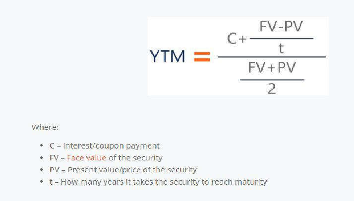

## Table of Contents

## What is a zero-coupon bond?

A zero-coupon bond is a type of bond that does not pay interest during its term. Instead, it is sold at a discount to its face value, and when it matures, the investor receives the full face value. For example, you might buy a zero-coupon bond for $800, but when it matures, you get $1,000. The difference between what you paid and what you get at the end is your profit, which is like the interest you would get from other types of bonds.

These bonds are often used by investors who want a guaranteed return at a future date without the need for regular interest payments. They are popular for saving for future expenses like college tuition or retirement because you know exactly how much money you will have at the end. However, because they do not pay interest along the way, they can be riskier if you need to sell them before they mature, as their value can change based on interest rates.

## What is Yield to Maturity (YTM)?

Yield to Maturity (YTM) is a way to figure out how much money you will make from a bond if you keep it until it matures. It's like the total interest you earn, but it's shown as a yearly rate. When you buy a bond, you might pay less than what it's worth at the end. The YTM tells you how much you're really earning each year from that difference.

For example, if you buy a bond for $950 that will be worth $1,000 when it matures in 5 years, the YTM helps you see your yearly gain. It takes into account the price you paid, the amount you'll get at the end, and how long you have to wait. The YTM is useful because it gives you a single number to compare different bonds and see which one might be a better investment for you.

## Why is YTM important for zero-coupon bonds?

Yield to Maturity (YTM) is really important for zero-coupon bonds because these bonds don't pay interest along the way. Instead, you buy them at a lower price and get the full amount when they mature. YTM helps you figure out what your yearly return is, even though you're not getting any money until the end. It's like figuring out how much you're earning each year from the difference between what you paid and what you'll get at the end.

For someone thinking about buying a zero-coupon bond, knowing the YTM is key. It tells you if the bond is a good deal compared to other investments. If the YTM is higher than what you could get from other safe investments, then the zero-coupon bond might be a better choice. It's a simple way to see if waiting until the bond matures will be worth it for you.

## How does the absence of coupon payments affect the YTM calculation for zero-coupon bonds?

The absence of coupon payments simplifies the YTM calculation for zero-coupon bonds. Since these bonds don't pay interest along the way, you don't have to add up a bunch of interest payments to figure out your return. Instead, you just need to know how much you paid for the bond, how much you'll get when it matures, and how long you have to wait. The YTM is the rate that makes the present value of the bond's face value equal to what you paid for it.

This makes the calculation easier because you're only dealing with two main numbers: the price you paid and the face value you'll get at the end. For example, if you buy a zero-coupon bond for $800 that will be worth $1,000 in 5 years, the YTM is the rate that makes $1,000 in 5 years worth $800 today. This rate tells you what you're earning each year on your investment, even though you won't see any money until the bond matures.

## What formula is used to calculate the YTM of a zero-coupon bond?

The formula to calculate the Yield to Maturity (YTM) of a zero-coupon bond is pretty straightforward. You use the formula: YTM = (Face Value / Purchase Price)^(1/Number of Years) - 1. Here, the Face Value is what you get when the bond matures, the Purchase Price is what you paid for the bond, and the Number of Years is how long you have to wait until the bond matures.

Let's say you buy a zero-coupon bond for $800 that will be worth $1,000 in 5 years. You plug those numbers into the formula: YTM = ($1,000 / $800)^(1/5) - 1. When you do the math, you find that the YTM is about 4.56%. This means you're earning around 4.56% each year on your investment, even though you won't see any money until the bond matures.

## Can you explain each component of the YTM formula for a zero-coupon bond?

The YTM formula for a zero-coupon bond has three main parts: the Face Value, the Purchase Price, and the Number of Years. The Face Value is the amount of money you get when the bond matures. It's like the final prize you're waiting for. The Purchase Price is what you pay to buy the bond. It's always less than the Face Value because you're not getting any interest along the way. The Number of Years is how long you have to wait from when you buy the bond until it matures. This tells you how long your money is tied up.

When you put these parts into the formula, YTM = (Face Value / Purchase Price)^(1/Number of Years) - 1, you figure out your yearly return. The formula works by finding the rate that makes the future Face Value worth the same as the Purchase Price today. It's a bit like magic, but it's really just math that helps you see how much you're earning each year, even though you won't see any money until the bond matures.

## What are the steps to calculate the YTM of a zero-coupon bond?

To calculate the Yield to Maturity (YTM) of a zero-coupon bond, you first need to know three things: the Face Value, which is what you get when the bond matures; the Purchase Price, which is what you paid for the bond; and the Number of Years, which is how long you have to wait until the bond matures. Once you have these numbers, you can use them in a simple formula.

The formula for YTM is YTM = (Face Value / Purchase Price)^(1/Number of Years) - 1. Let's say you buy a zero-coupon bond for $800 that will be worth $1,000 in 5 years. You plug those numbers into the formula: YTM = ($1,000 / $800)^(1/5) - 1. When you do the math, you find that the YTM is about 4.56%. This means you're earning around 4.56% each year on your investment, even though you won't see any money until the bond matures.

## How does the time to maturity impact the YTM of a zero-coupon bond?

The time to maturity has a big effect on the YTM of a zero-coupon bond. If the bond takes longer to mature, the YTM will be lower because you have to wait longer to get your money back. For example, if you buy a bond for $800 that will be worth $1,000 in 10 years, the YTM will be lower than if the same bond matured in 5 years. This is because the longer you wait, the less your yearly return is, even though the total amount you get at the end stays the same.

On the other hand, if the bond matures sooner, the YTM will be higher. This is because you get your money back faster, so your yearly return is bigger. For instance, if you buy a bond for $800 that will be worth $1,000 in 3 years, the YTM will be higher than if it took 10 years to mature. So, the time to maturity is really important when you're figuring out how much you're earning each year from a zero-coupon bond.

## What are the common pitfalls to avoid when calculating YTM for zero-coupon bonds?

When calculating the YTM for zero-coupon bonds, one common mistake is not considering the time to maturity correctly. If you mix up the years or use the wrong number, your YTM will be off. It's like trying to bake a cake but getting the oven temperature wrong; your cake won't turn out right. Always double-check the time until the bond matures because it really changes how much you're earning each year.

Another pitfall is not understanding that the YTM is an annual rate. Sometimes people think it's the total return over the life of the bond, but it's actually how much you're earning each year. If you don't see it that way, you might think the bond is a better or worse deal than it really is. It's like thinking a marathon is just a quick sprint; you need to know it's a long run to plan right.

## How does the market interest rate influence the YTM of a zero-coupon bond?

The market interest rate has a big impact on the YTM of a zero-coupon bond. When the market interest rates go up, the price of zero-coupon bonds usually goes down. This happens because new bonds being sold will have higher YTMs to match the higher market rates. If you want to sell your zero-coupon bond before it matures, you'll have to sell it for less to compete with these new bonds. So, even though the YTM you bought it at stays the same, the YTM for someone buying it now would be higher because they're paying less for the same future payout.

On the flip side, when market interest rates go down, the price of zero-coupon bonds goes up. This is because your bond now looks more attractive compared to new bonds with lower YTMs. If you decide to sell your bond before it matures, you can sell it for more because people are willing to pay more for the higher YTM your bond offers. But remember, the YTM you calculated when you bought the bond doesn't change; it's just that the YTM for someone buying it now would be lower because they're paying more for the same future payout.

## What are the tax implications of YTM on zero-coupon bonds?

When you own a zero-coupon bond, even though you don't get any money until it matures, you still have to pay taxes on the interest you're earning each year. This is called imputed interest. The IRS treats the difference between what you paid for the bond and what you'll get at the end as interest income, and you have to report a part of that each year as if you were getting paid. This can be a surprise because you're not actually getting any money, but you still have to pay taxes on it.

This tax situation can make zero-coupon bonds less appealing if you're in a high tax bracket because you're paying taxes on money you don't have yet. However, there are some ways to make it easier. For example, you can buy zero-coupon bonds in tax-deferred accounts like IRAs, where you don't have to pay taxes on the interest until you take the money out. This can help you avoid the yearly tax hit and make the bond a better fit for your investment plans.

## How can investors use YTM to compare different zero-coupon bonds?

Investors can use YTM to compare different zero-coupon bonds by looking at the yearly return they would get from each bond. If you have two bonds with the same face value and time to maturity, but one costs less than the other, the one that costs less will have a higher YTM. This means you're earning more each year on the bond that costs less. So, if you're trying to decide between two bonds, you can see which one gives you a better yearly return by comparing their YTMs.

Even if the bonds have different face values or times to maturity, YTM still helps. You can compare a bond that costs $800 and matures in 5 years to one that costs $900 and matures in 10 years. The YTM calculation takes into account the price you pay, what you get at the end, and how long you have to wait. By looking at the YTMs, you can figure out which bond gives you a better yearly return, no matter how different they are. This makes it easier to pick the best investment for your needs.

## How do you calculate the Yield to Maturity (YTM) for Zero-Coupon Bonds?

Yield to Maturity (YTM) for zero-coupon bonds is calculated using a formula that reflects the unique nature of these securities. The standard equation for determining the YTM of a zero-coupon bond is:

$$

\text{YTM} = \left(\frac{\text{Face Value}}{\text{Current Price}}\right)^{\frac{1}{\text{Years to Maturity}}} - 1 
$$

This equation captures how these bonds generate returns solely from capital appreciation, as opposed to periodic interest payments seen in traditional coupon bonds. One significant advantage of zero-coupon bonds is the absence of reinvestment risk, which typically arises when intermediate coupon payments need to be reinvested at potentially varying interest rates. By not requiring such reinvestment, zero-coupon bonds offer a more straightforward assessment of expected returns.

### Example Calculation

To illustrate, consider a zero-coupon bond with a face value of $1,000, purchased at a price of $925, and set to mature in 2 years. Applying the formula:

1. **Identify the parameters:**
   - Face Value = $1,000
   - Current Price = $925
   - Years to Maturity = 2

2. **Plug the values into the formula:**

$$

\text{YTM} = \left(\frac{1000}{925}\right)^{\frac{1}{2}} - 1 
$$

3. **Calculate the YTM:**

First, calculate the fraction:

$$
\frac{1000}{925} \approx 1.0811
$$

Then, take the square root (as the bond matures in 2 years):

$$
1.0811^{\frac{1}{2}} \approx 1.0398
$$

Finally, subtract 1 to determine the YTM:

$$
1.0398 - 1 = 0.0398
$$

Thus, the Yield to Maturity is approximately 3.98%.

In practice, investors and finance professionals might use programming languages like Python to automate this calculation, especially when dealing with large datasets or portfolios. A simple Python function could be defined as follows:

```python
def calculate_zero_coupon_ytm(face_value, current_price, years_to_maturity):
    return ((face_value / current_price) ** (1 / years_to_maturity)) - 1

# Example:
face_value = 1000
current_price = 925
years_to_maturity = 2

ytm = calculate_zero_coupon_ytm(face_value, current_price, years_to_maturity)
print(f"The YTM is approximately: {ytm:.4%}")
```

This code provides a straightforward method to compute YTM, thereby assisting investors and traders in assessing potential returns efficiently.

## What is the conclusion?

Zero-coupon bonds are integral to both traditional investing and algorithmic trading because of their unique structure and predictable cash flows. These bonds, which do not provide periodic interest payments, are generally issued at a discount and mature at their face value, offering returns through capital appreciation. This characteristic makes them sensitive to interest rate fluctuations, a crucial [factor](/wiki/factor-investing) that investors must consider when incorporating them into a portfolio.

A fundamental skill for investors dealing with zero-coupon bonds is understanding and accurately calculating the yield to maturity (YTM). The YTM, which determines the expected total return on investment if the bond is held until maturity, is calculated as:

$$
\text{YTM} = \left(\frac{\text{Face Value}}{\text{Current Price}}\right)^{\frac{1}{\text{Years to Maturity}}} - 1
$$

This formula helps investors evaluate the bond's potential returns and make informed decisions about their investments.

In algorithmic trading, zero-coupon bonds allow for enhanced strategic planning. Their predictable cash flows and interest rate sensitivity are instrumental in developing models that manage portfolio duration and analyze yield curves. Advanced algorithms can exploit these characteristics for arbitrage opportunities or to hedge against interest rate risks, ultimately optimizing trading strategies.

By utilizing sophisticated trading platforms and algorithmic models, investors can better navigate the complexities of the financial markets, ensuring more favorable outcomes. These approaches enable the identification of strategic buying and selling opportunities, thus maximizing the potential benefits of zero-coupon bonds within an investment portfolio.

## References & Further Reading

[1]: Fabozzi, F. J. (2012). ["Bond Markets, Analysis, and Strategies"](https://books.google.com/books/about/Bond_Markets_Analysis_and_Strategies_ten.html?id=bQpNEAAAQBAJ). Pearson.

[2]: Hull, J. C. (2018). ["Risk Management and Financial Institutions"](https://www.amazon.com/Management-Financial-Institutions-Wiley-Finance/dp/1119448115). Wiley Finance.

[3]: ["Advances in Financial Machine Learning"](https://www.amazon.com/Advances-Financial-Machine-Learning-Marcos/dp/1119482089) by Marcos Lopez de Prado

[4]: Brandimarte, P. (2018). ["Introduction to Distribution Logistics, Supply Chains, and Knowledge Sharing: Using OPC Unified Architecture"](http://www.heygatetranslations.co.uk/files/detail/Documents/introduction_to_distribution_logistics_paolo_brandimarte.pdf). Wiley.

[5]: ["Fixed Income Analysis"](https://en.wikipedia.org/wiki/Fixed_income_analysis) by Barbara S. Petitt, Jerald E. Pinto.