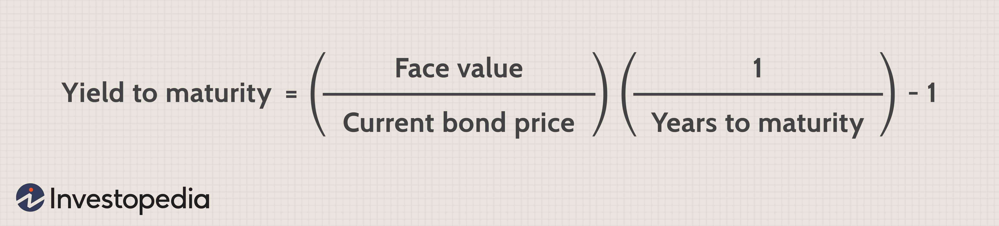

In the complex world of bond markets, understanding key terms and processes is crucial for making informed investment decisions. Bonds, as fixed-income securities, represent a significant component of the global financial markets and offer investors various opportunities to achieve their financial goals. However, to successfully navigate this landscape, investors must familiarize themselves with certain financial metrics and strategies.

This article focuses on three critical components that play a significant role in bond comparison and trading: yield to maturity (YTM), coupon rate, and algorithmic trading strategies. Yield to maturity is an essential metric that represents the total anticipated return on a bond if it is held until its maturity date. It aids investors in estimating the potential profitability of their bond investments. On the other hand, the coupon rate signifies the annual interest rate paid by the bond issuer to the bondholder, expressed as a percentage of the bond's face value. Both yield to maturity and the coupon rate are vital for evaluating the performance of bonds and making strategic investment decisions.



In recent years, algorithmic trading has gained prominence in bond markets. It involves the use of pre-programmed software to execute trades swiftly and efficiently, often leveraging financial metrics such as YTM and coupon rates. The application of algorithmic trading in bond markets offers numerous advantages, including increased liquidity and reduced transaction costs, thus optimizing trading strategies.

This article aims to equip investors with a thorough understanding of these financial concepts, enabling them to apply this knowledge to enhance their trading strategies. By comprehending the intricacies of yield to maturity, coupon rates, and algorithmic trading, investors can better position themselves to navigate the complexities of the bond market and optimize their investment outcomes.

## Table of Contents

## Understanding Key Bond Concepts

Understanding key bond concepts is fundamental for any investor navigating the bond markets. Yield to Maturity (YTM) and the coupon rate are two critical metrics that significantly influence bond valuation and investment strategies.

Yield to Maturity (YTM) is a measure that represents the total return an investor can expect to earn if the bond is held until it matures, assuming that all coupon and principal payments are made as scheduled. YTM is expressed as an annual rate, and it encompasses all components of a bond's yield, including interest payments and any capital gain or loss that occurs if the bond is purchased at a discount or premium to its face value. The calculation for YTM can be complex as it solves for the discount rate that equates the present value of all future cash flows (coupon payments and face value) with the bond's current market price. It involves solving the following equation:

$$
P = \sum_{t=1}^{N} \frac{C}{(1 + YTM)^t} + \frac{F}{(1 + YTM)^N}
$$

Where:
- $P$ is the current price of the bond,
- $C$ is the annual coupon payment,
- $F$ is the face value of the bond,
- $N$ is the number of years to maturity.

The coupon rate, on the other hand, is the rate at which the bond issuer pays interest to the bondholder. It is usually expressed as a percentage of the bond's face value. For example, if a bond has a face value of $1000 and an annual coupon rate of 5%, the issuer will pay $50 in interest each year. The coupon rate is fixed and does not change over the life of the bond. This rate is essential for investors because it determines the bond’s income-generating capacity, impacting the cash flow that the investor receives.

Understanding the interplay between YTM and the coupon rate is crucial for evaluating a bond's performance. While the coupon rate provides a straightforward measure of annual income from the bond, YTM offers a more comprehensive picture of the bond's total return, incorporating both income and capital gains or losses due to market price fluctuations. A bond selling at a discount (market price lower than face value) will have a YTM higher than its coupon rate, whereas a bond selling at a premium (market price above face value) will have a YTM lower than its coupon rate.

Investors use these metrics for making strategic investment choices, such as determining the attractiveness of a bond relative to others or deciding whether to hold it until maturity or consider alternative options. Evaluating both the YTM and coupon rate positions investors to make well-informed decisions tailored to their investment objectives and market conditions.

## Bond Valuation Basics

Bond valuation involves determining the present value of a bond's expected future cash flows, which consist of periodic coupon payments and the final redemption of the bond's face value at maturity. This valuation plays a critical role in assessing investment attractiveness and verifying if a bond is appropriately priced in the market.

The present value $PV$ of a bond can be calculated using the following formula:

$$
PV = \sum_{t=1}^{T} \frac{C}{(1 + r)^t} + \frac{F}{(1 + r)^T}
$$

Where:
- $C$ is the coupon payment per period,
- $T$ is the total number of periods until maturity,
- $r$ is the discount rate or yield to maturity,
- $F$ is the face value of the bond.

Key factors influencing bond valuation include par value, coupon rate, and discount rate.

1. **Par Value**: This is the bond's face value, which is the amount paid back to the bondholder at maturity. It serves as a baseline against which coupons are calculated.

2. **Coupon Rate**: This fixed rate determines the bond’s periodic interest payment, expressed as a percentage of the bond's par value. A higher coupon rate often makes a bond more attractive to investors, all else being equal, as it provides regular income.

3. **Discount Rate**: Also known as the required rate of return or yield, the discount rate reflects the investor's required compensation for the bond's risk. Factors affecting this rate include interest rate levels, inflation expectations, and the issuer's creditworthiness. The discount rate is pivotal in converting future cash flows to their present values in the bond pricing equation.

Investors use these factors to assess the bond's market price compared to its intrinsic value. If the calculated present value is higher than the current market price, the bond may be considered underpriced, indicating a potential buying opportunity. Conversely, if the market price exceeds the present value, the bond might be deemed overpriced.

In the context of [algorithmic trading](/wiki/algorithmic-trading) and financial modeling, Python is frequently used for bond valuation and analysis. Here is a simple Python code snippet to calculate the present value of a bond:

```python
def bond_valuation(face_value, coupon_rate, market_rate, periods):
    pv_coupons = sum(face_value * coupon_rate / ((1 + market_rate) ** t) for t in range(1, periods + 1))
    pv_face_value = face_value / ((1 + market_rate) ** periods)
    return pv_coupons + pv_face_value

# Example usage
face_value = 1000  # Face value of the bond
coupon_rate = 0.05  # 5% annual coupon rate
market_rate = 0.04  # 4% current market rate
periods = 10  # Bond matures in 10 years

present_value = bond_valuation(face_value, coupon_rate, market_rate, periods)
print(f"The present value of the bond is: ${present_value:.2f}")
```

Through rigorous bond valuation, investors can make informed decisions to optimize returns and manage risk effectively within their portfolios.

## Algorithmic Trading in Bond Markets

Algorithmic trading in bond markets leverages pre-programmed software to execute trades with precision and speed, revolutionizing how bonds are traded. These algorithms utilize financial metrics such as Yield to Maturity (YTM) and the coupon rate to refine trading strategies, enabling traders to make data-driven decisions aimed at optimizing returns.

YTM and coupon rates are critical metrics in bond trading. Algorithms process this information to gauge the potential profitability of bonds, comparing the expected earnings derived from a bond's YTM against current market conditions. This data is processed rapidly to identify favorable trading opportunities, thus making algorithmic trading a powerful tool for investors seeking to maximize efficiency. 

An additional benefit is increased [liquidity](/wiki/liquidity-risk-premium)—algorithmic trading injects [volume](/wiki/volume-trading-strategy) and reduces the bid-ask spread by facilitating a greater number of trades within shorter periods. This enhanced liquidity leads to more stable prices and a more accessible market for small and large investors alike. Furthermore, the speed and efficiency of algorithms contribute to reduced transaction costs. By minimizing manual intervention, algorithms cut down on the time and resources needed to execute trades, resulting in cost savings that can be passed to investors.

Due to these advantages, algorithmic trading has become a dominant force in bond markets, providing enhanced trading precision, efficiency, and financial returns. The synergy between YTM, coupon rates, and advanced algorithms continues to push the boundaries of traditional bond trading, offering promising prospects for financially savvy investors.

## Integrating YTM, Coupon Rates, and Algorithms

Strategically employing Yield to Maturity (YTM) and coupon rates within algorithmic trading offers a methodical approach to enhancing investment outcomes. By leveraging these financial metrics, investors can deploy algorithms to identify [arbitrage](/wiki/arbitrage) opportunities and optimize their bond trading strategies.

To effectively integrate YTM and coupon rates into trading algorithms, it is essential to understand their individual roles and how they can interplay within automated systems. YTM provides insights into the potential long-term return of a bond, helping investors gauge the time value of money if the bond is held until its maturity. Meanwhile, the coupon rate represents the fixed periodic interest payment of a bond, crucial for understanding the income generated from holding the bond. By combining these metrics in trading strategies, investors can aim to maximize returns while minimizing risks.

### Methods of Integrating Metrics into Trading Algorithms

1. **Calculating Present Value and Discounting Future Cash Flows**:
   A fundamental process in utilizing YTM and coupon rates is the calculation of present value for a bond's expected cash flows. The formula for present value (PV) is:
$$
   PV = \sum_{t=1}^{n} \frac{C}{(1 + r)^t} + \frac{F}{(1 + r)^n}

$$

   Where:
   - $C$ is the coupon payment,
   - $r$ is the discount rate approximated by YTM,
   - $t$ is the time period,
   - $F$ is the face value of the bond,
   - $n$ is the total number of periods.

   By discounting future cash flows, the algorithm can assess whether the bond is underpriced in the market, indicating potential arbitrage opportunities.

2. **Python Code Example for Calculating YTM and Arbitrage Identification**:
   A Python script can be utilized to compute the YTM and identify arbitrage opportunities based on deviations between the calculated YTM and current market rates:

   ```python
   def calculate_ytm(face_value, market_price, coupon_rate, periods):
       ytm = 0.05  # An initial guess for YTM
       epsilon = 0.0001  # Convergence tolerance
       max_iter = 1000

       for _ in range(max_iter):
           price = sum([coupon_rate * face_value / (1 + ytm)**t for t in range(1, periods + 1)]) + face_value / (1 + ytm)**periods
           ytm += (market_price - price) / face_value

           if abs(market_price - price) < epsilon:
               break

       return ytm

   face_value = 1000
   market_price = 950
   coupon_rate = 0.05
   periods = 10

   computed_ytm = calculate_ytm(face_value, market_price, coupon_rate, periods)
   print(f"Calculated YTM: {computed_ytm:.4f}")

   market_yield = 0.052  # Example current market yield

   if computed_ytm < market_yield:
       print("Opportunity for arbitrage: Bond is undervalued.")
   else:
       print("No arbitrage opportunity: Bond is fairly or overvalued.")
   ```

3. **Leveraging Financial Metrics in Machine Learning Models**:
   Advanced algorithms may incorporate [machine learning](/wiki/machine-learning) models to predict bond price movements based on historical YTM and coupon rate data. By training models on large datasets, the algorithm can recognize patterns and predict future price shifts, optimizing the trading strategy further.

### Practical Implications and Benefits

Implementing YTM and coupon rate analysis within algorithmic trading strategies enables sophisticated approaches to identifying market inefficiencies. Investors can benefit from reduced latency in executing trades and improved accuracy in decision-making, ultimately increasing the likelihood of achieving higher returns and more efficiently managing risk. Additionally, these algorithms facilitate continuous market analysis and automatic recalibration of strategies based on real-time data, ensuring that the trading approach remains aligned with market dynamics.

## Technological Advancements and Future Trends

With significant developments in [artificial intelligence](/wiki/ai-artificial-intelligence) (AI) and machine learning, bond trading is undergoing a transformation towards greater sophistication. These technologies are transforming how traders analyze and interact with the markets, primarily through enhanced predictive capabilities. AI and machine learning algorithms can process vast datasets to identify patterns and trends that may elude human traders. They enable the creation of predictive models that forecast market movements with higher accuracy, assisting traders in making well-informed and timely decisions.

For example, machine learning algorithms can be designed to predict changes in bond prices by analyzing historical market data along with various economic indicators. These algorithms can employ techniques such as supervised learning, where a model is trained on historical data with known outcomes, or unsupervised learning, to identify hidden patterns without pre-labeled outcomes. Consider a simple Python implementation using a machine learning library to predict bond yields:

```python
from sklearn.model_selection import train_test_split
from sklearn.ensemble import RandomForestRegressor
from sklearn.metrics import mean_squared_error

# Load your dataset
data = load_data('bond_market_data.csv')

# Feature selection
features = data[['economic_indicator1', 'economic_indicator2', 'historical_yield']]
target = data['bond_yield']

# Split dataset
X_train, X_test, y_train, y_test = train_test_split(features, target, test_size=0.2, random_state=42)

# Initialize and train the model
model = RandomForestRegressor(n_estimators=100, random_state=42)
model.fit(X_train, y_train)

# Make predictions
predictions = model.predict(X_test)

# Evaluate the model
mse = mean_squared_error(y_test, predictions)
print(f'Mean Squared Error: {mse}')
```

Alongside AI and machine learning, blockchain technology is making significant impacts by enhancing market transparency and reducing transaction costs. Blockchain, the technology underpinning cryptocurrencies, offers a decentralized and distributed ledger system that ensures immutability and transparency of transactions. In bond markets, this means improved trust among market participants and a reduction in the inefficiencies associated with traditional paper-based systems.

The use of smart contracts—self-executing contracts with the terms of the agreement directly written into code—can automate the execution of bond trades, thereby reducing the need for intermediaries, minimizing errors, and streamlining the settlement process. This automation can lead to reduced costs and faster transaction times, significantly improving market efficiency.

As these technological advancements continue to evolve, the landscape of bond trading is likely to shift towards more automated, transparent, and efficient processes. Traders who leverage these technologies can gain deeper insights into the markets and optimize their strategies to enhance investment outcomes. The continued integration of AI, machine learning, and blockchain will likely lead to a more dynamic and competitive market, offering new opportunities for those ready to embrace these changes.

## Conclusion

Understanding and employing yield to maturity (YTM), coupon rates, and algorithmic trading are crucial for optimizing bond investment strategies. These metrics provide a framework for evaluating bond performance, enabling investors to make informed decisions. Yield to maturity offers a comprehensive measure of a bond's expected returns, considering all future cash flows. The coupon rate, representing the annual interest paid, serves as a constant indicator of income potential. Together, these elements allow investors to assess the intrinsic value of bonds and compare them against market prices.

The integration of algorithmic trading strategies further enhances these assessments by automating and optimizing trading processes. Algorithms, capable of analyzing vast datasets efficiently, utilize YTM and coupon rate data to identify profitable trading opportunities, execute trades swiftly, and minimize transaction costs. This precision contributes to increased market liquidity and delivers potential financial gains.

Looking forward, future technological advancements promise further transformation in bond markets. Innovations in artificial intelligence and machine learning are expected to improve predictive analytics, granting traders deeper insights into market trends and behaviors. Concurrently, blockchain technology is projected to augment transparency and efficiency in trading operations, likely reducing costs and increasing trust in transactions.

Investors who adeptly integrate these evolving technologies and methodologies into their strategies are poised to achieve a competitive edge. By staying agile and informed, they can capitalize on new opportunities and navigate the complexities of a rapidly evolving financial landscape. As the bond market continues to evolve, an adept understanding and application of these concepts will be pivotal for sustained success.

## References & Further Reading

[1]: ["Bond Markets, Analysis, and Strategies"](https://books.google.com/books/about/Bond_Markets_Analysis_and_Strategies_ten.html?id=bQpNEAAAQBAJ) by Frank J. Fabozzi

[2]: ["Fixed Income Securities: Tools for Today's Markets"](https://www.amazon.com/Fixed-Income-Securities-Markets-Finance/dp/1119835550) by Bruce Tuckman and Angel Serrat

[3]: ["Algorithmic Trading: Winning Strategies and Their Rationale"](https://books.google.com/books/about/Algorithmic_Trading.html?id=WAlFDwAAQBAJ) by Ernie Chan

[4]: ["Python for Finance: Analyze Big Financial Data"](https://books.google.com/books/about/Python_for_Finance.html?id=E93SBQAAQBAJ) by Yves Hilpisch

[5]: ["Quantitative Finance for Dummies"](https://www.amazon.com/Quantitative-Finance-Dummies-Steve-DPhil/dp/1118769465) by Steve Bell

[6]: ["Machine Learning for Asset Managers"](https://github.com/emoen/Machine-Learning-for-Asset-Managers) by Marcos Lopez de Prado

[7]: ["Principles of Quantitative Equity Investing: A Complete Guide to Creating, Evaluating, and Implementing Trading Strategies"](https://ptgmedia.pearsoncmg.com/images/9780134192796/samplepages/9780134192796.pdf) by Sugata Ray