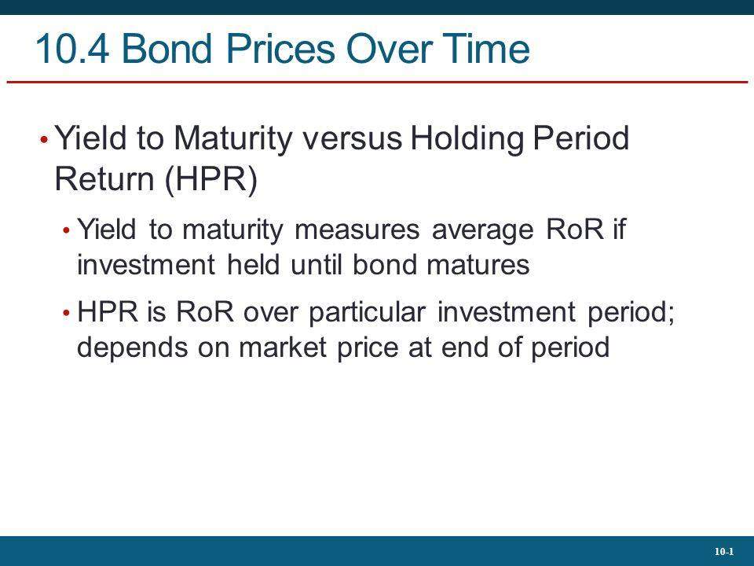

## Table of Contents

## What is Yield to Maturity (YTM)?

Yield to Maturity (YTM) is a way to measure the total return you can expect from a bond if you hold it until it matures. It takes into account the bond's current market price, its face value, the coupon interest rate, and the time left until the bond matures. Essentially, YTM shows you the annual return you would get if you reinvested all the bond's interest payments at the same rate until the bond matures.

Think of YTM as the average interest rate you earn on a bond over its entire life. If you buy a bond at a discount (below its face value), the YTM will be higher than the coupon rate because you're getting the face value back at maturity. If you buy it at a premium (above its face value), the YTM will be lower than the coupon rate because you paid more upfront but still get the same face value at the end. YTM helps investors compare the potential returns of different bonds and make informed investment decisions.

## What is Holding Period Return (HPR)?

Holding Period Return (HPR) is a way to figure out how much money you made or lost on an investment over a certain time. It looks at the total return, including any interest, dividends, or price changes, from the time you bought the investment until you sold it or until a specific date. To calculate HPR, you take the money you get at the end (including any income from the investment) and subtract the money you spent at the start, then divide that by the money you spent at the start.

HPR is useful because it gives you a clear picture of your investment's performance over the time you held it. It's often shown as a percentage, which makes it easy to compare with other investments or with different time periods. Whether you're looking at stocks, bonds, or any other type of investment, HPR helps you understand if your investment strategy is working and how well your money is growing.

## How do you calculate Yield to Maturity?

To calculate Yield to Maturity (YTM), you need to know the bond's current market price, its face value (the amount you get back when it matures), the coupon interest rate, and how many years are left until it matures. You also need to know how often the bond pays interest, usually yearly or semi-annually. The idea is to find the interest rate that makes the present value of all future cash flows from the bond equal to its current market price. This involves using a financial calculator or a computer program because it's a bit like solving a puzzle where you're trying to find the right interest rate.

Let's break it down a bit more. Imagine you have a bond that costs $950 now, has a face value of $1,000, pays a 5% coupon rate yearly, and has 5 years left until it matures. Each year, you get $50 in interest (5% of $1,000). At the end of 5 years, you also get the $1,000 face value back. To find the YTM, you need to figure out the interest rate that makes the sum of the present values of these $50 payments each year, plus the present value of the $1,000 at the end, equal to the $950 you paid for the bond. This calculation can be tricky, so people often use special calculators or software to do it.

## How do you calculate Holding Period Return?

To calculate Holding Period Return (HPR), you take the money you get at the end of holding the investment and subtract the money you paid at the start. Then, divide that difference by the money you paid at the start. For example, if you bought a stock for $100 and sold it for $120 after getting $5 in dividends, your HPR would be ($120 + $5 - $100) / $100, which equals 0.25 or 25%. This percentage tells you how much your investment grew over the time you held it.

HPR is great because it shows the total return on your investment, including any income like dividends or interest, as well as any changes in the investment's price. It's a simple way to see if you made money or lost money over a specific period. You can use HPR to compare different investments or to check how well your investment strategy is working over time.

## What are the key differences between YTM and HPR?

Yield to Maturity (YTM) and Holding Period Return (HPR) are both ways to measure how much money you can make from an investment, but they look at different things. YTM is all about bonds and it tells you what you would earn if you kept the bond until it matures. It takes into account the bond's price now, the amount you get back when it matures, the interest payments you get along the way, and how long you have to wait. YTM gives you an average yearly return, assuming you reinvest all the interest at the same rate.

On the other hand, HPR is a more general way to measure returns that you can use for any kind of investment, like stocks, bonds, or real estate. It looks at how much your investment grew from the time you bought it until you sold it or a certain date. HPR includes any income you got, like dividends or interest, plus any changes in the price of the investment. It gives you a total return over the time you held the investment, and it's usually shown as a percentage.

So, while YTM is focused on the long-term return of a bond if you hold it until it matures, HPR is about the return over whatever period you choose to look at, and it works for any type of investment. YTM is more complex to calculate because it involves figuring out an average rate over time, while HPR is simpler and just shows the total gain or loss over a specific period.

## In what scenarios would an investor use YTM versus HPR?

An investor would use Yield to Maturity (YTM) when they are looking at bonds and want to know the average yearly return they would get if they hold the bond until it matures. YTM is helpful for comparing different bonds because it gives you a single number that shows what you can expect to earn over the life of the bond. It's especially useful if you're planning to keep the bond until it matures and you want to know how it stacks up against other investment options.

On the other hand, an investor would use Holding Period Return (HPR) when they want to see how much they've made or lost on any type of investment over a specific time. HPR is great for looking at the total return, including any income like dividends or interest, and any changes in the investment's price. It's useful for all kinds of investments, not just bonds, and it helps you understand if your investment strategy is working over the period you choose to look at.

## How does the time horizon affect the comparison between YTM and HPR?

The time horizon plays a big role in how you compare Yield to Maturity (YTM) and Holding Period Return (HPR). YTM looks at the average yearly return you would get if you hold a bond until it matures. This means YTM is all about a long-term view, usually several years. If you plan to keep the bond until the end, YTM helps you understand what you can expect to earn over that whole time. So, if your time horizon matches the bond's maturity, YTM is a great way to see if the bond is a good investment for you.

On the other hand, HPR focuses on the total return you get over any time period you choose, which can be short or long. It's useful for any type of investment, not just bonds, and it tells you how much you've made or lost from the time you bought the investment until you sold it or a certain date. If you're looking at how well your investment did over a shorter period, or if you're comparing different kinds of investments over the same time, HPR is the better choice. The time horizon you're interested in will decide which measure is more helpful for your needs.

## Can YTM and HPR provide different insights into the same investment?

Yes, YTM and HPR can give you different views on the same investment, especially when you're looking at bonds. YTM tells you the average yearly return you'd get if you held the bond until it matures. It looks at the bond's current price, the interest payments you'll get, and the amount you'll get back at the end. So, if you're thinking about keeping the bond for the long haul, YTM helps you see if it's a good fit for your investment plans. It's all about what you can expect over the life of the bond.

HPR, on the other hand, shows you the total return you got over any time period you choose. It includes any interest or dividends you received, plus any changes in the investment's price. HPR is useful for any type of investment, not just bonds, and it's great for seeing how well your investment did over a shorter time or comparing different investments. So, if you're more interested in how much you made or lost over a specific period, HPR gives you that information. Both YTM and HPR can help you understand your investment, but they focus on different things and time frames.

## How do interest rate changes impact YTM and HPR?

When interest rates change, it can affect the Yield to Maturity (YTM) of a bond. If interest rates go up, new bonds will offer higher coupon rates, making existing bonds with lower rates less attractive. This can cause the price of the existing bond to drop, which in turn raises its YTM because the bond's fixed payments are now spread over a lower price. On the other hand, if interest rates go down, the price of existing bonds goes up because they're now more attractive than new bonds with lower coupon rates, which lowers the YTM. So, YTM changes with interest rates because it depends on the bond's price, which moves in the opposite direction of interest rates.

For Holding Period Return (HPR), interest rate changes can also have an impact, but it depends on the time period you're looking at. If you hold a bond until interest rates change, and you sell it before it matures, the HPR will reflect any price changes caused by the interest rate shift. If rates go up and you sell your bond at a lower price, your HPR will be lower. If rates go down and you sell at a higher price, your HPR will be higher. HPR looks at the total return over the time you held the investment, so it captures how interest rate changes affected the bond's price during that period.

## What role do reinvestment assumptions play in comparing YTM and HPR?

When you calculate Yield to Maturity (YTM), you're making an assumption about reinvesting the interest payments you get from the bond. YTM assumes that you will reinvest all those interest payments at the same rate as the YTM until the bond matures. This means if you're getting a 5% coupon rate, YTM assumes you'll reinvest those interest payments at 5% too. This assumption can make a big difference because if you can't reinvest at that rate, your actual return might be different from the YTM.

On the other hand, Holding Period Return (HPR) doesn't make any assumptions about reinvesting. HPR just looks at the total return you got over the time you held the investment, including any interest or dividends you received and any changes in the investment's price. It doesn't care what you did with those interest payments after you got them. So, when you compare YTM and HPR, you're comparing a long-term return that assumes reinvestment at a certain rate with a short-term or specific period return that doesn't make that assumption. This difference can help you see how important reinvestment can be for your overall returns.

## How can you use YTM and HPR to assess the risk of an investment?

You can use Yield to Maturity (YTM) to assess the risk of a bond by looking at how it changes with interest rates. If interest rates go up, the price of your bond might go down, which means the YTM goes up. This shows you that there's a risk of losing money if you have to sell the bond before it matures. Also, YTM assumes you can reinvest all the interest payments at the same rate, which might not happen in real life. If you can't reinvest at that rate, your actual return might be less than the YTM, adding more risk to your investment.

Holding Period Return (HPR) helps you see the risk of any investment over a specific time. If you look at HPR over a short period, you can see how much the investment's price and any income from it changed. Big changes in HPR can show that the investment is risky because its value can go up or down a lot in a short time. By comparing HPR over different periods, you can see if the investment is getting more or less risky. Both YTM and HPR give you different ways to understand risk, with YTM focusing on long-term bond risks and HPR looking at total returns over any time you choose.

## What advanced considerations should be taken into account when comparing YTM and HPR for complex securities?

When you're looking at complex securities like mortgage-backed securities or convertible bonds, comparing Yield to Maturity (YTM) and Holding Period Return (HPR) can get tricky. YTM might not be as straightforward because these securities can have changing cash flows. For example, with mortgage-backed securities, people might pay off their mortgages early, which changes how much money you get and when you get it. YTM assumes a steady reinvestment of these payments at the same rate, but if the cash flows are unpredictable, your actual return could be very different. Also, things like call features or conversion options can change the bond's value, making YTM harder to calculate and less reliable as a measure of return.

HPR is simpler because it just looks at the total return over the time you held the investment, but it still needs some careful thought with complex securities. If you're holding a convertible bond, for example, the HPR will depend not just on the bond's interest but also on how the stock it can be converted into performs. This means you have to consider both the bond and stock markets when figuring out HPR. Also, if you're looking at securities with embedded options, like the ability to be called back by the issuer, the HPR can be affected by whether those options get used. So, while HPR gives you a clear picture of what happened over a certain time, you need to think about all the different factors that could change the value of your complex security.

## What is Understanding Investment Returns?

Investment returns are a key indicator of an investment's profitability over a specified period. They encompass various types of income: dividends from stocks, interest from bonds, and capital gains generated from the sale of assets if they have appreciated in value.

Maximizing investment returns while efficiently managing associated risks is a primary focus for investors. Achieving higher returns often requires taking on greater risk, making the balancing act between risk and reward crucial. Investors employ a range of strategies to optimize this balance, often utilizing diversification and asset allocation to minimize potential losses.

The evaluation of investment returns is fundamental to investment decision-making and portfolio management. It involves assessing both historical performance and potential future returns. This evaluation helps in setting realistic investment goals and in choosing suitable investment products to meet those goals.

Investment returns can be calculated in several ways, often expressed as a percentage. A simple method is the basic rate of return, calculated as:

$$
\text{Rate of Return} = \left(\frac{\text{Final Value} - \text{Initial Value}}{\text{Initial Value}}\right) \times 100
$$

where the final value includes all distributions received during the holding period. This formula gives a straightforward depiction of how much an investment has grown over a given period.

A more comprehensive analysis might involve considering annualized returns, which standardize performance figures over different periods to reflect the compound effect. These calculations often account for factors such as the dividends reinvested and inflation-adjusted returns to give a holistic view.

In modern finance, the need for precise and timely evaluation of investment returns has led to the use of technology and software tools. These tools can process vast amounts of data to refine how returns are assessed, providing investors with detailed insights about both current portfolios and potential investment opportunities. Understanding these returns is foundational for investors to make informed decisions and effectively manage their portfolios.

## What is Holding Period Return (HPR)?

Holding period return (HPR) is a financial metric that quantifies the performance of an investment during the duration for which it is held. This concept encompasses both capital gains or losses and the income received from the investment, making it an essential tool for measuring investment performance. HPR is typically expressed as a percentage and is calculated using the following formula:

$$
\text{HPR} = \frac{\text{Income} + \text{End of Period Value} - \text{Initial Value}}{\text{Initial Value}}
$$

The utility of HPR is particularly pronounced when assessing short-term investment performance. This is especially relevant for bonds that are actively traded on the secondary market, where prices fluctuate frequently. For investors who often engage in buying and selling assets, a nuanced understanding of HPR can facilitate meaningful comparisons across diverse investment opportunities. By calculating HPR, investors gain the ability to evaluate the effectiveness of each investment relative to others in their portfolio.

Moreover, HPR is not restricted solely to bonds; it is applicable across various asset classes, including stocks and real estate, as long as there is a clear understanding of the initial and ending values and any income generated during the holding period. Investors can leverage this metric to decide whether to retain an investment or reallocate resources to potentially more profitable ventures, aligned with their financial goals.

For those interested in automating these calculations, programming languages like Python provide a straightforward means to compute HPR for multiple assets. Here is a simple example:

```python
def calculate_hpr(income, end_value, initial_value):
    return (income + end_value - initial_value) / initial_value * 100

# Example usage
initial_investment = 1000  # initial value
end_value = 1100  # end of period value
income = 50  # income received during the period

hpr = calculate_hpr(income, end_value, initial_investment)
print(f"The Holding Period Return is {hpr:.2f}%")
```

In this example, the function `calculate_hpr` computes the holding period return based on the provided income, end period value, and initial investment. Using such programming techniques, investors can efficiently evaluate multiple investments, adjusting their portfolios in accordance with their risk and return objectives.

## What is Yield to Maturity (YTM)?

Yield to maturity (YTM) is a critical financial metric used to assess the expected total return an investor can earn from a bond if it is held until it matures. This measure takes into account not only the bond's annual coupon payments but also any gains or losses incurred if the bond is purchased at a price above or below its par value. Expressed as an annual percentage rate, YTM assumes that all coupon payments are reinvested at the same rate as the bond's current yield, providing investors with a consistent basis for comparing the profitability of different fixed-income securities.

YTM's importance in bond valuation stems from its incorporation of the time value of money—an essential consideration in finance that recognizes the differing value of money received today versus in the future. By discounting future cash flows to their present values, YTM enables the consistent comparison of bonds with varying coupon rates, maturities, and prices. This is particularly useful for investors who seek to identify bonds that offer the best returns relative to their market price and risk profile.

The computation of YTM can be intricate, involving iterative methods or specialized financial calculators due to its dependence on solving for the [interest rate](/wiki/interest-rate-trading-strategies) in a present value equation. The formula for YTM is derived from equating the present value of all future cash flows (coupon payments and principal repayment) to the bond's current market price:

$$
P = \sum_{t=1}^{n} \frac{C}{(1 + YTM)^t} + \frac{F}{(1 + YTM)^n}
$$

where:
- $P$ is the current market price of the bond,
- $C$ is the annual coupon payment,
- $n$ is the number of years until maturity,
- $F$ is the face value of the bond, and
- $YTM$ is the yield to maturity.

Given the complexity, Python or other programming languages are often employed to solve for YTM, utilizing libraries such as NumPy or SciPy to perform root-finding algorithms. Here is a simple Python code snippet illustrating how one might estimate YTM using the Newton-Raphson method:

```python
from scipy.optimize import newton

def bond_ytm(price, face_value, coupon_rate, years_to_maturity):
    def ytm_function(r):
        return sum(
            (coupon_rate * face_value / (1 + r)**t) for t in range(1, years_to_maturity + 1)
        ) + (face_value / (1 + r)**years_to_maturity) - price

    return newton(ytm_function, 0.05)

# Example usage:
current_price = 950
face_value = 1000
coupon_rate = 0.05
years_to_maturity = 10

ytm = bond_ytm(current_price, face_value, coupon_rate, years_to_maturity)
print(f"Yield to Maturity: {ytm * 100:.2f}%")
```

This methodical approach affords investors a precise avenue for determining YTM, ensuring they make informed choices regarding bond investments relative to their financial goals and market expectations.

## What are the differences between HPR and YTM?

Holding Period Return (HPR) and Yield to Maturity (YTM) are two distinct financial metrics used to evaluate bond investments, each catering to specific investment objectives and horizons.

HPR is particularly useful for investors targeting short-term gains and engaging in active trading. It calculates the total return on an investment over the period it is held, encompassing capital gains or losses and income received, such as dividends or interest. The formula for HPR is:

$$
\text{HPR} = \frac{\text{Income} + \text{End of Period Value} - \text{Initial Value}}{\text{Initial Value}}
$$

This measure is expressed as a percentage and provides a snapshot of performance for a particular holding period. Investors who frequently trade bonds can leverage HPR to compare the performance of different assets and make informed decisions on buying and selling.

Conversely, YTM provides a comprehensive measure of potential returns for investors with a long-term focus, particularly those intending to hold a bond until maturity. Unlike HPR, YTM considers the time value of money, offering a consistent framework for comparing different bonds. It reflects the annual return an investor can expect if the bond is held to maturity, under the assumption that all coupon payments are reinvested at the same yield. Calculating YTM is complex and often requires computational tools due to its reliance on solving for the discount rate that equates the present value of future cash flows to the bond's current price.

Both HPR and YTM are invaluable tools for bond valuation and gauging expected returns. The choice between them is largely dictated by investment strategy: Investors seeking short-term profitability may prioritize HPR, while those interested in the long-term growth of their portfolio may find YTM more advantageous. These metrics, while serving different purposes, collectively enhance an investor's ability to make strategic decisions based on the intended investment horizon.

## What is the conclusion?

Understanding the concepts of investment returns, holding period return (HPR), and yield to maturity (YTM) is essential for informed decision-making in finance. These metrics offer distinct perspectives on investment gains, playing a crucial role for traders and investors. HPR provides a snapshot of short-term performance by capturing the gain or loss during the holding period, expressed as:

$$
\text{HPR} = \frac{\text{Income} + (\text{End of Period Value} - \text{Initial Value})}{\text{Initial Value}}
$$

On the other hand, YTM offers a long-term view by calculating the total expected return if a bond is held until maturity, considering the reinvestment of all coupon payments. YTM factors in the time value of money, thus facilitating a consistent comparison across various bonds.

The rise of algorithmic trading has amplified the significance of these metrics. Algorithmic strategies use tools and software to automate trading, allowing swift responses to market conditions based on quantitative data and historical performance trends. By understanding metrics like HPR and YTM, algorithmic traders can refine strategies to optimize investment returns while managing risk effectively.

Integrating HPR and YTM insights into the decision-making process enhances investment strategy automation and allows for better performance management and risk mitigation. These measures equip investors with the analytical tools necessary to navigate the complexities of financial markets and achieve optimal results.

## References & Further Reading

[1]: ["Advances in Financial Machine Learning"](https://www.amazon.com/Advances-Financial-Machine-Learning-Marcos/dp/1119482089) by Marcos Lopez de Prado

[2]: ["Quantitative Trading: How to Build Your Own Algorithmic Trading Business"](https://www.amazon.com/Quantitative-Trading-Build-Algorithmic-Business/dp/1119800064) by Ernest P. Chan

[3]: ["Machine Learning for Algorithmic Trading"](https://github.com/stefan-jansen/machine-learning-for-trading) by Stefan Jansen

[4]: Fabozzi, F. J. (2000). ["Bond Markets, Analysis, and Strategies."](https://books.google.com/books/about/Bond_Markets_Analysis_and_Strategies_ten.html?id=bQpNEAAAQBAJ) Pearson Education.

[5]: Mishkin, F. S. (2012). ["The Economics of Money, Banking, and Financial Markets."](https://www.pearsonhighered.com/assets/preface/0/1/3/4/0134855388.pdf) Pearson Education.