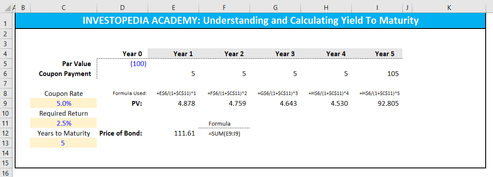

In the ever-evolving world of finance, understanding key investment metrics is crucial for investors aiming to maximize profitability and manage risks efficiently. This article examines three fundamental concepts: investment returns, holding period return (HPR), and yield to maturity (YTM), discussing their definitions, calculations, and applications in both traditional and algorithmic trading.

Investment returns are a fundamental measure of an investment's profitability, encompassing dividends, interest, and capital gains. These returns form the cornerstone of investment decision-making and portfolio management, as investors primarily focus on maximizing returns while managing associated risks. Understanding and evaluating investment returns are essential for making informed financial decisions.



Holding Period Return (HPR) and Yield to Maturity (YTM) provide valuable insights into the returns generated over specific periods. HPR measures the performance of an investment over the time it is held, including capital gains or losses and income received, typically expressed as a percentage. It is calculated using the formula:

$$
HPR = \frac{\text{Income} + \text{End of Period Value} - \text{Initial Value}}{\text{Initial Value}}
$$

Yield to Maturity (YTM) reflects the total return an investor can expect by holding a bond until maturity. Expressed as an annual percentage, YTM assumes all coupon payments are reinvested at the same rate and accounts for the time value of money, facilitating consistent comparison across different bonds. Calculating YTM often involves complex formulae and specialized tools for accuracy.

Algorithmic trading, an emerging trend in finance, leverages these investment concepts to optimize trading strategies. By automating trading processes, algorithmic trading aims to capitalize on small price movements with precision and speed. Incorporating HPR and YTM helps algorithmic traders refine strategies by making informed decisions based on historical performance and predicted trends, enhancing efficiency, reducing human error, and managing large transaction volumes effectively.

This article will explore the calculations and applications of HPR and YTM, highlighting their significance in traditional and algorithmic trading environments. Understanding these key metrics is essential for investors striving to achieve optimal performance and effectively manage risk in today's dynamic financial markets.

## Table of Contents

## Understanding Investment Returns

Investment returns are a key indicator of an investment's profitability over a specified period. They encompass various types of income: dividends from stocks, interest from bonds, and capital gains generated from the sale of assets if they have appreciated in value.

Maximizing investment returns while efficiently managing associated risks is a primary focus for investors. Achieving higher returns often requires taking on greater risk, making the balancing act between risk and reward crucial. Investors employ a range of strategies to optimize this balance, often utilizing diversification and asset allocation to minimize potential losses.

The evaluation of investment returns is fundamental to investment decision-making and portfolio management. It involves assessing both historical performance and potential future returns. This evaluation helps in setting realistic investment goals and in choosing suitable investment products to meet those goals.

Investment returns can be calculated in several ways, often expressed as a percentage. A simple method is the basic rate of return, calculated as:

$$
\text{Rate of Return} = \left(\frac{\text{Final Value} - \text{Initial Value}}{\text{Initial Value}}\right) \times 100
$$

where the final value includes all distributions received during the holding period. This formula gives a straightforward depiction of how much an investment has grown over a given period.

A more comprehensive analysis might involve considering annualized returns, which standardize performance figures over different periods to reflect the compound effect. These calculations often account for factors such as the dividends reinvested and inflation-adjusted returns to give a holistic view.

In modern finance, the need for precise and timely evaluation of investment returns has led to the use of technology and software tools. These tools can process vast amounts of data to refine how returns are assessed, providing investors with detailed insights about both current portfolios and potential investment opportunities. Understanding these returns is foundational for investors to make informed decisions and effectively manage their portfolios.

## Holding Period Return (HPR)

Holding period return (HPR) is a financial metric that quantifies the performance of an investment during the duration for which it is held. This concept encompasses both capital gains or losses and the income received from the investment, making it an essential tool for measuring investment performance. HPR is typically expressed as a percentage and is calculated using the following formula:

$$
\text{HPR} = \frac{\text{Income} + \text{End of Period Value} - \text{Initial Value}}{\text{Initial Value}}
$$

The utility of HPR is particularly pronounced when assessing short-term investment performance. This is especially relevant for bonds that are actively traded on the secondary market, where prices fluctuate frequently. For investors who often engage in buying and selling assets, a nuanced understanding of HPR can facilitate meaningful comparisons across diverse investment opportunities. By calculating HPR, investors gain the ability to evaluate the effectiveness of each investment relative to others in their portfolio.

Moreover, HPR is not restricted solely to bonds; it is applicable across various asset classes, including stocks and real estate, as long as there is a clear understanding of the initial and ending values and any income generated during the holding period. Investors can leverage this metric to decide whether to retain an investment or reallocate resources to potentially more profitable ventures, aligned with their financial goals.

For those interested in automating these calculations, programming languages like Python provide a straightforward means to compute HPR for multiple assets. Here is a simple example:

```python
def calculate_hpr(income, end_value, initial_value):
    return (income + end_value - initial_value) / initial_value * 100

# Example usage
initial_investment = 1000  # initial value
end_value = 1100  # end of period value
income = 50  # income received during the period

hpr = calculate_hpr(income, end_value, initial_investment)
print(f"The Holding Period Return is {hpr:.2f}%")
```

In this example, the function `calculate_hpr` computes the holding period return based on the provided income, end period value, and initial investment. Using such programming techniques, investors can efficiently evaluate multiple investments, adjusting their portfolios in accordance with their risk and return objectives.

## Yield to Maturity (YTM)

Yield to maturity (YTM) is a critical financial metric used to assess the expected total return an investor can earn from a bond if it is held until it matures. This measure takes into account not only the bond's annual coupon payments but also any gains or losses incurred if the bond is purchased at a price above or below its par value. Expressed as an annual percentage rate, YTM assumes that all coupon payments are reinvested at the same rate as the bond's current yield, providing investors with a consistent basis for comparing the profitability of different fixed-income securities.

YTM's importance in bond valuation stems from its incorporation of the time value of money—an essential consideration in finance that recognizes the differing value of money received today versus in the future. By discounting future cash flows to their present values, YTM enables the consistent comparison of bonds with varying coupon rates, maturities, and prices. This is particularly useful for investors who seek to identify bonds that offer the best returns relative to their market price and risk profile.

The computation of YTM can be intricate, involving iterative methods or specialized financial calculators due to its dependence on solving for the [interest rate](/wiki/interest-rate-trading-strategies) in a present value equation. The formula for YTM is derived from equating the present value of all future cash flows (coupon payments and principal repayment) to the bond's current market price:

$$
P = \sum_{t=1}^{n} \frac{C}{(1 + YTM)^t} + \frac{F}{(1 + YTM)^n}
$$

where:
- $P$ is the current market price of the bond,
- $C$ is the annual coupon payment,
- $n$ is the number of years until maturity,
- $F$ is the face value of the bond, and
- $YTM$ is the yield to maturity.

Given the complexity, Python or other programming languages are often employed to solve for YTM, utilizing libraries such as NumPy or SciPy to perform root-finding algorithms. Here is a simple Python code snippet illustrating how one might estimate YTM using the Newton-Raphson method:

```python
from scipy.optimize import newton

def bond_ytm(price, face_value, coupon_rate, years_to_maturity):
    def ytm_function(r):
        return sum(
            (coupon_rate * face_value / (1 + r)**t) for t in range(1, years_to_maturity + 1)
        ) + (face_value / (1 + r)**years_to_maturity) - price

    return newton(ytm_function, 0.05)

# Example usage:
current_price = 950
face_value = 1000
coupon_rate = 0.05
years_to_maturity = 10

ytm = bond_ytm(current_price, face_value, coupon_rate, years_to_maturity)
print(f"Yield to Maturity: {ytm * 100:.2f}%")
```

This methodical approach affords investors a precise avenue for determining YTM, ensuring they make informed choices regarding bond investments relative to their financial goals and market expectations.

## Comparing HPR and YTM

Holding Period Return (HPR) and Yield to Maturity (YTM) are two distinct financial metrics used to evaluate bond investments, each catering to specific investment objectives and horizons.

HPR is particularly useful for investors targeting short-term gains and engaging in active trading. It calculates the total return on an investment over the period it is held, encompassing capital gains or losses and income received, such as dividends or interest. The formula for HPR is:

$$
\text{HPR} = \frac{\text{Income} + \text{End of Period Value} - \text{Initial Value}}{\text{Initial Value}}
$$

This measure is expressed as a percentage and provides a snapshot of performance for a particular holding period. Investors who frequently trade bonds can leverage HPR to compare the performance of different assets and make informed decisions on buying and selling.

Conversely, YTM provides a comprehensive measure of potential returns for investors with a long-term focus, particularly those intending to hold a bond until maturity. Unlike HPR, YTM considers the time value of money, offering a consistent framework for comparing different bonds. It reflects the annual return an investor can expect if the bond is held to maturity, under the assumption that all coupon payments are reinvested at the same yield. Calculating YTM is complex and often requires computational tools due to its reliance on solving for the discount rate that equates the present value of future cash flows to the bond's current price.

Both HPR and YTM are invaluable tools for bond valuation and gauging expected returns. The choice between them is largely dictated by investment strategy: Investors seeking short-term profitability may prioritize HPR, while those interested in the long-term growth of their portfolio may find YTM more advantageous. These metrics, while serving different purposes, collectively enhance an investor's ability to make strategic decisions based on the intended investment horizon.

## The Role of Algorithmic Trading

Algorithmic trading employs sophisticated tools and software to enhance investment strategies by leveraging metrics such as Holding Period Return (HPR) and Yield to Maturity (YTM). This methodology relies heavily on automation to exploit small price fluctuations with remarkable precision and speed. By implementing computer algorithms, traders can execute orders in milliseconds, something impossible in traditional trading means. This speed advantage allows for the rapid exploitation of [arbitrage](/wiki/arbitrage) opportunities that may only exist for brief moments.

The effective use of HPR and YTM provides algorithmic traders with the capacity to refine their strategies based on concrete historical performance and projected market trends. Specifically, HPR offers insights on short-term performance, enabling algorithms to evaluate the profitability of securities over their holding period. YTM, on the other hand, provides a long-term perspective, crucial for estimating the expected return on bonds held until maturity. These metrics are instrumental for developing algorithms that can dynamically adjust their trading strategies based on changing market conditions.

This automated approach results in enhanced efficiency and significantly reduces human error, which are common in manual trading processes. Moreover, the ability of algorithms to process vast amounts of data allows them to manage large volumes of transactions effectively. With the capacity to analyze complex datasets at high speed, algorithmic systems can identify and execute the most beneficial trades, optimizing returns while managing risks associated with [volatility](/wiki/volatility-trading-strategies) and market fluctuations.

Algorithmic trading requires a robust technological infrastructure that includes comprehensive data feeds, analytics software, and trading platforms capable of real-time processing. Python, for instance, is a popular programming language used in [algorithmic trading](/wiki/algorithmic-trading) due to its extensive libraries, such as Pandas for data manipulation, NumPy for numerical calculations, and SciPy for statistical analysis. An example snippet to calculate HPR in Python could look like the following:

```python
def calculate_hpr(start_value, end_value, income):
    return ((income + end_value - start_value) / start_value) * 100

# Example values
start_value = 1000
end_value = 1100
income = 50

hpr = calculate_hpr(start_value, end_value, income)
print(f"Holding Period Return: {hpr:.2f}%")
```

By integrating these advanced techniques, traders can harness the power of algorithmic trading to optimize portfolio performance while efficiently navigating the complexities of modern financial markets.

## Conclusion

Understanding the concepts of investment returns, holding period return (HPR), and yield to maturity (YTM) is essential for informed decision-making in finance. These metrics offer distinct perspectives on investment gains, playing a crucial role for traders and investors. HPR provides a snapshot of short-term performance by capturing the gain or loss during the holding period, expressed as:

$$
\text{HPR} = \frac{\text{Income} + (\text{End of Period Value} - \text{Initial Value})}{\text{Initial Value}}
$$

On the other hand, YTM offers a long-term view by calculating the total expected return if a bond is held until maturity, considering the reinvestment of all coupon payments. YTM factors in the time value of money, thus facilitating a consistent comparison across various bonds.

The rise of algorithmic trading has amplified the significance of these metrics. Algorithmic strategies use tools and software to automate trading, allowing swift responses to market conditions based on quantitative data and historical performance trends. By understanding metrics like HPR and YTM, algorithmic traders can refine strategies to optimize investment returns while managing risk effectively.

Integrating HPR and YTM insights into the decision-making process enhances investment strategy automation and allows for better performance management and risk mitigation. These measures equip investors with the analytical tools necessary to navigate the complexities of financial markets and achieve optimal results.

## References & Further Reading

[1]: ["Advances in Financial Machine Learning"](https://www.amazon.com/Advances-Financial-Machine-Learning-Marcos/dp/1119482089) by Marcos Lopez de Prado

[2]: ["Quantitative Trading: How to Build Your Own Algorithmic Trading Business"](https://www.amazon.com/Quantitative-Trading-Build-Algorithmic-Business/dp/1119800064) by Ernest P. Chan

[3]: ["Machine Learning for Algorithmic Trading"](https://github.com/stefan-jansen/machine-learning-for-trading) by Stefan Jansen

[4]: Fabozzi, F. J. (2000). ["Bond Markets, Analysis, and Strategies."](https://books.google.com/books/about/Bond_Markets_Analysis_and_Strategies_ten.html?id=bQpNEAAAQBAJ) Pearson Education.

[5]: Mishkin, F. S. (2012). ["The Economics of Money, Banking, and Financial Markets."](https://www.pearsonhighered.com/assets/preface/0/1/3/4/0134855388.pdf) Pearson Education.