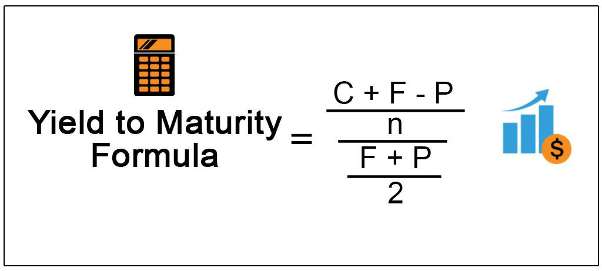

In the rapidly evolving world of finance, understanding key financial metrics is crucial for optimizing investment strategies. Among these metrics, Yield to Maturity (YTM) stands out as a fundamental concept, especially in the context of bond investments. YTM provides investors with a comprehensive measure of the total expected return on a bond if held until maturity, expressed annually. Unlike the coupon rate, which only reflects the bond's periodic interest income, or the current yield, which is influenced by the bond's current price, YTM encapsulates the cumulative returns accounting for the time value of money and compounding interest.

This article explores the intersection of YTM, bond investment, and algorithmic trading, offering insights into their collective significance in the financial landscape. Bond valuation, a core component of this discourse, involves calculating the present value of a bond's anticipated cash flows to determine its fair market value. It allows investors to assess whether a bond is fairly priced relative to prevailing market interest rates, thus guiding informed investment decisions.



Algorithmic trading leverages advanced computational techniques to enhance trading efficiency and accuracy, particularly in bond markets where it can significantly reduce transaction costs and improve liquidity. By integrating YTM calculations into trading algorithms, investors can better assess bond investments and identify lucrative opportunities for arbitrage.

Ultimately, comprehending these critical concepts enables investors to enhance decision-making and maximize returns. This guide delves into these aspects, providing a comprehensive overview of their role and significance in today's financial markets, equipping investors to navigate and capitalize on emerging opportunities while effectively mitigating risks.

## Table of Contents

## Understanding Yield to Maturity (YTM)

Yield to maturity (YTM) is a critical financial metric used to determine the total expected return of a bond if held until its maturity date. It is commonly expressed as an annual rate, which acts as the internal rate of return (IRR) for a bond's cash flows. YTM is crucial for investors as it encapsulates the value of both the bond's coupon payments and its final redemption value, providing a comprehensive picture of the bond's long-term performance.

### Calculation of Yield to Maturity

To calculate the YTM, investors need to account for several factors including the bond's current market price, its coupon payments, and the time value of money. The formula for YTM involves solving for the discount rate $i$ in the present value equation:

$$
P = \sum_{t=1}^{n} \frac{C}{(1+i)^t} + \frac{F}{(1+i)^n}
$$

Where:
- $P$ is the current market price of the bond.
- $C$ is the annual coupon payment.
- $F$ is the face value of the bond.
- $n$ is the number of years until maturity.
- $i$ is the yield to maturity.

Because this is a complex equation to solve analytically due to the exponential term, numerical methods such as the Newton-Raphson method or iterative trial-and-error techniques are often employed.

### Insight into Bond Performance

YTM provides essential insights into a bond's long-term performance and is used as a standard benchmark for comparing bonds. Unlike the coupon rate, which only represents the interest payment relative to the bond's face value, or the current yield, which considers the bond's coupon payment in relation to its market price, YTM encompasses the full life cycle of the bond's returns. It takes into account not only the coupon payments but also any capital gain or loss the investor will realize if they hold the bond to maturity.

### YTM vs. Other Rates

YTM is distinct from other rates such as the coupon rate and current yield. The coupon rate is fixed, determined by the bond issuer, and reflects the annual interest payment based on the face value of the bond. Current yield is simpler than YTM in its calculation, derived by dividing the annual coupon payment by the bond's current market price, but it does not account for the face value repayment or market price changes over time.

In conclusion, understanding YTM is essential for investors seeking to make informed decisions in bond markets. It provides a comprehensive view of potential earnings and a framework for comparing different bond investment opportunities.

## The Role of Bond Valuation

Bond valuation is a critical process in finance that determines the present value of a bond's expected future cash flows. This valuation helps investors assess whether a bond is appropriately priced in the market, thereby aiding in the decision-making process. The key factors that influence bond valuation include the bond's par value, coupon rate, and prevailing market interest rates.

The par value, or face value, is the amount the bond issuer agrees to repay the bondholder at maturity. This is a fixed amount and does not change over time. The coupon rate is the [interest rate](/wiki/interest-rate-trading-strategies) that the bond issuer pays to the bondholder, typically annually or semi-annually, based on the bond's par value. It is essential to differentiate the coupon rate from the bond's yield, as the coupon rate is fixed while the yield varies according to market conditions.

Market interest rates significantly impact bond valuation. When market interest rates rise, the present value of a bond’s future cash flows decreases, leading to a decline in the bond's price. Conversely, when market interest rates fall, the bond's price tends to increase as the present value of its cash flows becomes more valuable.

The fundamental principle of bond valuation is based on the discounted cash flow (DCF) model. This model calculates the present value of all expected future cash flows from the bond, which include periodic coupon payments and the repayment of the par value at maturity. The formula for calculating the present value (PV) of a bond is as follows:

$$
PV = \sum_{t=1}^{n} \frac{C}{(1 + r)^t} + \frac{M}{(1 + r)^n}
$$

Where:
- $PV$ is the present value of the bond.
- $C$ is the periodic coupon payment.
- $n$ is the total number of periods until maturity.
- $r$ is the discount rate or the required rate of return.
- $M$ is the maturity value or par value of the bond.

Valuation formulas, like the one above, provide investors with tools to make informed decisions by evaluating the attractiveness of a bond relative to prevailing market conditions. If the calculated present value is higher than the bond's market price, the bond may be underpriced, indicating a potential buying opportunity. Conversely, if the present value is lower than the market price, the bond may be overpriced, suggesting a potential sale.

Understanding bond valuation also aids investors in aligning their investment choices with their financial goals. By accurately valuing bonds, investors can identify opportunities to enhance returns while managing exposure to interest rate risk and ensuring their investments are consistent with their risk tolerance and return objectives. This competence in bond selection and portfolio management is paramount for optimizing investment strategies in the fixed-income landscape.

## Algorithmic Trading in Bond Markets

Algorithmic trading utilizes advanced computer algorithms to execute high-speed trading orders, revolutionizing the bond markets. With this technology, traders achieve increased operational efficiency, reduced transaction costs, and enhanced market [liquidity](/wiki/liquidity-risk-premium). These algorithms employ quantitative models to analyze bond prices rapidly and detect trading opportunities that might be missed by traditional means.

In bond markets, one core metric leveraged in [algorithmic trading](/wiki/algorithmic-trading) is the yield to maturity (YTM). YTM provides a comprehensive picture of the potential return on a bond if held to maturity, helping algorithms determine mispriced bonds. By comparing YTM with spot rates—the prevailing interest rates for specific maturities—algorithms can identify discrepancies and capitalize on potential [arbitrage](/wiki/arbitrage) opportunities.

Python is a prevalent programming language used for developing such trading algorithms, owing to its extensive libraries and simplicity. A basic outline of a Python script designed to compute bond mispricing based on YTM and spot rates might look like this:

```python
import numpy as np

def calculate_ytm(price, coupon_rate, par_value, years_to_maturity):
    # Calculate Yield to Maturity
    return np.irr([-price] + [coupon_rate * par_value] * years_to_maturity + [par_value])

def compare_ytm_spot(ytm, spot_rate):
    # Compare YTM to spot rate
    if ytm > spot_rate:
        return "Bond is potentially underpriced"
    elif ytm < spot_rate:
        return "Bond is potentially overpriced"
    else:
        return "Bond is fairly priced"

# Example values
current_price = 950
coupon_rate = 0.05
par_value = 1000
years_to_maturity = 5
spot_rate = 0.045

ytm = calculate_ytm(current_price, coupon_rate, par_value, years_to_maturity)
result = compare_ytm_spot(ytm, spot_rate)
print("YTM: ", ytm)
print("Assessment: ", result)
```

Algorithmic strategies exploit these pricing inefficiencies by executing trades based on real-time data, thereby not only streamlining operations but also maximizing returns. This technological advancement is transforming bond trading, offering traders the tools required to effectively interact with highly complex financial instruments.

## Integrating YTM and Algorithms in Trading

Combining Yield to Maturity (YTM) with algorithmic trading presents a comprehensive approach to optimizing bond market strategies. Algorithms leverage YTM as a critical input for precise bond pricing, facilitating the identification of arbitrage opportunities. By evaluating the expected returns from YTM, traders can effectively compare bonds against their prevailing market prices, enhancing assessment accuracy.

Spot rates, representing the interest rate environment over various maturities, complement YTM analysis by revealing divergences between market expectations and actual interest rate conditions. These discrepancies are pivotal for identifying arbitrage opportunities. For instance, if a bond's YTM is significantly higher than spot rates suggest for its maturity term, this gap may indicate undervaluation, prompting traders to execute transactions designed to capitalize on this mispricing.

The integration of YTM into trading algorithms can be illustrated through a simple Python-based code example:

```python
def calculate_ytm(coupon_rate, market_price, face_value, years_to_maturity):
    # A basic implementation to estimate the YTM for a bond
    def ytm_func(ytm):
        return sum([coupon_rate * face_value / (1 + ytm)**t for t in range(1, years_to_maturity + 1)]) + face_value / (1 + ytm)**years_to_maturity - market_price

    ytm_guess = 0.05  # initial guess for YTM
    ytm = optimize.newton(ytm_func, ytm_guess)
    return ytm

import numpy as np
from scipy import optimize

coupon_rate = 0.05  # 5% coupon rate
face_value = 1000  # $1000 face value
market_price = 950  # current market price $950
years_to_maturity = 10

ytm = calculate_ytm(coupon_rate, market_price, face_value, years_to_maturity)
print(f"Calculated Yield to Maturity: {ytm:.4f}")
```

This snippet utilizes the Newton-Raphson method to approximate a bond’s YTM, enabling traders to make informed decisions based on precise yield estimates. The output aids in determining the bond's attractiveness relative to spot rates.

Case studies provide evidence of integrating YTM and algorithmic trading yielding significant profitability improvements and risk management enhancements. Algorithms that diligently watch for YTM and spot rate disparities guide traders to systematically exploit market inefficiencies. This structured approach not only refines trading strategies but also contributes to robust risk mitigation by aligning investment decisions with comprehensive market insights.

## Technological Advancements and Future Trends

Emerging technologies such as [artificial intelligence](/wiki/ai-artificial-intelligence) (AI) and [machine learning](/wiki/machine-learning) are revolutionizing bond market trading by offering enhanced predictive capabilities and the ability to process large datasets more efficiently than traditional methods. These advanced technologies can analyze vast amounts of financial data to detect patterns and trends that inform trading strategies, ultimately leading to more accurate decision-making and optimized returns.

AI technologies, specifically, are invaluable for improving yield curve modeling. By integrating wider economic indicators, AI systems can produce more nuanced and dynamic yield curves. These models account for various factors such as inflation rates, unemployment data, and geopolitical events, offering traders a more comprehensive understanding of market conditions. This holistic approach enables investors to adjust their portfolios more effectively in response to shifting economic landscapes.

Moreover, blockchain technology is poised to play a crucial role in transforming bond market trading by enhancing transparency and reducing operational costs. Through the use of smart contracts, blockchain can facilitate secure and transparent transactions, minimizing the risks of fraud and human error. These self-executing contracts, programmed with predefined conditions, are capable of automatically enforcing the terms of an agreement once certain criteria are met. This automation can significantly reduce the time and costs associated with transaction settlement processes, thereby increasing overall market efficiency.

Looking forward, future trends in algorithmic trading are likely to concentrate on developing more autonomous and resilient trading systems. These systems will leverage advanced AI algorithms to adapt to rapid market changes autonomously. Machine learning models will continue to evolve, offering increased accuracy in prediction and execution without human intervention. In parallel, improvements in distributed ledger technology are expected to bolster the robustness and security of trading platforms, further enhancing their resilience against cyber threats.

Overall, the integration of AI, machine learning, and blockchain technologies is set to redefine the landscape of bond market trading, providing traders with sophisticated tools to navigate complex financial environments. The ongoing evolution of these technologies promises to open up new opportunities and present fresh challenges for investors looking to capitalize on the dynamic nature of global financial markets.

## Conclusion

Yield to maturity (YTM), bond valuation, and algorithmic trading are integral to the dynamics of modern bond markets, offering investors the tools necessary to make well-informed decisions and optimize their returns. YTM enables investors to project the long-term profitability of bonds by incorporating the total expected return if the bond is held until maturity. This comprehensive analysis aids in comparing bonds and selecting those that align with financial objectives, taking into account the internal rate of return of the bond’s cash flows.

Bond valuation is equally crucial, as it involves calculating the present value of future cash flows from a bond, which assists in determining whether a bond is priced fairly in the market. By considering factors such as par value, coupon rate, and prevailing market interest rates, bond valuation ensures that investors can assess market conditions accurately and make decisions that mitigate risk and enhance returns.

Algorithmic trading marks a significant evolution in bond markets, leveraging sophisticated computer algorithms to execute trades with high speed and precision. This approach not only streamlines operations by reducing transaction costs and increasing liquidity but also empowers traders to perceive and seize opportunities through quantitative analysis of bond pricing. Algorithms are particularly effective when integrated with YTM, using it as a pivotal input to identify and exploit arbitrage opportunities that arise from discrepancies between YTM and spot rates.

The relentless march of technological advancements continues to reshape trading strategies. The integration of artificial intelligence (AI) and machine learning is bringing transformative changes, making predictive analytics more powerful and accessible. These technologies facilitate the processing of large datasets and enhance yield curve modeling, enabling deeper insights into market trends and broader economic indicators. Additionally, the adoption of blockchain technology promises to elevate transparency and efficiency through the use of smart contracts, reducing costs and enhancing trust.

As trading strategies evolve, investors must remain vigilant and knowledgeable about these innovations to effectively navigate and capitalize on the ever-changing landscape of financial markets. By mastering these concepts and leveraging new technologies, investors can position themselves to seize emerging opportunities while adeptly managing the inherent challenges of the bond markets.

## References & Further Reading

- **Fabozzi, F. J. (2001). "Bond Markets, Analysis, and Strategies."** This comprehensive textbook offers an in-depth examination of bond markets, elucidating key concepts such as yield to maturity, bond valuation, and the factors affecting bond prices. It serves as an essential resource for investors seeking to understand complex market dynamics and develop effective bond investment strategies.

- **Lopez de Prado, M. (2018). "Advances in Financial Machine Learning."** This work explores the intersection of machine learning with financial markets, providing valuable insights into how data-driven algorithms can enhance trading strategies. It is particularly beneficial for those interested in algorithmic trading, offering techniques to improve predictive accuracy and manage risks in the bond markets.

- **Jarrow, R. A., & Turnbull, S. M. (2000). "Derivatives Securities."** This publication focuses on derivative securities, including the valuation and application of these financial instruments within broader market strategies. Understanding derivatives is integral for investors and traders utilizing algorithms to identify and exploit arbitrage opportunities and mispricings in bond markets.

These references collectively provide a solid foundation for further exploration of bond markets, yield to maturity, algorithmic trading, and the expanding role of technology in modern finance.

