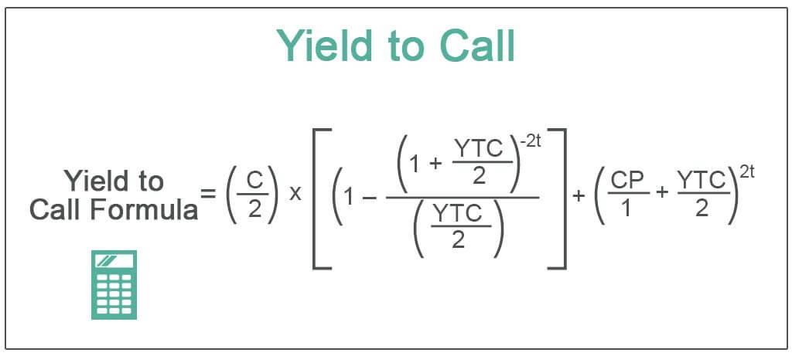

In fixed income investing, understanding bond yields is essential for assessing potential returns on investment. Yield to Maturity (YTM) and Yield to Call (YTC) are two pivotal metrics, especially significant for investors dealing with callable bonds. Yield to Maturity evaluates the total expected return of a bond if it is kept until its maturity date, providing a complete picture of profitability. Alternatively, Yield to Call measures the expected yield if the bond is redeemed before reaching maturity. Callable bonds, which issuers can redeem before their maturity date, often come with a heightened YTM to compensate for the inherent call risk. 

Alongside these traditional yield metrics, the advent of algorithmic trading is transforming the bond markets. This technological advancement optimizes trading strategies by using automated systems that can process vast amounts of financial data swiftly. Algorithms analyze yield metrics such as YTM and YTC and execute trades based on pre-established criteria, thereby enhancing liquidity, enabling rapid response to market dynamics, and reducing transaction costs. As algorithmic trading has gained prominence, it has become vital for investors to grasp these yield concepts. Understanding YTM, YTC, and their implications within an evolving market framework will empower investors, allowing them to make well-informed decisions while managing risk and optimizing portfolio returns effectively.



## Table of Contents

## Understanding Yield to Maturity (YTM)

Yield to Maturity (YTM) represents the total anticipated return on a bond if it is held until its maturity date. This yield metric serves as a comprehensive indicator of a bond's profitability, as it incorporates the bond's coupon interest payments and the redemption of the bond at its face value upon maturity. To further clarify, YTM is predicated on the assumption that each coupon payment is reinvested at the same yield, ensuring a compound return for investors.

In calculating YTM, several critical factors are considered. These include the bond's coupon rate, which is the annual interest rate paid on the bond's face value; the purchase price or the initial investment outlay incurred by the bondholder; the bond's face value, which is the amount paid back to the investor upon maturity; and the time to maturity, representing the duration until the bond expires.

The YTM is found by solving the following equation:

$$
\text{Current Price} = \sum_{t=1}^{n} \frac{\text{Coupon Payment}}{(1+\text{YTM})^t} + \frac{\text{Face Value}}{(1+\text{YTM})^n}
$$

where:
- $\text{Current Price}$ is the price for which the bond is purchased.
- $\text{Coupon Payment}$ is the periodic interest payment.
- $n$ is the total number of periods until maturity.
- $\text{Face Value}$ is the amount the bondholder receives upon maturity.
- $\text{YTM}$ is the yield to maturity.

This equation is typically solved using numerical methods such as the Newton-Raphson method, due to its nonlinear nature.

YTM serves as a benchmark for investors, allowing for the comparison of different bonds based on their expected returns, regardless of their types or maturities. By providing a universally applicable measure of potential return, YTM enables investors to make informed decisions about the appropriateness of particular bonds within their portfolios. For instance, as part of strategic portfolio management, an investor can utilize YTM to assess and realign their portfolios in accordance with desired risk profiles and investment objectives.

## Decoding Yield to Call (YTC)

Yield to Call (YTC) represents the expected yield of a callable bond if the issuer chooses to call the bond prior to its maturity. Callable bonds offer issuers the flexibility to redeem the bond before it reaches full maturity, typically resulting in a higher initial Yield to Maturity (YTM) to compensate investors for the added call risk. This potential for early redemption creates unique scenarios for both issuers and investors.

The calculation of YTC involves considering several key factors: the bond's coupon rate, its current market price, and the time remaining until the first or any subsequent call date. Specifically, YTC can be calculated using the following formula:

$$
YTC = \left( \frac{C + \frac{(Call\ Price - P)}{t}}{\frac{(Call\ Price + P)}{2}} \right) \times 100
$$

where:
- $C$ is the annual coupon payment,
- $Call\ Price$ is the price at which the bond can be called,
- $P$ is the current market price of the bond,
- $t$ is the number of years until the call date.

Investors face crucial decisions in assessing the yields of callable bonds. They must consider both the potential Yield to Maturity and the Yield to Call, evaluating which scenario might be more advantageous depending on [interest rate](/wiki/interest-rate-trading-strategies) movements. When interest rates decline, issuers are more likely to call the bonds, redeeming them early and reissuing new bonds at a lower rate, thus impacting the actual yield received by investors. In contrast, if interest rates are stable or rising, holding the bond to maturity might yield better returns.

Understanding YTC is vital, as it allows investors to gauge the return potential under these variable conditions, contributing significantly to informed bond investment strategies.

## Comparing YTM and YTC: Key Differences

Yield to Maturity (YTM) and Yield to Call (YTC) are critical metrics for investors analyzing callable bonds. YTM provides the expected rate of return on a bond if held until its maturity date, incorporating the bond’s purchase price, coupon interest payments, and the face value repaid at maturity. In contrast, YTC considers the yield assuming the bond is called at the earliest possible call date, reflecting the issuer’s option to retire the bond before it matures.

Callable bonds often present a higher YTM compared to non-callable ones because of the uncertainty surrounding early redemption. This potential for early call introduces a premium yield to compensate investors for the additional risk. The YTC, however, gives a more immediate perspective on the real return potential, assuming the issuer exercises the call option.

Investors need to be particularly vigilant in comparing YTM and YTC, as each offers insights under different interest rate scenarios. In environments where interest rates are expected to decline, the risk of bonds being called increases, making YTC a more critical metric. Conversely, in stable or rising interest rate environments, YTM may provide a better indication of potential returns, as the probability of early call diminishes.

To illustrate the calculation of YTM and YTC, consider the following example:

```python
def calculate_ytm(face_value, coupon_rate, market_price, years_to_maturity):
    annual_coupon = face_value * coupon_rate
    return (annual_coupon + (face_value - market_price) / years_to_maturity) / ((face_value + market_price) / 2)

def calculate_ytc(face_value, coupon_rate, market_price, years_to_call):
    annual_coupon = face_value * coupon_rate
    return (annual_coupon + (face_value - market_price) / years_to_call) / ((face_value + market_price) / 2)

# Example data
face_value = 1000
coupon_rate = 0.05
market_price = 950
years_to_maturity = 10
years_to_call = 5

ytm = calculate_ytm(face_value, coupon_rate, market_price, years_to_maturity)
ytc = calculate_ytc(face_value, coupon_rate, market_price, years_to_call)

print(f"Calculated YTM: {ytm:.2%}")
print(f"Calculated YTC: {ytc:.2%}")
```

In this hypothetical example, the calculated YTM and YTC help investors assess which yield is more advantageous given the bond's conditions and prevailing market expectations. Evaluating both metrics is essential, especially in volatile interest rate conditions, to fully appreciate the risk-reward dynamics inherent in callable bonds. This understanding empowers investors to balance potential risks and rewards effectively in their fixed income portfolios.

## The Role of Algorithmic Trading in Bond Markets

Algorithmic trading, a pivotal development in the evolution of financial markets, employs automated strategies to navigate the intricacies of the bond market with enhanced efficiency and accuracy. These algorithms leverage advanced computing technology to evaluate and respond to market conditions, employing predefined criteria to make real-time trading decisions. In bond markets, they play a significant role by analyzing a wide array of yield metrics, including Yield to Maturity (YTM) and Yield to Call (YTC).

YTM provides a measure of the total expected return on a bond if held until maturity, while YTC estimates the yield if the bond is called before its maturity. Understanding and using these metrics correctly is crucial for determining the optimal trading strategy. Algorithms can process vast amounts of data, including interest rates, market conditions, and issuer characteristics, to assess which bonds are likely to be most profitable, considering these yield figures.

A key advantage of [algorithmic trading](/wiki/algorithmic-trading) in bond markets is its ability to enhance [liquidity](/wiki/liquidity-risk-premium). By constantly analyzing market data and placing orders instantaneously, algorithms can ensure that bonds are more readily bought and sold, thus making the market more dynamic and responsive. This increased liquidity helps mitigate the risks associated with holding bonds, providing investors with greater flexibility.

Additionally, algorithmic trading facilitates quicker reactions to market changes. For example, if interest rates shift or economic indicators suggest increased market [volatility](/wiki/volatility-trading-strategies), these automated systems can adapt instantaneously, recalibrating their strategies to maintain profitability and manage risks appropriately. This agility is vital in a market like bonds, where prices respond sensitively to macroeconomic trends.

Moreover, algorithmic trading significantly reduces transaction costs. Traditional bond trading often involves manual processes and human intermediaries, which can be costly and time-consuming. In contrast, algorithmic systems can execute trades at a fraction of the cost, minimizing the impact of these expenses on overall investment returns.

The growing sophistication and integration of algorithmic trading systems in bond markets necessitate a robust understanding of yield concepts to develop and implement profitable trading strategies. Investors and financial institutions that adopt these advanced technologies are better positioned to optimize their market activities, ensuring competitive returns and efficient portfolio management.

Overall, algorithmic trading is reshaping the landscape of bond markets. Its ability to process and react to complex yield data, along with its contributions to liquidity and cost-efficiency, underscores its role as a transformative force. As these technologies continue to evolve, they promise to further enhance the efficiency and attractiveness of the bond market for investors worldwide.

## How Algo Trading Impacts Yield Calculations

Algorithmic trading has transformed the way bond yields are calculated and utilized in investment strategies. These advanced platforms employ vast datasets, analyzing yield metrics like Yield to Maturity (YTM) and Yield to Call (YTC) to refine trading decisions and enhance profitability. 

One of the primary benefits of algorithmic trading in bond markets is its ability to predict call events. Callable bonds present a unique challenge for investors, as they [carry](/wiki/carry-trading) the risk of being redeemed prior to maturity if market conditions, such as interest rate drops, make it advantageous for the issuer. Algorithms can assess historical data, interest rate trends, and other financial indicators to estimate the likelihood of a bond being called. This capability allows for more accurate modifications to investment strategies, particularly in calculating expected returns. For instance, by predicting call events effectively, algorithms can help investors adjust their YTM and YTC evaluations, providing a more informed perspective on potential gains.

Moreover, algorithmic trading facilitates more precise pricing and yield efficiency. By incorporating real-time data analytics and [machine learning](/wiki/machine-learning) techniques, algorithmic platforms can quickly respond to market fluctuations, ensuring that the pricing of bonds remains competitive. This rapid processing and execution help minimize discrepancies in yield calculations, enabling investors to capitalize on market opportunities more effectively. 

Python is often used to implement such algorithmic trading strategies due to its robust libraries like pandas, NumPy, and SciPy, which allow for efficient data processing and analysis. A simple Python example for calculating potential YTM adjustments based on anticipated call events might look like this:

```python
import numpy as np

# Constants representing rate predictions and bond parameters
interest_rates = np.array([0.02, 0.025, 0.03])  # Hypothetical interest rate scenarios
predicted_call_probability = np.array([0.7, 0.6, 0.4])  # Probability of the bond being called

def adjust_ytm(yield_to_maturity, call_probability, rates):
    expected_return = yield_to_maturity * (1 - call_probability) + call_probability * np.min(rates)
    return expected_return

ytm = 0.05  # Assume a YTM of 5%
adjusted_ytm = adjust_ytm(ytm, predicted_call_probability, interest_rates)
print(adjusted_ytm)
```

This code evaluates potential adjustments to YTM based on the anticipated probability of call events and varying interest rate scenarios. By integrating such computational models, traders can better navigate the uncertainties associated with bond calls, thus optimizing their investment outcomes.

Overall, algorithmic trading enhances the capacity to forecast call events and assess yield metrics with greater precision, offering a significant edge in the competitive bond markets. As technology continues to evolve, the reliance on data-driven insights and automated systems is expected to grow, underscoring the critical role of algorithmic trading in achieving optimal yield calculations.

## Conclusion

In-depth knowledge of bond yield metrics, especially Yield to Maturity (YTM) and Yield to Call (YTC), is crucial for informed decision-making in fixed income markets. These metrics provide insights into potential returns, helping investors to assess and compare various bonds despite differences in coupon rates, face values, and maturity dates. As market conditions fluctuate, understanding these metrics aids investors in gauging both potential profits and associated risks.

The rise of algorithmic trading, with its capacity to process and analyze large volumes of yield data swiftly, presents significant advantages. Algorithms can effectively navigate complex market landscapes by using predefined strategies that incorporate yield metrics like YTM and YTC. This capability allows for improved liquidity, reduced transaction costs, and more rapid responses to market trends, ultimately leading to better yield efficiency. As algorithms continue to evolve, their ability to predict bond call events and adjust trading strategies enhances the precision of yield calculations.

Investors should be equipped to understand and utilize these technological advancements to optimize returns and effectively manage risks. By embracing algorithmic strategies, investors can achieve balanced and profitable portfolios, ensuring they remain competitive in an ever-evolving market environment. Proficiency in these areas will empower investors to make well-informed choices, adapting their strategies to align with both market opportunities and their financial goals.

## References & Further Reading

[1]: Fabozzi, F. J., Mann, S. V., & Choudhry, M. (2005). ["The Handbook of European Fixed Income Securities."](https://www.mhebooklibrary.com/doi/book/10.1036/9781260473902?contentTab=true) Wiley.

[2]: Hull, J. C. (2009). ["Options, Futures, and Other Derivatives"](https://www.semanticscholar.org/paper/Options%2C-Futures%2C-and-Other-Derivatives-Hull/89bdee500c8623864fc9eb7a471546aa713acc44) (8th ed.). Pearson Education.

[3]: ["Fixed Income Securities: Tools for Today's Markets"](https://www.amazon.com/Fixed-Income-Securities-Markets-Finance/dp/1119835550) by Bruce Tuckman and Angel Serrat

[4]: ["Algorithmic Trading: Winning Strategies and Their Rationale"](https://www.wiley.com/en-us/Algorithmic+Trading%3A+Winning+Strategies+and+Their+Rationale-p-9781118460146) by Ernie Chan

[5]: Choudhry, M. (2010). ["The Future of Finance: A New Model for Banking and Investment"](https://archive.org/details/futureoffinancen0000chou) Wiley.