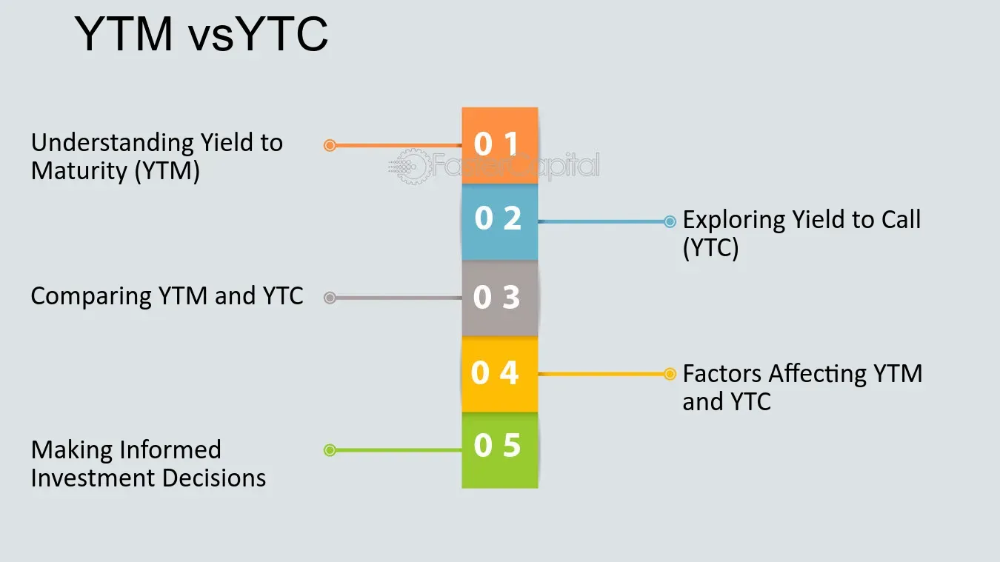

## Table of Contents

## What is Yield to Maturity (YTM)?

Yield to Maturity (YTM) is the total return you can expect from a bond if you hold it until it matures. It takes into account the bond's current market price, its face value, the coupon interest rate, and the time remaining until the bond matures. YTM is expressed as an annual rate and helps investors compare the potential returns of different bonds.

Think of YTM as the average annual return you would get if you reinvested all the bond's interest payments at the same rate until the bond matures. It's a useful measure because it shows the total value of holding the bond over its entire life, not just the interest payments you receive each year. However, calculating YTM can be complex because it involves solving for the interest rate that makes the present value of all future cash flows equal to the bond's current price.

## What is Yield to Call (YTC)?

Yield to Call (YTC) is the total return you can expect from a bond if you hold it until the issuer calls it back before it matures. Some bonds have a call feature, which means the issuer can decide to pay off the bond early. If this happens, the bondholder gets the call price, which might be different from the bond's face value. YTC helps investors figure out what they might earn if the bond gets called back early.

Calculating YTC is similar to calculating Yield to Maturity (YTM), but instead of using the bond's maturity date, you use the earliest call date. You also use the call price instead of the face value. This gives you an annual rate that shows the return you would get if the bond is called at the earliest possible date. It's important for investors to know the YTC because it can affect their investment decisions, especially if they think the bond might be called back soon.

## How is YTM calculated?

Calculating Yield to Maturity (YTM) involves figuring out the interest rate that makes the present value of all the bond's future cash flows equal to its current price. You need to know the bond's face value, the coupon rate, the time until it matures, and how often the bond pays interest. The future cash flows include the regular interest payments (coupons) and the final payment of the face value when the bond matures. You use these to find the rate that balances the equation.

The calculation can be tricky because it's like solving a puzzle. You usually need a financial calculator or a computer program to do it easily. The formula for YTM is complex, but it's based on the idea of discounting future cash flows back to today's value. If you know the bond's price and all the future payments, you can work backward to find the rate that makes it all add up correctly. This rate is the YTM, and it shows you what you can expect to earn annually if you hold the bond until it matures.

## How is YTC calculated?

Calculating Yield to Call (YTC) is like figuring out Yield to Maturity (YTM), but you use the bond's call date instead of its maturity date. The call date is when the issuer can choose to pay off the bond early. You also use the call price instead of the face value. The call price might be different from the face value, so it's important to know what it is. You need to know the bond's current price, the coupon rate, how often the bond pays interest, and the time until the earliest call date. The goal is to find the interest rate that makes the present value of all the bond's future cash flows up to the call date equal to its current price.

To find YTC, you add up all the interest payments you'll get until the call date, plus the call price you'll get when the bond is called. Then, you figure out the interest rate that makes the total of these future payments, when discounted back to today, equal to the bond's current price. This can be a bit tricky, so most people use a financial calculator or a computer program to help. The rate you find is the YTC, and it shows you what you can expect to earn annually if the bond is called back at the earliest possible date.

## What are the key differences between YTM and YTC?

Yield to Maturity (YTM) and Yield to Call (YTC) are two ways to figure out what you might earn from a bond, but they look at different things. YTM tells you what you can expect to earn if you hold the bond until it matures. It uses the bond's face value, which is what you get when the bond matures, and it looks at all the interest payments until that date. YTM is useful because it shows you the total return over the whole life of the bond.

On the other hand, YTC tells you what you might earn if the bond is called back early by the issuer. Some bonds can be paid off before they mature, and YTC uses the call price, which might be different from the face value, and the earliest call date. YTC is important because it helps you understand what you could earn if the bond gets called back sooner than expected. Both YTM and YTC help you compare bonds, but YTC is more relevant if you think the bond might be called early.

## In what scenarios would an investor be more interested in YTM versus YTC?

An investor would be more interested in Yield to Maturity (YTM) when they plan to hold a bond until it matures and they are not worried about the bond being called back early. YTM is important because it shows the total return they can expect if they keep the bond for its full term. This is useful for long-term investors who want to know what they will earn over the life of the bond, including all the interest payments and the final payment of the face value.

On the other hand, an investor would focus more on Yield to Call (YTC) if they think there's a good chance the bond will be called back early by the issuer. Some bonds have a call feature, which means the issuer can pay off the bond before it matures. If this happens, the investor will get the call price instead of the face value. YTC helps them figure out what they might earn if the bond is called back at the earliest possible date. This is important for investors who need to plan for different outcomes and want to understand the potential returns if the bond doesn't last until its maturity date.

## How do interest rate changes affect YTM and YTC?

When interest rates go up, the price of bonds usually goes down. This is because new bonds will be issued with higher coupon rates, making existing bonds with lower rates less attractive. As a result, the Yield to Maturity (YTM) of existing bonds will increase because the lower price makes the future cash flows more valuable when compared to the new, higher-priced bonds. So, if you're looking at a bond's YTM, it will be higher if interest rates have gone up since the bond was issued.

The same thing happens with Yield to Call (YTC). If interest rates rise, the price of a bond that can be called back early will also drop. This means the YTC will go up because the lower price makes the bond's future cash flows until the call date more valuable. If interest rates fall, the opposite happens: bond prices go up, and both YTM and YTC go down. This is why investors need to keep an eye on interest rates when they're thinking about buying or holding onto bonds.

## What are the implications of a bond being called on YTC?

If a bond is called, it means the issuer decides to pay it off early. This can change what you earn from the bond. When a bond is called, you get the call price instead of the face value. The call price might be different from what you expected to get at maturity. If the call price is lower than the face value, you might earn less than you planned. This is why it's important to know the Yield to Call (YTC), because it shows you what you might earn if the bond gets called early.

Knowing the YTC helps you plan for different outcomes. If interest rates drop a lot, issuers might call back bonds to issue new ones with lower interest rates. This can be bad for you if you were counting on the higher interest payments from the old bond. But if the call price is higher than what you paid for the bond, you might actually make more money than you expected. So, YTC gives you a way to think about what might happen if the bond gets called, and it helps you decide if the bond is a good investment for you.

## How can an investor use YTM and YTC to make investment decisions?

Investors can use Yield to Maturity (YTM) and Yield to Call (YTC) to compare different bonds and decide which one to buy. YTM tells you what you can expect to earn if you hold a bond until it matures. It's good for long-term investors who want to know the total return they'll get from the bond over its whole life. When looking at YTM, investors can see if the bond's return matches their investment goals. If they're planning to keep the bond until the end, YTM helps them decide if the bond is worth buying.

YTC is useful when a bond can be called back early by the issuer. It tells you what you might earn if the bond gets called before it matures. This is important because if interest rates drop, issuers might call back the bond to issue new ones at lower rates. Investors need to think about YTC if they believe there's a chance the bond will be called early. By looking at both YTM and YTC, investors can get a full picture of what they might earn in different situations and make smarter choices about which bonds to buy.

## What are the limitations of using YTM and YTC for bond valuation?

Using Yield to Maturity (YTM) and Yield to Call (YTC) for bond valuation has some limits. One big problem is that they both assume you can reinvest all the interest payments at the same rate until the bond matures or is called. But in real life, interest rates change all the time, so you might not be able to reinvest at the same rate. This means the actual return you get could be different from what YTM or YTC predicts. Also, these measures don't think about taxes, which can change how much money you really make from the bond.

Another issue is that YTM and YTC don't consider the risk of the bond. Some bonds are riskier than others because the issuer might not be able to pay back the money. YTM and YTC don't show this risk, so they might make a bond look better than it really is. Also, if you need to sell the bond before it matures or is called, the price you get might be different from what you expected based on YTM or YTC. So, while these measures are helpful, they don't tell the whole story about a bond's value.

## How do market conditions influence the relative importance of YTM and YTC?

Market conditions can change how important Yield to Maturity (YTM) and Yield to Call (YTC) are for investors. If interest rates are going down, issuers might call back their bonds early to issue new ones at lower rates. This makes YTC more important because it shows what you might earn if the bond gets called back sooner than expected. Investors need to pay more attention to YTC in a falling interest rate environment because it helps them plan for what might happen if the bond doesn't last until its maturity date.

On the other hand, if interest rates are stable or going up, YTM becomes more relevant. In a stable or rising interest rate environment, it's less likely that bonds will be called early, so investors can focus more on what they'll earn if they hold the bond until it matures. YTM gives them a good idea of the total return they can expect over the bond's full life, which is useful for long-term planning. So, the choice between focusing on YTM or YTC depends a lot on what's happening in the market with interest rates.

## Can you provide a case study comparing YTM and YTC for a specific bond?

Let's look at a case study about a bond from XYZ Corporation. This bond has a face value of $1,000, a coupon rate of 5%, and it pays interest yearly. It's set to mature in 10 years, but it can also be called back by the issuer after 5 years at a call price of $1,050. Right now, you can buy this bond for $950. If you hold the bond until it matures, you'll get the face value of $1,000 plus the yearly interest payments. If you use a financial calculator or a computer program, you find out that the Yield to Maturity (YTM) is about 5.79%. This means if you keep the bond for the full 10 years, you can expect to earn around 5.79% each year.

Now, let's think about what happens if the bond gets called back early. If XYZ Corporation decides to call the bond after 5 years, you'll get the call price of $1,050 instead of the face value. Using the same tools, you find out that the Yield to Call (YTC) is about 7.04%. This means if the bond is called back after 5 years, you could earn around 7.04% each year. In this case, the YTC is higher than the YTM because you get the call price sooner and at a higher amount than the bond's current price. So, if you think there's a good chance the bond will be called early, you might focus more on the YTC when deciding if it's a good investment.

## What is Understanding Yield to Maturity (YTM)?

Yield to Maturity (YTM) represents the total anticipated return on a bond if it is held until its maturity date. This yield metric serves as a comprehensive indicator of a bond's profitability, as it incorporates the bond's coupon interest payments and the redemption of the bond at its face value upon maturity. To further clarify, YTM is predicated on the assumption that each coupon payment is reinvested at the same yield, ensuring a compound return for investors.

In calculating YTM, several critical factors are considered. These include the bond's coupon rate, which is the annual interest rate paid on the bond's face value; the purchase price or the initial investment outlay incurred by the bondholder; the bond's face value, which is the amount paid back to the investor upon maturity; and the time to maturity, representing the duration until the bond expires.

The YTM is found by solving the following equation:

$$
\text{Current Price} = \sum_{t=1}^{n} \frac{\text{Coupon Payment}}{(1+\text{YTM})^t} + \frac{\text{Face Value}}{(1+\text{YTM})^n}
$$

where:
- $\text{Current Price}$ is the price for which the bond is purchased.
- $\text{Coupon Payment}$ is the periodic interest payment.
- $n$ is the total number of periods until maturity.
- $\text{Face Value}$ is the amount the bondholder receives upon maturity.
- $\text{YTM}$ is the yield to maturity.

This equation is typically solved using numerical methods such as the Newton-Raphson method, due to its nonlinear nature.

YTM serves as a benchmark for investors, allowing for the comparison of different bonds based on their expected returns, regardless of their types or maturities. By providing a universally applicable measure of potential return, YTM enables investors to make informed decisions about the appropriateness of particular bonds within their portfolios. For instance, as part of strategic portfolio management, an investor can utilize YTM to assess and realign their portfolios in accordance with desired risk profiles and investment objectives.

## What is Decoding Yield to Call (YTC)?

Yield to Call (YTC) represents the expected yield of a callable bond if the issuer chooses to call the bond prior to its maturity. Callable bonds offer issuers the flexibility to redeem the bond before it reaches full maturity, typically resulting in a higher initial Yield to Maturity (YTM) to compensate investors for the added call risk. This potential for early redemption creates unique scenarios for both issuers and investors.

The calculation of YTC involves considering several key factors: the bond's coupon rate, its current market price, and the time remaining until the first or any subsequent call date. Specifically, YTC can be calculated using the following formula:

$$
YTC = \left( \frac{C + \frac{(Call\ Price - P)}{t}}{\frac{(Call\ Price + P)}{2}} \right) \times 100
$$

where:
- $C$ is the annual coupon payment,
- $Call\ Price$ is the price at which the bond can be called,
- $P$ is the current market price of the bond,
- $t$ is the number of years until the call date.

Investors face crucial decisions in assessing the yields of callable bonds. They must consider both the potential Yield to Maturity and the Yield to Call, evaluating which scenario might be more advantageous depending on [interest rate](/wiki/interest-rate-trading-strategies) movements. When interest rates decline, issuers are more likely to call the bonds, redeeming them early and reissuing new bonds at a lower rate, thus impacting the actual yield received by investors. In contrast, if interest rates are stable or rising, holding the bond to maturity might yield better returns.

Understanding YTC is vital, as it allows investors to gauge the return potential under these variable conditions, contributing significantly to informed bond investment strategies.

## References & Further Reading

[1]: Fabozzi, F. J., Mann, S. V., & Choudhry, M. (2005). ["The Handbook of European Fixed Income Securities."](https://www.mhebooklibrary.com/doi/book/10.1036/9781260473902?contentTab=true) Wiley.

[2]: Hull, J. C. (2009). ["Options, Futures, and Other Derivatives"](https://www.semanticscholar.org/paper/Options%2C-Futures%2C-and-Other-Derivatives-Hull/89bdee500c8623864fc9eb7a471546aa713acc44) (8th ed.). Pearson Education.

[3]: ["Fixed Income Securities: Tools for Today's Markets"](https://www.amazon.com/Fixed-Income-Securities-Markets-Finance/dp/1119835550) by Bruce Tuckman and Angel Serrat

[4]: ["Algorithmic Trading: Winning Strategies and Their Rationale"](https://www.wiley.com/en-us/Algorithmic+Trading%3A+Winning+Strategies+and+Their+Rationale-p-9781118460146) by Ernie Chan

[5]: Choudhry, M. (2010). ["The Future of Finance: A New Model for Banking and Investment"](https://archive.org/details/futureoffinancen0000chou) Wiley.