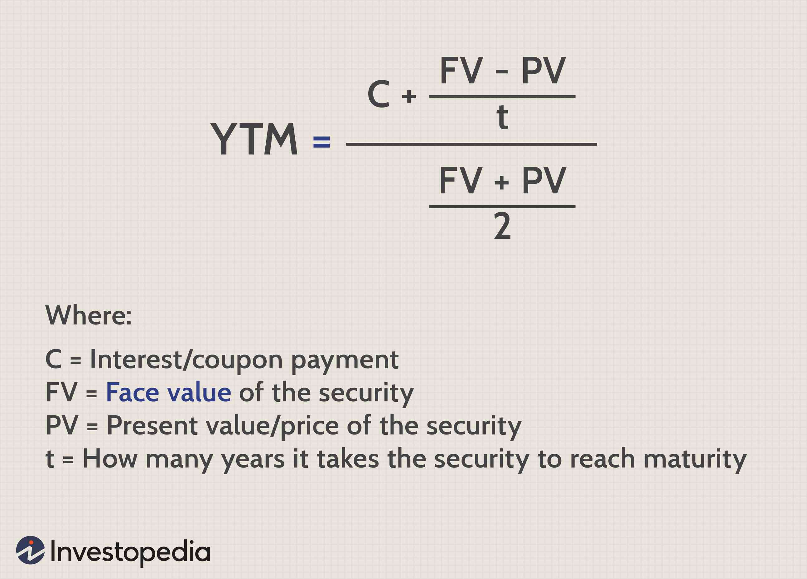

## Table of Contents

## What is Yield to Worst (YTW)?

Yield to Worst (YTW) is a measure used in finance to figure out the lowest possible yield an investor could get from a bond. It takes into account all the different ways a bond might be paid back early, like if the issuer decides to call the bond back before it matures. By looking at the YTW, investors can understand the worst-case scenario for their investment's return, which helps them make smarter decisions.

YTW is especially useful for bonds that have features allowing the issuer to redeem them before they reach their full term. For example, if a bond can be called back in 5 years but matures in 10, the YTW calculation would consider the yield if the bond is called at the earliest possible date. This way, investors can see the minimum return they might get, which is crucial for managing risk and planning their investments carefully.

## Why is Yield to Worst important for bond investors?

Yield to Worst is important for bond investors because it shows the lowest return they might get from their investment. Bonds can be paid back early if the issuer decides to call them back before they mature. If this happens, the investor might not get as much money as they expected. By looking at the Yield to Worst, investors can see the worst-case scenario for their bond's return. This helps them understand the risks better and decide if the bond is a good investment for them.

Knowing the Yield to Worst is also useful for comparing different bonds. When investors are choosing between several bonds, they can use YTW to see which one has the best worst-case scenario. This can help them pick the bond that offers the most safety and potential return, even if things don't go as planned. In the end, Yield to Worst helps investors make smarter choices and manage their money more carefully.

## How does Yield to Worst differ from Yield to Maturity (YTM)?

Yield to Worst (YTW) and Yield to Maturity (YTM) are both important numbers for bond investors, but they tell you different things. YTM is what you would earn if you held the bond until it matures, or reaches the end of its life. It's like the best-case scenario for your investment. YTM looks at all the interest payments you'll get and the money you get back when the bond matures.

On the other hand, YTW looks at the worst-case scenario. It takes into account things like the bond being called back early by the issuer, which means you might not get to keep the bond until it matures. YTW calculates the lowest possible return you could get if the bond is paid back before it's supposed to be. This helps you understand the risks better and make a safer investment decision.

## What are the components needed to calculate Yield to Worst?

To calculate Yield to Worst, you need to know the bond's price, its face value, the coupon rate, and the dates when the bond could be called back early. You also need to know the frequency of the coupon payments, which is usually yearly or semi-annually. These pieces of information help you figure out the different ways the bond could be paid back and which one would give you the lowest return.

Once you have all these details, you calculate the yield for each possible scenario where the bond could be called back early. This includes the yield if the bond is held until it matures and the yields if it's called back at different times before maturity. The Yield to Worst is the smallest of these yields, showing you the worst-case scenario for your investment return.

## Can you explain the step-by-step process to calculate Yield to Worst?

To calculate Yield to Worst, you start by gathering all the important information about the bond. You need to know the bond's price, its face value, the coupon rate, and the dates when the bond could be called back early. You also need to know how often the bond pays interest, which is usually once or twice a year. With this information, you can figure out all the different ways the bond might be paid back, including if it's held until it matures or if it's called back early.

Next, you calculate the yield for each of these possible scenarios. For example, you calculate the yield if the bond is held until it matures, which is the Yield to Maturity. Then, you calculate the yields for each date the bond could be called back early. Each of these calculations involves figuring out the total return you would get from the bond's interest payments and the amount you get back when the bond is paid off, considering the time value of money. The Yield to Worst is the smallest of all these yields, showing you the lowest possible return you could get from the bond.

## What are the common scenarios where Yield to Worst is applicable?

Yield to Worst is important when you're looking at bonds that can be called back early. This means the company that issued the bond can decide to pay it off before it's supposed to mature. If you're thinking about buying these kinds of bonds, you want to know the worst-case scenario for your investment. That's where Yield to Worst comes in handy. It helps you see the lowest return you might get if the bond is called back early, so you can make a smarter decision.

For example, if you're choosing between different bonds, some might have options for the issuer to call them back in a few years. By looking at the Yield to Worst, you can compare the worst-case returns of each bond. This way, you can pick the one that gives you the best safety net, even if things don't go as planned. Yield to Worst is a key tool for managing risk and making sure you're prepared for different outcomes with your bond investments.

## How does call risk affect the Yield to Worst?

Call risk is the chance that a bond might be paid back early by the issuer. This can happen if the bond has a call feature, which lets the issuer decide to call the bond back before it reaches its full term. When a bond is called back early, it might mean the investor gets less money than they expected. This is because they won't get all the interest payments they would have if the bond had lasted until maturity. So, call risk makes the worst-case scenario for the bond's return more likely to happen.

Because of call risk, the Yield to Worst becomes really important. It tells investors the lowest return they might get if the bond is called back early. By looking at the Yield to Worst, investors can see how much the call risk might affect their investment. If the Yield to Worst is a lot lower than the Yield to Maturity, it means the call risk could have a big impact on what the investor earns. This helps them decide if the bond is a good investment, considering the possibility that it might be called back before it matures.

## What are the limitations of using Yield to Worst as a metric?

Yield to Worst is a helpful tool, but it has some limitations. It only looks at the worst-case scenario, which means it might make you focus too much on the risks and not enough on the good things that could happen. For example, if a bond has a high chance of being called back early but also a good chance of giving you a lot of money if it isn't, Yield to Worst won't show you that. It's like only looking at the dark clouds and not seeing the sunny sky behind them.

Another limitation is that Yield to Worst can be hard to calculate and understand. You need to know a lot about the bond's details, like when it could be called back and what the interest payments are. If you don't have all this information or if you find it hard to do the math, you might not get a good picture of the bond's risks. It's like trying to solve a puzzle without all the pieces; it can be tricky and might lead you to the wrong conclusion about whether the bond is a good investment.

## How can Yield to Worst be used in bond portfolio management?

Yield to Worst is a key tool for managing a bond portfolio because it helps investors understand the lowest possible return they might get from their bonds. When you're putting together a portfolio of bonds, you want to know not just the best-case scenarios but also the worst. By looking at the Yield to Worst for each bond, you can see which ones might not perform as well if they're called back early. This helps you pick a mix of bonds that balance risk and return, making sure your portfolio is ready for different outcomes.

For example, if you have a bunch of bonds in your portfolio and some have call features, you can use Yield to Worst to compare them. You might decide to keep bonds with higher Yields to Worst because they offer a better safety net if things go wrong. This way, you can manage your portfolio more carefully, knowing that you've planned for the worst-case scenarios. Yield to Worst helps you make smarter choices and build a stronger, more resilient bond portfolio.

## What are some advanced techniques to optimize Yield to Worst calculations?

To make Yield to Worst calculations better, you can use computer programs and special math methods. These tools help you do the math faster and more accurately. For example, you can use a program that tries different numbers over and over until it finds the lowest yield possible. This is called an iterative method. Another way is to use something called linear interpolation, which helps you guess the yield between two known points. These techniques make it easier to handle all the different ways a bond might be paid back early and figure out the worst-case scenario quickly.

Another advanced technique is to use a computer model that looks at how likely it is for a bond to be called back early. This is called a callable bond model. By putting in different chances of the bond being called back, you can see how it affects the Yield to Worst. This helps you understand the risks better and make smarter decisions. Using these advanced methods can give you a clearer picture of what might happen with your bond investments and help you plan for the worst-case scenarios more effectively.

## How does the interest rate environment impact Yield to Worst?

The interest rate environment can have a big impact on Yield to Worst. When interest rates go up, the value of existing bonds usually goes down. This is because new bonds will be issued with higher interest rates, making the old bonds less attractive. If a bond has a call feature, the issuer might decide to call it back early and issue new bonds at the higher rates. This means the Yield to Worst could be lower because the bond might be called back before it matures, and you won't get all the interest you expected.

On the other hand, when interest rates go down, the value of existing bonds usually goes up. In this case, the issuer might not call the bond back early because they would have to issue new bonds at lower rates. This means the Yield to Worst might be closer to the Yield to Maturity because the bond is more likely to be held until it matures. So, the interest rate environment is important to consider when you're looking at the Yield to Worst, as it can change how likely it is for a bond to be called back early and affect your investment return.

## Can you provide a case study where Yield to Worst was crucial in investment decision-making?

Imagine an investor named Sarah who was thinking about buying a bond from a company. This bond could be called back by the company after 5 years, even though it was supposed to last for 10 years. Sarah looked at the Yield to Maturity and saw it was pretty good, but she wanted to be safe. So, she checked the Yield to Worst, which showed her the lowest return she might get if the bond was called back early. The Yield to Worst was much lower than the Yield to Maturity, which made Sarah think twice. She realized that if the company called the bond back in 5 years, she wouldn't get as much money as she hoped.

After seeing the Yield to Worst, Sarah decided to compare it with other bonds she was considering. One of the other bonds had a higher Yield to Worst, which meant it was safer if things didn't go as planned. Even though the first bond had a better Yield to Maturity, Sarah chose the second bond because it had a better worst-case scenario. This helped her feel more confident about her investment, knowing she had planned for the possibility of the bond being called back early. In the end, using Yield to Worst helped Sarah make a smarter and safer investment choice.

## What is Understanding Yield to Worst (YTW)?

Yield to Worst (YTW) is a crucial financial metric in bond investing, representing the lowest possible yield an investor can receive on a bond without default. It assumes that any unfavorable call or redemption features will be exercised by the issuer at the earliest opportunity. This makes YTW particularly relevant in the context of callable bonds, where the issuer has the right to redeem the bonds before their maturity date.

Callable bonds are a common scenario where YTW provides significant insight. These financial instruments give issuers the flexibility to call back the bond before maturity, often when interest rates decline, allowing them to refinance the debt at a lower cost. For investors, this presents a risk, as the expected returns may be lowered if the bond is called. YTW calculates the worst-case yield scenario for such bonds, assuming the earliest possible call date, thus providing a conservative estimate of returns.

The importance of YTW lies in its ability to offer a conservative yield estimate, guiding investors in assessing the risk of receiving lower returns than initially anticipated. This metric assumes adverse scenarios, such as the issuer exercising the call option, and provides a benchmark for evaluating the minimum return achievable. This conservative approach contrasts with other yield measures, like Yield to Maturity (YTM), which calculates the yield assuming the bond is held until its maturity date without any early redemption. YTW serves as a risk management tool, enabling investors to make informed decisions by anticipating unfavorable outcomes.

The calculation of YTW involves determining the yield on a bond assuming it is called away at the earliest possible date. This requires evaluating all potential call dates and corresponding call prices. The formula used is similar to that for calculating YTM but considers the worst-case call scenario. The general formula is:

$$

YTW = \frac{C + \left(\frac{F - P}{N}\right)}{\frac{F + P}{2}}
$$

Where:
- $C$ is the annual coupon payment,
- $F$ is the call price (face value if held to maturity),
- $P$ is the current price,
- $N$ is the number of years until the worst-case call or redemption date.

Several factors influence YTW calculations, including changes in interest rates, the bond’s call schedule, and the issuer's creditworthiness. Macroeconomic conditions and market sentiment also play critical roles in determining whether an issuer might choose to call the bond early. As bond markets continue evolving, understanding and accurately calculating YTW remains vital for investors looking to optimize their returns while managing associated risks.

## References & Further Reading

[1]: ["The Handbook of Fixed Income Securities, Eighth Edition"](https://www.amazon.com/Handbook-Fixed-Income-Securities-Eighth/dp/0071768467) by Frank J. Fabozzi

[2]: ["Algorithmic and High-Frequency Trading"](https://www.cambridge.org/us/universitypress/subjects/mathematics/mathematical-finance/algorithmic-and-high-frequency-trading) by Álvaro Cartea, Sebastian Jaimungal, and José Penalva

[3]: ["Fixed Income Securities: Tools for Today's Markets"](https://www.amazon.com/Fixed-Income-Securities-Markets-Finance/dp/1119835550) by Bruce Tuckman and Angel Serrat

[4]: ["Advances in Financial Machine Learning"](https://www.amazon.com/Advances-Financial-Machine-Learning-Marcos/dp/1119482089) by Marcos Lopez de Prado

[5]: ["Quantitative Investing: Strategies to Exploit Anomalies for All Investors"](https://www.amazon.com/Quantitative-Investing-Strategies-anomalies-investors/dp/0857193007) by Fred Piard