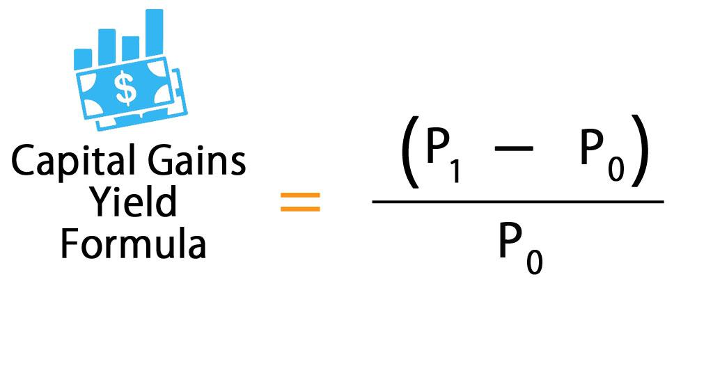

In finance, effective decision-making is crucial for achieving successful investment outcomes. Investors are constantly faced with the challenge of evaluating potential returns and risks associated with their financial choices. At the core of this analysis are financial formulas and yield types, which are essential tools in the investor's toolkit. Financial formulas, such as Net Present Value (NPV), Internal Rate of Return (IRR), and Return on Investment (ROI), offer quantitative insights that empower investors to make informed choices by assessing the profitability and potential risks of various investments.

Yield, on the other hand, represents the earnings generated from an investment over a specified period. Understanding different types of yield, such as dividend yield, bond yield, and yield to maturity, is vital for comparing investment options and making strategic decisions. Each yield type provides unique information about the expected returns, aiding investors in constructing and optimizing their portfolios.



In recent years, algorithmic trading, or algo trading, has emerged as a transformative force in financial markets. By leveraging computer algorithms, algo trading allows for the automatic execution of trades based on preset criteria. This innovation has significantly enhanced trading efficiency and reduced human error, thereby optimizing investment strategies. Algorithmic trading strategies often incorporate financial formulas and yield data to make rapid, data-driven decisions, aligning closely with evolving market dynamics.

This article explores the intersection of financial formulas, yield types, and algorithmic trading, offering insights into how these components work together to enhance financial performance. By the end, you will gain a deeper understanding of how integrating these elements can lead to superior investment outcomes and improve financial decision-making.

## Table of Contents

## Understanding Financial Formulas in Finance

Financial formulas serve as crucial instruments in financial analysis by offering quantitative evaluations of investment opportunities. Among the most pivotal formulas are the Net Present Value (NPV), Internal Rate of Return (IRR), and Return on Investment (ROI). These metrics offer insights into the potential profitability and risks associated with various investments.

### Net Present Value (NPV)

The Net Present Value is a fundamental formula used to determine the value of an investment by assessing the difference between the present value of cash inflows and outflows over a period. The formula is expressed as:

$$

NPV = \sum_{t=0}^{n} \frac{C_t}{(1 + r)^t} 
$$

where $C_t$ is the cash flow at time $t$, $r$ is the discount rate, and $n$ is the investment’s time horizon. A positive NPV indicates that the projected earnings (discounted back to present value) exceed the anticipated costs, suggesting a profitable investment.

### Internal Rate of Return (IRR)

The Internal Rate of Return is used to evaluate the profitability of potential investments. It identifies the discount rate at which the net present value of cash flows equals zero. The IRR can be found by solving the equation:

$$

0 = \sum_{t=0}^{n} \frac{C_t}{(1 + IRR)^t} 
$$

An investment is generally considered favorable if its IRR exceeds the required rate of return, indicating that it is expected to yield more than the cost of capital.

### Return on Investment (ROI)

Return on Investment is a straightforward metric for gauging the efficiency of an investment. It is calculated as:

$$

ROI = \frac{\text{Net Profit}}{\text{Cost of Investment}} \times 100 
$$

ROI provides a percentage representation of the return relative to the investment’s cost, enabling straightforward comparisons across diverse investment opportunities.

### Practical Application

Understanding and applying these formulas is imperative for making informed financial decisions. For example, consider the need to choose between multiple projects. By calculating the NPV, IRR, and ROI for each project, an investor can prioritize options based on potential returns and inherent risks. Here is a simple example using Python to calculate NPV and IRR:

```python
import numpy as np

# Define cash flows
cash_flows = [-1000, 200, 300, 400, 500]  # Investment and annual returns

# Define discount rate
discount_rate = 0.1  # 10%

# Calculate NPV
npv = np.npv(discount_rate, cash_flows)
print(f"Net Present Value (NPV): {npv}")

# Calculate IRR
irr = np.irr(cash_flows)
print(f"Internal Rate of Return (IRR): {irr*100:.2f}%")
```

This script offers a practical illustration of how these financial formulas can be employed to determine the feasibility of investments. By mastering these calculations, investors are better equipped to identify lucrative opportunities and manage financial risks effectively. Understanding financial formulas like NPV, IRR, and ROI is integral to successful investing, as they provide the necessary insights to make informed decisions in the financial landscape.

## Exploring Different Types of Yield

Yield is a fundamental concept in finance, representing the earnings generated from an investment relative to its cost over a specified period. It plays a crucial role in evaluating the attractiveness and profitability of different investment vehicles. Key yield types, such as dividend yield, bond yield, and yield to maturity, offer unique insights vital for comparing assets and making informed investment decisions. 

### Dividend Yield

Dividend yield is a financial ratio that indicates how much a company pays out in dividends each year relative to its stock price. It is calculated using the formula:

$$
\text{Dividend Yield} = \left( \frac{\text{Annual Dividends per Share}}{\text{Price per Share}} \right) \times 100\%
$$

This yield metric is particularly useful for income-focused investors who prioritize receiving regular cash flows from their stock investments. Companies with stable and high dividend yields are often perceived as less risky and more suitable for conservative investment portfolios. However, a high dividend yield might also indicate a declining stock price, necessitating a thorough analysis.

### Bond Yield

Bond yield refers to the returns an investor can expect from holding a bond and is usually represented as an annual percentage. Various measures of bond yield include current yield and yield to maturity.

1. **Current Yield:** This is a simple measure, calculated as:

$$
\text{Current Yield} = \left( \frac{\text{Annual Coupon Payment}}{\text{Current Market Price of the Bond}} \right) \times 100\%
$$

2. **Yield to Maturity (YTM):** This is a more comprehensive measure, taking into account the total returns received if the bond is held until maturity, incorporating all interest payments and any capital gain or loss. Yield to maturity can be calculated iteratively as it generally requires solving for yield in the present value of a bond equation:

$$
P = \sum_{t=1}^{n} \frac{C}{(1 + YTM)^t} + \frac{F}{(1 + YTM)^n}
$$

where $P$ is the bond's current price, $C$ is the coupon payment, $F$ is the face value of the bond, $n$ is the number of years to maturity, and $YTM$ is the yield to maturity.

### Importance in Financial Planning

Different yield types serve varying purposes depending on the investor's financial goals. For instance, dividend yield provides insights into the regular income potential of equity investments, while bond yields are crucial for evaluating the fixed-income segment of a portfolio. Understanding these yields aids investors in assessing the risk-return profile of their investments, thus facilitating a well-balanced and strategic asset allocation. 

Data-driven yield analysis, supported by technology and real-time market information, further enhances the accuracy and effectiveness of financial planning. By mastering yield metrics, investors can better manage their portfolios, forecast potential income streams, and make strategic decisions to optimize their financial outcomes.

## The Role of Algorithmic Trading in Financial Markets

Algorithmic trading, commonly known as algo trading, leverages computer algorithms to automate and streamline the process of executing trades. This approach to trading has brought significant advancements to financial markets by improving trading efficiency and minimizing human errors. At its core, [algorithmic trading](/wiki/algorithmic-trading) uses pre-set rules derived from a variety of inputs, including financial formulas and yield data, to make instantaneous and objective decisions.

One of the primary benefits of algorithmic trading is its ability to operate at speeds and volumes far beyond what human traders can achieve. Algorithms can process vast amounts of market data in real-time, identifying patterns and trends that can trigger buy or sell orders within microseconds. This capability not only enhances market [liquidity](/wiki/liquidity-risk-premium) but also reduces transaction costs and minimizes the impact of market changes on larger trades.

Algorithmic trading strategies are built around the principles of quantitative analysis, utilizing various financial models and formulas to derive insights from data. For instance, strategies may rely on moving averages, mean reversion, or [momentum](/wiki/momentum) indicators, each offering a different perspective on how to capitalize on market dynamics. These strategies often use statistical models to predict future price movements based on historical data.

Python has emerged as a popular language for developing algorithmic trading systems due to its extensive libraries and frameworks. Libraries such as NumPy and pandas allow traders to perform complex quantitative analyses, while trading platforms like QuantConnect and Zipline facilitate back-testing and live execution.

An example of a simple moving average crossover strategy in Python might look like this:

```python
import pandas as pd
import numpy as np

# Load historical market data
data = pd.read_csv('market_data.csv')
data['Date'] = pd.to_datetime(data['Date'])
data.set_index('Date', inplace=True)

# Calculate moving averages
short_window = 40
long_window = 100

data['short_mavg'] = data['Close'].rolling(window=short_window, min_periods=1).mean()
data['long_mavg'] = data['Close'].rolling(window=long_window, min_periods=1).mean()

# Generate signals
data['signal'] = 0
data['signal'][short_window:] = np.where(data['short_mavg'][short_window:] > data['long_mavg'][short_window:], 1, -1)

# Calculate trading positions
data['position'] = data['signal'].shift()

# Print first few rows
print(data.head())
```

This script reads historical market data, calculates short-term and long-term moving averages, and generates buy or sell signals based on a crossover strategy. Such strategies are foundational in algo trading and can be further enhanced with complex data analytics and [machine learning](/wiki/machine-learning) techniques.

Furthermore, modern algo trading platforms use real-time data feeds and low-latency connections to ensure trades are executed at optimal prices. These platforms incorporate sophisticated risk management tools, allowing traders to set predefined stop-loss limits and other protective measures automatically.

In summary, algorithmic trading is reshaping financial markets by using advanced computational techniques to optimize trading decisions. Its capacity to process and analyze real-time data, along with the integration of financial formulas and yield insights, makes it a powerful tool for enhancing trading outcomes and improving market efficiency.

## Integrating Financial Formulas and Yields in Algorithmic Strategies

Integrating financial formulas and yield data into algorithmic strategies can significantly enhance the precision of trading decisions. The application of such quantitative tools allows traders to efficiently exploit market trends and evaluate potential investment returns.

Financial ratios, such as the Price-to-Earnings (P/E) ratio, the Debt-to-Equity (D/E) ratio, and the Current Ratio, serve as critical indicators in identifying market patterns and assessing a company's financial health. By leveraging these ratios, algorithms are capable of recognizing valuation trends and predicting changes in asset prices. Such predictive power enables traders to react quickly to market developments, thereby optimizing their trading decisions.

Yield data is another essential component that algorithms utilize to evaluate the profitability of investment opportunities. For instance, understanding the yield to maturity (YTM) of bonds helps algorithms ascertain the return an investor would receive if the bond is held until its maturity date. This insight assists in comparing different fixed-income assets accurately, considering factors like [interest rate](/wiki/interest-rate-trading-strategies) changes and reinvestment risks.

To incorporate financial formulas and yield data into trading algorithms, developers can employ programming languages like Python, which offers powerful libraries and tools for data analysis and machine learning. For example, the following Python snippet demonstrates how to use the Pandas library to calculate a moving average of a stock's price—a foundational concept in momentum trading:

```python
import pandas as pd

# Sample data: Daily closing prices of a stock
data = {'Date': ['2023-01-01', '2023-01-02', '2023-01-03', '2023-01-04'],
        'Close': [150, 153, 155, 154]}
df = pd.DataFrame(data)

# Compute the moving average over a 3-day window
df['Moving Average'] = df['Close'].rolling(window=3).mean()

print(df)
```

In addition to classic quantitative data manipulation, developments in machine learning and [artificial intelligence](/wiki/ai-artificial-intelligence) offer advanced methods for integrating financial analysis into trading systems. Tools such as TensorFlow and PyTorch provide frameworks for creating models that can learn from historical market data and make predictive decisions in real-time. These models can incorporate numerous variables, including financial ratios and yields, enhancing their capacity to predict market movements and identify lucrative trading opportunities.

By employing these cutting-edge tools and technologies, traders and developers can achieve a seamless integration of financial analysis into their algorithmic trading systems. This technological synergy not only augments decision-making accuracy but also maximizes trading efficiency and profitability, ensuring a competitive edge in the fast-paced world of finance.

## Conclusion

The synergy between financial formulas, yield types, and algorithmic trading is significantly shaping the finance industry. By understanding and applying these concepts, investors can optimize trading strategies to enhance returns. Financial formulas such as Net Present Value (NPV), Internal Rate of Return (IRR), and Return on Investment (ROI) provide the quantitative foundation needed to analyze investment opportunities and assess risk effectively. These formulas allow traders to evaluate the viability and potential profitability of an investment. 

Yield types, including dividend yield, bond yield, and yield to maturity, further aid investors by offering insights into the earnings generated from an investment within a specific period. By comparing these yields, investors can make informed decisions among various investment options and align their portfolio strategies with desired outcomes.

Algorithmic trading has emerged as a powerful tool in integrating these financial aspects, improving trading efficiency through automation and precision. By employing computer algorithms, algo trading platforms leverage real-time data and advanced statistical models to execute trades with reduced human error. The incorporation of financial formulas and yield data into these algorithms enables more accurate and timely decision-making, enhancing investment strategies.

As technological advancements continue, the role of algorithmic trading in financial markets is expected to grow. It's imperative for investors and traders to stay abreast of such developments to maintain a competitive edge. Mastery over the integration of financial formulas, yield types, and algorithmic trading can lead to superior financial performance. By effectively harnessing these components, traders have the opportunity to achieve enhanced returns and foster sustainable growth within their investment portfolios.

## References & Further Reading

[1]: Bergstra, J., Bardenet, R., Bengio, Y., & Kégl, B. (2011). ["Algorithms for Hyper-Parameter Optimization."](https://papers.nips.cc/paper/4443-algorithms-for-hyper-parameter-optimization) Advances in Neural Information Processing Systems 24.

[2]: ["Advances in Financial Machine Learning"](https://www.amazon.com/Advances-Financial-Machine-Learning-Marcos/dp/1119482089) by Marcos Lopez de Prado

[3]: ["Evidence-Based Technical Analysis: Applying the Scientific Method and Statistical Inference to Trading Signals"](https://www.amazon.com/Evidence-Based-Technical-Analysis-Scientific-Statistical/dp/0470008741) by David Aronson

[4]: ["Machine Learning for Algorithmic Trading"](https://github.com/stefan-jansen/machine-learning-for-trading) by Stefan Jansen

[5]: ["Quantitative Trading: How to Build Your Own Algorithmic Trading Business"](https://www.amazon.com/Quantitative-Trading-Build-Algorithmic-Business/dp/1119800064) by Ernest P. Chan