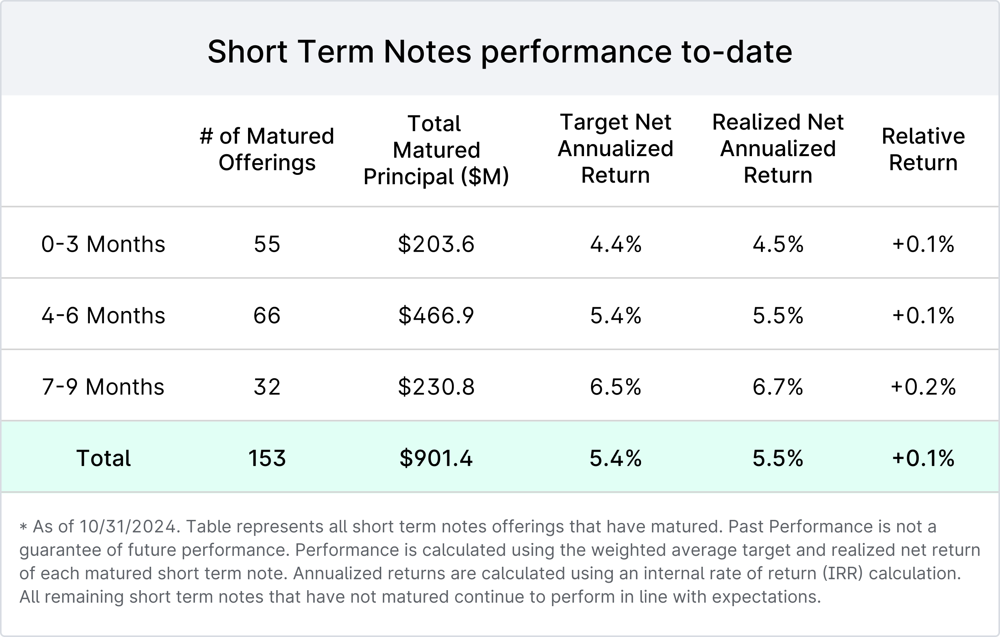

## Table of Contents

## What is Yieldstreet and what services does it offer?

Yieldstreet is a financial platform that helps people invest their money in different ways. It was started in 2015 and is based in New York. The main goal of Yieldstreet is to make investing easier and more accessible for everyone, not just rich people. They do this by offering investments in things like real estate, art, and legal settlements, which are usually hard for regular people to get into.

The services that Yieldstreet offers include different types of investment opportunities. They have something called "alternative investments," which means you can invest in things other than just stocks and bonds. For example, you can invest in real estate projects, artwork, or even legal cases that might pay out money. Yieldstreet takes care of managing these investments, so you don't have to worry about the details. They also provide tools and information to help you understand where your money is going and how it's doing.

## How does Yieldstreet work for investors?

Yieldstreet works by letting people invest in things that are usually hard to get into, like real estate or art. When you find an investment you like on their website, you can put in some money. Yieldstreet then pools this money with other investors' money to buy the investment. They take care of everything, from buying the investment to managing it. This means you don't have to do much work after you invest.

Once the investment is bought, Yieldstreet keeps you updated on how it's doing. They send you reports and let you know if there are any changes. If the investment makes money, like if a piece of real estate is sold for a profit, Yieldstreet shares that money with you. They take a fee for their work, but the rest goes to you and the other investors. This way, you can earn money from investments that you might not have been able to get into on your own.

## What types of investments can be found on Yieldstreet?

Yieldstreet offers different kinds of investments that you might not find on other platforms. They have things like real estate, where you can invest in buildings or land. They also let you invest in art, which means you can own a piece of a famous painting or sculpture. Another type of investment they offer is in legal settlements, where you can invest in cases that might pay out money if they win.

Besides these, Yieldstreet also has investments in things like commercial loans and marine finance. Commercial loans are when businesses borrow money, and you can invest in those loans to earn interest. Marine finance is about investing in ships or boats, which can be a good way to make money if the ships are used for business. All these investments are managed by Yieldstreet, so you don't have to worry about the details.

## What are the minimum investment requirements on Yieldstreet?

The minimum amount you need to invest on Yieldstreet can be different for each investment. Usually, it's around $5,000, but some investments might need more or less money. This means you should check each investment to see how much you need to put in.

Yieldstreet wants to make investing easier for everyone, but they still have these minimums to make sure they can manage the investments well. If you're thinking about investing, you'll need to have at least the minimum amount ready. This way, you can join in and possibly earn money from things like real estate, art, or legal settlements.

## How does Yieldstreet generate returns for its investors?

Yieldstreet helps investors earn money by investing their money in different things like real estate, art, and legal settlements. When you invest, Yieldstreet pools your money with other investors' money to buy these investments. They take care of everything, from buying the investment to managing it. If the investment does well, like if a piece of real estate goes up in value and is sold for a profit, Yieldstreet shares that profit with you. They take a fee for their work, but the rest of the money goes to you and the other investors.

The way Yieldstreet makes money for you can be different depending on what you invest in. For example, if you invest in a real estate project, you might get money from rent while the property is owned, and then a big payout if it's sold for more than what was paid for it. If you invest in a legal settlement, you might get money if the case wins and there's a payout. Yieldstreet keeps you updated on how your investment is doing, so you know what's happening with your money.

## What are the fees associated with investing through Yieldstreet?

When you invest through Yieldstreet, they charge fees for their services. These fees help them manage your investments and keep everything running smoothly. The main fee you'll see is the management fee, which is usually around 1% to 2% of the money you invest each year. This fee is taken out of your investment, so it's important to think about it when you're looking at how much money you might make.

There can also be other fees depending on what you're investing in. For example, if you're investing in real estate, there might be fees for buying or selling the property. These fees are usually one-time costs and can change depending on the investment. Yieldstreet tries to be clear about all the fees so you know what you're paying for, but it's a good idea to read all the details before you invest.

## How does Yieldstreet assess and manage risk?

Yieldstreet works hard to understand and manage the risks that come with investing. They do this by carefully checking each investment before they let people put money into it. They look at things like the history of the investment, how likely it is to make money, and what could go wrong. This helps them pick investments that have a good chance of doing well, even though there's always some risk with investing.

Once an investment is chosen, Yieldstreet keeps a close eye on it. They have a team of experts who watch over the investments and make sure everything is going as planned. If something changes, like if a real estate project runs into problems, they figure out the best way to handle it. They also spread out the investments so that if one doesn't do well, it won't hurt all the money people have put in. This way, they try to keep the risks as low as possible while still trying to make money for investors.

## What is the historical performance of investments on Yieldstreet?

Yieldstreet has had a good track record with its investments. Since they started, many of their investments have made money for people who put money in them. For example, their real estate investments have often done well, with some projects making a lot of money when they were sold. The same goes for their art investments, where pieces of art have gone up in value over time. This has helped a lot of investors earn more than they would have with regular savings accounts or other simple investments.

Of course, not every investment on Yieldstreet has been a winner. Some have lost money, which is normal in investing because there's always some risk. But overall, Yieldstreet has managed to keep the good investments more common than the bad ones. They share detailed reports about how each investment is doing, so people can see the ups and downs. This helps investors understand that while there are risks, Yieldstreet has a history of finding good opportunities that can lead to profits.

## How does Yieldstreet ensure transparency and investor communication?

Yieldstreet makes sure to keep things clear and open with its investors. They do this by giving regular updates on how each investment is doing. These updates come in the form of reports that you can read on their website. They tell you about any big changes or news about the investment, so you always know what's going on with your money. This way, you can see if the investment is doing well or if there are any problems.

They also have a team that you can talk to if you have questions. You can reach out to them through email or phone, and they'll help explain things to you. Yieldstreet believes in being honest and clear, so they make sure you have all the information you need to feel good about your investments. This helps build trust and makes investing with them easier and less scary.

## What are the tax implications of investing through Yieldstreet?

When you invest through Yieldstreet, you need to think about taxes. The money you make from your investments might be taxed, and how much you pay can depend on what you invested in. For example, if you invest in real estate and get money from rent, that's usually considered regular income and you'll pay taxes on it. If you sell the real estate and make a profit, that profit is called a capital gain, and you might pay a different tax rate on that. Yieldstreet gives you information to help you figure out your taxes, but it's a good idea to talk to a tax expert to make sure you're doing everything right.

Different investments can have different tax rules. If you invest in art or legal settlements, the tax situation might be different from real estate. Yieldstreet sends you tax documents at the end of the year, like a Form 1099, which shows how much money you made from your investments. This helps you when you're filling out your tax return. Remember, taxes can be tricky, so it's always smart to get advice from someone who knows a lot about taxes to make sure you're not missing anything important.

## How does Yieldstreet's platform compare to other alternative investment platforms?

Yieldstreet stands out from other alternative investment platforms because it offers a wide range of investment options, like real estate, art, and legal settlements. This variety makes it easier for people to find something that fits what they want to invest in. Other platforms might focus on just one type of investment, like real estate or stocks, but Yieldstreet gives you more choices. They also have a lower minimum investment amount, usually around $5,000, which means more people can start investing with them compared to some other platforms that might need more money to get started.

Another way Yieldstreet is different is how they work hard to keep things clear and open with their investors. They send regular updates and reports so you always know how your money is doing. Some other platforms might not be as good at keeping you in the loop. Yieldstreet also has a team you can talk to if you have questions, which can make investing feel less scary. While other platforms might have their own good points, like lower fees or different investment options, Yieldstreet's focus on variety, accessibility, and communication makes it a strong choice for people looking to invest in alternative ways.

## What future developments or innovations can we expect from Yieldstreet in 2024?

In 2024, Yieldstreet is planning to keep making their platform better and easier to use. They want to add more types of investments so people can have even more choices. They might start offering things like investments in technology startups or green energy projects. This would give investors more ways to put their money into things they care about, like helping the environment or supporting new businesses. Yieldstreet also wants to make their website and app easier to use, so even if you're new to investing, you can figure out how to use it without any trouble.

Another big thing Yieldstreet is working on is using new technology to make investing smoother. They're looking into using artificial intelligence to help pick the best investments and to give better advice to people. This could mean that the platform will be able to suggest investments that fit what you're looking for even better. They also want to make sure their platform is safe and secure, so they'll be adding more ways to protect your money and information. All these changes are meant to make investing with Yieldstreet a better experience for everyone.

## References & Further Reading

[1]: Bergstra, J., Bardenet, R., Bengio, Y., & Kégl, B. (2011). ["Algorithms for Hyper-Parameter Optimization."](https://papers.nips.cc/paper/4443-algorithms-for-hyper-parameter-optimization) Advances in Neural Information Processing Systems 24.

[2]: ["Advances in Financial Machine Learning"](https://www.amazon.com/Advances-Financial-Machine-Learning-Marcos/dp/1119482089) by Marcos Lopez de Prado

[3]: ["Evidence-Based Technical Analysis: Applying the Scientific Method and Statistical Inference to Trading Signals"](https://www.amazon.com/Evidence-Based-Technical-Analysis-Scientific-Statistical/dp/0470008741) by David Aronson

[4]: ["Machine Learning for Algorithmic Trading"](https://github.com/stefan-jansen/machine-learning-for-trading) by Stefan Jansen

[5]: ["Quantitative Trading: How to Build Your Own Algorithmic Trading Business"](https://www.amazon.com/Quantitative-Trading-Build-Algorithmic-Business/dp/1119800064) by Ernest P. Chan