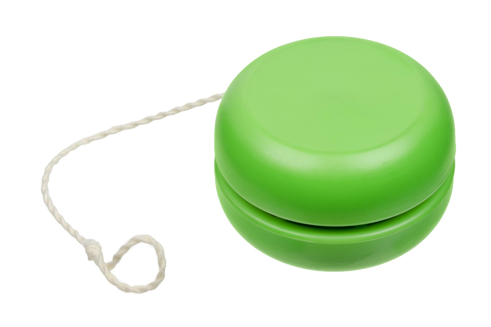

## Table of Contents

## What is a yo-yo and how does it work?

A yo-yo is a toy that you play with by holding a string and making it go up and down. It is made of two round parts called halves that are joined together with an axle in the middle. The string is tied to the axle and wraps around it. When you throw the yo-yo down, the string unwraps from the axle, letting the yo-yo spin and go down.

When the yo-yo reaches the end of the string, it keeps spinning because of something called inertia. This makes the yo-yo stay at the bottom until you pull the string up. When you pull up, the string wraps back around the axle, and the yo-yo comes back up to your hand. You can do many tricks with a yo-yo by changing how you throw it and pull the string.

## What are the basic parts of a yo-yo?

A yo-yo has a few main parts that make it work. The body of the yo-yo is made up of two round halves. These halves are usually made from plastic or wood and are connected in the middle by an axle. The axle is a small rod that goes through the center of the yo-yo and holds the two halves together.

The string is another important part of the yo-yo. One end of the string is tied to the axle, and the other end is looped around your finger. When you throw the yo-yo, the string unwraps from the axle, letting the yo-yo spin and move down. When you pull the string, it wraps back around the axle, bringing the yo-yo back up to your hand.

## How do you perform a basic yo-yo throw?

To do a basic yo-yo throw, start by holding the yo-yo in your hand with the string looped around your middle finger. Make sure the yo-yo is hanging down from your hand. Then, swing your hand down and forward in a smooth motion, like you're throwing the yo-yo away from you. Let go of the yo-yo at the right time so it goes straight down.

When the yo-yo reaches the end of the string, it will keep spinning at the bottom. To bring it back up, give a gentle tug on the string with your hand. This will make the yo-yo start to wrap the string back around the axle and come back up to your hand. Practice this throw and catch a few times to get the hang of it.

## What are some common beginner yo-yo tricks?

One easy trick for beginners is called the "sleeper." To do this, throw the yo-yo down like you normally would, but instead of pulling it back right away, keep your hand still. The yo-yo will keep spinning at the bottom of the string. After a few seconds, give the string a small tug to make the yo-yo come back up. This trick helps you learn how to control the yo-yo's spin.

Another simple trick is the "walk the dog." Start by doing a sleeper, keeping the yo-yo spinning at the bottom of the string. Then, slowly tilt your hand forward so the yo-yo touches the ground. The yo-yo will roll forward as it spins, looking like it's walking a dog. To end the trick, lift your hand up gently to make the yo-yo come back to you. This trick is fun and helps you practice keeping the yo-yo spinning.

A third trick beginners can try is the "forward pass." Begin with a sleeper, keeping the yo-yo spinning at the end of the string. Then, swing your hand forward and let the yo-yo swing out in front of you. As it swings back, catch it in your hand. This trick helps you learn how to control the yo-yo's movement and timing.

## How do you maintain and care for a yo-yo?

To keep your yo-yo working well, you need to take good care of it. First, always clean your yo-yo after playing with it. You can use a soft cloth to wipe off any dirt or dust. If the yo-yo gets really dirty, you can use a little bit of water and mild soap, but make sure to dry it completely before you play with it again. Also, check the string often. If it gets frayed or dirty, you should replace it. You can find new strings at toy stores or online.

Another important thing is to keep the yo-yo's axle clean and smooth. Sometimes, the axle can get sticky or dirty, which makes the yo-yo hard to spin. You can use a small tool like a toothpick to clean out any dirt from the axle. If your yo-yo has a bearing, you might need to clean it with a special cleaner or replace it if it gets too worn out. By taking these simple steps, your yo-yo will stay in good shape and be fun to play with for a long time.

## What are the differences between fixed axle and ball bearing yo-yos?

Fixed axle yo-yos are the classic type where the string is tied directly to a solid axle that goes through the middle of the yo-yo. When you throw a fixed axle yo-yo, it spins and goes down, but it doesn't stay spinning at the bottom for very long. You have to pull the string quickly to make it come back up. These yo-yos are good for learning the basics and doing simple tricks like the sleeper and walk the dog. They are often cheaper and easier to find.

Ball bearing yo-yos have a different kind of axle that uses small metal balls inside it. This makes the yo-yo spin much longer and smoother at the bottom of the string. When you throw a ball bearing yo-yo, it can stay spinning for a long time, which makes it easier to do more advanced tricks. These yo-yos are usually more expensive than fixed axle ones, but they are great for people who want to do more complicated tricks and have more fun with their yo-yo.

## How do responsive and unresponsive yo-yos differ in functionality?

Responsive yo-yos are easier for beginners. They come back up when you give the string a small tug. This is because they have a special part inside called a clutch or star-shaped piece. When you tug the string, this part makes the yo-yo return to your hand. Responsive yo-yos are good for learning basic tricks like the sleeper and walk the dog because they are easy to control.

Unresponsive yo-yos are for more advanced players. They don't come back up when you tug the string. Instead, you need to do a special move called a "bind" to make them return. Unresponsive yo-yos have a smoother, longer spin, which is great for doing harder tricks. They need more skill to use, but they let you do more cool things with your yo-yo.

## What are some advanced yo-yo tricks and how are they executed?

One advanced trick is called the "Brain Twister." To do this trick, start with a sleeper, keeping the yo-yo spinning at the bottom of the string. Then, swing the yo-yo around your hand in a big circle, making sure it stays spinning the whole time. After it goes around once, let the yo-yo swing back to the front of your hand and do a bind to make it come back up. This trick looks cool and takes practice to keep the yo-yo spinning smoothly while it goes around your hand.

Another advanced trick is the "Iron Whip." Begin with a sleeper, then swing the yo-yo out to the side and make it go around your body. As it comes back to the front, catch the string with your free hand and make a loop. Then, swing the yo-yo through the loop and let it spin around your body again. Finally, do a bind to bring the yo-yo back up. This trick needs good timing and control to make sure the yo-yo goes through the loop and keeps spinning.

A third advanced trick is the "Kwijibo." Start with a sleeper, then swing the yo-yo out to the side and make it go around your body. As it comes back to the front, catch the string with your free hand and make a loop. Swing the yo-yo through the loop and let it go around your body again. This time, as it comes back, make another loop with your free hand and swing the yo-yo through it again. Finally, do a bind to bring the yo-yo back up. This trick is really hard because you need to make two loops and keep the yo-yo spinning through them both.

## How does the string length and type affect yo-yo performance?

The length of the yo-yo string can change how well you play. If the string is too short, it can be hard to do tricks because the yo-yo won't have enough room to spin and move. If the string is too long, it can be hard to control the yo-yo and it might get tangled up. Most yo-yos come with a string that is just the right length for the size of the yo-yo, but you might need to change it a little bit to fit your hand and the tricks you want to do.

The type of string also makes a difference. Some strings are made of cotton, which is soft and good for beginners because it's easy to use. Other strings are made of polyester, which is stronger and lasts longer. Polyester strings are better for advanced players because they can handle more spinning and harder tricks. The type of string you choose can help you do better with your yo-yo, so it's good to try different kinds to see what works best for you.

## What are the competitive aspects of yo-yoing and what are the categories?

Yo-yoing can be a sport where people compete against each other to see who can do the best tricks. There are different categories in yo-yo competitions, like freestyle and 1A to 5A. In freestyle, players do a routine with lots of different tricks to show off their skills. The 1A to 5A categories are about using different types of yo-yos and doing specific kinds of tricks. For example, 1A is for regular yo-yos, and 2A is for two yo-yos at the same time.

Judges in yo-yo competitions look at things like how well the tricks are done, how hard the tricks are, and how creative the routine is. Competitors get points for each trick they do right and lose points if they make mistakes. The person with the most points at the end wins. Yo-yo competitions can be fun to watch because players do amazing tricks and show off their yo-yo skills.

## How has yo-yo design evolved over time and what are the latest innovations?

Yo-yo design has changed a lot over time. In the old days, yo-yos were made of wood or metal and had a simple fixed axle. They were fun to play with, but they didn't spin for very long. As time went on, people started making yo-yos out of plastic, which made them lighter and easier to use. Then, they added ball bearings to the axle, which made the yo-yo spin longer and smoother. This let people do more tricks and have more fun with their yo-yos.

The latest innovations in yo-yo design are all about making them even better for doing tricks. Some yo-yos now have special shapes that help them spin longer and make it easier to do hard tricks. There are also yo-yos with adjustable gaps, which means you can change how tight or loose the yo-yo is to fit your style of playing. Another cool thing is that some yo-yos have lights or sounds, which makes playing with them even more fun. These new designs show how much yo-yos have changed and how they keep getting better for players of all levels.

## What are the physics principles that govern yo-yo motion and performance?

Yo-yos work because of some basic physics rules. When you throw a yo-yo down, it starts spinning and moves because of something called angular [momentum](/wiki/momentum). This is like when a spinning top keeps going because it wants to keep spinning in the same way. The yo-yo keeps spinning at the bottom of the string because of inertia, which means it wants to keep doing what it's doing unless something changes it. The string also helps because it makes the yo-yo go in a circle, which is called centripetal force. This force pulls the yo-yo towards the center of the circle, which is your hand.

Another important thing is friction. When the yo-yo spins, the string rubs against the axle, and this friction can slow it down. In a fixed axle yo-yo, the friction is high, so it doesn't spin for long. But in a ball bearing yo-yo, the friction is low because the little balls inside the bearing let the yo-yo spin smoothly. This makes the yo-yo spin longer and do more tricks. The way the yo-yo comes back up when you tug the string is because of something called torque. When you pull the string, it makes the yo-yo twist and wrap the string back around the axle, bringing it back to your hand.

## How can one navigate volatile markets using algorithmic trading?

Algorithmic trading has emerged as a powerful tool for navigating the unpredictable landscape of yo-yo markets, where rapid price fluctuations can present both opportunities and challenges. By leveraging predefined algorithms, traders can efficiently pinpoint optimal buy and sell points, adjusting strategies based on historical price patterns and current market conditions. Several [algorithmic trading](/wiki/algorithmic-trading) strategies have proven particularly effective in volatile markets, including momentum trading, [trend following](/wiki/trend-following), and [arbitrage](/wiki/arbitrage).

Momentum trading capitalizes on the continuation of existing market trends, with algorithms designed to detect and exploit these trends swiftly. This approach relies on the assertion that securities that have been rising (or falling) in price will continue to do so. Algorithms in this strategy often use indicators such as the Moving Average Convergence Divergence (MACD) and Relative Strength Index (RSI) to signal trading opportunities.

Trend following strategies, on the other hand, seek to profit from the ongoing directional movement of an asset's price. Algorithms in this strategy monitor price movements over a specific period to identify the direction of the trend. A common formula used is the calculation of moving averages to smooth out short-term fluctuations and highlight longer-term trends. For instance, moving averages $MA_t$ can be computed as:

$$
MA_t = \frac{1}{n} \sum_{i=t-n+1}^{t} P_i
$$

where $P_i$ represents the asset price at time $i$ and $n$ is the number of periods considered.

Arbitrage strategies exploit price discrepancies of the same asset in different markets or forms. Algorithms rapidly execute trades to benefit from even minor differences, an action that requires high-speed execution and minimal transaction latency. This approach is particularly effective in volatile markets, where price inefficiencies can occur more frequently.

Automation is a key element in algorithmic trading, allowing for prompt intervention as soon as trading opportunities arise. Automated systems can execute trades with precision and speed, which is crucial in fast-moving yo-yo markets where human intervention may lag. The latency, or the delay between identifying an opportunity and executing a trade, is minimized with automation, enhancing the potential for profitable trades.

Incorporating [machine learning](/wiki/machine-learning) and [artificial intelligence](/wiki/ai-artificial-intelligence) (AI) further elevates the predictive capacity of algorithmic trading strategies, enabling systems to adapt quickly to changing market dynamics. Machine learning models can analyze vast datasets to uncover patterns and correlations that may not be immediately visible through traditional analysis. By continuously learning from new data, these models can refine their predictions and improve over time, thus enhancing the ability of traders to navigate volatile yo-yo market conditions effectively. Python, a popular language in financial analysis, offers numerous libraries such as NumPy, pandas, and TensorFlow that facilitate the development of sophisticated machine learning models for trading.

Overall, algorithmic trading strategies, supported by automation and advanced data analytics, provide traders with the tools necessary to exploit the rapid swings characteristic of yo-yo markets, turning potential [volatility](/wiki/volatility-trading-strategies) risks into profitable opportunities.

## References & Further Reading

[1]: Bergstra, J., Bardenet, R., Bengio, Y., & Kégl, B. (2011). ["Algorithms for Hyper-Parameter Optimization."](https://papers.nips.cc/paper/4443-algorithms-for-hyper-parameter-optimization) Advances in Neural Information Processing Systems 24.

[2]: ["Advances in Financial Machine Learning"](https://www.amazon.com/Advances-Financial-Machine-Learning-Marcos/dp/1119482089) by Marcos Lopez de Prado

[3]: ["Evidence-Based Technical Analysis: Applying the Scientific Method and Statistical Inference to Trading Signals"](https://www.amazon.com/Evidence-Based-Technical-Analysis-Scientific-Statistical/dp/0470008741) by David Aronson

[4]: ["Machine Learning for Algorithmic Trading"](https://github.com/stefan-jansen/machine-learning-for-trading) by Stefan Jansen

[5]: ["Quantitative Trading: How to Build Your Own Algorithmic Trading Business"](https://www.amazon.com/Quantitative-Trading-Build-Algorithmic-Business/dp/1119800064) by Ernest P. Chan