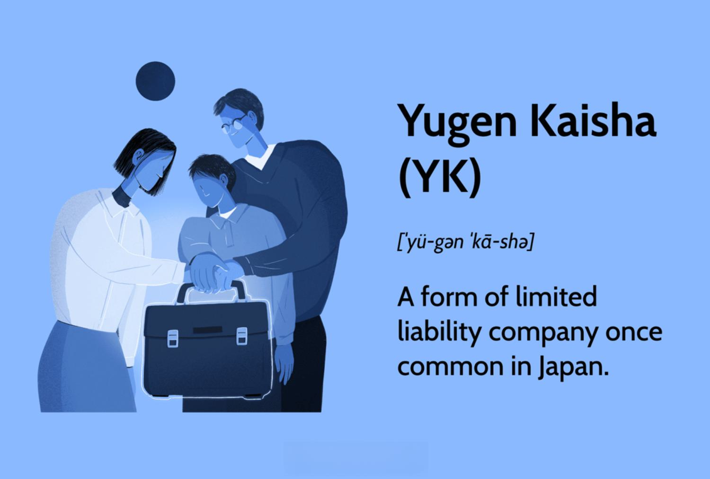

## Table of Contents

## What is a Yugen Kaisha (YK)?

A Yugen Kaisha, often abbreviated as YK, is a type of private company in Japan. It is similar to a limited liability company in other countries. This means that the owners, called shareholders, are not personally responsible for the company's debts. YKs were popular before 2006, but they are less common now because a new type of company called Godo Kaisha (GK) was introduced.

Starting a YK requires at least one shareholder and one director. The shareholders can be individuals or other companies. The company must have a minimum capital of 3 million yen, which is about $27,000 USD. YKs must also have a company seal, called a hanko, which is used to sign official documents. Even though YKs are not as popular anymore, some businesses still choose this structure because it is well-known and trusted.

## How does a Yugen Kaisha differ from other business structures in Japan?

A Yugen Kaisha (YK) is different from other business structures in Japan in a few ways. First, it is a private company, which means it is not listed on the stock market. This is different from a Kabushiki Kaisha (KK), which can be public and can sell shares to the public. A YK also needs at least one shareholder and one director, but it cannot have more than 50 shareholders. This makes it smaller and more private than a KK, which can have many more shareholders.

Another difference is that a YK needs a minimum capital of 3 million yen to start, which is less than the 10 million yen needed for a KK. This makes it easier for smaller businesses to start as a YK. Also, a YK must use a company seal, called a hanko, for official documents. This is a traditional practice in Japan that is not required for all business types, like the newer Godo Kaisha (GK). A GK is more flexible and does not have a limit on the number of shareholders, making it a popular choice for new businesses since it was introduced in 2006.

## What are the legal requirements to establish a Yugen Kaisha?

To start a Yugen Kaisha (YK), you need at least one shareholder and one director. The shareholders can be people or other companies. You also need to have at least 3 million yen as the minimum capital to start the company. This money shows that the company has enough funds to operate. You must also create a company seal, called a hanko, which is used to sign official documents. This is a traditional practice in Japan.

You also need to register the YK with the Legal Affairs Bureau. This involves filling out forms and paying a fee. The registration process includes providing the company's name, address, and details about the shareholders and directors. Once everything is approved, the YK becomes a legal entity. Remember, a YK can have no more than 50 shareholders, which keeps it a private company.

## Who can be a director or an auditor in a Yugen Kaisha?

In a Yugen Kaisha, a director can be any person who is at least 18 years old. They do not need to be a Japanese citizen or live in Japan. The director is responsible for managing the company and making sure it follows the law. They can be a shareholder or someone from outside the company. The shareholders choose the director, and there must be at least one director in a YK.

An auditor in a Yugen Kaisha is someone who checks the company's financial records to make sure they are correct. Like a director, an auditor must be at least 18 years old but does not need to be a Japanese citizen or live in Japan. The auditor's job is to make sure the company is following the rules and that the financial reports are honest. A YK does not always need an auditor, but if it does, the shareholders choose them.

## What is the minimum capital required to start a Yugen Kaisha?

To start a Yugen Kaisha, you need at least 3 million yen. This is the minimum amount of money you must have to set up the company. It shows that the company has enough money to start working.

This amount is less than what you need for some other types of companies in Japan. For example, a Kabushiki Kaisha needs 10 million yen to start. The 3 million yen for a Yugen Kaisha makes it easier for smaller businesses to begin.

## How is the liability of shareholders structured in a Yugen Kaisha?

In a Yugen Kaisha, the shareholders are not personally responsible for the company's debts. This means if the company owes money, the shareholders' personal money and things they own are safe. The most they can lose is the money they put into the company as their share.

This structure is called limited liability. It helps people feel safer about starting a business because they know their personal money is protected. It's one reason why people might choose a Yugen Kaisha over other types of businesses where they might have to pay the company's debts with their own money.

## What are the tax implications for a Yugen Kaisha?

A Yugen Kaisha (YK) has to pay taxes like any other business in Japan. The company pays corporate tax on its profits. The tax rate depends on how much money the company makes. If the YK makes more money, it pays a higher tax rate. The company also has to pay other taxes like consumption tax, which is like a sales tax, if its sales are over a certain amount.

Shareholders of a YK also have to think about taxes. If the company makes money and gives some of it to the shareholders as dividends, the shareholders have to pay taxes on that money. The tax they pay depends on how much money they get and their personal tax situation. So, both the company and the shareholders need to keep track of their taxes and make sure they pay what they owe.

## How does a Yugen Kaisha handle financial reporting and auditing?

A Yugen Kaisha (YK) needs to keep good records of its money. This means writing down all the money that comes in and goes out. They have to make financial reports every year. These reports show how much money the company made and spent. The reports are important because they help the company know if it is doing well or not. They also help the shareholders understand how the company is doing.

Sometimes, a YK needs to have an audit. An audit is when someone checks the financial reports to make sure they are correct. Not all YKs need an audit, but if they do, they have to hire an auditor. The auditor looks at the money records and makes sure everything is right. If the company is big or if the shareholders want an audit, they have to do it. This helps keep the company honest and makes sure everyone knows the real financial situation.

## What are the steps to dissolve a Yugen Kaisha?

To dissolve a Yugen Kaisha, the first step is to get the shareholders to agree to close the company. They need to have a meeting and vote on it. If most of them agree, they can start the process. Next, they need to tell the Legal Affairs Bureau that they want to dissolve the company. They fill out some forms and pay a fee. After that, they have to make sure all the company's debts are paid. If there is any money left, it gets shared among the shareholders.

Once the debts are paid and the money is shared, the company needs to do a final report. This report shows that everything is done and the company is ready to close. They send this report to the Legal Affairs Bureau. After the bureau checks everything and says it's okay, the Yugen Kaisha is officially dissolved. This means the company no longer exists, and the shareholders are no longer responsible for it.

## How can a Yugen Kaisha be converted into a Kabushiki Kaisha (KK)?

To change a Yugen Kaisha (YK) into a Kabushiki Kaisha (KK), the shareholders need to agree to the change. They have to have a meeting and vote on it. If most of them say yes, they can start the process. They need to change the company's rules, called the articles of incorporation, to fit the new KK structure. This means they have to write down new rules about how the company will work as a KK. They also need to make sure the company has at least 10 million yen, which is the minimum money needed to start a KK. This is more than the 3 million yen needed for a YK.

After the shareholders agree and the rules are changed, the company has to tell the Legal Affairs Bureau about the change. They fill out some forms and pay a fee. The bureau checks everything to make sure it's okay. Once the bureau says yes, the YK becomes a KK. This means the company now follows the rules for a KK, and it can have more shareholders and maybe even sell shares to the public if it wants to.

## What are the common challenges faced by Yugen Kaishas in terms of growth and expansion?

One common challenge for Yugen Kaishas when they want to grow and expand is the limit on the number of shareholders. A YK can only have up to 50 shareholders. This can make it hard to get more money from new investors if the company needs it to grow. If a YK wants to get more money, it might need to change into a different type of company, like a Kabushiki Kaisha, which can have more shareholders.

Another challenge is the minimum capital needed to start a YK. It's 3 million yen, which is less than what a Kabushiki Kaisha needs, but it can still be a lot of money for a small business. This can make it hard for a YK to start with enough money to grow quickly. Also, if a YK wants to expand to other countries, it might find that the YK structure is not well-known outside Japan, which can make things more complicated.

## How does the governance of a Yugen Kaisha compare to international standards?

The governance of a Yugen Kaisha (YK) in Japan is different from what you might see in other countries. A YK needs at least one director and can have up to 50 shareholders. The shareholders choose the director, who runs the company and makes sure it follows the law. This is similar to how many companies work around the world, where shareholders pick leaders to manage the business. But, a YK has a limit on how many shareholders it can have, which is not common in many other countries where companies can have many more shareholders or even be public.

Another difference is that a YK must use a company seal, called a hanko, for official documents. This is a traditional practice in Japan and is not required in many other countries. In places like the United States or Europe, companies usually just use signatures. Also, a YK needs a minimum of 3 million yen to start, which is less than what some other countries require for similar types of companies. But, this amount can still be a challenge for small businesses wanting to start and grow. Overall, while the basic idea of shareholders and directors is similar, the specific rules and practices of a YK are unique to Japan.

## References & Further Reading

[1]: Miwa, Y., & Ramseyer, J. M. (2005). "The Good, the Bad, and the Ugly: An Economic Analysis of the Japanese Company Law Reforms." Journal of Japanese Law, 10(19), 19-47.

[2]: Milhaupt, C. J., & West, M. D. (2004). "Economic Organizations and Corporate Governance in Japan: The Impact of Formal and Informal Rules." Oxford University Press.

[3]: Nishimura, K., & Yamaguchi, H. (2006). "The Decline of the Yugen Kaisha and the Rise of The New Godo Kaisha." Japanese Business Law.

[4]: West, M. D. (2001). "The Pricing of Shareholder Derivative Actions in Japan and the United States." University of Pennsylvania Law Review, 88-123.

[5]: Iwahara, A., & Shoichi, K. (2000). "Corporate Governance in Japan: The Position of Shareholders in Publicly Held Corporations." American Journal of Comparative Law, 48(3), 257-284.

[6]: Kanda, H. (1998). "Reform of Corporate Law in Japan." International & Comparative Corporate Law Journal, 1(3), 198-217.