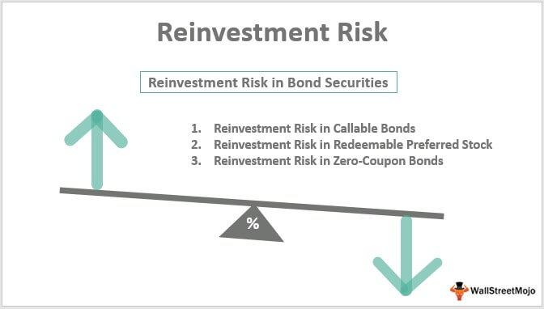

Understanding the key components of financial instrument risk management is crucial for modern investors. In this article, we explore the specifics of financial instruments such as Z-Bonds and their relevance to algorithmic trading. Z-Bonds, recognized as the final tranche of collateralized mortgage obligations (CMOs), are a unique type of mortgage-backed security. These bonds receive payments only after all prior tranches have been fully paid, posing a distinct risk profile characterized by the higher likelihood of payment delays and defaults. Despite these risks, Z-Bonds have the potential for substantial returns due to their accrual of interest over time.

The integration of algorithmic trading techniques represents a significant advancement in managing and potentially mitigating the risks associated with Z-Bonds. Algorithmic trading employs pre-programmed trading strategies to execute orders automatically, leveraging high-speed data processing to identify and capitalize on market inefficiencies. This capability can optimize trading activities around Z-Bonds, transforming risk assessment and decision-making processes within investment strategies.



This article aims to guide investors in leveraging Z-Bonds effectively within an algorithmic trading strategy to optimize their investment outcomes. By pairing the speculative nature of Z-Bonds with the precision of algorithmic trading, investors can enhance their portfolios through informed risk management and strategic execution. This synergistic approach requires a comprehensive understanding of both financial instruments and cutting-edge trading technologies, fostering an environment of adaptability and informed decision-making in the dynamic financial market landscape.

## Table of Contents

## Understanding Z-Bonds

Z-Bonds, also known as accrual bonds, are a specific type of financial instrument associated with collateralized mortgage obligations (CMOs). Within the structure of a CMO, Z-Bonds are positioned as the final tranche, meaning they receive payment only after all preceding tranches have been settled. This unique payment structure often categorizes Z-Bonds as speculative and inherently risky investments.

The speculative nature of Z-Bonds is primarily due to their payout order, which rests heavily on the successful repayment of mortgages within the underlying pool of the CMO. This makes them sensitive to fluctuations in mortgage payment behaviors, particularly in terms of prepayment risks and defaults. Since Z-Bonds are last in line to receive payments, any adverse changes in the mortgage market can significantly impact their expected returns.

Despite these risks, Z-Bonds may offer attractive returns through accumulated interest. The accrued interest is not disbursed immediately; rather, it is added to the bond's principal value and paid out at maturity or when preceding tranches are fully paid. This accrual mechanism can potentially result in substantial yields for investors who are willing and able to withstand the higher risk level.

Investors considering Z-Bonds must be acutely aware of the specific risks involved. Payment defaults within the CMO pool can lead to significant delays or reductions in expected returns. Assessing the quality and performance of the mortgage loans within the pool, as well as understanding macroeconomic factors that could influence mortgage repayments, is essential for managing these risks. A thorough risk analysis of the issuer's credibility and the economic environment becomes critical in safeguarding potential investments in Z-Bonds.

## Risk Management in Z-Bond Investments

Managing risk is a critical component of incorporating Z-Bonds into an investment portfolio. As these bonds are exposed to default risks, evaluating the credibility of the issuer is imperative. Z-Bonds are typically at higher risk of default due to their dependence on the performance of the underlying mortgage pool and their position within the collateralized mortgage obligation (CMO) hierarchy. Investors must assess the creditworthiness of the institutions issuing these bonds, as well as the overall economic environment that could impact mortgage payments.

One fundamental strategy in risk management is distinguishing between government-backed mortgage securities and those issued by private institutions. Government-backed securities, such as those guaranteed by entities like Ginnie Mae, generally present lower default risk due to government support. This backing can provide a safety net in times of economic uncertainty, reducing the likelihood of default. In contrast, privately issued securities might offer higher yields but come with increased risk, as they lack government guarantees.

Moreover, understanding the broader economic and financial environment is crucial for Z-Bond investment. Events such as market downturns and financial crises can significantly impact the performance of mortgage-backed securities, including Z-Bonds. During such times, the likelihood of borrower defaults may increase, which would adversely affect the cash flows to Z-Bond holders. Consequently, monitoring indicators such as interest rates, housing market trends, and macroeconomic stability is vital. 

By employing a thorough evaluation of these factors, investors can better manage the inherent risks of Z-Bonds and structure their portfolios to withstand economic fluctuations effectively, aligning with their long-term financial objectives.

## Algorithmic Trading: A Modern Approach

Algorithmic trading, known for harnessing advanced computational techniques, relies on pre-programmed strategies to automatically execute trades at high speeds. This approach capitalizes on technology to exploit market inefficiencies and significantly enhances decision-making through precise data analysis. The core advantage of [algorithmic trading](/wiki/algorithmic-trading) lies in its ability to reduce human error, amplify trading speed, and optimize trade execution.

A typical algorithmic trading strategy involves mathematical models that assess market conditions and implement trades based on predefined criteria. These models utilize vast datasets to identify trading signals and opportunities that may be invisible to human traders due to their sheer [volume](/wiki/volume-trading-strategy) and speed.

The benefits of algorithmic trading are substantial. By removing human intervention, the potential for emotional decision-making is minimized, leading to more consistent and reliable trading outcomes. Additionally, the automation enables high-frequency trading ([HFT](/wiki/high-frequency-trading-strategies)), where trades are executed in fractions of a second, capturing opportunities that arise due to short-term market inefficiencies.

Moreover, algorithmic trading systems can incorporate complex algorithms to analyze market trends, forecast price movements, and execute trades at the optimal time. This leads to an improvement in the execution quality and a reduction in transaction costs. The accuracy of data processing further allows traders to backtest their strategies against historical data, refining them for better future performance.

However, these advantages must be carefully balanced against the potential drawbacks. One significant challenge is the risk of exacerbating market [volatility](/wiki/volatility-trading-strategies). The rapid execution of large volumes of trades can amplify market movements, potentially leading to flash crashes or other destabilizing events. Additionally, relying solely on algorithms can result in automated systems reacting to anomalies or false signals, leading to unintended trading consequences.

Hence, while algorithmic trading presents a sophisticated method to navigate the financial markets, it calls for a comprehensive understanding of both the algorithms employed and the market dynamics they operate within. Algorithms must be rigorously tested and continuously refined to adapt to evolving market conditions, ensuring that the advantages are leveraged while mitigating associated risks.

## Integrating Z-Bonds with Algo Trading

Combining Z-Bonds with algorithmic trading strategies forms a comprehensive risk management framework for financial portfolios. Algorithmic trading utilizes advanced computational techniques to analyze large datasets and execute trades based on predefined criteria. This can be particularly advantageous for Z-Bonds, whose prices are influenced by complex factors like interest rates, mortgage prepayment rates, and overall economic conditions.

Algorithmic systems are adept at monitoring and forecasting market trends affecting Z-Bonds, enabling investors to automate responses to fluctuations. For instance, [machine learning](/wiki/machine-learning) algorithms can analyze historical data to predict the future movement of mortgage-backed securities and adjust portfolio holdings accordingly. This capacity for precise data analysis allows for timely interventions that might be missed by human traders due to biases or slower reaction times.

One widely used approach is statistical [arbitrage](/wiki/arbitrage), which involves exploiting pricing inefficiencies between related securities. In the context of Z-Bonds, algorithms can detect discrepancies in pricing compared to other tranches of collateralized mortgage obligations or market indices. By executing trades that capitalize on these differences, investors can optimize trading outcomes. Statistical models such as mean-reversion or co-integration frameworks are often employed to identify these opportunities.

Below is a basic Python code snippet that models a simplified Z-Bond-focused trading strategy. This illustration demonstrates the practicality of integrating algorithmic elements to manage Z-Bond investments:

```python
import numpy as np
import pandas as pd
from sklearn.linear_model import LinearRegression

# Load historical Z-Bond price data
data = pd.read_csv('z_bond_prices.csv')
prices = data['Price'].values
dates = pd.to_datetime(data['Date'])

# Calculate returns
returns = np.diff(prices) / prices[:-1]

# Define a simple mean-reversion strategy
window_size = 20
threshold = 0.01

# Rolling window for mean and standard deviation
rolling_mean = pd.Series(returns).rolling(window=window_size).mean()
rolling_std = pd.Series(returns).rolling(window=window_size).std()

# Generate trading signals
signals = np.where(returns > rolling_mean + threshold * rolling_std, -1, 0)  # Sell signal
signals += np.where(returns < rolling_mean - threshold * rolling_std, 1, 0)  # Buy signal

# Output signals for each date
signal_df = pd.DataFrame({'Date': dates[window_size:], 'Signal': signals})
print(signal_df.head())

# Assume a simple linear regression model for forecasting
X = np.array(range(len(prices))).reshape(-1, 1)
model = LinearRegression().fit(X, prices)

# Forecast price change
future_trend = model.predict(X[-1].reshape(1, -1))
print("Forecasted price change:", future_trend - prices[-1])
```

This code implements a basic mean-reversion strategy, where Z-Bond price deviations from historical averages trigger buy or sell signals. Although simplified, more sophisticated models can incorporate cross-asset correlations, macroeconomic indicators, and real-time data to enhance predictive accuracy and risk management. 

Incorporating algorithmic trading with Z-Bonds requires continuous assessment of model robustness and alignment with financial objectives. While algorithms offer significant advantages in efficiency and precision, investors must remain cognizant of the inherent risks, especially in volatile markets.

## Conclusion

A balanced approach that leverages both the speculative nature of Z-Bonds and the precision offered by algorithmic trading technologies can substantially optimize investment portfolios. Z-Bonds' high-risk, high-reward profile necessitates a nuanced understanding, which is complemented by the systematic and data-driven nature of algorithmic trading.

Investors interested in this approach should prioritize developing a profound understanding of both the financial instruments themselves and the intricacies of algorithmic trading methodologies. Z-Bonds require detailed knowledge of mortgage-backed securities and an ability to assess issuer credibility and economic conditions. Algorithmic trading, on the other hand, demands expertise in programming, statistical analysis, and market dynamics to create robust trading algorithms that can swiftly react to market conditions.

The combination of Z-Bonds and algorithmic trading should be founded on thorough risk assessment and a clear alignment with the investor's financial goals. Risk management strategies are essential to balance the potential rewards of Z-Bonds with their inherent risks, such as payment defaults. Algorithms can automate responses to market signals, enhancing precision in decision-making and potentially mitigating financial risks.

Continued adaptation and exploration are necessary for sustained success in the volatile financial market landscape. Investors must stay abreast of technological advances and emerging market trends, as well as refine their strategies in response to ever-changing market conditions. Mastery of both Z-Bonds and algorithmic trading can facilitate informed financial decisions and capital growth, but it requires an ongoing commitment to education and strategic adaptation.

## References & Further Reading

Bergstra, J., Bardenet, R., Bengio, Y., & Kégl, B. (2011). 'Algorithms for Hyper-Parameter Optimization.' Advances in Neural Information Processing Systems 24. This paper presents methodologies for hyper-parameter optimization, crucial for enhancing algorithmic trading strategies through improved machine learning models.

'Advances in Financial Machine Learning' by Marcos Lopez de Prado provides a comprehensive guide to implementing machine learning methodologies in financial markets. It is particularly useful for understanding the theoretical underpinnings and applications of machine learning to optimize trading strategies, including those involving Z-Bonds.

'Evidence-Based Technical Analysis: Applying the Scientific Method and Statistical Inference to Trading Signals' by David Aronson emphasizes the importance of empirical validation in technical analysis. This book offers insights into developing robust trading signals, which can be integrated with Z-Bond trading strategies to refine decision-making processes.

'Machine Learning for Algorithmic Trading' by Stefan Jansen is a practical guide to leveraging machine learning tools for algorithmic trading. The book offers code examples and strategies that can be adapted to monitor and trade Z-Bonds effectively, introducing ways to reduce risk while maximizing returns.

'Quantitative Trading: How to Build Your Own Algorithmic Trading Business' by Ernest P. Chan serves as a detailed manual for traders looking to establish algorithm-driven trading businesses. It covers the essentials of creating trading systems, risk management, and backtesting strategies that are vital for incorporating complex instruments like Z-Bonds into algorithmic trading frameworks.