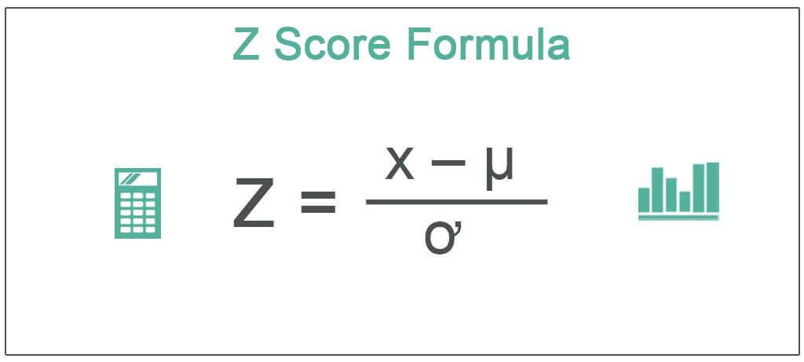

In algorithmic trading, statistical tools play a critical role in evaluating potential trading strategies. Among these tools, the Z-score is particularly useful for measuring the statistical significance of a stock's deviation from its mean price. By providing a standardized way to assess price movements, Z-scores are invaluable for traders aiming to make informed decisions based on quantitative analysis.

The Z-score is calculated using the formula $Z = \frac{X - \mu}{\sigma}$, where $X$ is the current value of the stock, $\mu$ is its historical mean, and $\sigma$ is the standard deviation. This calculation helps traders understand whether a particular price is characteristic of the usual fluctuations within a dataset or if it represents an anomaly. The presence of a positive Z-score indicates a price above the mean, while a negative Z-score shows the contrary. Thus, Z-scores provide insights into an asset's volatility, assisting traders in identifying potential trends or reversals.



Through this article, we will explore how Z-scores can be effectively employed in automated trading systems. Understanding the relationship between Z-scores and standard deviations is crucial, as it enhances the trader's ability to develop robust strategies. Both seasoned traders and those new to algorithmic trading will benefit from understanding how to use Z-scores to refine their trading strategies and improve overall performance.

## Table of Contents

## Understanding Z-Score

A Z-score is a statistical metric that quantifies how many standard deviations a particular data point is from the mean of a dataset. This measurement is crucial for traders as it offers insights into whether a value is typical or an anomaly within the dataset. Specifically, a Z-score provides valuable information about an asset's volatility by examining how its current price compares to its historical average.

In trading, Z-scores are pivotal because they help to determine the normalcy or extremeness of price movements. When a Z-score is positive, it signifies that the asset's value is above the mean. Conversely, a negative Z-score indicates that the value is below the mean. This differentiation is essential for traders when assessing potential buy or sell signals based on deviations from historical price norms.

The calculation of a Z-score is straightforward and relies on a standard formula: 

$$
Z = \frac{X - \mu}{\sigma}
$$

In this formula:
- $Z$ represents the Z-score.
- $X$ denotes the individual data point or the current value.
- $\mu$ is the mean of the dataset, representing the average historical value.
- $\sigma$ stands for the standard deviation of the dataset, conveying the dispersion or variation.

This formula quantifies how distant, in terms of standard deviation units, a particular value is from the mean. By employing this statistical approach, traders can quickly identify whether the current price level of an asset is typical or requires further examination due to its potential implications as an outlier. Understanding and calculating Z-scores is a fundamental skill for traders seeking to manage risk and refine their trading strategies based on statistical analyses.

## Z-Scores and Standard Deviations: A Statistical Approach

Standard deviation is a statistical metric that quantifies the level of variation or [dispersion](/wiki/dispersion-trading) in a set of values. It is pivotal in calculating the Z-score, a measure essential in [algorithmic trading](/wiki/algorithmic-trading) to assess the statistical significance of a stock's deviation from its historical mean. Grasping the concept of standard deviation is fundamental for traders, as it not only highlights the spread of asset prices but also facilitates the understanding of price [volatility](/wiki/volatility-trading-strategies).

In a normal distribution, approximately 68% of data points fall within one standard deviation of the mean, 95% within two, and 99.7% within three. This distribution pattern underscores the utility of Z-scores in pinpointing outliers. A Z-score reveals how many standard deviations an individual data point, such as a stock price, is from the mean, thereby aiding traders in assessing current price deviations relative to historical norms. The formula for calculating a Z-score is as follows:

$$
Z = \frac{(X - \mu)}{\sigma}
$$

where $X$ is the observed value, $\mu$ is the mean of the dataset, and $\sigma$ is the standard deviation. 

By applying Z-scores, traders can effectively gauge whether a stock's price significantly deviates from its historical average. This capability is particularly useful for identifying potential buy or sell signals based on observed deviations, offering insights into whether a stock is overvalued or undervalued in the current market context. Incorporating Z-scores into trading strategies thereby enhances a trader's ability to make informed, statistically-backed decisions.

## Applying Z-Scores in Algorithmic Trading

Z-scores offer valuable insights for algorithmic trading strategies. They are instrumental in both mean reversion and anomaly detection methodologies. In mean reversion strategies, Z-scores are utilized to determine whether a stock's current price is significantly deviating from its historical average. A stock is deemed overbought when its Z-score exceeds a certain positive threshold, while a Z-score below a negative threshold suggests it is oversold. Mean reversion strategies aim to capitalize on these conditions by predicting the stock's price movement back toward its mean.

For [pair trading](/wiki/pair-trading), Z-scores are used to identify price divergences between two correlated assets. The strategy hinges on the idea that the price difference between the assets will revert to the historical mean over time. When the Z-score signifies a significant divergence, a trader may open positions in anticipation of the spread returning to its mean. This approach relies on statistical [arbitrage](/wiki/arbitrage) and exploits temporary inefficiencies in the market.

In anomaly detection, Z-scores are applied to filter out market noise and to isolate significant trading signals. By determining the extent to which a data point differs from the mean, Z-scores assist in emphasizing atypical price movements, thereby enhancing the robustness of trading strategies. This methodology is vital in determining whether a particular movement in price is statistically significant or merely due to random fluctuations.

Implementing these applications often requires the integration of Z-score calculations into automated trading systems. A typical Python implementation may involve calculating the Z-score using the formula `Z = (X - μ) / σ`, where `X` is the current stock price, `μ` is the historical mean, and `σ` is the standard deviation. Utilizing libraries such as NumPy and Pandas, traders can efficiently process financial data to execute trades based on predetermined Z-score thresholds. Here's a basic example in Python:

```python
import numpy as np
import pandas as pd

# Assume data is a Pandas DataFrame with a column 'price'
mean_price = data['price'].rolling(window=lookback_period).mean()
std_dev = data['price'].rolling(window=lookback_period).std()

data['z_score'] = (data['price'] - mean_price) / std_dev

# Example criterion for mean reversion
buy_signal = data['z_score'] < -threshold
sell_signal = data['z_score'] > threshold
```

This code snippet calculates the Z-score for each data point over a specified lookback period, identifying potential buy and sell signals based on Z-score thresholds. Leveraging these capabilities, traders can develop robust algorithmic strategies that leverage statistical analysis to inform trading decisions.

## Practical Implementation of Z-Scores

Implementing Z-scores in algorithmic trading strategies largely hinges on the use of programming languages such as Python. Python's rich ecosystem offers robust libraries like NumPy and Pandas, which simplify the handling and processing of financial data, making the calculation of Z-scores efficient and straightforward.

Automating Z-score calculations starts with collecting real-time or historical financial data. This data is generally retrieved through APIs provided by financial data services or trading platforms. Once the data is sourced, traders can utilize Python to automate the calculation of Z-scores with the formula:

$$
Z = \frac{{X - \mu}}{{\sigma}}
$$

In this equation, $X$ denotes the current price of the asset, $\mu$ is the historical mean price, and $\sigma$ represents the standard deviation of the asset's past prices.

Using NumPy, which excels at numerical operations, traders can compute the mean and standard deviation as follows:

```python
import numpy as np

# Sample data: historical prices of a stock
prices = np.array([10, 12, 13, 11, 12, 15])

# Calculate the mean and standard deviation
mean_price = np.mean(prices)
std_dev = np.std(prices)

# Current price of the stock
current_price = 14

# Calculate Z-score
z_score = (current_price - mean_price) / std_dev
```

Pandas, another powerful library for data manipulation, allows traders to handle time-series data with ease. It can be used to automate these calculations over large datasets, further refining the trading process.

Trading strategies often exploit certain Z-score thresholds to make informed decisions. For instance, in a mean reversion strategy, a trader might decide to sell an overbought security when its Z-score crosses above 2 or buy an oversold security when the Z-score drops below -2. These thresholds can be adjusted according to [backtesting](/wiki/backtesting) results and specific strategy requirements.

In practice, Z-scores can also complement other indicators to enhance decision-making robustness. For example, combining Z-scores with moving averages or relative strength index (RSI) might filter out false signals and refine entry or [exit](/wiki/exit-strategy) points. Algorithmic trading platforms provide an environment to backtest these strategies, allowing traders to evaluate their performance and optimize parameters.

Through coding scripts, traders can automate not just the calculation of Z-scores, but also the execution of buy or sell orders when certain conditions are met. This automation can be achieved using Python in conjunction with trading APIs provided by brokerage firms.

In summary, leveraging Python's powerful libraries like NumPy and Pandas enables traders to efficiently implement Z-score-based strategies, automate workflows, and execute trades with precision, thereby enhancing the efficacy and reliability of their trading operations.

## Conclusion

Z-score analysis remains an essential statistical tool in algorithmic trading, enabling traders to make informed decisions by providing a clear measure of how far an asset’s price deviates from its historical mean. Its application in identifying mean reversion opportunities is particularly valuable, as it helps traders detect when a stock is potentially overbought or oversold, thereby signaling a potential return to the mean price. This analytical approach enhances the robustness of trading strategies by highlighting significant deviations rather than temporary fluctuations.

In anomaly detection, Z-scores serve to filter out noise, allowing traders to concentrate on significant and actionable signals. This usage leads to more precise trading decisions and better risk management across diverse market conditions. Developing robust trading algorithms that integrate Z-score analysis can thus substantially improve both the reliability and effectiveness of a trader’s strategy.

For traders looking to expand upon these strategies, platforms such as QuantConnect and QuantInsti provide valuable resources and environments to test and deploy algorithmic trading strategies. These platforms offer tools and frameworks that simplify the process of incorporating complex statistical analyses, such as Z-score computations, into automated trading systems. This integration can lead to enhanced trading outcomes and a deeper understanding of market dynamics.

By effectively incorporating Z-score analysis, traders are positioned to enhance strategy development, improve trading results, and adapt more readily to market changes.

## References & Further Reading

[1]: De Prado, M. L. (2018). ["Advances in Financial Machine Learning"](https://www.amazon.com/Advances-Financial-Machine-Learning-Marcos/dp/1119482089). Wiley.

[2]: Aronson, D. R. (2006). ["Evidence-Based Technical Analysis: Applying the Scientific Method and Statistical Inference to Trading Signals"](https://www.amazon.com/Evidence-Based-Technical-Analysis-Scientific-Statistical/dp/0470008741). Wiley.

[3]: Jansen, S. (2020). ["Machine Learning for Algorithmic Trading: Predictive models to extract signals from market and alternative data for systematic trading strategies with Python"](https://github.com/stefan-jansen/machine-learning-for-trading). Packt Publishing.

[4]: Chan, E. P. (2008). ["Quantitative Trading: How to Build Your Own Algorithmic Trading Business"](https://github.com/ftvision/quant_trading_echan_book). Wiley.