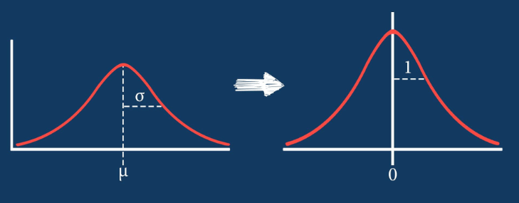

## Table of Contents

## What is Z-Score Normalization in the context of machine learning?

Z-Score Normalization, also known as standardization, is a technique used in machine learning to rescale data so that different features can be compared on a common scale. This method transforms the data to have a mean of 0 and a standard deviation of 1. By doing this, it ensures that no single feature dominates the others due to its scale, which is particularly important in algorithms like gradient descent where the scale of features can affect the convergence rate. The formula for Z-Score Normalization is $$ Z = \frac{(X - \mu)}{\sigma} $$, where $X$ is the original data point, $\mu$ is the mean of the feature, and $\sigma$ is the standard deviation of the feature.

In practice, Z-Score Normalization is applied to each feature independently. For example, if you have a dataset with features like age and income, you would calculate the mean and standard deviation for age separately from those for income. After applying the normalization, both features will be on the same scale, making it easier for machine learning models to interpret and process the data. This technique is widely used in preprocessing steps for various algorithms, including neural networks and support vector machines, as it helps in improving the model's performance by ensuring that all features contribute equally to the result.

## Why is Z-Score Normalization important in data preprocessing?

Z-Score Normalization is important in data preprocessing because it helps make all features in a dataset comparable. When you have different features like age and income, they can be on very different scales. Age might range from 0 to 100, while income could be from 0 to millions. If you use these numbers directly in a machine learning model, the model might think income is more important just because the numbers are bigger. By using Z-Score Normalization, we change the numbers so that all features have the same importance. The formula for this is $$ Z = \frac{(X - \mu)}{\sigma} $$, where $X$ is the original number, $\mu$ is the average of all numbers in that feature, and $\sigma$ is how spread out the numbers are.

This process also helps many [machine learning](/wiki/machine-learning) algorithms work better. For example, in algorithms like gradient descent, which is used in training neural networks, the scale of the features can affect how quickly the model learns. If one feature has a much larger range than others, it can slow down the learning process. By normalizing the data, we make sure all features are on the same scale, which can speed up the learning and make the model more accurate. This is why Z-Score Normalization is a common step in preparing data for machine learning.

## How do you calculate the Z-Score for a dataset?

To calculate the Z-Score for a dataset, you first need to find the mean (average) and the standard deviation of the data. The mean is the sum of all the numbers divided by how many numbers there are. The standard deviation tells you how spread out the numbers are from the mean. Once you have these two numbers, you can use them to find the Z-Score for each data point. The formula for the Z-Score is $$ Z = \frac{(X - \mu)}{\sigma} $$, where $X$ is the data point you want to find the Z-Score for, $\mu$ is the mean of the dataset, and $\sigma$ is the standard deviation.

Let's say you have a dataset of test scores: 70, 80, 90, 100. First, you calculate the mean. The mean is $\frac{70 + 80 + 90 + 100}{4} = 85$. Next, you calculate the standard deviation. The standard deviation for this dataset is about 12.91. Now, to find the Z-Score for the score of 70, you use the formula: $$ Z = \frac{(70 - 85)}{12.91} \approx -1.16 $$. This means that the score of 70 is about 1.16 standard deviations below the mean. You repeat this process for each data point in the dataset to get their Z-Scores.

## What are the benefits of using Z-Score Normalization over other normalization techniques?

Z-Score Normalization, or standardization, is often preferred over other normalization techniques because it adjusts data to have a mean of 0 and a standard deviation of 1. This makes it easier to compare different features on the same scale. When you use the formula $$ Z = \frac{(X - \mu)}{\sigma} $$, where $X$ is your data point, $\mu$ is the mean, and $\sigma$ is the standard deviation, you end up with numbers that are easy to understand. For example, a Z-Score of 1 means the data point is one standard deviation above the mean, while a Z-Score of -1 means it's one standard deviation below the mean. This makes it simpler to see how far each data point is from the average.

Another benefit of Z-Score Normalization is that it works well with many machine learning algorithms, especially those that use gradient descent like neural networks. These algorithms can be sensitive to the scale of the input features. If one feature has much larger values than another, it can cause the algorithm to take longer to find the best solution or even miss it entirely. By standardizing the data, you help these algorithms work faster and more accurately. Other normalization methods, like Min-Max scaling, can also make features comparable, but they don't center the data around zero, which can be less helpful for some algorithms.

## Can Z-Score Normalization affect the performance of machine learning models? If so, how?

Z-Score Normalization can indeed affect the performance of machine learning models, often in a positive way. By using the formula $$ Z = \frac{(X - \mu)}{\sigma} $$, where $X$ is the original data point, $\mu$ is the mean, and $\sigma$ is the standard deviation, Z-Score Normalization transforms the data so that all features have a mean of 0 and a standard deviation of 1. This makes it easier for the model to understand and compare different features. For example, if you have features like age and income, which are on very different scales, normalizing them helps the model treat them equally. This can lead to better predictions because the model isn't biased towards features with larger numbers.

However, Z-Score Normalization can also have some negative effects if not used carefully. For instance, if the data contains outliers, the standard deviation can become very large, which might make the normalized values less meaningful. Also, some algorithms, like decision trees, are not sensitive to the scale of the features, so applying Z-Score Normalization might not improve their performance and could even add unnecessary complexity to the preprocessing step. Therefore, it's important to understand the specific needs of your machine learning model and the nature of your data before deciding to use Z-Score Normalization.

## What are the limitations or potential drawbacks of Z-Score Normalization?

Z-Score Normalization, which uses the formula $$ Z = \frac{(X - \mu)}{\sigma} $$, can be affected by outliers in the data. Outliers are numbers that are very different from most of the other numbers. When you have outliers, the standard deviation, or how spread out the numbers are, can become very large. This means that the Z-Scores for all the data points will be smaller, and it might be harder to see the differences between them. So, if your data has outliers, Z-Score Normalization might not work as well as you hoped.

Another thing to think about is that not all machine learning models need Z-Score Normalization. Some models, like decision trees, don't care about the scale of the numbers. They work the same way whether the numbers are big or small. If you use Z-Score Normalization with these models, it might not help and could just make your work more complicated. So, it's important to know what kind of model you're using and whether it will benefit from Z-Score Normalization before you decide to use it.

## How does Z-Score Normalization handle outliers in a dataset?

Z-Score Normalization uses the formula $$ Z = \frac{(X - \mu)}{\sigma} $$ to change the numbers in a dataset. It makes the average of all the numbers zero and the spread of the numbers one. But if there are outliers in the data, which are numbers that are very different from most of the others, it can cause problems. Outliers make the spread of the numbers, or the standard deviation, much bigger. When the standard deviation is big, the Z-Scores for all the numbers become smaller. This can make it harder to see the differences between the numbers because everything looks more similar.

Because of this, Z-Score Normalization might not be the best choice if your dataset has a lot of outliers. The outliers can pull the average and the spread in a way that makes the normalized numbers less useful. If you still want to use Z-Score Normalization with outliers, you might need to do something else first, like removing the outliers or using a different method to deal with them. This way, you can make sure that the normalization helps your data analysis instead of making it harder.

## In what types of machine learning algorithms is Z-Score Normalization particularly useful?

Z-Score Normalization is particularly useful in machine learning algorithms that are sensitive to the scale of the input features. One common example is algorithms that use gradient descent, like neural networks. These algorithms work better when all the features are on the same scale. If one feature has much bigger numbers than another, it can make the algorithm take longer to find the best solution or even miss it. By using Z-Score Normalization, which changes the data so that the average is zero and the spread is one with the formula $$ Z = \frac{(X - \mu)}{\sigma} $$, you help these algorithms work faster and more accurately.

Another type of algorithm where Z-Score Normalization can be helpful is in support vector machines (SVMs). SVMs try to find the best way to separate different groups of data. If the features are on different scales, it can be harder for the SVM to find the right separation. By normalizing the data, you make it easier for the SVM to see the important differences between the groups. This can lead to better performance and more accurate predictions.

## How can Z-Score Normalization impact the interpretability of the results in machine learning?

Z-Score Normalization can make it easier to understand the results of a machine learning model. By using the formula $$ Z = \frac{(X - \mu)}{\sigma} $$, where $X$ is the original data point, $\mu$ is the mean, and $\sigma$ is the standard deviation, Z-Score Normalization changes the data so that the average is zero and the spread is one. This means that when you look at the results, you can easily see how far each data point is from the average. For example, a Z-Score of 2 means the data point is two standard deviations above the average, which is easy to understand and compare across different features.

However, Z-Score Normalization can also make the results harder to understand in some cases. If your data has outliers, which are numbers that are very different from most others, the standard deviation can become very large. This can make the Z-Scores smaller and less meaningful, making it harder to see the real differences between the data points. Also, if you are used to working with the original numbers, like ages or incomes, the normalized numbers might not make as much sense at first. You might need to change the way you think about the data to understand the results properly.

## What are the considerations for applying Z-Score Normalization in real-time data processing?

When you want to use Z-Score Normalization for real-time data processing, you need to think about how you will keep track of the mean and standard deviation. In real-time processing, new data comes in all the time, so you need to update the mean and standard deviation as you go. This can be tricky because you have to do it quickly without slowing down the processing. If you use the formula $$ Z = \frac{(X - \mu)}{\sigma} $$, you need to make sure that $\mu$ and $\sigma$ are always up to date with the latest data.

Another thing to consider is how sensitive your system is to changes in the data. If the data changes a lot, the mean and standard deviation can change too, which means the Z-Scores will change. This can make it hard to understand the results if the normalization keeps shifting. You might need to find a way to balance between updating the normalization quickly enough to reflect new data and keeping it stable enough to make sense of the results. This balance is important for making sure your real-time processing works well and gives you useful information.

## How does Z-Score Normalization compare to Min-Max Normalization in terms of robustness and sensitivity to outliers?

Z-Score Normalization, which uses the formula $$ Z = \frac{(X - \mu)}{\sigma} $$, and Min-Max Normalization, which uses the formula $$ X_{\text{norm}} = \frac{(X - X_{\text{min}})}{(X_{\text{max}} - X_{\text{min}})} $$, handle outliers differently. Z-Score Normalization is less robust to outliers because it relies on the mean and standard deviation. When there are outliers, they can pull the mean and inflate the standard deviation, making the normalized values less meaningful. This means that if your data has a lot of outliers, Z-Score Normalization might not work well because the outliers can change the results a lot.

On the other hand, Min-Max Normalization is more sensitive to outliers but can be more robust in certain situations. Outliers can affect the minimum and maximum values used in the formula, which can stretch or compress the range of the normalized data. However, if you know the range of your data and it doesn't change much, Min-Max Normalization can be more stable. It's good to think about whether your data has outliers and how they might affect your normalization choice. Both methods have their strengths and weaknesses, so it's important to pick the one that fits your data and what you're trying to do with it.

## Are there advanced techniques or modifications to Z-Score Normalization used in specific domains or for specific types of data?

In some fields, like finance or medical research, people use special versions of Z-Score Normalization to deal with unique data problems. One common tweak is to use a "robust" version of Z-Score Normalization, which is better at handling outliers. Instead of using the regular mean and standard deviation, this method uses the median and the median absolute deviation (MAD). The formula for this is $$ Z_{\text{robust}} = \frac{(X - \text{median})}{\text{MAD}} $$. This helps because the median and MAD are less affected by outliers, making the normalization more reliable when the data has some unusual values.

Another advanced technique is called "online" or "incremental" Z-Score Normalization. This is useful when you're dealing with data that keeps coming in, like in real-time systems. Instead of calculating the mean and standard deviation all at once, you update them as new data arrives. This way, you can normalize new data points quickly without having to go back and recalculate everything. It's a bit more complicated but can be very helpful for keeping your data processing fast and up-to-date.

## References & Further Reading

[1]: Gelman, A., Hill, J. (2006). ["Data Analysis Using Regression and Multilevel/Hierarchical Models"](https://www.cambridge.org/highereducation/books/data-analysis-using-regression-and-multilevel-hierarchical-models/32A29531C7FD730C3A68951A17C9D983). Cambridge University Press.

[2]: Bishop, C. M. (2006). ["Pattern Recognition and Machine Learning"](https://www.cs.uoi.gr/~arly/courses/ml/tmp/Bishop_book.pdf). Springer.

[3]: Géron, A. (2019). ["Hands-On Machine Learning with Scikit-Learn, Keras, and TensorFlow: Concepts, Tools, and Techniques to Build Intelligent Systems"](https://www.academia.edu/43840124/Hands_On_Machine_Learning_with_Scikit_Learn_Keras_and_TensorFlow_SECOND_EDITION_Concepts_Tools_and_Techniques_to_Build_Intelligent_Systems). O'Reilly Media.

[4]: Murphy, K. P. (2012). ["Machine Learning: A Probabilistic Perspective"](https://www.cs.ubc.ca/~murphyk/MLbook/pml-toc-1may12.pdf). MIT Press.

[5]: Aha, D. W., & Kibler, D. (1991). ["Instance-based learning algorithms."](https://link.springer.com/article/10.1007/BF00153759) Machine Learning, 6(1), 37-66.

[6]: "Statistics for Machine Learning: Techniques for exploring supervised, unsupervised, and reinforcement learning models with Python and R" by Pratap Dangeti, 2017, Packt Publishing.

[7]: Jain, R., & Dubes, R. C. (1988). ["Algorithms for Clustering Data."](https://dl.acm.org/doi/10.5555/42779) Prentice-Hall, Inc.