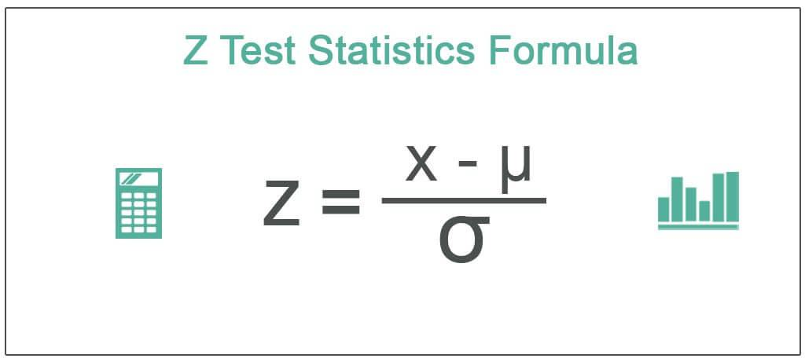

The incorporation of statistical analysis and algorithmic strategies marks a significant evolution in trading practices. Among the array of statistical methods, Z-Tests and Z-Scores stand out as invaluable tools in identifying potential trading opportunities. By quantifying how far a data point is from the mean of a dataset in terms of standard deviations, Z-Scores facilitate the detection of anomalies and the validation of hypotheses in trading scenarios.

Algorithmic trading, which relies extensively on predefined rules and statistical models, benefits greatly from such tools to enhance decision-making processes. Traders utilize these methods to increase the accuracy of predictions regarding price movements and other market dynamics. Understanding the Z-Test is essential for those seeking to employ statistical techniques to achieve superior trading outcomes.



This article will provide a comprehensive overview of the Z-Test, highlighting its mathematical basis and applicability in trading. Furthermore, the discussion will extend to practical examples, demonstrating how the Z-Test can be integrated into algorithmic strategies to create robust trading models. Through this analysis, traders can gain insights into harnessing statistical methods to refine their strategies and optimize trading results.

## Table of Contents

## Understanding the Z-Test

A Z-Test is a fundamental statistical tool used to ascertain whether there is a significant difference between the means of two datasets. It is most effective when applied to large sample sizes where the population variance is known, setting it apart from other statistical tests like the T-Test, which is used when the population variance is unknown and the sample size is smaller.

The foundation of the Z-Test lies in the concept of the Z-Score, a dimensionless measure that indicates how many standard deviations an element is from the mean of the dataset. The Z-Score is calculated using the formula:

$$
Z = \frac{(X - \mu)}{\sigma}
$$

where $X$ is the value in question, $\mu$ is the population mean, and $\sigma$ is the population standard deviation. The Z-Score's role is to transform the data point into a standardized form, allowing for comparison across different datasets or distributions.

In a Z-Test, the objective is to compare the sample mean ($\bar{X}$) with the population mean ($\mu$). The test statistic for a Z-Test is given by:

$$
Z = \frac{(\bar{X} - \mu)}{\frac{\sigma}{\sqrt{n}}}
$$

Here, $n$ represents the sample size. This formula allows for determining whether any observed differences are statistically significant or merely a result of random variation in the sample. By utilizing the standard normal distribution, the Z-Test assesses whether to reject the null hypothesis, which typically posits that there is no difference between the sample mean and the population mean.

Key assumptions of the Z-Test include:

1. **Normal Distribution**: The data points are assumed to follow a normal distribution, which is generally a reasonable assumption when sample sizes are large due to the Central Limit Theorem.

2. **Known Population Variance**: The test assumes that the population variance is known, an important distinction that dictates the suitability of the Z-Test over other types of statistical analyses.

3. **Random Sampling**: The samples must be randomly selected from the population to ensure the representativeness and validity of the test results.

These facets of the Z-Test make it a valuable method in evaluating statistical significance, especially in scenarios where sample sizes are large and the conditions for other tests are not met. Understanding the mathematical foundation and assumptions of the Z-Test is essential for effectively utilizing this tool in various applications, such as [algorithmic trading](/wiki/algorithmic-trading) strategies, where it offers a quantitative basis for decision-making.

## Applications of Z-Tests in Algorithmic Trading

Algorithmic trading, a sophisticated area of financial markets, leverages statistical analyses to gain a competitive edge. The Z-Test is an instrumental tool in this domain, offering a systematic way to evaluate whether the means of two datasets are statistically different, which can be pivotal for various trading strategies.

### Mean Reversion Strategies
One notable use of Z-Tests within algorithmic trading is in mean reversion strategies. Mean reversion postulates that asset prices over time tend to move back toward the average value, making the Z-Test a useful method to quantify deviations from this mean. By calculating the Z-Score, traders can ascertain whether an asset is significantly deviating from its historical average, potentially indicating a trading opportunity. The formula for the Z-Score is:

$$
Z = \frac{X - \mu}{\sigma}
$$

where $X$ represents the asset’s current price, $\mu$ is the historical mean, and $\sigma$ is the standard deviation. A Z-Score that falls outside a pre-defined threshold indicates that the asset may be mispriced, prompting traders to buy or sell based on the expectation of a return to the mean.

### Pair Trading Strategies
The Z-Test can also enhance [pair trading](/wiki/pair-trading) strategies, which involve taking a simultaneous long and short position in a pair of stocks with historically correlated returns. By performing a Z-Test on the price ratio of these two stocks, traders can assess the level of divergence from the historical mean of the ratio. This divergence could signal a potential trade: buying the underperforming stock while shorting the outperforming one, anticipating a convergence to the mean.

### Anomaly Detection
Another application is in anomaly detection, aiming to identify outliers in market data that may represent potential trading opportunities or risks. In this context, the Z-Test helps in distinguishing regular market fluctuations from abnormal price movements. Outlier detection can be crucial for risk management, allowing traders to adjust their strategies in response to unexpected market behavior.

Using Python, traders can automate these calculations to enhance their algorithmic trading systems. Here's a basic Python snippet demonstrating anomaly detection using Z-Scores:

```python
import numpy as np

def calculate_z_scores(prices):
    mean_price = np.mean(prices)
    std_dev = np.std(prices)
    z_scores = [(price - mean_price) / std_dev for price in prices]
    return z_scores

# Example price data
price_data = [100, 102, 105, 97, 110, 95]
z_scores = calculate_z_scores(price_data)

# Identifying anomalies
anomalies = [price for price, score in zip(price_data, z_scores) if abs(score) > 2]
print("Anomalies detected:", anomalies)
```

In conclusion, the Z-Test enables traders to systematically evaluate price behaviors, supporting the execution of sophisticated trading strategies like mean reversion, pair trading, and anomaly detection. With the ongoing advancements in technology and data analysis, the utility of Z-Tests in algorithmic trading is bound to expand, providing traders with refined tools to enhance decision-making and strategy execution.

## Implementing Z-Test-Based Trading Strategies

To implement a Z-Test-based trading strategy, traders must first establish key parameters, including the mean and standard deviation of the sample data. The Z-Score calculation is central to this approach, as it allows traders to generate buy or sell signals when the observed price deviates significantly from the expected mean.

### Setting Parameters

The foundation of a Z-Test-based strategy lies in calculating the Z-Score, which is defined as follows:

$$
Z = \frac{X - \mu}{\sigma}
$$

where $X$ is the observed value, $\mu$ is the mean, and $\sigma$ is the standard deviation. These parameters must be carefully chosen based on historical data to reflect the true market conditions.

### Generating Trading Signals

Once the Z-Score is calculated, traders interpret the magnitude of the score to make trading decisions. For example:

- A **buy signal** might occur when the Z-Score is less than -2, indicating that the asset is significantly undervalued compared to its historical mean.
- A **sell signal** could be triggered when the Z-Score exceeds +2, suggesting an overvaluation.

Here's a simple example in Python to demonstrate Z-Score calculation and trade signal generation:

```python
import numpy as np

def calculate_z_score(price_series):
    mean_price = np.mean(price_series)
    std_dev = np.std(price_series)
    z_scores = [(price - mean_price) / std_dev for price in price_series]
    return z_scores

def generate_signals(z_scores, buy_threshold=-2, sell_threshold=2):
    signals = []
    for z in z_scores:
        if z < buy_threshold:
            signals.append('Buy')
        elif z > sell_threshold:
            signals.append('Sell')
        else:
            signals.append('Hold')
    return signals

# Example usage
price_series = [10, 12, 9, 11, 14, 15, 13]  # Replace with actual price data
z_scores = calculate_z_score(price_series)
signals = generate_signals(z_scores)

print(signals)
```

### Risk Management and Backtesting

Risk management is an integral component of implementing Z-Test-based strategies to ensure that the signals are not only profitable but also sustainable. This involves establishing stop-loss limits and position sizing to mitigate potential losses. Additionally, comprehensive [backtesting](/wiki/backtesting) of the strategy across different market conditions and time frames is crucial. This process involves running historical simulations to evaluate the effectiveness of the strategy and adjusting parameters to optimize performance.

Backtesting can be implemented using libraries like `[backtrader](/wiki/backtrader)` in Python, which allows traders to apply their strategies to historical data and assess metrics such as returns, [volatility](/wiki/volatility-trading-strategies), and drawdowns, ensuring the strategy's robustness before live deployment.

In summary, integrating Z-Test statistical analysis into trading strategies requires a structured approach to calculating Z-Scores, interpreting signals accurately, and emphasizing risk management and backtesting to achieve reliable and effective trading results.

## Case Study: Z-Test in Action

One illustrative example of employing Z-Tests in algorithmic trading is through a mean reversion strategy. Mean reversion is predicated on the idea that asset prices tend to move back towards their historical averages over time. In this case study, we will focus on using Z-Tests to identify mean reversion opportunities for a single stock.

### Steps and Statistical Foundations

1. **Data Collection and Preparation**: 
   Gather historical price data for the asset. The time frame can vary, but a dataset spanning several years can provide a robust basis for analysis. For this case study, daily closing prices will be used.

2. **Calculating Moving Average and Standard Deviation**:
   A moving average (e.g., 20-day) and its corresponding standard deviation are computed continuously. These metrics are instrumental for subsequent Z-Score calculations:
$$
   \text{Moving Average} = \frac{1}{n} \sum_{i=1}^{n} Price_i

$$
$$
   \text{Standard Deviation} = \sqrt{\frac{1}{n} \sum_{i=1}^{n} (Price_i - \text{Moving Average})^2}

$$

3. **Deriving Z-Scores**:
   The Z-Score for the asset's current price is calculated to determine how many standard deviations it is from the moving average:
$$
   Z = \frac{(\text{Current Price} - \text{Moving Average})}{\text{Standard Deviation}}

$$

   Z-Scores help to quantify unusual deviations of the price from its mean, which can indicate potential trading signals.

4. **Generating Trading Signals**:
   Trading rules can be derived based on Z-Scores. For instance, a Z-Score exceeding +2 might suggest a potential overbought condition, where a trader could consider selling the asset. Conversely, a Z-Score below -2 could imply an oversold condition, presenting a buy opportunity.

### Sample Python Implementation

```python
import pandas as pd
import numpy as np

# Assume df is a DataFrame containing the price data with a 'Close' column
df['Moving Average'] = df['Close'].rolling(window=20).mean()
df['Standard Deviation'] = df['Close'].rolling(window=20).std()
df['Z-Score'] = (df['Close'] - df['Moving Average']) / df['Standard Deviation']

# Define buy and sell conditions
df['Signal'] = np.where(df['Z-Score'] < -2, 'Buy', 
                        np.where(df['Z-Score'] > 2, 'Sell', 'Hold'))

# View the first few lines to check the output
print(df.head())
```

### Data Analysis and Interpretation

In analyzing the results from the calculation, trades will be executed based on the generated signals. For practical reasons, it's essential to backtest this strategy using historical data and simulate its potential performance. The results should be scrutinized for both profitability and risk.

#### Potential Outcomes

- **Profits**: Deals from buying undervalued (oversold) assets when the Z-Score is low and selling when it's high can be profitable if prices revert to their historical means.
- **Risks**: The main risk involves prices deviating further from the mean, leading to potential losses. Incorporating stop-loss mechanisms can mitigate such risks.

### Interpretation of Z-Score Results

The Z-Score's interpretation in this context is paramount—it quantifies deviation but doesn't guarantee price reversion. Therefore, traders must corroborate signals with additional market insights or complementary strategies to enhance robustness and reduce false positives in trading signals.

By critically assessing and interpreting Z-Scores within a well-defined framework, traders can exploit statistical irregularities in asset prices, thereby refining their algorithmic trading strategies.

## Conclusion

The integration of statistical methods such as the Z-Test in trading offers a potent means of enhancing trading strategies and achieving better outcomes. By providing a quantitative framework to assess market data, Z-Tests enable traders to identify opportunities and make informed decisions based on statistical significance. This level of analysis can lead to more precise and potentially profitable trading signals.

However, while Z-Tests are valuable tools, they do not operate in isolation. Successful trading requires a holistic approach that also considers risk management strategies and varying market conditions. The inherent volatility and unpredictability of financial markets necessitate incorporating robust risk management protocols to mitigate potential losses. Moreover, market conditions can significantly influence the effectiveness of a statistical model; thus, traders must remain adaptable and vigilant.

As algorithmic trading progresses, the application of statistical analysis, including methods like the Z-Test, is poised to expand further. The continuous development of technology and the increasing availability of market data provide a fertile ground for evolving these strategies. This advancement opens doors for more sophisticated models and techniques that can adapt to dynamic market environments.

Future explorers in the field of algorithmic trading are encouraged to delve deeper into statistical methods such as the Z-Test. Innovations in data analysis and computational techniques will likely lead to new opportunities and strategies. Engaging in extensive research and iterative testing will be crucial for advancing these statistical techniques and applying them effectively in the ever-changing landscape of financial markets.

## References & Further Reading

[1]: ["Introductory Statistics"](https://openstax.org/books/introductory-statistics/pages/1-introduction) by Neil A. Weiss

[2]: Tsay, R. S. (2010). ["Analysis of Financial Time Series"](https://onlinelibrary.wiley.com/doi/book/10.1002/9780470644560). Wiley Series in Probability and Statistics.

[3]: Evans, M. J., & Rosenthal, J. S. (2010). ["Probability and Statistics: The Science of Uncertainty"](https://www.utstat.toronto.edu/mikevans/jeffrosenthal/).

[4]: ["Python for Data Analysis: Data Wrangling with Pandas, NumPy, and IPython"](https://wesmckinney.com/book/) by Wes McKinney

[5]: Fabozzi, F. J., Focardi, S. M., & Kolm, P. N. (2006). ["Quantitative Equity Investing: Techniques and Strategies"](https://www.semanticscholar.org/paper/Quantitative-Equity-Investing%3A-Techniques-and-Fabozzi-Focardi/1c49a2a53919f7e65cb96f16691b8ff726fd3cd7).