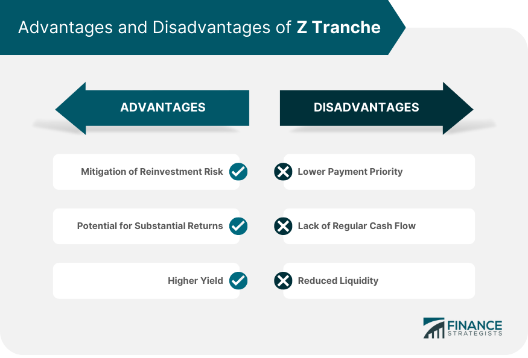

## Table of Contents

## What is a Z Tranche?

A Z Tranche is a type of bond that is part of a larger group of bonds called a Collateralized Mortgage Obligation (CMO). In a CMO, the money from a pool of mortgages is split into different pieces, called tranches. Each tranche gets paid back at different times. The Z Tranche is special because it is the last one to get paid back. It doesn't get any interest payments until all the other tranches ahead of it are paid off.

Because the Z Tranche is the last to be paid, it can be riskier than other tranches. However, it can also offer higher potential returns if the investor is willing to wait. The interest that would normally be paid to the Z Tranche is added to its value over time, a process called accretion. This means that when the Z Tranche finally starts getting payments, the amount it gets can be much larger than what it would have been if it had been paid interest all along.

## How does a Z Tranche work in a Collateralized Mortgage Obligation (CMO)?

In a Collateralized Mortgage Obligation (CMO), a pool of mortgages is divided into different slices called tranches. Each tranche has its own rules about when it gets paid back. The Z Tranche is the last one in line to get paid. This means that it doesn't get any interest payments until all the other tranches in front of it have been fully paid off. Because it's the last to be paid, the Z Tranche is considered riskier than the others.

Even though the Z Tranche doesn't get interest payments right away, the interest it would have received is added to its value over time. This process is called accretion. So, when the Z Tranche finally starts getting payments, the amount it gets can be much bigger than what it would have been if it had been paid interest all along. This makes the Z Tranche potentially more rewarding for investors who are willing to wait and take on the extra risk.

## What are the key features of a Z Tranche?

A Z Tranche is a special part of a Collateralized Mortgage Obligation (CMO). It is the last one to get paid back from the money collected from a pool of mortgages. This means it doesn't get any interest payments until all the other parts, called tranches, in front of it are fully paid off. Because it's the last to be paid, a Z Tranche can be riskier than the other tranches.

Even though the Z Tranche doesn't get interest payments right away, the interest it would have received is added to its value over time. This process is called accretion. So, when the Z Tranche finally starts getting payments, the amount it gets can be much bigger than what it would have been if it had been paid interest all along. This makes the Z Tranche a good choice for investors who are willing to wait and take on more risk for the chance of getting bigger returns.

## Who typically invests in Z Tranches?

Investors who typically put money into Z Tranches are often looking for higher returns and are willing to take more risk. These investors might be big institutions like banks or investment funds. They understand that Z Tranches are the last to get paid in a Collateralized Mortgage Obligation (CMO), so they need to wait longer before seeing any money back.

These investors are okay with waiting because they know that the interest not paid right away gets added to the value of the Z Tranche over time. This process, called accretion, can make the Z Tranche worth a lot more when it finally starts getting payments. So, while Z Tranches are riskier, they can offer bigger rewards for those who are patient and can handle the risk.

## What are the advantages of investing in a Z Tranche?

Investing in a Z Tranche can be good for people who want to get more money back than they put in. Since Z Tranches are the last ones to get paid in a Collateralized Mortgage Obligation (CMO), they can end up being worth a lot more. This is because the interest that would have been paid to them gets added to their value over time. This process is called accretion. So, when a Z Tranche finally starts getting paid, it can give investors a bigger return than other parts of the CMO.

However, investing in a Z Tranche is not for everyone. It's best for big investors like banks or investment funds who can wait a long time to get their money back. These investors know that Z Tranches are riskier because they are the last to get paid. But if they can handle the wait and the risk, they might get a lot more money in the end. So, Z Tranches can be a good choice for those who are looking for bigger rewards and are okay with taking more chances.

## What are the potential risks and disadvantages of Z Tranches?

Investing in Z Tranches can be risky because they are the last ones to get paid in a Collateralized Mortgage Obligation (CMO). This means if the people who took out the mortgages stop paying, there might not be enough money left to pay the Z Tranche. This makes Z Tranches more likely to lose money compared to other parts of the CMO. Also, because Z Tranches don't get paid until the end, they can be hard to sell if an investor needs money quickly. This can make it tough for investors who might need to get their money back sooner.

Another disadvantage is that Z Tranches can be hard to understand. They work differently from regular bonds because of the way interest is added to their value over time. This can make it tricky for investors to figure out how much money they might make or lose. Because of these risks and complexities, Z Tranches are usually not a good choice for people who don't like taking big chances or who need their money back quickly. They are better for big investors who can wait a long time and handle the risk.

## How does the interest accrual mechanism in a Z Tranche differ from other tranches?

In a Collateralized Mortgage Obligation (CMO), a Z Tranche works differently from other tranches when it comes to how interest is handled. Other tranches get regular interest payments as soon as the money starts coming in from the pool of mortgages. But a Z Tranche doesn't get paid any interest right away. Instead, the interest that would have been paid to the Z Tranche is added to its value over time. This process is called accretion.

Because of this accretion, when the Z Tranche finally starts getting paid, the amount it gets can be much bigger than what it would have been if it had been paid interest all along. This makes the Z Tranche different from other tranches, which get smaller, regular payments. The Z Tranche's interest accrual mechanism means it can offer bigger rewards, but investors have to wait longer and take on more risk.

## Can you explain the cash flow structure of a Z Tranche within a CMO?

In a Collateralized Mortgage Obligation (CMO), the money from a pool of mortgages is split into different parts called tranches. The Z Tranche is the last one to get paid. When people make their mortgage payments, the money first goes to the other tranches in front of the Z Tranche. These other tranches get their interest and some of their principal back before the Z Tranche gets anything. This means that the Z Tranche doesn't get any interest payments until all the other tranches are fully paid off.

Even though the Z Tranche doesn't get interest payments right away, the interest it would have received is added to its value over time. This is called accretion. So, when all the other tranches are paid off and the Z Tranche finally starts getting money, the amount it gets can be much bigger. This makes the Z Tranche a good choice for investors who are willing to wait and take on more risk, because they can get a bigger reward in the end.

## How does the prepayment risk affect Z Tranche investors?

Prepayment risk is when people pay off their mortgages early, and this can affect Z Tranche investors in a big way. If lots of people pay off their mortgages early, the money that comes into the Collateralized Mortgage Obligation (CMO) might run out before the Z Tranche gets paid. This is because the Z Tranche is the last one to get money, so if there's not enough left, Z Tranche investors might not get anything at all.

This risk is a big deal for Z Tranche investors because they are already waiting a long time to get their money back. If prepayments happen a lot, it can mean that the Z Tranche never gets paid, or it gets paid much less than expected. So, Z Tranche investors need to think carefully about prepayment risk before they decide to invest, because it can make their investment a lot riskier.

## What impact does interest rate fluctuation have on Z Tranches?

Interest rate changes can have a big effect on Z Tranches in a Collateralized Mortgage Obligation (CMO). When interest rates go down, people often pay off their mortgages early to get new ones with lower rates. This is called prepayment, and it can be bad for Z Tranche investors. If lots of people pay off their mortgages early, the money coming into the CMO might run out before the Z Tranche gets paid. Since the Z Tranche is the last one to get money, this means Z Tranche investors might not get anything at all.

On the other hand, when interest rates go up, fewer people pay off their mortgages early. This means the money coming into the CMO might last longer, which can be good for Z Tranche investors. They might have to wait longer to get their money, but there's a better chance that there will still be money left when it's their turn. So, Z Tranche investors need to keep an eye on interest rates because they can make a big difference in how much money they might get back.

## How can Z Tranches be used for tax planning purposes?

Z Tranches can be used for tax planning because of how they handle interest. When you invest in a Z Tranche, you don't get interest payments right away. Instead, the interest that would have been paid gets added to the value of the Z Tranche over time. This is called accretion. Because you don't get the interest until later, you don't have to pay taxes on it until then. This can help investors who want to put off paying taxes on their investment income.

For people who are looking to manage their taxes, Z Tranches can be a good choice. They can help spread out when you have to pay taxes on your investment earnings. This can be useful if you think you'll be in a lower tax bracket in the future, or if you want to keep more of your money now to use for other investments or expenses. But remember, Z Tranches are riskier than other parts of a CMO, so you need to think carefully about whether they fit with your overall investment and tax plans.

## What are some advanced strategies for investing in Z Tranches?

One advanced strategy for investing in Z Tranches is to use them as part of a bigger investment plan that focuses on long-term growth. Since Z Tranches don't get paid until all other tranches are paid off, they can be a good choice for investors who can wait a long time. These investors might put money into Z Tranches to balance out other investments that give quick returns but less overall growth. By waiting for the Z Tranche to pay out, investors can aim for bigger rewards in the end, even though it's riskier.

Another strategy is to use Z Tranches to manage taxes. Because the interest on Z Tranches is added to their value over time and not paid out until the end, investors can put off paying taxes on that interest. This can be helpful for people who think they'll be in a lower tax bracket later or want to keep more money now for other investments. But, this strategy needs careful planning because Z Tranches are riskier and need a long wait before they pay off.

Lastly, some investors might use Z Tranches to take advantage of changes in interest rates. If interest rates go down, more people might pay off their mortgages early, which can be bad for Z Tranches. But if rates go up, fewer people will pay off early, and there's a better chance the Z Tranche will get paid. Smart investors might buy Z Tranches when they think rates will go up and hold onto them until rates are high enough to make the Z Tranche a good bet. This strategy needs a good understanding of the mortgage market and [interest rate](/wiki/interest-rate-trading-strategies) trends.

## What are the benefits and risks of Z Tranche investments?

Z tranches, as the residual class in collateralized mortgage obligations (CMOs), present a unique investment opportunity that comes with both distinct advantages and notable risks. These financial instruments, although inherently complex, can be appealing due to the potential benefits they offer to certain types of investors seeking long-term gains and strategic investment.

### Benefits of Z Tranche Investments

1. **Accrued Interest**: Unlike other tranches, Z tranches do not pay periodic interest. Instead, the interest that accumulates is added to the principal balance of the tranche until the more senior tranches are completely paid off. This feature of Z tranches can be advantageous for investors who prioritize growth potential over immediate cash flow. The accrued interest increases the principal amount, which can lead to higher eventual payouts.

2. **Low Reinvestment Risk**: Since investors in Z tranches are not receiving periodic interest payments, they do not face reinvestment risk during the accrual period. Reinvestment risk occurs when interim payments from an investment must be reinvested at a lower rate of return. The absence of regular cash flows until the principal is amortized means investors do not need to worry about reinvesting funds at diminished interest rates.

### Risks of Z Tranche Investments

1. **High Volatility**: The delayed cash flows associated with Z tranches can lead to volatility in their market valuations. Since these tranches are paid after the senior tranches, any variations or delays in overall mortgage payments can impact the cash flow timing, thus affecting the present value of the tranche.

2. **Long Duration Before Payouts**: The nature of Z tranches involves extended periods before principal and interest are paid out, which might not suit every investor, particularly those requiring liquidity or shorter investment horizons. Investors must be prepared for an extended commitment—often reflecting the life of the underlying mortgage obligations.

3. **Time Value of Money**: With Z tranches, the understanding and application of the time value of money (TVM) are critical. Since investors wait longer for their returns, it's important to account for the decrease in purchasing power over time. The formula for TVM often used is:
$$
   PV = \frac{FV}{(1 + r)^n}

$$

   Where $PV$ is the present value, $FV$ is the future value, $r$ is the interest rate, and $n$ is the number of periods. This concept helps investors evaluate the real value of cash flows received in the future.

### Historical Performance and Market Scenarios

Z tranche investments have historically performed well in stable or declining interest rate environments, as the value of fixed-income products tends to rise. During periods of rising interest rates, however, the present value of future cash flows can diminish, making these investments less attractive. 

Investors should consider both historical performance data and market scenarios that have influenced Z tranches. For instance, the 2008 financial crisis demonstrated how shifts in mortgage payments and defaults could dramatically affect the payout structure and timing of these tranches.

### Case Studies

Analysis of specific cases where Z tranches have either succeeded or underperformed can provide valuable insights into their potential. For example, during periods of economic stability, when mortgage default rates are low, Z tranches have shown capability to deliver robust returns. Conversely, during periods of economic downturn, increases in mortgage defaults have proven detrimental, delaying or even reducing expected payout amounts.

### Conclusion

Investors contemplating Z tranche investments must weigh the associated benefits and risks in line with their financial goals and risk tolerance. While offering promising returns through accrued interest and minimized reinvestment risk, they entail substantial periods without cash flows and heightened sensitivity to the macroeconomic environment. A careful assessment of market conditions and a thorough understanding of underlying risks are essential to optimize the benefits of Z tranche investments.

## What are the synergies between Z Tranche and Algorithmic Trading?

Combining the accrual nature of Z tranche investments with the analytical power of [algorithmic trading](/wiki/algorithmic-trading) can significantly enhance investment returns. By using automated systems, investors can precisely time their entry and [exit](/wiki/exit-strategy) points in Z tranche investments, optimizing profit potential. Algorithmic trading harnesses vast datasets to anticipate market trends and execute trades more efficiently than a human investor might.

### Timing and Execution

Algorithmic trading can be instrumental in navigating the complexities of Z tranche investments. These investments involve receiving accrued interest after certain senior tranches are paid. Thus, timing is crucial. By employing algorithms to analyze market conditions, investors can effectively plan their position entries and exits. For instance, an algorithm might optimize for variables such as prevailing interest rates, economic indicators, and changes in mortgage default rates.

### Evaluation of Market Conditions

Advanced algorithms can evaluate the conditions influencing Z tranches. Consider models that incorporate stochastic processes to account for interest rate fluctuations, or leverage [machine learning](/wiki/machine-learning) algorithms to predict mortgage default risks. For instance, the Cox-Ingersoll-Ross (CIR) model is useful for modeling interest rate dynamics:

$$
dr(t) = a(b - r(t))dt + \sigma \sqrt{r(t)}dW(t)
$$

where:
- $dr(t)$ is the rate change over time,
- $a$ is the speed of reversion,
- $b$ is the long-term mean,
- $\sigma$ is the volatility,
- $dW(t)$ is a Wiener process (standard Brownian motion).

By applying such models within algorithmic systems, traders can make informed predictions on how these variables might impact Z tranche values.

### Case Studies and Competitive Edge

To exemplify the competitive edge achieved, consider a scenario where an algorithm accurately predicts a drop in interest rates, leading to strategic profitable positions in Z tranches. A notable example is the deployment of a [neural network](/wiki/neural-network) model that evaluates historical data on interest rates and mortgage payments to forecast future performance. Algorithms can backtest these strategies, ensuring robustness before actual application in the financial markets.

### Streamlining Investment Processes

Integrating these tools streamlines investment processes by reducing the manual burden on traders and increasing decision accuracy. With algorithms handling data analysis and trade execution, human traders can focus on strategy development and risk management. This synergy transforms the trading landscape, offering comprehensive solutions that enhance portfolio performance.

In conclusion, the fusion of Z tranche investments with algorithmic trading not only optimizes returns but also allows investors to better manage the inherent risks and complexities associated with these financial instruments. Through leveraging technology and sophisticated models, investors gain a decisive advantage in today's fast-paced trading environment.

## References & Further Reading

[1]: Gorton, G. B., & Souleles, N. S. (2006). ["Special Purpose Vehicles and Securitization."](https://www.nber.org/papers/w11190) National Bureau of Economic Research Working Paper Series.

[2]: ["Advances in Financial Machine Learning"](https://www.amazon.com/Advances-Financial-Machine-Learning-Marcos/dp/1119482089) by Marcos Lopez de Prado.

[3]: Brigo, D., & Mercurio, F. (2007). ["Interest Rate Models - Theory and Practice: With Smile, Inflation, and Credit."](https://link.springer.com/book/10.1007/978-3-540-34604-3) Springer Finance.

[4]: ["Quantitative Trading: How to Build Your Own Algorithmic Trading Business"](https://github.com/LucindaYa/quant-resources/blob/master/Quantitative%20Trading%20How%20to%20Build%20Your%20Own%20Algorithmic%20Trading%20Business.pdf) by Ernest P. Chan.

[5]: Fabozzi, F. J. (2001). ["The Handbook of Mortgage-Backed Securities."](https://academic.oup.com/book/7943) McGraw-Hill Education.

[6]: Choudhry, M. (2013). ["The Bond & Money Markets: Strategy, Trading, Analysis."](https://www.sciencedirect.com/book/9780750646772/the-bond-and-money-markets) Butterworth-Heinemann.

[7]: Aronson, D. R. (2007). ["Evidence-Based Technical Analysis: Applying the Scientific Method and Statistical Inference to Trading Signals."](https://onlinelibrary.wiley.com/doi/book/10.1002/9781118268315) Wiley.