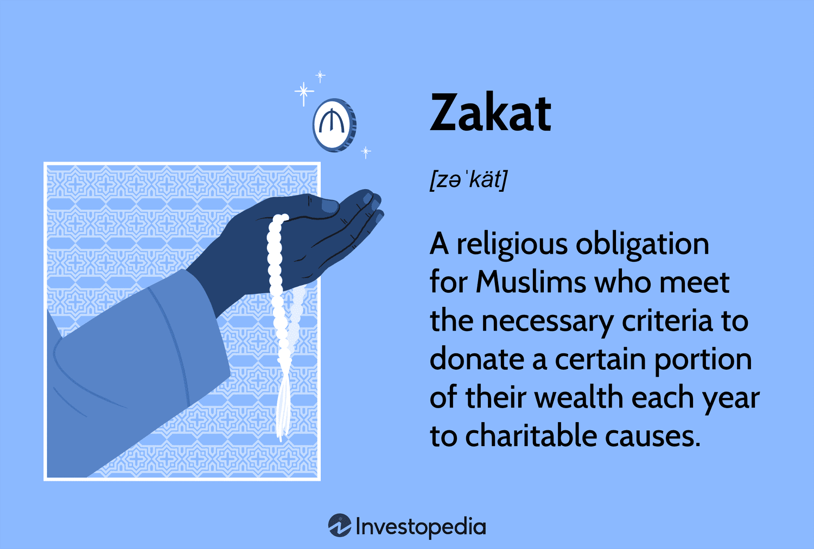

## Table of Contents

## What is Zakat and why is it important in Islam?

Zakat is one of the five pillars of Islam, which means it is a very important part of the religion. It is a type of charity that Muslims are supposed to give to help those who are poor or in need. Muslims give Zakat by giving away a certain amount of their money or wealth every year. The amount is usually about 2.5% of what they have saved over the year, but it can be different depending on what they own.

Zakat is important in Islam because it helps to make sure that everyone in the community is taken care of. It is a way for Muslims to show that they care about others and want to help them. By giving Zakat, Muslims are following the teachings of the Quran and the example of the Prophet Muhammad, who always helped those in need. It also helps to clean the heart of the person giving Zakat, as it teaches them to be less attached to their money and more focused on helping others.

## Who is obligated to pay Zakat?

Zakat is something that adult Muslims who have enough money or wealth need to pay. This means if you are a Muslim and you have more money than you need for your basic needs, you should give Zakat. The money or wealth you have should be more than a certain amount, called the nisab, for a whole year. If it is, then you need to give away 2.5% of it as Zakat.

Not everyone has to pay Zakat. For example, children, people who are not Muslim, and people who do not have enough money or wealth do not need to pay it. Also, if someone's money or wealth is less than the nisab, they do not have to give Zakat. It's important for Muslims to know if they need to pay Zakat because it is a big part of their religion and helps others in need.

## What types of wealth are subject to Zakat?

Zakat is something Muslims give from different kinds of wealth they have. This includes money they have saved in the bank or at home, gold and silver they own, and any business goods they have that they plan to sell. If a Muslim has more than a certain amount of these things for a whole year, they need to give Zakat on them.

Zakat also applies to some other types of wealth. For example, if a Muslim has animals like cows, sheep, or camels, and they have more than a certain number of these animals, they need to give Zakat on them too. Also, if a Muslim gets money from renting out land or buildings, they might need to give Zakat on that money if it is more than the required amount for a year.

## How is the amount of Zakat calculated?

To calculate Zakat, you first need to know if you have enough wealth to give it. This means your money or things you own should be more than a certain amount called the nisab. The nisab is usually the value of 87.48 grams of gold or 612.36 grams of silver. If you have more than this amount for a whole year, you need to give Zakat.

Once you know you have enough, you calculate Zakat by taking 2.5% of your total wealth. This includes money in the bank, cash at home, gold, silver, and things you plan to sell in your business. For example, if you have $10,000 that is more than the nisab and you've had it for a year, you would give $250 as Zakat because $10,000 times 2.5% equals $250. It's important to be honest and careful when figuring out how much Zakat to give.

## What is the Nisab threshold for Zakat?

The Nisab is the minimum amount of wealth a Muslim must have before they need to give Zakat. It is usually measured by the value of gold or silver. For gold, the Nisab is the value of 87.48 grams of gold. For silver, it is the value of 612.36 grams of silver. You can use either gold or silver to figure out if you have enough wealth to give Zakat, but you should stick to one or the other.

To know if you need to give Zakat, you have to see if your wealth is more than the Nisab for a whole year. If it is, then you need to give 2.5% of that wealth as Zakat. The Nisab helps make sure that only people who have enough money or things give Zakat, so it is fair and helps those who really need it.

## When and how often should Zakat be paid?

Zakat should be paid once every year. Muslims usually pay it during the month of Ramadan because it is a special time for giving and helping others. But you can pay Zakat at any time of the year as long as it has been a full year since you last paid it and your wealth is still more than the Nisab.

To pay Zakat, you need to add up all your money and things that you have to give Zakat on, like cash, gold, silver, and business goods. If this total is more than the Nisab for a whole year, you give away 2.5% of it. You can give this money to poor people, to help build mosques, or to other good causes that help the community.

## Who are the eligible recipients of Zakat?

Zakat can be given to people who really need help. This includes poor people who don't have enough money for their basic needs like food, clothes, and a place to live. It can also be given to people who are in debt and can't pay it back. Zakat helps them get out of their money problems.

Zakat can also be given to travelers who are stuck and need money to get back home. It can be used to help free people who are slaves or to support people who are working to spread Islam. Zakat is not just for helping people with money problems; it's also for making the community stronger and helping people in different ways.

## Can Zakat be given to non-Muslims?

Zakat is usually given to Muslims who need help. The main people who can get Zakat are poor Muslims, Muslims who are in debt, and Muslims who are traveling and need money to get back home. Zakat is meant to help the Muslim community and make it stronger.

Some Muslim scholars say that Zakat can be given to non-Muslims if they are very poor and need help. But most scholars say it should only be given to Muslims. It's important to follow the rules about who can get Zakat to make sure it helps the right people.

## What are the conditions under which Zakat can be distributed?

Zakat can be given to people who really need help. This includes poor Muslims who don't have enough money for food, clothes, and a place to live. It can also be given to Muslims who are in debt and can't pay it back. Zakat helps them get out of their money problems. It can also be used to help travelers who are stuck and need money to get back home, to free people who are slaves, and to support people who are working to spread Islam.

Most Muslim scholars say that Zakat should only be given to Muslims. This is because Zakat is meant to help the Muslim community and make it stronger. Some scholars say it can be given to non-Muslims if they are very poor and need help, but this is not the usual way. It's important to follow the rules about who can get Zakat to make sure it helps the right people.

## How should Zakat be distributed among the different categories of recipients?

Zakat should be shared among different groups of people who need help. These groups include poor Muslims who don't have enough money for food, clothes, and a place to live. It can also be given to Muslims who are in debt and can't pay it back. Zakat helps them get out of their money problems. It can also be used to help travelers who are stuck and need money to get back home, to free people who are slaves, and to support people who are working to spread Islam.

Most Muslim scholars say that Zakat should only be given to Muslims. This is because Zakat is meant to help the Muslim community and make it stronger. Some scholars say it can be given to non-Muslims if they are very poor and need help, but this is not the usual way. It's important to follow the rules about who can get Zakat to make sure it helps the right people. When giving Zakat, you can decide how much to give to each group, but it's good to try to help as many people as you can in the different categories.

## What are the consequences of not paying Zakat?

Not paying Zakat is a big deal in Islam. It's one of the five pillars of the religion, so it's very important. If a Muslim who has enough money doesn't pay Zakat, they are not following the rules of their faith. This can make them feel guilty and it can also make their heart less clean because they are holding onto their money instead of helping others.

There are also some beliefs about what might happen if someone doesn't pay Zakat. Some people think that if you don't give Zakat, your wealth might not grow or you might lose it. This is because Zakat is seen as a way to clean your wealth and make it grow. Not paying it can be seen as a bad thing that might bring bad luck or problems. It's important for Muslims to pay Zakat to follow their religion and to help those in need.

## Are there any contemporary issues or debates surrounding the application of Zakat?

There are some debates about how Zakat should be used today. One big issue is whether Zakat can be given to non-Muslims. Most Muslim scholars say it should only be given to Muslims to help the Muslim community. But some scholars think it's okay to give Zakat to non-Muslims if they are very poor and need help. This is a big debate because people want to make sure Zakat helps the right people.

Another issue is how to calculate Zakat in today's world. With things like stocks, savings accounts, and other modern types of wealth, it can be hard to know what counts for Zakat. Some people think you should give Zakat on all your money, even if it's in a bank or invested. Others think you should only give it on money you can use right away. This debate is important because it affects how much Zakat people give and who gets help from it.

## References & Further Reading

[1]: Bakar, N. A., & Rahman, A. A. (2007). ["A comparative study of Zakat and modern taxation."](https://www.researchgate.net/profile/Nur-Barizah-Abu-Bakar/publication/201848387_Comparative_Study_of_Zakah_and_Modern_Taxation/links/09121a6dea4886330e2f9535/Comparative-Study-of-Zakah-and-Modern-Taxation.pdf) Journal of King Abdulaziz University: Islamic Economics.

[2]: Hossain, S. A., & Lim, C. S. (2016). ["Shariah and Ethical Concepts in Islamic Banking: A Case Study of Bangladesh."](https://onlinelibrary.wiley.com/doi/full/10.1111/caim.12511) International Journal of Multidisciplinary and Basic Sciences, 6(4), 1-10.

[3]: Iqbal, Z., & Mirakhor, A. (2011). ["An Introduction to Islamic Finance: Theory and Practice."](https://archive.org/details/introductiontois0000iqba) Wiley Finance.

[4]: Krishnamurthy, A. (2010). ["How Debt Markets Have Maladapted to Financial Crises."](https://www.nber.org/papers/w15542) National Bureau of Economic Research Working Paper No. 16897.

[5]: Ramli, R., & Hamid, M. A. (2014). ["The Concept and Operations of Zakat as a Taxation Tool in Malaysia."](https://pmc.ncbi.nlm.nih.gov/articles/PMC7296476/) Conference Paper, Universiti Teknologi MARA.