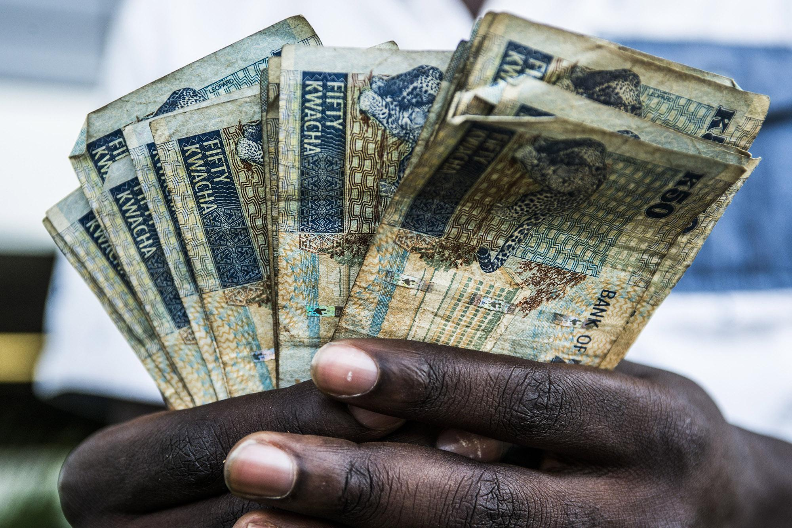

## Table of Contents

## What is the Zambian Kwacha?

The Zambian Kwacha is the official currency of Zambia, a country in southern Africa. It is used every day by people in Zambia to buy things like food, clothes, and other goods. The word "Kwacha" means "dawn" in the local language, symbolizing a new beginning for the country when it was first introduced.

The Kwacha is divided into smaller units called ngwee. Just like how a dollar is divided into cents, 1 Kwacha is equal to 100 ngwee. The currency has gone through changes over the years, including a rebasing in 2013 where they removed three zeros from the currency to make it easier to use and understand.

## How was the Zambian Kwacha introduced and when?

The Zambian Kwacha was first introduced on January 16, 1968. Before that, Zambia used the Zambian pound. The change to the Kwacha was a big step for Zambia because it showed the country was moving forward on its own after becoming independent from Britain in 1964.

When the Kwacha was introduced, it was a new beginning for Zambia. The word "Kwacha" means "dawn" in the local language, which symbolized a fresh start. At first, the Kwacha was divided into 100 ngwee, just like how a dollar is divided into cents. This made it easier for people in Zambia to use the new money.

## What are the denominations of the Zambian Kwacha?

The Zambian Kwacha comes in different sizes of money, called denominations. For the paper money, you can find Kwacha notes in 2, 5, 10, 20, 50, and 100 Kwacha. These are the big bills that people use to buy things that cost more money.

For the smaller money, there are coins. The coins come in 1 Kwacha, 5 ngwee, 10 ngwee, and 50 ngwee. People use these coins to buy smaller things or to get change when they buy something. This way, the Kwacha can be used for all kinds of purchases, big and small.

## How does the Zambian Kwacha impact everyday life in Zambia?

The Zambian Kwacha is very important for everyday life in Zambia. People use it to buy food, clothes, and other things they need every day. When someone goes to the market, they use Kwacha to pay for vegetables, meat, and other groceries. If they need to take a bus or a taxi, they use Kwacha to pay for the ride. Even when kids go to school, their parents use Kwacha to pay for school fees and supplies.

The value of the Kwacha can also affect how much things cost. If the Kwacha is strong, people can buy more with the same amount of money. But if the Kwacha is weak, the same amount of money might not buy as much. This can make life harder for people because they might have to spend more money to get the things they need. So, the Kwacha is not just money; it's a big part of how people live and plan their lives in Zambia.

## What is the current exchange rate of the Zambian Kwacha against major currencies?

The Zambian Kwacha's exchange rate changes every day, so it's good to check the latest numbers. As of now, 1 US Dollar is about 27 Zambian Kwacha. This means if you have 1 US Dollar, you can get around 27 Kwacha when you change your money. For the Euro, 1 Euro is about 29 Kwacha. So, if you have 1 Euro, you can get around 29 Kwacha.

The exchange rate with the British Pound is also important. Right now, 1 British Pound is about 34 Zambian Kwacha. This means if you have 1 British Pound, you can get around 34 Kwacha. These rates can help you understand how much your money is worth in Zambia and plan your spending if you're visiting or doing business there.

## How has the value of the Zambian Kwacha changed over the past decade?

Over the past ten years, the value of the Zambian Kwacha has gone up and down a lot. At the start of the decade, around 2013, 1 US Dollar was worth about 5 Kwacha. But by 2020, the Kwacha had lost a lot of its value, and 1 US Dollar was worth around 18 Kwacha. This big change made things more expensive for people in Zambia because they needed more Kwacha to buy the same things.

In the last few years, the Kwacha has kept losing value. By 2023, 1 US Dollar was worth about 27 Kwacha. This means that over the decade, the Kwacha has become much weaker compared to the US Dollar. This change affects everyday life in Zambia because people have to spend more Kwacha to buy things from other countries, like medicine or machinery.

## What factors influence the value of the Zambian Kwacha?

The value of the Zambian Kwacha can change because of many things. One big reason is how much copper Zambia sells to other countries. Zambia has a lot of copper, and when the price of copper goes up, the Kwacha usually gets stronger. But if the price of copper goes down, the Kwacha can lose value. Another reason is how much money Zambia makes from selling things to other countries. If Zambia sells a lot of things and makes a lot of money, the Kwacha can get stronger. But if Zambia doesn't sell as much, the Kwacha can get weaker.

Another thing that can change the value of the Kwacha is how much money the government spends. If the government spends a lot more money than it makes, it can make the Kwacha weaker. Also, what other countries think about Zambia's economy can affect the Kwacha. If other countries think Zambia's economy is doing well, they might want to buy more Kwacha, which can make it stronger. But if they think Zambia's economy is not doing well, they might not want to buy Kwacha, which can make it weaker.

## How does the Zambian government manage the Kwacha's monetary policy?

The Zambian government, through the Bank of Zambia, manages the Kwacha's monetary policy to keep the economy stable. They do this by controlling how much money is in the country. If there's too much money, prices can go up, so the Bank of Zambia might raise interest rates. This makes it more expensive to borrow money, which can slow down spending and help keep prices from going up too fast. On the other hand, if the economy needs a boost, the Bank of Zambia might lower interest rates to make borrowing cheaper, encouraging people and businesses to spend more.

Another way the Zambian government manages the Kwacha is by keeping an eye on the exchange rate. They might buy or sell foreign currency to keep the Kwacha from getting too weak or too strong. This helps make sure that Zambian goods stay competitive in the world market and that imports don't become too expensive for people in Zambia. By doing these things, the government tries to keep the economy balanced and make life easier for everyone in the country.

## What role does the Zambian Kwacha play in Zambia's international trade?

The Zambian Kwacha is very important for Zambia's international trade. When Zambia sells things like copper to other countries, it gets paid in foreign money like US Dollars. Then, it changes that money into Kwacha to use at home. If the Kwacha is strong, Zambia can buy more things from other countries with the same amount of foreign money. But if the Kwacha is weak, it might not be able to buy as much, which can make things more expensive for people in Zambia.

The value of the Kwacha also affects how much other countries want to buy from Zambia. If the Kwacha is weak, Zambian goods become cheaper for other countries, which can help Zambia sell more. But if the Kwacha is strong, Zambian goods might be more expensive, and other countries might not want to buy as much. So, the Kwacha plays a big role in how Zambia trades with the rest of the world, affecting both what Zambia can buy and what it can sell.

## How do fluctuations in the Zambian Kwacha affect Zambia's economy?

Fluctuations in the Zambian Kwacha can have a big impact on Zambia's economy. When the Kwacha gets weaker, it means that things from other countries become more expensive for people in Zambia. This can make life harder because everyday things like medicine, fuel, and machinery cost more. On the other hand, a weaker Kwacha can make Zambian goods cheaper for other countries to buy, which might help Zambia sell more of its products like copper. But if the Kwacha keeps getting weaker, it can also make people lose trust in the economy, which can lead to less spending and investment.

When the Kwacha gets stronger, it can help make imports cheaper, which is good for people in Zambia because they can buy more with the same amount of money. But a stronger Kwacha can also make Zambian goods more expensive for other countries, which might mean Zambia sells less. This can hurt the economy because Zambia makes a lot of money from selling things like copper to other countries. So, the Kwacha's value going up and down can affect how much people in Zambia can buy, how much Zambia can sell, and how much people trust the economy.

## What are the historical economic crises related to the Zambian Kwacha?

Zambia has faced several economic crises related to the Kwacha over the years. One big crisis happened in the 1980s and 1990s when the price of copper, which Zambia sells a lot of, dropped a lot. This made the Kwacha lose a lot of its value. People in Zambia found it hard to buy things from other countries because everything became more expensive. The government had to borrow a lot of money, which made the situation even worse. This time was very tough for Zambia's economy.

Another crisis came in the early 2000s when the Kwacha kept losing value. By 2003, the Kwacha was worth much less than before, and this made life very hard for people. The government tried to fix things by changing the Kwacha in 2013, taking away three zeros to make it easier to use. But even after that, the Kwacha kept going up and down, causing more problems. These ups and downs made it hard for Zambia to plan and grow its economy.

## What future economic policies are being considered to stabilize the Zambian Kwacha?

The Zambian government is thinking about different ways to make the Kwacha more stable. One idea is to keep a close eye on how much money is in the country. If there's too much money, it can make prices go up, so the government might raise interest rates to slow down spending. If the economy needs help, they might lower interest rates to make borrowing cheaper, which can encourage people and businesses to spend more. Another idea is to make sure Zambia sells more things to other countries, like copper, to bring in more foreign money. This can help keep the Kwacha strong.

Another policy being considered is to work on making the economy stronger overall. This means helping businesses grow and creating more jobs. If more people have jobs, they can spend more money, which can help the economy. The government is also thinking about borrowing less money from other countries. If Zambia doesn't have to pay back as much money, it can use more of its own money to help the economy. By doing these things, the government hopes to make the Kwacha more stable and life easier for people in Zambia.

## References & Further Reading

[1]: Frömmel, M. (2013). ["The Microstructure of Foreign Exchange Markets."](https://www.researchgate.net/publication/37692810_The_Microstructure_of_Foreign_Exchange_Markets) Walter de Gruyter.

[2]: ["Algorithmic Trading & DMA: An Introduction to Direct Access Trading Strategies"](https://www.amazon.com/Algorithmic-Trading-DMA-introduction-strategies/dp/0956399207) by Barry Johnson

[3]: Cheung, Y., & Rime, D. (2014). ["The Microstructure of the Foreign Exchange Market."](https://www.cb.cityu.edu.hk/ef/doc/Conference%20on%20International%20Monetary%20Systems/rime.pdf) Oxford Bibliographies.

[4]: Chaboud, A. P., Chiquoine, B., Hjalmarsson, E., & Vega, C. (2014). ["Rise of the Machines: Algorithmic Trading in the Foreign Exchange Market."](https://www.jstor.org/stable/43612951) International Finance Discussion Papers.

[5]: ["International Monetary Fund (IMF) Country Report on Zambia."](https://www.imf.org/-/media/Files/Publications/CR/2024/English/1zmbea2024001-print-pdf.ashx) International Monetary Fund, 2022.