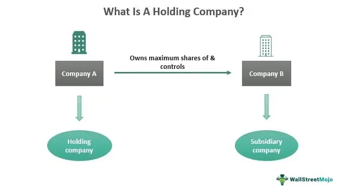

The Zayo Group, established in 2007, has rapidly positioned itself as a key entity in the telecommunications sector with a specialization in fiber-optic services. Its influence extends across North America and Europe, signifying a substantial geographical reach. Zayo's offerings are diverse, encompassing high-speed data transmission and comprehensive connectivity solutions that cater to the evolving needs of modern businesses.

Zayo's infrastructure is pivotal in providing essential services across various industries. It ensures seamless connectivity and supports enhanced communication networks, which are crucial for the efficient operation of contemporary businesses. With a robust network, the company facilitates critical operations by offering reliable and scalable solutions that meet the high-demand requirements of its clientele.



Moreover, as a leader in fiber-optic and telecommunications technology, Zayo significantly contributes to the efficiency of algorithmic trading platforms. This is achieved through its provision of low-latency networks, which are essential for the swift execution of trades in financial markets. By minimizing latency, Zayo's networks help in reducing the time delay during transactions, thus enhancing the overall performance and effectiveness of trading strategies that rely heavily on rapid data transmission.

Zayo's strategy and infrastructure position it as a crucial partner for businesses that demand high-speed and reliable connectivity. Its comprehensive range of products and services not only meets current demands but also anticipates future needs in an increasingly digital and fast-paced global economy.

## Table of Contents

## Zayo's Fiber-Optic Services

Zayo Group's fiber-optic services are developed to cater to the multifaceted requirements of varied business environments, offering a range of solutions including dark fiber, lit services, and Internet Protocol (IP) services. Dark fiber, essentially unused optical fiber, provides companies the flexibility to manage their own network infrastructure. Organizations opting for dark fiber benefit from dedicated connections that offer enhanced security, limitless bandwidth, and control over network operations, making it an ideal choice for enterprises with high data transmission needs.

Lit fiber services, in contrast, offer businesses a fully managed solution with Zayo operating the fiber and ensuring connectivity. These services are essential for companies seeking reliable, scalable bandwidth without the need to manage the network infrastructure themselves. Lit fiber services from Zayo support various applications, including Internet and Ethernet connectivity, and are designed to facilitate seamless communication and data exchange.

Zayo's IP services encompass a broad range of solutions intended to ensure high-capacity data transport and robust internet connectivity. These services enable organizations to leverage Zayo's expansive network for efficient data management, ensuring minimal latency and high-speed transmission crucial for modern business operations.

Moreover, Zayo offers carrier-neutral colocation services, providing data centers where multiple telecom carriers have access to interconnect. These services afford businesses the advantage of flexibility in choosing and managing their telecommunications partners, enhancing operational efficiency and cost management.

Zayo's extensive network infrastructure is a critical asset, characterized by its expansive reach and robust capacity. This infrastructure not only supports current connectivity requirements but also offers businesses customizable and scalable options to adjust as their needs evolve. The company's dedication to network expansion means that clients can expect ongoing improvements and enhancements to service offerings, ensuring alignment with the latest technological advancements and market demands. Zayo's commitment to providing comprehensive fiber-optic solutions underscores its position as a leader in offering high-quality, adaptable connectivity services to a diverse range of industries.

## Algorithmic Trading and Telecommunications

Algorithmic trading, a predominant force in financial markets, leverages computerized systems to execute orders at speeds and frequencies beyond human capability. The crux of successful [algorithmic trading](/wiki/algorithmic-trading) lies in minimizing latency—the delay before a transfer of data begins following an instruction. Low-latency networks are vital, enabling traders to capitalize on minuscule price differences available for fractions of a second. Zayo Group's low-latency fiber networks offer a significant advantage in this domain, providing expedited data transmission that is paramount for high-frequency trading.

Zayo's infrastructure is designed to ensure rapid data flow across financial hubs, reducing time delays in financial transactions. This is crucial for executing a large number of trades instantaneously and responding dynamically to market conditions. The low-latency networks minimize the execution time, allowing trading algorithms to promptly process information from market data feeds, make trading decisions, and transmit orders to exchanges.

The integration of Zayo's services into trading platforms has significantly transformed the efficiency of algorithmic trading by optimizing the data transmission pathways. These networks have enabled trading firms to achieve maximum throughput with minimum latency, ensuring that their trades are executed as close to real-time as possible. This infrastructure supports various algorithmic strategies, including statistical [arbitrage](/wiki/arbitrage), [market making](/wiki/market-making), and [trend following](/wiki/trend-following), by ensuring that the underlying data is as current as possible.

Furthermore, advances in financial technology, facilitated by quality infrastructures like those of Zayo, are driving changes in how firms approach trading. Python, among other tools, is frequently used to develop and test trading algorithms that benefit from these robust low-latency networks. Here’s a simple example of a Python script for [backtesting](/wiki/backtesting) a basic moving average crossover strategy that would require rapid data processing capabilities:

```python
import pandas as pd
import numpy as np

# Load historical price data
data = pd.read_csv('historical_prices.csv')
data['Date'] = pd.to_datetime(data['Date'])
data.set_index('Date', inplace=True)

# Calculate moving averages
data['SMA_50'] = data['Close'].rolling(window=50).mean()
data['SMA_200'] = data['Close'].rolling(window=200).mean()

# Implement buy/sell signals
data['Signal'] = 0
data['Signal'][50:] = np.where(data['SMA_50'][50:] > data['SMA_200'][50:], 1, 0)

# Calculate strategy returns
data['Strategy_Returns'] = data['Signal'].shift(1) * data['Close'].pct_change()

# Output performance metrics
cumulative_returns = (data['Strategy_Returns'] + 1).cumprod()
total_return = cumulative_returns[-1]
print(f'Total Strategy Return: {total_return:.2f}')
```

Zayo's capabilities in offering a seamless and efficient network environment enable the effective deployment of such strategies, underscoring the transformative role of their telecommunications infrastructure in advancing algorithmic trading globally. This blend of high-speed data transmission and advanced trading technologies contributes significantly to the dynamic nature of modern financial markets.

## Zayo's Market Impact

Zayo Group's expansive network has substantially impacted the telecommunications sector by offering innovative fiber-optic solutions and fostering market competition. This impact is largely driven by Zayo's strategic acquisition activities and growth initiatives, which have significantly enhanced its reach and capabilities on a global scale.

Central to Zayo's market influence is its robust acquisition strategy. Over the years, Zayo has consistently pursued acquisitions to expand its network infrastructure and service capabilities. Notable acquisitions include companies such as AboveNet, FiberGate, and Electric Lightwave, which have strengthened Zayo's position in key geographic markets and expanded its service offerings. By integrating these companies, Zayo has been able to provide more comprehensive solutions to its customers, thereby solidifying its presence in the industry.

Zayo's approach to growth extends beyond acquisitions. The company has focused on extending its network footprint and enhancing its service offerings to maintain a competitive edge. This entails investing in the expansion of its fiber-optic infrastructure, ensuring businesses have access to high-speed, reliable connectivity. Moreover, Zayo has adapted to market demands by diversifying its service portfolio, which includes dark fiber, lit services, and data center solutions. These enhancements facilitate greater flexibility and scalability for businesses, further cementing Zayo’s role as a pivotal provider of telecommunications services.

The company's market impact is not only measured by its expansions but also by the competitive dynamics it introduces to the telecommunications landscape. Zayo's presence has prompted other providers to innovate and improve their offerings, thereby driving overall industry advancement. This has resulted in a more competitive environment that benefits businesses seeking cutting-edge telecommunications solutions.

Through strategic acquisitions and a continuous focus on growth and innovation, Zayo Group has reshaped the telecommunications landscape. Its expansive network capabilities and innovative service options have not only enhanced its market position but have also spurred competition and innovation within the industry.

## Future Prospects and Challenges

Zayo is strategically situated to leverage the growing need for high-speed and reliable connectivity, particularly as cloud computing and 5G technologies continue to advance. The proliferation of cloud services demands expansive bandwidth and robust infrastructure, which Zayo is well-equipped to provide through its extensive fiber-optic network. This foundation not only supports the complex requirements of cloud providers but also positions Zayo as a critical partner in the deployment of 5G networks that require dense and low-latency fiber backhaul.

However, Zayo's path forward is not without challenges. Regulatory hurdles present a constant barrier in the telecommunications sector. As governments worldwide continue to evaluate and impose regulations aimed at ensuring fair competition and protecting consumer interests, Zayo must navigate complex legal terrains that could impact its operational strategies and cost structures. Additionally, increased market competition from both emerging players and established telecommunication giants necessitates continual innovation and value proposition enhancement to maintain and grow its market share.

Global market expansion and technology investments offer Zayo significant opportunities to reinforce its standing in the telecommunications industry. By continuing to expand its geographic footprint, particularly in untapped and growing markets, Zayo can increase its customer base and service diversity. Investment in cutting-edge technologies is crucial for their strategy to deliver scalable and flexible solutions that cater to the evolving demands of industries reliant on high-speed connectivity. These strategic initiatives are pivotal in ensuring that Zayo retains its influential position and continues to drive transformation within the global telecommunications landscape.

## Conclusion

Zayo Group's high-speed, low-latency fiber networks form a crucial backbone for modern technological advancements, particularly in areas such as algorithmic trading. These networks provide the infrastructure necessary for rapid data transmission, which is essential for executing the swift trades that characterize this sector. By significantly minimizing data latency, Zayo's fiber-optic solutions enable financial firms to perform trades at unprecedented speeds, thereby enhancing their competitiveness in the market.

Furthermore, Zayo's commitment to continuous innovation and strategic expansion positions the company as a global leader in providing critical infrastructure services. This approach not only facilitates the delivery of cutting-edge solutions but also ensures the company's agility in adapting to technological advancements and market demands. Through investments in network expansion and technology enhancements, Zayo consistently bolsters its ability to offer comprehensive and reliable services to businesses worldwide.

In fostering business growth, Zayo's robust fiber-optic solutions transcend multiple sectors reliant on fast and stable network connections. Industries such as healthcare, education, and finance benefit from enhanced communication capabilities and data management, ultimately driving operational efficiencies and productivity. As global demand for high-speed connectivity continues to escalate, Zayo Group remains a pivotal entity in shaping the future landscape of telecommunications and network services.

## References & Further Reading

[1]: Jonkman, M., & Boggs, D. (2016). ["A Practical Guide to Training Neural Networks: Event Classification and Financial Trading."](https://pubmed.ncbi.nlm.nih.gov/26251965/) Springer International Publishing.

[2]: Narang, R. K. (2013). ["Inside the Black Box: A Simple Guide to Quantitative and High Frequency Trading."](https://onlinelibrary.wiley.com/doi/book/10.1002/9781118662717) Wiley Finance.

[3]: Aldridge, I. (2017). ["Real-Time Risk: What Investors Should Know About Fintech, High-Frequency Trading, and Flash Crashes."](https://archive.org/details/realtimeriskwhat0000aldr) Wiley.

[4]: Clare, A., Seaton, J., Smith, P. N., & Thomas, S. (2019). ["The Trend Following Code: Trading for the Next Era"](https://papers.ssrn.com/sol3/papers.cfm?abstract_id=2126478) Cambridge University Press.

[5]: Farmer, J. D., & Skouras, S. (2012). ["An ecological perspective on the future of computer trading."](https://www.tandfonline.com/doi/full/10.1080/14697688.2012.757636) Bank of England.

[6]: DeGroot, M. H., & Schervish, M. J. (2012). ["Probability and Statistics."](https://www.pearson.com/en-us/subject-catalog/p/probability-and-statistics-classic-version/P200000006163/9780137981694) Addison-Wesley.