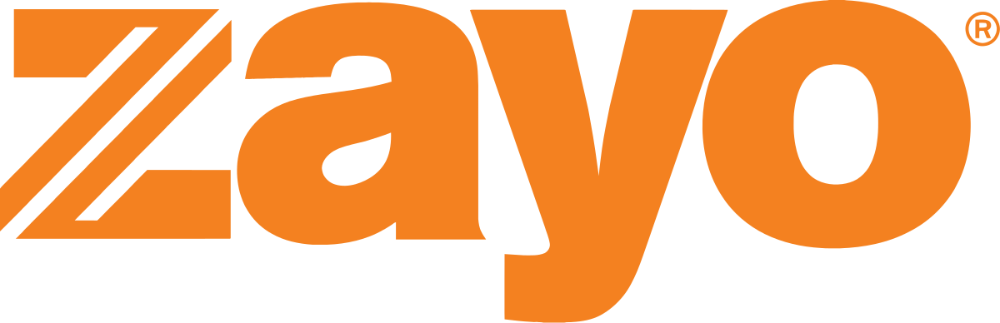

## Table of Contents

## What is Zayo Group Holdings?

Zayo Group Holdings, often just called Zayo, is a company that provides communication services. They help businesses and other organizations connect to the internet and to each other. Zayo owns a lot of fiber optic cables and other equipment that make these connections possible. They work with big companies, small businesses, and even other internet service providers to make sure data can travel quickly and safely.

The company was started in 2007 and has grown a lot since then. They now have a network that spans across the United States and even reaches into Europe. Zayo offers different services like internet access, data storage, and helping companies set up their own networks. They are known for being reliable and for having a lot of options for their customers.

## When was Zayo Group Holdings founded?

Zayo Group Holdings was founded in 2007. It started as a small company but grew quickly because it offered important services that many businesses needed.

The company helps businesses connect to the internet and to each other. They own a lot of fiber optic cables and other equipment that make these connections fast and safe.

## Who are the founders of Zayo Group Holdings?

Zayo Group Holdings was started by Dan Caruso and John Scarano. They saw a need for better internet and communication services for businesses. So, they decided to start a company that could help with that.

Dan Caruso became the CEO of Zayo. He had a lot of experience in the tech world and knew how to grow a business. John Scarano helped with the day-to-day running of the company. Together, they built Zayo into a big company that helps many businesses connect to the internet and to each other.

## What are the main services provided by Zayo Group Holdings?

Zayo Group Holdings offers a variety of services that help businesses connect to the internet and to each other. One of their main services is providing high-speed internet access. They use their own fiber optic cables to make sure the internet is fast and reliable. This is important for businesses that need to send a lot of data quickly.

Another key service is data storage. Zayo helps businesses keep their important information safe and easy to access. They have big data centers where this information is stored. This service is useful for companies that need a lot of space to keep their files and need to know that their data is secure.

Zayo also helps businesses set up their own networks. This means they can help a company connect all of its different locations together. This service is important for big companies that have offices in different places and need to share information between them.

## In which countries does Zayo Group Holdings operate?

Zayo Group Holdings operates mainly in the United States. They have a big network of fiber optic cables that covers many parts of the country. This helps businesses in different cities and states connect to the internet and to each other easily.

Zayo also has operations in Europe. They have expanded their services to countries like the United Kingdom, France, and Germany. This allows them to help businesses in these countries connect to the internet and to other businesses in Europe and the United States.

## What is the business model of Zayo Group Holdings?

Zayo Group Holdings makes money by offering services that help businesses connect to the internet and to each other. They own a lot of fiber optic cables and other equipment that they use to provide these services. Businesses pay Zayo to use their network, which is fast and reliable. This is important for companies that need to send a lot of data quickly and safely.

Zayo also makes money by helping businesses set up their own networks. They can connect different offices of a company together, which is useful for big businesses with locations in different places. Zayo charges for setting up these networks and for keeping them running smoothly. This way, they help businesses work better and make money at the same time.

## How has Zayo Group Holdings grown over the years?

Zayo Group Holdings started in 2007 and has grown a lot since then. At first, they focused on helping businesses in the United States connect to the internet and to each other. They did this by building a big network of fiber optic cables across the country. As more and more businesses needed these services, Zayo kept growing. They bought other companies that also provided internet and communication services, which helped them get bigger and offer more to their customers.

Over time, Zayo expanded beyond the United States. They started offering their services in Europe, in countries like the United Kingdom, France, and Germany. This allowed them to help businesses in these countries connect to the internet and to other businesses in Europe and the United States. By growing their network and services, Zayo became a big company that many businesses rely on for fast and reliable internet and communication.

## What are some major acquisitions made by Zayo Group Holdings?

Zayo Group Holdings has grown a lot by buying other companies. One big acquisition was AboveNet in 2012. AboveNet had a lot of fiber optic cables in big cities in the United States and Europe. By buying AboveNet, Zayo was able to offer more services to more businesses in these places. This helped Zayo grow quickly and become a bigger company.

Another important acquisition was Allstream in 2016. Allstream was a Canadian company that provided internet and communication services. When Zayo bought Allstream, they were able to expand their services into Canada. This was a big step for Zayo because it helped them reach more customers and offer their services in a new country. These acquisitions have been important for Zayo's growth and success.

## What is the current market position of Zayo Group Holdings in the telecommunications industry?

Zayo Group Holdings holds a strong position in the telecommunications industry, especially in the United States and Europe. They are known for their extensive network of fiber optic cables, which helps them provide fast and reliable internet and communication services to businesses. Many companies rely on Zayo for their internet needs because of their reputation for being dependable and having a wide reach. This has helped Zayo become a leader in the industry, competing with other big names in telecommunications.

Zayo's growth through acquisitions, like AboveNet and Allstream, has also strengthened their market position. By buying these companies, Zayo was able to expand their services and reach more customers in different regions. This has made them a go-to choice for businesses looking for high-quality internet and communication solutions. Overall, Zayo's focus on providing excellent service and their strategic growth has solidified their place as a key player in the telecommunications market.

## How does Zayo Group Holdings contribute to the digital infrastructure?

Zayo Group Holdings helps build the digital world by owning a big network of fiber optic cables. These cables are like super-fast highways for data, helping businesses send information quickly and safely. Zayo's network covers many parts of the United States and reaches into Europe, so they can help a lot of companies connect to the internet and to each other. This is important because it makes it easier for businesses to work and share information, no matter where they are.

Zayo also helps businesses set up their own networks and store their data. They have big data centers where companies can keep their important files safe and easy to access. By offering these services, Zayo makes sure that businesses can run smoothly and keep their information secure. This is a big part of the digital infrastructure because it supports the way businesses use technology every day.

## What are the financial performance highlights of Zayo Group Holdings in recent years?

Zayo Group Holdings has been doing well financially in recent years. They have been making more money each year because more businesses are using their services. In 2020, Zayo reported a revenue of about $2.2 billion. This was a big increase from the year before. They also made a profit, which means they earned more money than they spent. This shows that Zayo is a strong company that is growing.

In 2021, Zayo continued to do well. Their revenue went up to around $2.3 billion. This growth happened because more companies needed fast and reliable internet services, especially during the time when many people were working from home. Zayo's focus on providing good service and expanding their network helped them keep making money and stay strong in the market.

## What are the future strategic plans and initiatives of Zayo Group Holdings?

Zayo Group Holdings is looking to keep growing and getting better in the future. They plan to do this by making their network even bigger and faster. They want to reach more places in the United States and Europe, so more businesses can use their services. Zayo also wants to keep buying other companies that can help them offer more to their customers. This will help them stay ahead in the telecommunications industry and keep being a leader.

Another big plan for Zayo is to focus on new technology. They want to use the latest tech to make their services even better. For example, they are looking into things like 5G and edge computing, which can make internet and data services faster and more reliable. By doing this, Zayo hopes to meet the needs of businesses that are always looking for the newest and best ways to connect and share information.

## References & Further Reading

[1]: Jonkman, M., & Boggs, D. (2016). ["A Practical Guide to Training Neural Networks: Event Classification and Financial Trading."](https://pubmed.ncbi.nlm.nih.gov/26251965/) Springer International Publishing.

[2]: Narang, R. K. (2013). ["Inside the Black Box: A Simple Guide to Quantitative and High Frequency Trading."](https://onlinelibrary.wiley.com/doi/book/10.1002/9781118662717) Wiley Finance.

[3]: Aldridge, I. (2017). ["Real-Time Risk: What Investors Should Know About Fintech, High-Frequency Trading, and Flash Crashes."](https://archive.org/details/realtimeriskwhat0000aldr) Wiley.

[4]: Clare, A., Seaton, J., Smith, P. N., & Thomas, S. (2019). ["The Trend Following Code: Trading for the Next Era"](https://papers.ssrn.com/sol3/papers.cfm?abstract_id=2126478) Cambridge University Press.

[5]: Farmer, J. D., & Skouras, S. (2012). ["An ecological perspective on the future of computer trading."](https://www.tandfonline.com/doi/full/10.1080/14697688.2012.757636) Bank of England.

[6]: DeGroot, M. H., & Schervish, M. J. (2012). ["Probability and Statistics."](https://www.pearson.com/en-us/subject-catalog/p/probability-and-statistics-classic-version/P200000006163/9780137981694) Addison-Wesley.