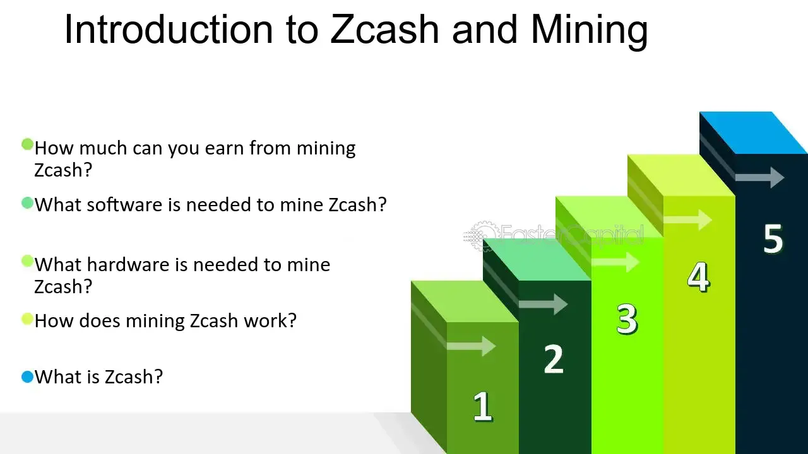

## Table of Contents

## What is ZCash and what is its main purpose?

ZCash is a type of cryptocurrency, similar to Bitcoin, that you can use to buy things or send money to others. It was created to give people more privacy when they use it. The main purpose of ZCash is to let people make transactions without others knowing who is sending or receiving the money. This is different from other cryptocurrencies like Bitcoin, where anyone can see the details of a transaction on a public record called the blockchain.

ZCash uses special technology called "zero-knowledge proofs" to keep transactions private. This technology allows the network to check that a transaction is valid without revealing any details about it. This means that while the total amount of ZCash in circulation is public, the specifics of each transaction stay secret. This makes ZCash useful for people who want to keep their financial activities private.

## Who created ZCash and when was it launched?

ZCash was created by a company called the Electric Coin Company, which was originally known as the Zerocoin Electric Coin Company. The main person behind ZCash is Zooko Wilcox-O'Hearn, who is a well-known figure in the world of cryptocurrency and privacy technology.

ZCash was launched on October 28, 2016. Since then, it has grown in popularity among people who value privacy in their financial transactions. The launch of ZCash brought a new option for those looking to use cryptocurrency with added privacy features.

## How does ZCash differ from other cryptocurrencies like Bitcoin?

ZCash is different from other cryptocurrencies like Bitcoin mainly because it focuses a lot on keeping transactions private. With Bitcoin, anyone can see all the details of a transaction on a public record called the blockchain. This means you can see who sent money, who received it, and how much was sent. But with ZCash, the details of transactions are hidden. It uses something called "zero-knowledge proofs" to make sure transactions are valid without showing any details about them. This means that while people can see that a transaction happened, they can't see who was involved or how much money was moved.

Another way ZCash differs from Bitcoin is in how it was created and who manages it. Bitcoin was created by someone using the name Satoshi Nakamoto, and it's run by a community of people all over the world. ZCash, on the other hand, was created by the Electric Coin Company, led by Zooko Wilcox-O'Hearn. This company plays a big role in managing and developing ZCash. Also, ZCash has a special feature called the "founder's reward," where a part of the new ZCash created goes to the company and its founders for the first four years. Bitcoin doesn't have anything like this.

## What are the key features of ZCash?

ZCash has a few important features that make it different from other cryptocurrencies. One big feature is its focus on privacy. ZCash uses something called "zero-knowledge proofs" to keep transactions private. This means that when you send or receive ZCash, other people can't see who is involved or how much money is being moved. They can only see that a transaction happened. This is different from Bitcoin, where anyone can see all the details of a transaction on a public record.

Another key feature of ZCash is how it was created and is managed. ZCash was made by the Electric Coin Company, led by Zooko Wilcox-O'Hearn. This company plays a big role in running and improving ZCash. Also, ZCash has a special thing called the "founder's reward." For the first four years, a part of the new ZCash that is created goes to the company and its founders. This is different from Bitcoin, which doesn't have anything like this.

## What is the significance of privacy in ZCash?

Privacy is a big deal for ZCash because it lets people keep their money moves secret. When you use ZCash, other people can't see who is sending or getting the money, or how much is being sent. This is different from other cryptocurrencies like Bitcoin, where anyone can see all the details of a transaction on a public record. ZCash uses something called "zero-knowledge proofs" to make sure transactions are valid without showing any details about them. This means you can use ZCash to buy things or send money without worrying about others knowing what you're doing.

This focus on privacy makes ZCash useful for people who want to keep their financial activities private. For example, if you want to buy something without others knowing, ZCash can help you do that. It's also good for people who live in places where the government watches what people do with their money. By using ZCash, they can keep their money safe and private. This privacy feature is what makes ZCash special and different from other cryptocurrencies.

## How does ZCash ensure transaction privacy?

ZCash keeps transactions private by using something called "zero-knowledge proofs." This special technology lets the ZCash network check that a transaction is real and valid without showing any details about it. So, when you send or receive ZCash, other people can see that a transaction happened, but they can't see who was involved or how much money was moved. This is different from other cryptocurrencies like Bitcoin, where anyone can see all the details of a transaction on a public record.

This privacy feature is important because it lets people use ZCash to buy things or send money without others knowing what they're doing. For example, if you want to buy something without anyone finding out, ZCash can help you do that. It's also good for people who live in places where the government watches what people do with their money. By using ZCash, they can keep their financial activities safe and private.

## What is the total supply of ZCash and how is it distributed?

The total supply of ZCash is set to be 21 million coins, just like Bitcoin. This means that over time, the number of ZCash coins that can ever exist will be limited to 21 million. This limit helps to control how much ZCash is out there and can affect its value.

When new ZCash coins are created, they are distributed in a special way. For the first four years, a part of the new coins, called the "founder's reward," goes to the Electric Coin Company and its founders. This is different from other cryptocurrencies. After the first four years, all the new coins go to the people who help run the ZCash network, called miners. Miners are important because they use their computers to check and add transactions to the ZCash network.

## What is the mining process for ZCash and what algorithm does it use?

Mining ZCash is a lot like mining other cryptocurrencies. It's a way to add new ZCash coins to the total supply and to check that transactions are real and valid. People who mine ZCash use special computers to solve hard math problems. When they solve these problems, they can add a group of transactions to the ZCash network and get new ZCash coins as a reward. This process helps keep the ZCash network safe and working well.

ZCash uses a mining algorithm called Equihash. This algorithm is different from the one Bitcoin uses, which is called SHA-256. Equihash was made to be more fair and to stop big mining companies from taking over the network. It's designed so that regular people with normal computers can mine ZCash, not just people with really expensive, special mining machines. This helps keep the ZCash network open to more people and makes it harder for any one group to control it.

## How can someone start mining ZCash and what are the hardware requirements?

To start mining ZCash, you need a computer with the right hardware and software. First, you need to get a computer with a good graphics card, also called a GPU. GPUs are better at solving the math problems needed for mining ZCash than regular computer parts. You can use a regular computer with a good GPU, or you can buy a special mining rig that has several GPUs. Next, you need to download and set up mining software. There are different programs you can use, like EWBF's CUDA Zcash Miner or GMiner. Once you have the software, you connect it to a mining pool, which is a group of miners working together to solve problems and share the rewards.

The hardware requirements for mining ZCash depend on how much you want to mine. A basic setup might just need a computer with a good GPU, like an NVIDIA GTX 1070 or AMD Radeon RX 580. These cards can mine ZCash well and don't cost too much. If you want to mine more ZCash, you might want to get a special mining rig with several GPUs. These rigs can be more expensive, but they can mine a lot more ZCash. You also need to think about the cost of electricity, because mining uses a lot of power. Make sure your computer can stay cool and has enough power to run the GPUs without problems.

## What are the potential risks and challenges associated with mining ZCash?

Mining ZCash can be risky and challenging. One big risk is the cost of electricity. Mining uses a lot of power, and if the cost of electricity is high where you live, it might cost more to mine ZCash than you earn from it. Another risk is that the price of ZCash can go up and down a lot. If the price goes down, you might not make as much money from mining as you hoped. Also, the mining software and hardware can have problems or stop working, which can slow down your mining or stop it completely.

Another challenge is keeping up with the competition. As more people start mining ZCash, it gets harder to solve the math problems and earn rewards. You might need to keep buying new, better hardware to stay competitive, which can be expensive. Also, setting up and running the mining software can be hard if you're not good with computers. You need to make sure everything is working right and that you're connected to a good mining pool. If you don't do this well, you might not mine as much ZCash as you could.

## How does the governance of ZCash work and who controls its development?

The governance of ZCash is managed by the Electric Coin Company, which used to be called the Zerocoin Electric Coin Company. This company was started by Zooko Wilcox-O'Hearn and his team. They are in charge of making decisions about how ZCash works and how it can be improved. The Electric Coin Company also gets a part of the new ZCash coins that are created for the first four years, which is called the "founder's reward." This money helps them pay for the work they do on ZCash.

Even though the Electric Coin Company plays a big role, the ZCash community also has a say in how things are run. They can talk about ideas and vote on changes through online forums and other ways. This helps make sure that the people who use ZCash have a voice in its development. But at the end of the day, the Electric Coin Company has the final say on big decisions about ZCash.

## What are the future prospects and potential developments for ZCash?

The future of ZCash looks promising because it focuses a lot on privacy, which is something more and more people care about. As more people learn about how their money moves can be watched, they might want to use ZCash to keep their transactions secret. This could make ZCash more popular and valuable. Also, the Electric Coin Company, which runs ZCash, is always working on making it better. They are looking at new ways to make ZCash easier to use and more private, which could bring in more users.

One big thing that could happen in the future is that ZCash might be used more by businesses and regular people for everyday buying and selling. If more stores and websites start accepting ZCash, it could become a common way to pay for things. This would make ZCash more useful and could make its value go up. But there are also challenges. The price of ZCash can go up and down a lot, and it has to compete with other cryptocurrencies that also focus on privacy. So, while there are good chances for ZCash to grow, it also has to deal with some tough problems.

## References & Further Reading

[1]: Ben-Sasson, E., Chiesa, A., Garman, C., Green, M., Miers, I., Tromer, E., & Virza, M. (2014). ["Zerocash: Decentralized Anonymous Payments from Bitcoin."](http://zerocash-project.org/media/pdf/zerocash-oakland2014.pdf) IEEE Symposium on Security and Privacy.

[2]: DuPont, Q., & Luciana, A. (2018). ["Zcash: Privacy and Confidentiality."](https://pubmed.ncbi.nlm.nih.gov/29681040/) Springer, Social Semiotics for Financial Communication.

[3]: Biryukov, A., Khovratovich, D., & Nikov, V. (2016). ["Equihash: A New Proof-of-Work Algorithm for Bitcoin."](https://eprint.iacr.org/2015/946) Springer, International Conference on the Theory and Application of Cryptology and Information Security.

[4]: Lopez de Prado, M. (2018). ["Advances in Financial Machine Learning."](https://www.amazon.com/Advances-Financial-Machine-Learning-Marcos/dp/1119482089) Wiley.

[5]: Chan, E. P. (2008). ["Quantitative Trading: How to Build Your Own Algorithmic Trading Business."](https://github.com/ftvision/quant_trading_echan_book) Wiley.