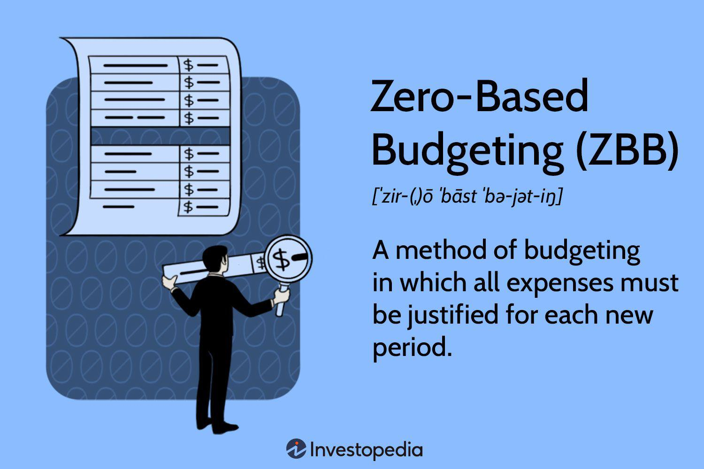

Financial planning remains a cornerstone in navigating personal and organizational financial stability and growth. At its core, effective financial planning involves understanding and controlling expenditures, setting clear financial goals, and aligning resources to support these objectives. This process is vital, not just for ensuring day-to-day financial health but also for making informed decisions that drive long-term success.

One key aspect of financial planning is budgeting—an activity that helps allocate resources efficiently by evaluating income and forecasted expenses. Among various budgeting techniques, zero-based budgeting (ZBB) has gained recognition for its meticulous approach, requiring every expense to be justified for each new period. ZBB is distinguished from traditional budgeting methods by its unique process of building each budget from a base of zero, rather than using previous budgets as a starting point. This helps organizations to focus spending on activities that align with their current goals and eliminate wasteful expenses.



Alongside budgeting advancements, the rise of algorithmic trading has become a significant trend in financial management, offering new opportunities and efficiencies. Algorithmic trading uses sophisticated algorithms and high-speed data analysis to execute trades, presenting a technological edge that can inform strategic investment choices. Understanding algorithmic trading involves grasping its potential to shift investment strategies towards more precise and timely executions.

The intersection of budgeting techniques such as zero-based budgeting and algorithmic trading offers a unique perspective on strategic financial planning. While zero-based budgeting prioritizes resource allocation based on priority and necessity, algorithmic trading emphasizes data-driven investment strategies. Together, they form a comprehensive approach to maximizing financial efficiency and ensuring robust financial health in a rapidly evolving financial environment.

## Table of Contents

## Understanding Budgeting Techniques

Budgeting techniques are a fundamental component in financial planning, setting the groundwork for effective management of income and expenses. These techniques assist individuals and organizations in allocating resources efficiently, ensuring financial health and sustainability.

One of the most commonly used budgeting methods is the traditional incremental budget. This approach involves adjusting the previous year's budget to account for any changes in income or expenses. Incremental budgets are simple to implement and maintain, as they build on existing financial patterns. They are suitable for organizations with stable financial environments, where past financial records are considered a reliable indicator of future needs. However, this method often leads to inefficiencies as it assumes past expenditures are justified without reevaluating their necessity. Consequently, incremental budgeting may perpetuate unnecessary spending or fail to account for changes in the operational landscape.

Zero-based budgeting (ZBB) is an alternative method that eschews the reliance on historical budgets. Instead, ZBB requires that every expense be justified and approved, starting from a "zero base." This technique promotes financial discipline by scrutinizing each expenditure against current organizational goals. Although ZBB can lead to significant cost savings and enhanced allocation of resources, it is labor-intensive and may require substantial time and effort to execute effectively, especially in large organizations.

Priority-based budgeting offers another distinct approach, focusing on aligning budgetary allocations with strategic priorities. This method allows organizations to fund high-impact areas while reducing expenditures on less critical operations. By emphasizing strategic priorities, priority-based budgeting can improve organizational outcomes by ensuring that funds are directed toward initiatives that support core objectives. This method's primary disadvantage is its potential to overlook essential but less visible expenditures that do not directly align with primary strategic goals.

Different budgeting methods cater to varying financial goals and organizational needs. Selecting the appropriate budgeting technique requires a thorough understanding of one's financial environment and strategic objectives. By leveraging the strengths of these methods, organizations and individuals can optimize financial management and enhance overall fiscal performance.

## Zero-Based Budgeting: A Deep Dive

Zero-based budgeting (ZBB) is a financial management tool where every budgeting cycle begins without a predetermined base, necessitating that every expense is justified independently rather than relying on historical expenditure data. This approach stands in contrast to traditional budgeting methods, where past budgets often serve as a baseline, allowing for incremental adjustments. By setting each budget period from a "zero base," ZBB demands a rigorous and detailed assessment of needs and costs, ensuring that every expense is essential and aligned with the organization’s current strategic objectives.

ZBB emphasizes the alignment of spending with organizational goals. It requires organizations to meticulously evaluate their expenditures, fostering a comprehensive understanding of cost drivers and encouraging a culture of efficiency and strategic alignment. This method compels managers to prioritize activities that heavily contribute to organizational success, thus strategically redirecting resources to areas that promise optimal returns.

One of the primary advantages of zero-based budgeting is its ability to identify and eliminate non-essential costs. This sharp focus on essential expenditures aids in the detection of redundant or outdated processes that may have been perpetuated without question under the traditional incremental budgeting approach. By systematically analyzing each aspect of spending, organizations can better allocate resources to high-priority projects, ultimately reducing waste and driving value.

ZBB can be particularly beneficial for companies undergoing significant strategic shifts or aiming for aggressive cost reductions. It enables a granular examination of processes and expenditures, ensuring that funds are allocated exclusively to those functions that align with and promote the overarching strategic plan of the organization. This precise allocation not only supports effective financial planning but also enhances operational efficiency by concentrating efforts and funds where they are most needed.

In practice, implementing zero-based budgeting can be a complex endeavor, requiring a significant time investment from managers and stakeholders to reassess all budget categories. However, the potential gains in terms of cost savings and improved resource allocation often outweigh these challenges, especially for organizations keen on tightly aligning their budgets with their strategic priorities.

Overall, zero-based budgeting provides a robust framework for organizations seeking substantial improvements in efficiency and alignment with strategic goals, making it a powerful tool for enhancing financial and operational performance.

## Comparing Zero-Based and Traditional Budgeting

Traditional budgeting and zero-based budgeting (ZBB) are two contrasting approaches to financial planning, each with its own methodology and implications for financial management. Traditional budgeting is primarily characterized by its reliance on historical data, where budget allocations are often adjusted incrementally based on previous periods. This approach assumes that existing expenses are largely justified and only require minor adjustments to align with inflation or anticipated changes in revenue. However, this reliance on historical precedence can lead to inefficiencies as unnecessary expenditures may perpetuate year on year due to lack of rigorous reevaluation.

In contrast, zero-based budgeting (ZBB) takes a more rigorous and detailed approach. Each budgeting cycle begins from a 'zero base,' meaning that all expenses must be scrutinized and justified irrespective of past allocations. This process involves a comprehensive evaluation of each expenditure, fundamentally questioning its necessity and relevance to the organization's current goals. By requiring justification for every line item, ZBB encourages a deep understanding of costing structures and can lead to more strategic financial decision-making.

One of the critical advantages of ZBB is its potential to enhance strategic financial management. By systematically evaluating expenditures, organizations are compelled to prioritize their spending based on current objectives rather than historical patterns. This can lead to improved allocation of resources, focusing on activities that directly contribute to strategic goals while eliminating inefficiencies.

However, the implementation of ZBB is notably more time-intensive compared to traditional budgeting methods. The meticulous evaluation and approval process required for each expense demands significant investment in time and resources. This aspect of ZBB, while demanding, provides an opportunity for fostering innovation within the organization. By questioning the necessity of each expense, organizations are encouraged to explore innovative solutions and alternatives, possibly leading to more cost-effective operations and improved financial health.

In summary, while traditional budgeting offers a more straightforward and less time-consuming process, it risks perpetuating inefficiencies due to its reliance on historical spending patterns. Zero-based budgeting, though more demanding in terms of time and resources, offers a methodology that can significantly optimize expenditures and strategically align financial resources with the organization's current objectives. The choice between these budgeting approaches requires careful consideration of an organization's capacity for detailed financial analysis and its strategic priorities.

## Zero-Based Budgeting in Practice: Advantages and Disadvantages

Zero-based budgeting (ZBB) presents numerous advantages, making it an attractive option for organizations seeking efficient financial management. One of its primary benefits is its ability to generate significant cost savings. By starting each budget cycle from scratch, ZBB compels organizations to scrutinize and justify every expense, which can lead to the identification and elimination of unnecessary costs. This meticulous process ensures that funds are allocated only to those activities that align with current strategic priorities, fostering better resource allocation.

Moreover, ZBB enhances strategic awareness. As each expense must be justified based on its contribution to organizational goals, decision-makers are encouraged to reevaluate priorities constantly. This process helps ensure that spending aligns with the most pressing needs and strategic objectives, which can result in improved organizational focus and agility.

Despite these advantages, zero-based budgeting is not without its challenges. The method can be notably time-consuming, as the process requires a detailed analysis of expenditures at every budgeting cycle. This complexity can strain an organization's resources, particularly if there is insufficient expertise or capacity to conduct thorough reviews. Another potential drawback is the risk of resource misallocation. If the justification process is not thorough or objective, critical activities may be underfunded, or resources might be diverted to less impactful areas.

The complexity and time requirements of ZBB may deter some organizations from adopting it. Successful implementation of zero-based budgeting depends significantly on the organization's capacity to invest necessary time and resources into the budgeting process. It requires efficient communication channels and a culture open to change, which can be demanding for some organizations.

Ultimately, determining whether the benefits of ZBB outweigh its challenges hinges on several factors. Organizations must evaluate their ability to commit to the comprehensive analysis required by ZBB, and they must consider whether they possess the necessary expertise and resources to execute this budgeting technique effectively. Those that do so may find in zero-based budgeting a powerful tool to enhance financial discipline and strategic alignment.

## Algorithmic Trading and Financial Planning

Algorithmic trading involves the use of complex computer algorithms to facilitate trading decisions and execute trades at speeds and frequencies that would be difficult for human traders to achieve. This technique capitalizes on the computational power to process vast amounts of market data, identifying profitable opportunities and executing trades based on pre-determined criteria. These criteria are typically rooted in quantitative models that analyze historical data and market trends. 

Integrating [algorithmic trading](/wiki/algorithmic-trading) into financial planning necessitates a comprehensive understanding of market dynamics, risk management, and operational precision. Successful implementation involves designing algorithms that can accurately predict market behaviors, manage exposure to risk, and execute trades efficiently. By reducing the cognitive and emotional biases that can cloud human judgment, algorithmic trading systems are often better positioned to make objective and timely investment decisions.

For both organizations and individuals, the benefits of leveraging algorithmic trading are significant. Access to algorithmic trading can lead to improved decision-making speed, reduced transaction costs, and the ability to process information more accurately than manual trading methods. Organizations can optimize their portfolios by continuously analyzing market data to adjust investment strategies dynamically. Individuals, too, can gain competitive advantages by using algorithms to capitalize on fleeting market opportunities that human traders might miss due to slower reaction times. Advanced programming languages like Python are often employed to develop these algorithms due to their extensive libraries and ease of use for data analysis. Here is a simple example of a Python function that could form the basis of a basic trading algorithm:

```python
def simple_moving_average(data, period):
    return sum(data[-period:]) / period

def trading_signal(prices, short_period, long_period):
    short_avg = simple_moving_average(prices, short_period)
    long_avg = simple_moving_average(prices, long_period)

    if short_avg > long_avg:
        return "Buy"
    elif short_avg < long_avg:
        return "Sell"
    else:
        return "Hold"

# Example usage:
# prices = [price_data]
# signal = trading_signal(prices, short_period=5, long_period=20)
```

Incorporating such algorithmic strategies into financial planning frameworks ensures that organizations and individuals can react swiftly to market changes, optimizing their investment performance through informed and efficient trading strategies. As technology continues to advance, the role of algorithmic trading in financial planning is anticipated to grow, demanding ongoing adaptation and innovation in trading algorithms and risk management protocols.

## How Zero-Based Budgeting Supports Algorithmic Trading Strategies

Zero-based budgeting (ZBB) offers a comprehensive framework for identifying and effectively allocating resources necessary for developing algorithmic trading strategies. By emphasizing a meticulous assessment and validation of each expense, ZBB ensures alignment with strategic goals, which can significantly enhance technological and data analysis capabilities critical for algorithmic trading.

Algorithmic trading relies heavily on cutting-edge technology and sophisticated data analysis. The primary costs associated with these strategies include acquiring and maintaining advanced computing infrastructure, purchasing or developing trading software, and obtaining high-quality financial data. Zero-based budgeting assists organizations in justifying these costs by ensuring that every dollar spent contributes directly to achieving strategic objectives. This approach encourages a systematic evaluation of the necessary technology investments, leading to better resource allocation that supports algorithmic trading.

Furthermore, ZBB promotes financial discipline by preventing unnecessary expenditures, which can be redirected to enhance trading strategies. By meticulously reviewing and justifying each financial commitment, organizations can channel savings into critical areas such as research and development of new trading algorithms, hiring skilled personnel, and ongoing training. This targeted investment can lead to more robust and innovative trading systems.

An effectively implemented zero-based budget can significantly optimize trading strategies and lead to superior financial performance. By fostering a culture of fiscal responsibility and targeted investment, ZBB aids in the development of precise, adaptive, and efficient algorithmic trading strategies. This ensures that resources are not only optimally utilized but also aligned with the trading goals, ultimately contributing to better financial results.

In conclusion, the strategic alignment and resource optimization framework provided by zero-based budgeting can profoundly support algorithmic trading capabilities, allowing organizations to innovate and excel in competitive financial markets.

## Conclusion

Incorporating budgeting techniques alongside advanced trading strategies significantly improves financial management and investment efficiency. Zero-based budgeting (ZBB) stands out as a powerful framework, pushing both organizations and individuals to scrutinize every financial outlay. By mandating that each expense be justified from the ground up, ZBB ensures that resources are meticulously aligned with strategic objectives. This rigorous approach eliminates unnecessary costs, supporting a lean operating model that maximizes financial performance.

Further, the adaptability provided by ZBB is crucial in a rapidly evolving financial landscape. It necessitates a commitment to detailed planning and continuous reassessment, ensuring that budgets remain relevant amidst economic shifts. This method complements advanced trading strategies, such as algorithmic trading, by allowing for strategic resource allocation and fostering an environment where adaptive decision-making can thrive.

In essence, the integration of disciplined budgeting with cutting-edge trading technologies can lead to optimized financial strategies and superior investment outcomes. The key lies in the ongoing evaluation, ensuring that financial plans are not only current but also primed to leverage emerging opportunities and innovations in finance. Adapting these methodologies empowers organizations and individuals to navigate and succeed in the dynamic financial environment.

## References & Further Reading

[1]: ["Zero-Base Budgeting: A Practical Management Tool for Evaluating Expenses"](https://books.google.com/books/about/Zero_base_Budgeting.html?id=EYV8NNMAJ00C) by Peter A. Pyhrr

[2]: ["Implementing Zero-based Budgeting at a Technology Company"](https://www.mckinsey.com/capabilities/operations/our-insights/zero-based-budgeting-then-and-now-technology-remakes-the-zbb-rules) from Harvard Business Review

[3]: "Caloia, A. M. (2019). [Zero-Based Budgeting in the New Health Economy: Proven Techniques from Cognizant and Other Leading Companies.](https://onlinelibrary.wiley.com/doi/10.1111/acfi.12884)"

[4]: ["Advances in Financial Machine Learning"](https://www.amazon.com/Advances-Financial-Machine-Learning-Marcos/dp/1119482089) by Marcos Lopez de Prado

[5]: ["Machine Learning for Algorithmic Trading"](https://github.com/stefan-jansen/machine-learning-for-trading) by Stefan Jansen

[6]: ["Quantitative Trading: How to Build Your Own Algorithmic Trading Business"](https://www.amazon.com/Quantitative-Trading-Build-Algorithmic-Business/dp/1119800064) by Ernest P. Chan

[7]: ["Evidence-Based Technical Analysis: Applying the Scientific Method and Statistical Inference to Trading Signals"](https://www.semanticscholar.org/paper/Evidence-Based-Technical-Analysis%3A-Applying-the-and-Aronson/3b33df8737f1772e9e14d66a08c9696f140a2ee1) by David Aronson