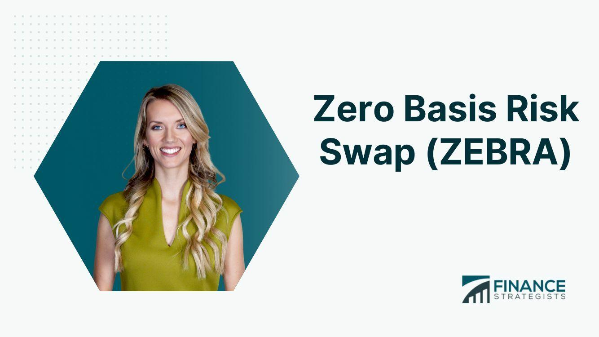

## Table of Contents

## What is a Zero Basis Risk Swap (ZEBRA)?

A Zero Basis Risk Swap, often called ZEBRA, is a type of financial agreement where two parties exchange cash flows based on different interest rates, but with a twist. Unlike regular swaps, a ZEBRA is designed to eliminate the risk that comes from the difference between the two rates, known as basis risk. This means that if one rate goes up or down, the other rate will move in a way that keeps the overall value of the swap stable for both parties.

ZEBRAs are often used by companies and investors who want to manage their interest rate exposure without worrying about the ups and downs of the market. For example, a company might use a ZEBRA to lock in a fixed interest rate on a loan, while still benefiting from any changes in the floating rate. This can help them plan their finances better and avoid unexpected costs.

## How does a ZEBRA differ from traditional swaps?

A ZEBRA, or Zero Basis Risk Swap, is different from traditional swaps because it takes away the risk that comes from the difference between the two interest rates being swapped. In a regular swap, if one rate goes up and the other goes down, one party might end up losing money. But with a ZEBRA, the swap is set up so that any changes in one rate are balanced out by changes in the other rate. This means that both parties can feel more secure, knowing that the value of their swap won't change unexpectedly.

Traditional swaps are often used to change the type of [interest rate](/wiki/interest-rate-trading-strategies) a company or investor is exposed to, like switching from a floating rate to a fixed rate. While these swaps can help manage interest rate risk, they still leave room for basis risk, which is the risk that the difference between the two rates will change. A ZEBRA, on the other hand, is specifically designed to eliminate this basis risk, making it a more stable option for those who want to avoid the ups and downs of the market.

## What are the primary benefits of using a ZEBRA?

The main benefit of using a ZEBRA is that it removes the worry about basis risk. Basis risk is when the difference between two interest rates changes, which can cause problems in regular swaps. With a ZEBRA, if one rate goes up or down, the other rate moves in a way that keeps the swap's value steady. This makes it easier for companies and investors to plan their finances without unexpected surprises.

Another big advantage of ZEBRAs is that they help companies and investors manage their interest rate exposure more safely. For example, a company might want to switch from a floating interest rate to a fixed one to avoid rate changes. A ZEBRA lets them do this without the risk that comes from the difference between the rates. This stability can be really helpful for budgeting and planning, especially in uncertain economic times.

## Who typically uses ZEBRA swaps and why?

Companies and big investors often use ZEBRA swaps. They like them because ZEBRAs help them manage their money without worrying about the ups and downs of interest rates. For example, a company might have a loan with a floating interest rate, which can change and make it hard to plan their budget. By using a ZEBRA, they can switch to a fixed rate and know exactly what they'll pay each month, without the risk that the difference between the rates will cause problems.

Financial institutions, like banks, also use ZEBRAs. They use them to help their clients manage interest rate risk and to make their own financial planning more stable. Banks might offer ZEBRAs to companies that want to protect themselves from rate changes. This not only helps the companies but also makes the banks look good because they're providing a useful service. Plus, banks can use ZEBRAs themselves to balance out their own interest rate risks, making their operations smoother and more predictable.

## Can you explain the mechanics of a ZEBRA swap?

A ZEBRA swap works by having two parties agree to exchange cash flows based on different interest rates, but with a special feature that keeps things balanced. Let's say one party has a loan with a floating interest rate, and they want to switch to a fixed rate. They enter into a ZEBRA swap with another party who agrees to pay them the floating rate they would have paid on their loan. In return, the first party pays the second party a fixed rate. The key thing about a ZEBRA is that it's set up so that any changes in the floating rate are matched by changes in the fixed rate, keeping the swap's value steady for both parties.

This balancing act is done by carefully choosing the rates and terms of the swap. If the floating rate goes up, the fixed rate will also adjust in a way that keeps the overall value of the swap the same. This means that neither party has to worry about losing money if interest rates move unexpectedly. By using a ZEBRA, companies and investors can switch between floating and fixed rates without the risk that comes from the difference between the rates changing. This makes their financial planning easier and more predictable.

## What are the key components of a ZEBRA agreement?

A ZEBRA agreement has a few main parts that make it work. First, there are two parties who agree to swap cash flows based on different interest rates. One party might have a loan with a floating interest rate and wants to switch to a fixed rate. The other party agrees to pay the floating rate in exchange for receiving a fixed rate. The key thing is that the rates are chosen carefully so that any changes in the floating rate are matched by changes in the fixed rate.

The second important part is how the rates are set up to balance each other out. If the floating rate goes up, the fixed rate will adjust in a way that keeps the overall value of the swap the same. This means that neither party has to worry about losing money if interest rates move unexpectedly. By using a ZEBRA, companies and investors can switch between floating and fixed rates without the risk that comes from the difference between the rates changing.

## How is risk managed in a ZEBRA swap?

In a ZEBRA swap, risk is managed by making sure that any changes in one interest rate are balanced out by changes in the other rate. This means that if the floating rate goes up, the fixed rate will also go up in a way that keeps the swap's value the same for both parties. This special setup takes away the worry about basis risk, which is the risk that comes from the difference between the two rates changing.

By using a ZEBRA, companies and investors can switch between floating and fixed rates without the risk that comes from the difference between the rates changing. This makes their financial planning easier and more predictable. They don't have to worry about losing money if interest rates move unexpectedly, which helps them manage their money better.

## What are the potential drawbacks or risks associated with ZEBRA swaps?

Even though ZEBRA swaps are designed to take away the risk that comes from the difference between two interest rates, they still have some potential drawbacks. One big issue is that they can be more complicated to set up than regular swaps. This means that companies and investors might need to spend more time and money to understand and use them properly. Also, because ZEBRAs are less common than regular swaps, it might be harder to find someone to swap with, which can make things more difficult.

Another risk is that while ZEBRAs protect against basis risk, they don't protect against other types of risks. For example, if a company uses a ZEBRA to switch from a floating rate to a fixed rate, they might still face credit risk, which is the risk that the other party in the swap won't be able to pay. Also, if interest rates change a lot, the fixed rate in the ZEBRA might end up being higher than the floating rate would have been, which could cost the company more money in the long run.

## How do regulatory environments affect ZEBRA swaps?

Regulatory environments can have a big impact on ZEBRA swaps. Different countries have different rules about how swaps can be used and who can use them. For example, some places might require companies to report their swaps to a special agency, which can make things more complicated and expensive. Also, regulations might limit who can enter into a ZEBRA swap, like only allowing big banks or certain types of investors. This can make it harder for smaller companies to use ZEBRAs to manage their interest rate risk.

On top of that, changes in regulations can affect how ZEBRAs are set up and used. If a government decides to change the rules about swaps, companies might have to adjust their ZEBRA agreements to follow the new rules. This can be a lot of work and might even make ZEBRAs less useful for some companies. So, it's important for anyone thinking about using a ZEBRA to keep an eye on the regulatory environment and be ready to make changes if needed.

## What are some real-world examples of ZEBRA swaps in action?

A big company called ABC Corp had a loan with a floating interest rate. They were worried that if the rate went up, their loan payments would get too expensive. So, they used a ZEBRA swap to switch to a fixed rate. They found another company, XYZ Inc, that agreed to pay them the floating rate they would have paid on their loan. In return, ABC Corp paid XYZ Inc a fixed rate. Because it was a ZEBRA swap, if the floating rate went up, the fixed rate would also go up in a way that kept the swap's value the same for both companies. This helped ABC Corp plan their budget better without worrying about the ups and downs of interest rates.

Another example is a bank called Bank of Trust. They wanted to help their clients manage interest rate risk better. So, they started offering ZEBRA swaps to companies that had loans with floating rates. One of their clients, a small business called Happy Bakery, used a ZEBRA swap to switch to a fixed rate. This made it easier for Happy Bakery to plan their finances because they knew exactly what their loan payments would be each month. Bank of Trust also used ZEBRA swaps themselves to balance out their own interest rate risks, making their operations smoother and more predictable.

## How can one assess the performance of a ZEBRA swap?

To assess the performance of a ZEBRA swap, you need to look at how well it's doing its main job: keeping the value of the swap steady for both parties. This means checking if the swap is really taking away the risk that comes from the difference between the two interest rates. If the floating rate goes up and the fixed rate goes up in a way that keeps the swap's value the same, then the ZEBRA is working well. You can do this by comparing the cash flows from the swap to what would have happened without it. If the swap is helping the company or investor manage their interest rate risk without unexpected surprises, then it's performing well.

Another way to assess the performance is by looking at the costs and benefits of using the ZEBRA. This includes the fees for setting up and managing the swap, as well as any savings or extra costs that come from switching between floating and fixed rates. If the benefits of using the ZEBRA, like having a more predictable budget, outweigh the costs, then the swap is performing well. It's also important to consider how easy it is to find someone to swap with and how the regulatory environment might affect the swap. If all these things are working in favor of the company or investor, then the ZEBRA swap is doing its job effectively.

## What advanced strategies can be employed with ZEBRA swaps for expert users?

Expert users can use ZEBRA swaps in smart ways to manage their money better. One strategy is to use ZEBRAs along with other financial tools, like options or futures, to create a full plan for handling interest rate risk. For example, a company might use a ZEBRA to switch to a fixed rate on one loan, while using options to protect against big changes in another loan's floating rate. This mix of tools can help them cover all their bases and make their financial planning even more stable.

Another advanced strategy is to use ZEBRAs to take advantage of differences in interest rates between different markets or countries. A big investor might use a ZEBRA to swap a floating rate in one country for a fixed rate in another country where rates are expected to stay the same. This can help them make money from the difference in rates while still keeping their overall risk low. By thinking carefully about how to use ZEBRAs in different situations, expert users can find new ways to manage their money and make the most of their investments.

## References & Further Reading

[1]: Dodd, R. (2001). ["The Economic Rationale for the Swap Market."](https://www.semanticscholar.org/paper/The-Economic-Rationale-for-Financial-Market-Randall-Dodd/e02034c8c970bdd9959b9906fb2176565d5161c4) Financial Policy Forum Derivatives Study Center.

[2]: ["Interest Rate Swap: Financial Models, Valuation and Applications"](https://www.iotafinance.com/en/Article-Interest-rate-swaps.html) by Howard Corb

[3]: ["Risk Management and Financial Institutions"](https://www.simonfoucher.com/MBA/FINA%20695%20-%20Risk%20Management/riskmanagementandfinancialinstitutions4theditionjohnhull-150518225205-lva1-app6892.pdf) by John C. Hull

[4]: Duffie, D., & Singleton, K. J. (1997). ["An Econometric Model of the Term Structure of Interest-Rate Swap Yields."](https://www.jstor.org/stable/2329437?item_view=read_online) Journal of Finance.

[5]: ["Interest Rate Swaps and Their Derivatives"](http://students.aiu.edu/submissions/profiles/resources/onlineBook/N2D3C5_Interest_Rate_Swaps_and_Their_Derivatives.pdf) by Amir Sadr