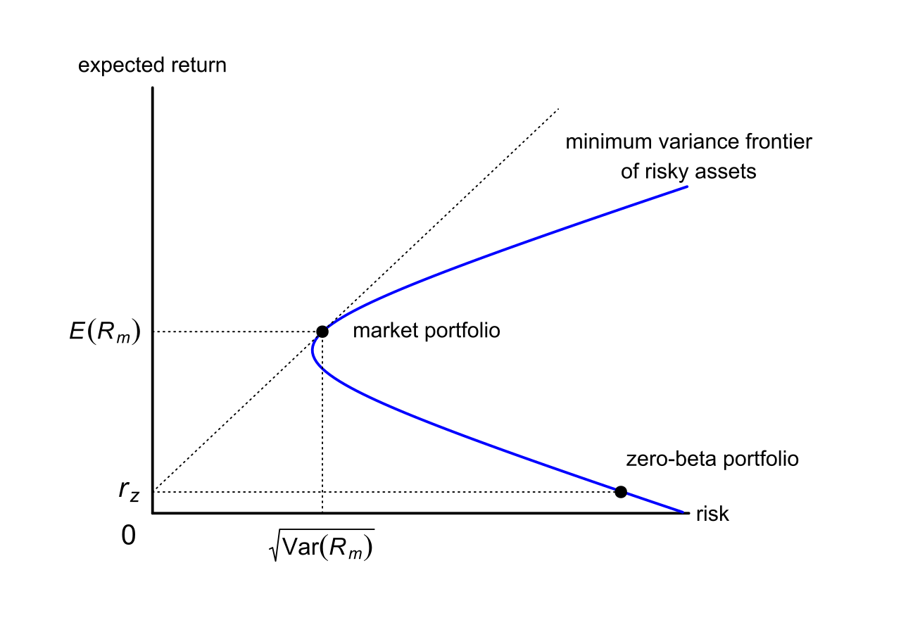

## Table of Contents

## What is a zero-beta portfolio?

A zero-beta portfolio is a type of investment strategy where the overall risk, or beta, of the portfolio is zero. Beta measures how much a stock or a portfolio moves in relation to the market. A zero-beta portfolio is designed so that its performance does not depend on the movements of the overall market. This means that if the market goes up or down, the value of a zero-beta portfolio should stay the same.

Creating a zero-beta portfolio involves balancing assets that have positive and negative betas. For example, you might include stocks that tend to go up when the market goes up (positive beta) and stocks that tend to go up when the market goes down (negative beta). By carefully selecting and weighting these assets, investors can create a portfolio that has a net beta of zero. This can be useful for investors who want to avoid market risk and focus on other types of investment strategies.

## How does a zero-beta portfolio relate to market risk?

A zero-beta portfolio is designed to have no market risk. Market risk is the risk that comes from the overall movements of the market, like when the stock market goes up or down. A zero-beta portfolio is made so that it doesn't move with these market changes. This means that if the market goes up, the value of the zero-beta portfolio doesn't go up, and if the market goes down, the value of the zero-beta portfolio doesn't go down either.

To create a zero-beta portfolio, you need to balance assets that go up when the market goes up with assets that go up when the market goes down. This balance makes sure the overall beta of the portfolio is zero. By doing this, investors can avoid the ups and downs of the market and focus on other ways to make money from their investments. This can be really helpful for people who want to keep their investments safe from big swings in the market.

## What are the main components of a zero-beta portfolio?

The main components of a zero-beta portfolio are assets that have different reactions to the market. Some of these assets go up when the market goes up, and these are called positive beta assets. Other assets go up when the market goes down, and these are called negative beta assets. By including both types of assets in the portfolio, investors can balance out the effects of market movements. This balance helps the portfolio have a beta of zero, meaning it doesn't move with the market.

For example, a zero-beta portfolio might include stocks of companies that do well even when the economy is struggling, like utility companies or consumer staples. These stocks often have negative betas because they can go up when the market goes down. On the other hand, the portfolio might also include stocks of tech companies or [growth stocks](/wiki/growth-stocks) that tend to go up when the market is doing well. By carefully choosing and balancing these different types of stocks, investors can create a portfolio that stays stable no matter what the market does.

## How can one construct a zero-beta portfolio?

To build a zero-beta portfolio, you need to mix different types of investments that react differently to the market. Some investments, like tech stocks, go up when the market goes up. These are called positive beta assets. Other investments, like utility stocks or certain bonds, might go up when the market goes down. These are called negative beta assets. By putting both kinds of investments in your portfolio, you can balance them out so that the whole portfolio doesn't move with the market.

The key is to figure out how much of each type of investment you need. You might start by looking at the beta of each investment. If a stock has a beta of 1.5, it moves 1.5 times as much as the market. If another stock has a beta of -0.5, it moves in the opposite direction of the market by half as much. By choosing the right mix of these investments, you can make the overall beta of your portfolio equal to zero. This means your portfolio won't go up or down just because the market does.

## What are the benefits of investing in a zero-beta portfolio?

Investing in a zero-beta portfolio can help you avoid the ups and downs of the market. When the market goes up or down, a zero-beta portfolio stays the same. This can be really helpful if you want to keep your investments safe from big market swings. It's like having a steady boat in a stormy sea. If you're worried about losing money when the market drops, a zero-beta portfolio can give you peace of mind.

Another benefit of a zero-beta portfolio is that it lets you focus on other ways to make money from your investments. Since the portfolio doesn't move with the market, you can look at other things like how well the companies in your portfolio are doing or how much money they're making. This can be a good way to find investments that are doing well, even if the market isn't. By not worrying about market risk, you can make better decisions about where to put your money.

## Can a zero-beta portfolio completely eliminate risk?

A zero-beta portfolio can't completely get rid of all risk. It's made to not move with the market, which means it doesn't have market risk. But there are other kinds of risks that it can't stop. For example, there's the risk that the companies in your portfolio might not do well, even if the market is doing okay. This is called company-specific risk. Also, there's the risk that you might need to sell your investments when they're not worth as much as you hoped. This is called [liquidity](/wiki/liquidity-risk-premium) risk.

Even though a zero-beta portfolio can help you avoid market ups and downs, it still has other risks. For instance, if you put money into bonds to balance out your stocks, there's still a chance that the bond issuer might not be able to pay you back. This is called credit risk. So, while a zero-beta portfolio can make your investments more stable, it can't make them completely safe. You always need to think about other kinds of risks when you're investing.

## How does a zero-beta portfolio perform in different market conditions?

A zero-beta portfolio is made to stay the same no matter what the market does. If the market goes up, a zero-beta portfolio doesn't go up with it. If the market goes down, the zero-beta portfolio doesn't go down either. This means that in both good and bad market conditions, the value of a zero-beta portfolio stays pretty much the same. This can be really helpful if you want to keep your investments safe from big swings in the market.

However, a zero-beta portfolio doesn't make money from market changes. If the market is doing really well, other investors might be making a lot of money, but your zero-beta portfolio won't be going up. On the other hand, if the market is doing badly, other investors might be losing a lot of money, but your zero-beta portfolio will stay the same. So, while a zero-beta portfolio protects you from market risk, it also means you won't benefit from good market conditions.

## What are the limitations of a zero-beta portfolio?

A zero-beta portfolio can't make you money when the market is doing well. If the stock market goes up a lot, other people might be making a lot of money, but your zero-beta portfolio will stay the same. This means you miss out on the chance to make more money when the market is good. Also, even though a zero-beta portfolio doesn't move with the market, it can still lose money if the companies you invest in do badly. This is called company-specific risk, and it's something you can't avoid with a zero-beta portfolio.

Another problem with a zero-beta portfolio is that it might be hard to keep it at zero-beta. The beta of different investments can change over time, so you need to keep checking and changing your portfolio to make sure it stays balanced. This can be a lot of work and might cost you money in fees or time. Plus, while a zero-beta portfolio can protect you from market risk, it can't protect you from other kinds of risks, like the risk that you might need to sell your investments when they're not worth as much as you hoped. So, even though a zero-beta portfolio can help keep your investments safe from market swings, it's not a perfect solution.

## How do zero-beta portfolios fit into modern portfolio theory?

Modern portfolio theory is all about balancing risk and reward in your investments. It says that you can lower the risk of your whole portfolio by mixing different kinds of investments. A zero-beta portfolio fits into this theory because it helps you avoid market risk. By not moving with the market, a zero-beta portfolio can make your overall investments more stable. This can be really helpful if you want to keep your investments safe from big market swings.

But a zero-beta portfolio isn't the whole answer. Modern portfolio theory also says that you should think about how much risk you're willing to take and how much reward you want. A zero-beta portfolio can't make you money when the market is doing well, so you might miss out on some rewards. You might want to mix a zero-beta portfolio with other kinds of investments that do move with the market. This way, you can balance the safety of a zero-beta portfolio with the chance to make more money when the market is good.

## What are the tax implications of investing in a zero-beta portfolio?

When you invest in a zero-beta portfolio, you need to think about how it might affect your taxes. If you buy and sell investments a lot to keep your portfolio at zero-beta, you might have to pay taxes on any profits you make. These profits are called capital gains. If you hold onto your investments for less than a year before selling them, the capital gains are taxed at a higher rate than if you hold them for more than a year. So, if you're always changing your investments to keep your portfolio balanced, you might end up paying more in taxes.

Also, the types of investments you put in your zero-beta portfolio can affect your taxes. For example, if you use bonds or other fixed-income investments to balance out your stocks, the interest you earn from these investments is usually taxed as regular income. This can be at a higher rate than the tax on long-term capital gains from stocks. So, even though a zero-beta portfolio can help you avoid market risk, you need to think about how it might increase your tax bill.

## How can zero-beta portfolios be used in conjunction with other investment strategies?

Zero-beta portfolios can be a helpful part of a bigger investment plan. They can work well with other strategies because they don't move with the market. For example, you might use a zero-beta portfolio to keep some of your money safe while you try riskier investments with the rest. If the market goes down, your zero-beta portfolio won't lose money, so it can protect your overall investments. This can give you the confidence to take more risks with other parts of your portfolio, knowing that you have a stable base.

Another way to use zero-beta portfolios is to balance out other investments that do move with the market. For instance, you might have some stocks that go up when the market goes up. By adding a zero-beta portfolio, you can make your whole investment plan more stable. This way, you can still make money when the market is doing well, but you won't lose as much if the market goes down. It's like having a safety net that lets you try different strategies without worrying too much about market swings.

## What advanced techniques can be used to optimize a zero-beta portfolio?

To make a zero-beta portfolio even better, you can use something called regression analysis. This is a fancy way of figuring out how much each investment in your portfolio affects its overall beta. By using regression analysis, you can see which investments are making your portfolio move with the market and which ones are keeping it steady. Then, you can change how much of each investment you have to make sure your portfolio stays at zero-beta. This can be a lot of work, but it helps you keep your investments safe from market ups and downs.

Another advanced technique is called dynamic rebalancing. This means you keep checking your portfolio and making changes to keep it at zero-beta. The market changes all the time, so the beta of your investments can change too. By using dynamic rebalancing, you can adjust your portfolio to make sure it stays balanced. This can be really helpful because it helps you stay on top of things and keep your investments safe. But it can also be a lot of work and might cost you money in fees or time.

## What is the understanding of Zero-Beta Portfolios?

A zero-beta portfolio is an investment portfolio that exhibits no sensitivity to market movements, effectively achieving a zero correlation with the overall market. This characteristic is quantified by a beta value of zero. In finance, beta measures the volatility or systematic risk of a portfolio compared to the broader market. By having a beta of zero, the portfolio is constructed such that its returns are entirely independent of market fluctuations. This independence is typically achieved through a strategic combination of assets whose individual beta values offset each other to result in a portfolio with an overall beta of zero.

The significance of having a beta of zero lies in the elimination of systematic risk. Systematic risk, also known as market risk, refers to the risk inherent to the entire market or market segment. It cannot be eliminated through diversification within a single market. However, by creating a zero-beta portfolio, investors can effectively neutralize this risk, as their portfolio returns are not correlated with market-wide movements. This makes zero-beta portfolios particularly appealing for risk-averse investors seeking stability in returns regardless of market conditions.

Zero-beta portfolios offer similar expected returns to risk-free investments due to their lack of market risk exposure. According to the Capital Asset Pricing Model (CAPM), the expected return on a portfolio can be expressed as:

$$
E(R_p) = R_f + \beta_p(E(R_m) - R_f)
$$

where $E(R_p)$ is the expected return of the portfolio, $R_f$ is the risk-free rate, $E(R_m)$ is the expected market return, and $\beta_p$ is the portfolio beta. For a zero-beta portfolio, $\beta_p = 0$, simplifying the equation to:

$$
E(R_p) = R_f
$$

Hence, a zero-beta portfolio is designed to generate returns equivalent to the risk-free rate, as any excess returns associated with market risk are eliminated. This aligns with the theoretical expectation that such portfolios should deliver returns similar to those of risk-free investments, positioning them as a conservative option for investors prioritizing risk mitigation over higher, riskier returns.

## What are the components of a Zero-Beta Portfolio?

A zero-beta portfolio is constructed with the goal of isolating investments from systematic market risk. Achieving a beta—the measure of an asset's [volatility](/wiki/volatility-trading-strategies) relative to the overall market—of zero means that the portfolio's returns are uncorrelated with market movements, effectively eliminating exposure to general market risks. Successfully building such a portfolio requires careful selection of assets with appropriate beta characteristics and thoughtful diversification strategies.

### Asset Selection for Zero-Beta Portfolios

To form a zero-beta portfolio, investors typically select a variety of assets, including stocks, bonds, and commodities. Stocks that exhibit low or negative beta values are primary candidates. Low-beta stocks generally experience less market volatility, whereas negative-beta stocks can move inversely to the market. Bonds, particularly those with fixed returns and low sensitivity to market fluctuations, often align well with the zero-beta goal. Commodities can also contribute if they exhibit a stable or inverse relationship with market indices.

#### Criteria for Asset Selection

The selection of assets focuses on identifying those with specific beta values. The beta coefficient ($\beta$) is calculated using the following formula:

$$
\beta = \frac{\text{Cov}(R_i, R_m)}{\text{Var}(R_m)}
$$

where $R_i$ represents the return of the individual asset, and $R_m$ represents the return of the market. Assets with a $\beta$ close to zero are preferred. Financial databases and tools such as Bloomberg Terminal and Yahoo Finance can provide these beta values, or they can be calculated using statistical software like Python:

```python
import numpy as np

# Assume returns_i and returns_m are numpy arrays of an asset's returns and market returns respectively
cov_matrix = np.cov(returns_i, returns_m)
beta = cov_matrix[0, 1] / np.var(returns_m)
```

Investors may also look for inverse-reactive assets to balance out positive-beta stocks within the portfolio.

### Role of Diversification

Diversification is a critical component in constructing a zero-beta portfolio. By combining multiple low and negative-beta assets, the overall risk is spread across different sources of returns, mitigating single-asset risk. This diversification reduces the portfolio's susceptibility to specific sector or asset class volatility, enabling the ensemble of assets to achieve lower aggregate market correlation.

An optimally diversified portfolio is less likely to undergo large fluctuations from individual market shifts, as gains from some assets can offset losses from others. Portfolio optimization techniques, including mean-variance optimization, can aid in determining the optimal asset weights to achieve a zero-beta profile. These techniques involve solving the following optimization problem:

$$
\min_w \left( \frac{1}{2}w^T \Sigma w \right), \quad \text{subject to } w^T \beta = 0
$$

where $w$ is the vector of asset weights, and $\Sigma$ is the covariance matrix of asset returns.

By meticulously selecting appropriate assets and employing strategic diversification, investors can construct effective zero-beta portfolios that manage market risk efficiently, providing a stable investment strategy across various economic conditions.

## How can one construct a zero-beta portfolio?

Constructing a zero-beta portfolio involves a methodical process that relies heavily on quantitative analysis to ensure that the portfolio's beta, which measures its sensitivity to market movements, remains effectively neutral, or zero. Below is a step-by-step overview of how to build this type of portfolio.

### Step 1: Asset Selection

The first step in constructing a zero-beta portfolio is selecting assets with low or negative beta values. Beta is a measure of an asset’s volatility in relation to the overall market, hence assets with beta close to zero are ideal. These assets can include stocks, bonds, and commodities. The selection process requires analyzing historical beta values, which can typically be obtained from financial databases. The goal is to identify a diverse set of assets that, when combined, produce a portfolio with an overall beta as close to zero as possible.

### Step 2: Quantitative Analysis and Model Building

Quantitative models are utilized to calculate the expected return, variance, and covariance of the selected assets. One common approach is the use of a multi-[factor](/wiki/factor-investing) model that includes the market index and other relevant factors affecting the assets. Here's a simple Python example using basic libraries for initial computational purposes:

```python
import numpy as np
import pandas as pd
from sklearn.linear_model import LinearRegression

# Example of fitting a linear regression to find beta values of individual assets
returns = pd.DataFrame(...)  # Load your asset returns data
market_returns = pd.Series(...)  # Load market returns data

# Compute betas
betas = []
for asset in returns.columns:
    model = LinearRegression().fit(market_returns.values.reshape(-1, 1), returns[asset].values)
    betas.append(model.coef_[0])

# Betas now contain the beta values for each asset
```

### Step 3: Portfolio Optimization

Optimization algorithms play a critical role in constructing a zero-beta portfolio. These algorithms, such as Mean-Variance Optimization (MVO) or more advanced techniques like Monte Carlo simulations, help determine the optimal weight of each asset to achieve the desired beta while maximizing returns or minimizing risk.

One optimization method involves solving the following optimization problem:

$$
\min_{w} \; \frac{1}{2} w^T \Sigma w \quad \text{subject to} \quad w^T\beta = 0, \; \sum w_i = 1, \; w_i \geq 0
$$

where $w$ represents the weights of the assets, $\Sigma$ is the covariance matrix, and $\beta$ is the vector of asset betas.

### Step 4: Regular Rebalancing

Maintaining the zero-beta status of a portfolio requires periodic rebalancing. Over time, changes in market conditions and asset performance can alter the portfolio's beta. Rebalancing involves adjusting asset weights to bring the portfolio's beta back to zero. This can be done using up-to-date quantitative analyses and ensuring that deviations from the target beta are corrected promptly.

In summary, the construction of a zero-beta portfolio is a precise, data-driven process that leverages quantitative models and optimization algorithms to achieve and maintain a neutral market position. Regular rebalancing ensures that the portfolio remains aligned with the goal of minimizing market risk.

## References & Further Reading

[1]: Fama, E. F., & French, K. R. (1993). ["Common risk factors in the returns on stocks and bonds."](https://www.sciencedirect.com/science/article/pii/0304405X93900235)90023-5) Journal of Financial Economics, 33(1), 3-56.

[2]: Litterman, R., & Winkelmann, K. (1998). ["Estimating Covariance Matrices."](https://people.duke.edu/~charvey/Teaching/IntesaBci_2001/GS_Estimating_covariance_matrices.pdf) The Journal of Portfolio Management, 24(5), 80-91.

[3]: Black, F. (1972). ["Capital Market Equilibrium with Restricted Borrowing."](https://econpapers.repec.org/RePEc:ucp:jnlbus:v:45:y:1972:i:3:p:444-55) The Journal of Business, 45(3), 444-455.

[4]: Grinold, R. C., & Kahn, R. N. (1999). ["Active Portfolio Management: A Quantitative Approach for Producing Superior Returns and Controlling Risk."](https://www.amazon.com/Active-Portfolio-Management-Quantitative-Controlling/dp/0070248826) McGraw-Hill.

[5]: Treynor, J. L., & Black, F. (1973). ["How to Use Security Analysis to Improve Portfolio Selection."](https://www.semanticscholar.org/paper/How-to-Use-Security-Analysis-to-Improve-Portfolio-Treynor-Black/fd655bf8e1fb8b018c78188d8c32636ec8c7b3b6) The Journal of Business, 46(1), 66-86.

[6]: Engelberg, J., McLean, R. D., & Pontiff, J. (2018). ["Anomalies and News."](https://onlinelibrary.wiley.com/doi/10.1111/jofi.12718) The Review of Financial Studies, 31(1), 165-210.

[7]: Chan, E. (2009). ["Quantitative Trading: How to Build Your Own Algorithmic Trading Business."](https://github.com/ftvision/quant_trading_echan_book) Wiley.

[8]: Jansen, S. (2020). ["Machine Learning for Algorithmic Trading: Predictive Models to Extract Signals from Market and Alternative Data for Systematic Trading Strategies with Python."](https://www.amazon.com/Machine-Learning-Algorithmic-Trading-alternative/dp/1839217715) Packt Publishing.

[9]: Marcos López de Prado. (2018). ["Advances in Financial Machine Learning."](https://archive.org/download/massimo_motta_competition_policy_theory_and_prabookfi-org/Marcos%20Lopez%20de%20Prado%20-%20Advances%20in%20Financial%20Machine%20Learning-Wiley%20%282018%29.pdf) Wiley.

[10]: Aronson, D. (2006). ["Evidence-Based Technical Analysis: Applying the Scientific Method and Statistical Inference to Trading Signals."](https://www.amazon.com/Evidence-Based-Technical-Analysis-Scientific-Statistical/dp/0470008741) Wiley.