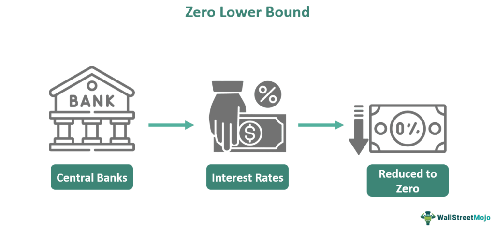

## Table of Contents

## What is a zero-bound interest rate?

A zero-bound interest rate is when the interest rate set by a central bank, like the Federal Reserve in the U.S., is very close to zero percent. This happens when the economy is not doing well, and the central bank wants to encourage people and businesses to borrow and spend money. By keeping interest rates low, it becomes cheaper to borrow money, which can help boost economic activity.

When interest rates are at the zero bound, central banks have less power to use traditional methods to stimulate the economy further. This is because they can't lower rates below zero, as people would just hold onto cash instead of putting it in banks. In these situations, central banks might use other tools, like buying government bonds or other assets, to try and support the economy.

## How does a zero-bound interest rate affect the economy?

When interest rates are at the zero bound, it means the central bank has set rates very close to zero percent. This is done to help the economy when it's not doing well. By keeping rates low, borrowing money becomes cheaper. This encourages people and businesses to take out loans to buy things like houses, cars, or to start new projects. When more people are spending and investing, it can help the economy grow.

However, when rates are at the zero bound, the central bank can't lower them anymore to help the economy even more. This is a problem because if the economy needs more help, the central bank has to find other ways to do it. They might start buying government bonds or other assets to put more money into the economy. This can be tricky and might not work as well as lowering interest rates. So, a zero-bound [interest rate](/wiki/interest-rate-trading-strategies) can help the economy, but it also limits what the central bank can do next.

## What historical events led to the adoption of zero-bound interest rates?

Zero-bound interest rates were first used during the Great Depression in the 1930s. Back then, the U.S. economy was in bad shape, and the government tried everything to help it get better. They lowered interest rates all the way down to zero to make borrowing money cheaper. This was a new idea at the time, and it helped people and businesses spend more money, which slowly helped the economy recover.

The next big time zero-bound interest rates were used was during the 2008 financial crisis. The economy was in trouble again, and the U.S. Federal Reserve, along with other central banks around the world, lowered interest rates to zero. They did this to encourage spending and investing, hoping it would help the economy get back on its feet. Since then, zero-bound interest rates have been used by central banks in Japan, Europe, and other places when their economies needed a boost.

## Which countries have experienced zero-bound interest rates and when?

The United States first used zero-bound interest rates during the Great Depression in the 1930s. They did this to help the economy recover by making it cheaper for people and businesses to borrow money. Later, during the 2008 financial crisis, the U.S. Federal Reserve brought interest rates down to zero again. This was to help the economy get better after a big financial shock. The rates stayed near zero until 2015.

Japan has also used zero-bound interest rates a lot. They started doing this in the late 1990s when their economy was struggling. Japan kept rates at zero for a long time, hoping it would help their economy grow again. In Europe, the European Central Bank brought interest rates to zero in 2016. They did this to help their economy, especially after facing many challenges like slow growth and high unemployment.

## What are the challenges faced by central banks when interest rates hit the zero bound?

When interest rates hit the zero bound, central banks face a big problem. They can't lower rates anymore to help the economy. Usually, when the economy is not doing well, the central bank makes borrowing money cheaper by lowering interest rates. But at zero, they can't do that anymore. This means they have to find other ways to help the economy, which can be harder and might not work as well.

One way central banks try to help is by buying government bonds or other assets. This puts more money into the economy and can encourage spending and investing. But this method, called quantitative easing, can be tricky. It's not as straightforward as lowering interest rates, and it can take a long time to see if it's working. Plus, it might not help as much as people hope. So, when interest rates are at zero, central banks have to be creative and patient, but it's not easy.

## How do zero-bound interest rates influence inflation and deflation?

When interest rates are at zero, it can affect inflation and deflation in different ways. Inflation is when prices go up over time, and deflation is when prices go down. When rates are at zero, it's cheaper to borrow money. This can lead to more spending and investment, which might push prices up and cause inflation. Central banks usually like a little bit of inflation because it means the economy is growing.

But if zero interest rates don't make people spend more, it can be a problem. If people and businesses are still not spending even when borrowing is cheap, the economy might not grow. This can lead to deflation, where prices start to fall. Deflation can be bad because people might wait to buy things, hoping prices will drop even more. This can make the economy shrink, and it's harder for central banks to fix when rates are already at zero.

## What are the conventional monetary policy tools used at the zero bound?

When interest rates are at the zero bound, central banks can't lower them anymore to help the economy. So, they use other tools to try and make things better. One big tool is called quantitative easing. This is when the central bank buys government bonds or other assets. By doing this, they put more money into the economy, hoping it will encourage people and businesses to spend and invest more. This can be tricky because it's not as simple as just lowering interest rates, and it might take a while to see if it's working.

Another tool is forward guidance. This is when the central bank tells everyone what they plan to do with interest rates in the future. They might say they will keep rates at zero for a long time or until certain things happen, like the economy getting better. This can help people and businesses feel more sure about the future, which might make them more willing to spend and invest. Both of these tools are important when rates are at zero, but they can be hard to use and might not always work as well as everyone hopes.

## What unconventional monetary policies are implemented when interest rates are at the zero bound?

When interest rates are at the zero bound, central banks have to get creative because they can't lower rates anymore. One unconventional tool they use is called quantitative easing. This means the central bank buys a lot of government bonds or other financial assets. By doing this, they put more money into the economy, hoping it will make people and businesses spend and invest more. It's like trying to jump-start a car that won't start on its own. But it's not always easy, and it can take a long time to see if it's helping.

Another tool is forward guidance. This is when the central bank tells everyone what they plan to do with interest rates in the future. They might say they will keep rates at zero for a long time or until the economy gets better. This helps people and businesses feel more sure about what's going to happen, which might make them more willing to spend and invest. Sometimes, central banks might even use negative interest rates, where they charge banks for holding money. This is a way to push banks to lend more money instead of just keeping it. All these tools are used when regular methods don't work, but they can be tricky and might not always help as much as hoped.

## How effective have zero-bound interest rate policies been in past economic crises?

Zero-bound interest rate policies have been used in several big economic crises, like the Great Depression and the 2008 financial crisis. During the Great Depression, the U.S. lowered interest rates to zero to help the economy recover. It made borrowing money cheaper, which helped people and businesses spend more. This slowly helped the economy get better. In 2008, the U.S. and other countries did the same thing to help their economies after a big financial shock. It took time, but it helped stop the economy from getting worse and started to bring it back to health.

However, zero-bound interest rates are not a perfect fix. When rates are at zero, central banks can't lower them anymore to help the economy even more. This means they have to use other tools, like buying government bonds or telling everyone what they plan to do with rates in the future. These methods can be tricky and might not work as well as just lowering interest rates. For example, Japan used zero-bound rates for a long time starting in the late 1990s, but their economy still struggled. So, while zero-bound interest rates can help in a crisis, they have limits and might not solve all the problems.

## What are the potential long-term consequences of maintaining zero-bound interest rates?

Keeping interest rates at zero for a long time can cause some problems. One big issue is that it might make people save less and spend more, which can be good for the economy in the short term. But if people get used to low rates, they might take on too much debt, thinking it will always be cheap to borrow. This can lead to a bubble, where too many people borrow too much money. If the bubble bursts, it can hurt the economy a lot, just like what happened in the 2008 financial crisis.

Another problem is that zero-bound interest rates can make it hard for banks to make money. Banks usually make money by lending at higher rates than what they pay to get money. But when rates are at zero, they can't charge much for loans, and their profits go down. This can make banks less willing to lend, which can slow down the economy. Also, if rates stay at zero for too long, it might make it harder for central banks to raise them later without causing big problems. People and businesses might be used to cheap borrowing, and raising rates could slow down the economy or even cause a recession.

## How do zero-bound interest rates impact savers and investors?

When interest rates are at zero, it can be tough for people who save money. Normally, you put money in a bank and get some interest on it. But when rates are at zero, the interest you get is very small or nothing at all. This means savers don't see their money grow much, and they might even lose money if prices go up faster than their savings. So, many people might decide to spend their money instead of saving it, because keeping it in the bank doesn't help them much.

For investors, zero-bound interest rates can change things too. When borrowing money is cheap, it can be a good time to invest in things like stocks or real estate. More people might want to buy these things, which can push their prices up. But it's not all good news. If everyone is borrowing and investing because rates are low, it can create a bubble. If the bubble bursts, it can hurt the economy and the value of investments can go down a lot. So, while zero rates can help some investors, they also come with risks.

## What alternative strategies can be used by policymakers when zero-bound interest rates fail to stimulate the economy?

When zero-bound interest rates don't work to help the economy, policymakers can try other things. One way is to use something called fiscal policy. This means the government spends more money on things like building roads, schools, or giving money to people who need it. By doing this, the government can put more money into the economy and help it grow. Another way is to change tax rules. If the government lowers taxes, people and businesses might have more money to spend and invest, which can help the economy too.

Another strategy is to use different kinds of monetary policy. For example, central banks can use what's called helicopter money. This is when they give money directly to people, hoping they will spend it and help the economy. Central banks can also try to make the value of their currency go down compared to other countries. This can make their exports cheaper and more attractive to other countries, which can help the economy grow. All these ideas can be used when zero interest rates aren't enough to get the economy moving again.

## What is Algorithmic Trading in Financial Markets?

Algorithmic trading, often referred to as algo trading, has revolutionized financial markets by employing computer algorithms to execute trades at high speed and large volumes. The primary advantage of [algorithmic trading](/wiki/algorithmic-trading) lies in its ability to minimize human error, capitalize on market inefficiencies swiftly, and reduce transaction costs. These systems use pre-programmed instructions to analyze variables such as timing, price, and quantity, enabling highly efficient trade execution.

In environments characterized by zero-bound interest rate policies, algorithmic trading's role becomes increasingly significant. Zero-bound rates present challenges for traditional monetary policy, often leading to unconventional measures like quantitative easing. These measures can influence market [liquidity](/wiki/liquidity-risk-premium) and [volatility](/wiki/volatility-trading-strategies), creating opportunities and challenges for algo trading systems. As central banks employ such strategies to stimulate economic activity, liquidity provided by algo trading can either stabilize or exacerbate market volatility.

Mechanically, algo trading systems assess market data in real-time, making decisions based on sophisticated models. These include statistical [arbitrage](/wiki/arbitrage), wherein algos detect price discrepancies between correlated assets and execute trades to profit from these differences. Another popular model involves trend-following strategies, where algorithms identify and exploit market [momentum](/wiki/momentum).

$$
\text{Profit} = \sum_{i=1}^{n} (P_{\text{sell}} - P_{\text{buy}}) \times \text{Volume}
$$

In this equation, $P_{\text{sell}}$ and $P_{\text{buy}}$ represent the selling and buying prices, respectively, while 'Volume' denotes the amount of the asset traded. Algorithmic trading remarkably improves the speed of such calculations, enhancing profit potential.

Real-world examples showcase the impact of algorithmic trading under economic stress. For instance, during the 2008 financial crisis, trading algorithms adapted quickly to changing conditions, exploiting volatile swings to generate profits. However, the rapid actions of these systems can sometimes lead to unintended consequences, such as the 'flash crash' of May 6, 2010, when the Dow Jones Industrial Average plummeted over 1,000 points before swiftly recovering, primarily driven by automated trades.

Policymakers and traders must consider several factors when dealing with algorithmic trading amid economic uncertainty. Regulation is crucial to prevent market manipulation and ensure fair trading practices. Understanding the behavior of algorithmic systems in reaction to unconventional monetary policies is essential in maintaining market stability. Transparency in algorithmic operations and robust risk management frameworks can mitigate potential adverse effects.

In summary, algorithmic trading significantly influences modern financial markets, particularly in contexts where traditional policy tools are less effective. The high-frequency nature of algo trades enhances liquidity but also poses risks that must be managed through strategic oversight and adaptive regulatory measures.

## References & Further Reading

[1]: Bernanke, B. S. (2009). ["The Crisis and the Policy Response."](https://www.federalreserve.gov/newsevents/speech/bernanke20090113a.htm) Federal Reserve.

[2]: Krugman, P. (1998). ["It's Baaack: Japan's Slump and the Return of the Liquidity Trap."](https://www.brookings.edu/wp-content/uploads/1998/06/1998b_bpea_krugman_dominquez_rogoff.pdf) Brookings Papers on Economic Activity.

[3]: Cecchetti, S. G., & Disyatat, P. (2010). ["Central Bank Tools and Liquidity Shortages."](https://www.newyorkfed.org/medialibrary/media/research/epr/10v16n1/1008cecc.pdf) Bank for International Settlements Working Paper No. 278.

[4]: Haldane, A. G., & May, R. M. (2011). ["Systemic Risk in Banking Ecosystems."](https://www.nature.com/articles/nature09659) Nature.

[5]: Gürkaynak, R. S., & Wright, J. H. (2013). ["Identification and Inference Using Event Studies."](https://onlinelibrary.wiley.com/doi/abs/10.1111/manc.12020) National Bureau of Economic Research Working Paper No. 17196.

[6]: ["Countdown to Zero: When Interest Rates Become Negative."](https://www.weforum.org/stories/2016/11/negative-interest-rates-absolutely-everything-you-need-to-know/) European Central Bank Working Paper Series.

[7]: Baker, M., & Wurgler, J. (2006). ["Investor Sentiment and the Cross-Section of Stock Returns."](https://onlinelibrary.wiley.com/doi/10.1111/j.1540-6261.2006.00885.x) The Journal of Finance.

[8]: Bekaert, G., Hoerova, M., & Duca, M. L. (2011). ["Risk, Uncertainty and Monetary Policy."](https://www.sciencedirect.com/science/article/pii/S0304393213000871) European Central Bank Working Paper Series.

[9]: Ait-Sahalia, Y., & Saglam, M. (2017). ["High Frequency Market Making: Overview of the Line of Research and Future Developments."](https://papers.ssrn.com/sol3/papers.cfm?abstract_id=2908438) Journal of Economic Surveys.