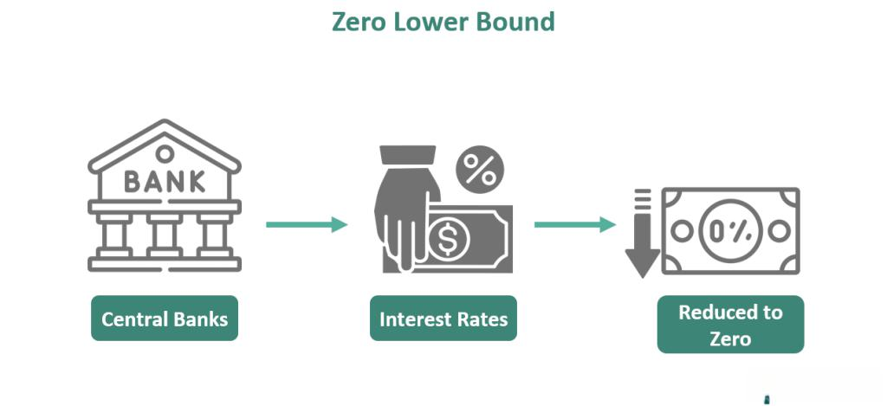

## Table of Contents

## What is the zero bound in monetary policy?

The zero bound in monetary policy refers to a situation where the central bank's interest rate is at or close to zero percent. At this point, the central bank can't lower the interest rate any further to stimulate the economy because interest rates can't go below zero. This situation often happens during severe economic downturns when traditional monetary policy tools become less effective.

When interest rates hit the zero bound, central banks may use other methods to help the economy. These methods can include buying government bonds or other assets to increase money supply, a policy known as quantitative easing. By doing this, they hope to encourage spending and investment, even when they can't lower interest rates any more.

## Why is the zero bound significant for central banks?

The zero bound is important for central banks because it limits what they can do to help the economy. When interest rates are at zero, central banks can't make borrowing cheaper by lowering rates even more. This is a problem because during tough economic times, people and businesses often need cheaper loans to keep going or to invest in new projects. If central banks can't lower rates, they lose one of their main tools for boosting the economy.

To deal with the zero bound, central banks might try other methods. One common approach is called quantitative easing, where the central bank buys things like government bonds to put more money into the economy. This can help even when interest rates are stuck at zero. Understanding the zero bound helps central banks plan better and find new ways to support the economy when traditional methods don't work.

## How does the zero bound affect interest rates?

The zero bound means that interest rates can't go below zero. This is a big deal for central banks because they usually lower interest rates to help the economy when times are tough. When rates hit zero, central banks can't make borrowing even cheaper by lowering rates more. This makes it harder for them to encourage people and businesses to spend and invest.

When interest rates are at the zero bound, central banks need to find other ways to help the economy. They might start buying things like government bonds, which is called quantitative easing. This puts more money into the economy and can help even when interest rates can't go any lower. So, the zero bound changes how central banks work and what tools they use to support the economy.

## What are the challenges faced by economies at the zero bound?

When an economy hits the zero bound, it means that interest rates are at zero and can't go any lower. This makes it hard for the economy to grow because people and businesses can't borrow money at cheaper rates. Normally, when the economy is slow, central banks lower interest rates to help. But at the zero bound, this tool doesn't work anymore. This can make it tough for the economy to recover from a downturn.

Another challenge at the zero bound is that central banks have to find new ways to help the economy. They might use things like quantitative easing, where they buy government bonds to put more money into the economy. But these methods can be less effective and harder to control than just changing interest rates. So, economies at the zero bound face more uncertainty and may struggle to get back on track.

## Can you explain the concept of the zero lower bound (ZLB)?

The zero lower bound, or ZLB, is when a country's central bank can't lower interest rates below zero. Think of interest rates like the price of borrowing money. When the economy is slow, the central bank usually lowers this price to make it easier for people and businesses to borrow and spend. But when interest rates hit zero, they can't go any lower. This is a problem because the central bank loses one of its main tools to help the economy grow.

When an economy is stuck at the zero lower bound, the central bank needs to find other ways to help. One common way is called quantitative easing. This is when the central bank buys things like government bonds to put more money into the economy. It's like trying to give the economy a boost when the usual way of lowering interest rates doesn't work anymore. But these new methods can be trickier to use and might not work as well, making it harder for the economy to recover from a downturn.

## What are the differences between the zero bound and the effective lower bound (ELB)?

The zero bound and the effective lower bound (ELB) are similar ideas, but they have a small difference. The zero bound is when interest rates can't go below zero. This is because people would rather keep their money in cash than in a bank if they have to pay to keep it there. So, central banks can't lower interest rates below zero when they are at the zero bound.

The effective lower bound is a bit different. It's the lowest [interest rate](/wiki/interest-rate-trading-strategies) that a central bank can set before people start taking their money out of banks and keeping it as cash. Sometimes, central banks can actually set interest rates a little below zero, but not too far. This means the effective lower bound might be slightly below zero, but it's still a limit on how low interest rates can go.

## How have central banks historically responded to reaching the zero bound?

When central banks hit the zero bound, they have tried different things to help the economy. One big thing they've done is called quantitative easing. This means they buy things like government bonds to put more money into the economy. It's like giving the economy a little boost when they can't lower interest rates anymore. Central banks have also tried to make people think that interest rates will stay low for a long time. This can encourage people and businesses to borrow and spend now, instead of waiting.

Another thing central banks have done is called forward guidance. This is when they tell everyone what they plan to do with interest rates in the future. By doing this, they try to make people feel more sure about the economy and more likely to spend and invest. Sometimes, central banks have even set interest rates a tiny bit below zero, which is called negative interest rates. This makes it a little more expensive to keep money in the bank, hoping it will push people to spend more. All these methods show how central banks try to help the economy when they can't use their usual tool of lowering interest rates.

## What are unconventional monetary policies used at the zero bound?

When interest rates hit the zero bound, central banks can't lower them any more to help the economy. So, they use other methods called unconventional monetary policies. One big one is quantitative easing. This means the central bank buys things like government bonds to put more money into the economy. It's like giving the economy a little boost when they can't lower interest rates anymore. Another thing they do is called forward guidance. This is when they tell everyone what they plan to do with interest rates in the future. By doing this, they try to make people feel more sure about the economy and more likely to spend and invest.

Sometimes, central banks even set interest rates a tiny bit below zero, which is called negative interest rates. This makes it a little more expensive to keep money in the bank, hoping it will push people to spend more. These unconventional methods can be trickier to use and might not work as well as just lowering interest rates. But they are important tools for central banks when they hit the zero bound and need to find new ways to help the economy grow.

## How does quantitative easing work as a response to the zero bound?

Quantitative easing is a way for central banks to help the economy when they can't lower interest rates anymore because they are at the zero bound. When interest rates are at zero, central banks can't make borrowing cheaper by lowering them further. So, they start buying things like government bonds from banks and other financial places. This puts more money into the economy. It's like giving the economy a little boost when they can't use their usual tool of lowering interest rates.

When central banks buy these bonds, they give banks more money to lend out. This can help lower other interest rates, like those for loans and mortgages, even if the central bank's main interest rate is stuck at zero. By doing this, they hope to encourage people and businesses to borrow more, spend more, and invest more. This can help the economy grow, even when traditional methods like lowering interest rates don't work anymore.

## What are the potential long-term effects of prolonged periods at the zero bound?

When an economy stays at the zero bound for a long time, it can lead to some big changes. One problem is that people might start expecting low interest rates to last forever. This can make it hard for central banks to raise rates later because people will be used to borrowing money cheaply. If rates go up suddenly, it could hurt people and businesses that have taken out loans. Also, keeping interest rates low for a long time can cause too much borrowing and spending, which might lead to higher prices, or inflation, down the road.

Another long-term effect is that it can be tough for banks to make money when interest rates are stuck at zero. Banks usually make money by charging more for loans than they pay for deposits. But when interest rates are very low, the difference between what they charge and what they pay gets smaller. This can make it hard for banks to stay profitable. If banks struggle, they might lend less, which can slow down the economy even more. So, staying at the zero bound for a long time can create new problems for the economy and make it harder for central banks to manage things in the future.

## How do negative interest rates relate to the zero bound?

Negative interest rates are when central banks set interest rates below zero. This happens when they want to encourage people and businesses to spend more money, even after they've already hit the zero bound. At the zero bound, interest rates can't go any lower than zero because people would rather keep their money in cash than in a bank if they have to pay to keep it there. But sometimes, central banks can push rates a little below zero, hoping to make it a bit more expensive to keep money in the bank. This might make people take their money out and spend it instead.

Using negative interest rates is a way to fight the limits of the zero bound. When interest rates are negative, it means that instead of [earning](/wiki/earning-announcement) money on their savings, people have to pay to keep their money in the bank. This can make them more likely to spend or invest their money, which can help the economy grow. But negative interest rates can be tricky to use and might not always work as well as hoped. They can also cause problems for banks, which might struggle to make money when they have to pay interest on deposits.

## What are the theoretical and practical implications of escaping the zero bound?

Escaping the zero bound means finding ways to help the economy grow even when interest rates can't go any lower than zero. In theory, one way to do this is by using other tools like quantitative easing, where the central bank buys things like government bonds to put more money into the economy. This can help even when interest rates are stuck at zero. Another idea is using negative interest rates, where people have to pay to keep their money in the bank. This might make them more likely to spend or invest their money, helping the economy grow. But these methods can be hard to control and might not always work as well as hoped.

In practice, escaping the zero bound is tricky. Central banks have to be careful because using these new tools can lead to other problems. For example, if they use quantitative easing for a long time, it might cause too much money in the economy, leading to higher prices, or inflation. Negative interest rates can also make it hard for banks to make money, which might make them lend less. So, central banks need to think carefully about how to use these tools and when to stop using them. The goal is to help the economy without causing new problems that could make things worse in the long run.

## References & Further Reading

[1]: Bernanke, B. S. (2009). ["The Federal Reserve's Balance Sheet: An Update"](https://www.federalreserve.gov/newsevents/speech/bernanke20091008a.htm). Speech at the Federal Reserve.

[2]: Brunnermeier, M. K., & Sannikov, Y. (2016). ["The I Theory of Money."](https://www.nber.org/papers/w22533) American Economic Journal: Macroeconomics, 8(4), 1-32.

[3]: Krishnamurthy, A., & Vissing-Jorgensen, A. (2011). ["The Effects of Quantitative Easing on Interest Rates: Channels and Implications for Policy."](https://www.nber.org/papers/w17555) Brookings Papers on Economic Activity.

[4]: Gagnon, J., Raskin, M., Remache, J., & Sack, B. (2011). ["The Financial Market Effects of the Federal Reserve's Large-Scale Asset Purchases."](https://www.ijcb.org/journal/ijcb11q1a1.pdf) International Journal of Central Banking, 7(1), 3-43.

[5]: Tobin, J. (1958). ["Liquidity Preference as Behavior Towards Risk."](https://www.jstor.org/stable/2296205) The Quarterly Journal of Economics, 67(2), 338-417.

[6]: Blanchard, O., Dell'Ariccia, G., & Mauro, P. (2010). ["Rethinking Macroeconomic Policy."](https://onlinelibrary.wiley.com/doi/abs/10.1111/j.1538-4616.2010.00334.x) Journal of Money, Credit and Banking, 42(6), 199-215.

[7]: Woodford, M. (2012). ["Methods of Policy Accommodation at the Interest-Rate Lower Bound."](https://www.columbia.edu/~mw2230/JHole2012final.pdf) Federal Reserve Bank of Kansas City Symposium Proceedings.