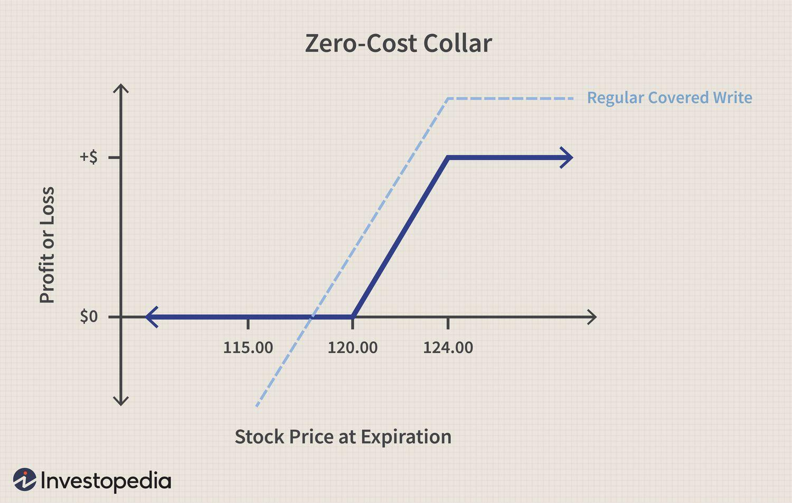

In the world of options trading, the zero cost collar strategy provides a mechanism for investors to safeguard their portfolios while minimizing expenses. This strategy is notable for its ability to offer downside protection without necessitating an upfront cost, making it appealing to both novice and experienced traders. By strategically buying put options and selling call options, investors set up a cost-neutral position that shields against significant losses and caps potential gains.

This article seeks to provide an in-depth examination of the zero cost collar strategy, exploring its mechanics, applications, and the potential benefits and risks it involves. Investors will gain insights into how this strategy works, along with illustrative examples that highlight its effectiveness under various market conditions. The zero cost collar technique is popular among equity investors due to its ability to strike a balance between risk management and cost efficiency.



In addition to explaining the core elements of the zero cost collar, this article will explore how algorithmic trading can be leveraged to enhance the implementation of this strategy. Automated trading strategies can optimize entry and exit points, rapidly adjust to market changes, and eliminate the emotional biases inherent in manual trading. By integrating algorithmic solutions into the execution of zero cost collars, investors can potentially achieve more consistent outcomes and benefit from strategic automation.

Overall, this guide is designed to equip traders with a comprehensive understanding of zero cost collars, providing essential knowledge for diversifying investment strategies while managing risks. Whether you are emerging in the trading scene or an established investor, understanding and utilizing the zero cost collar strategy can offer a disciplined and effective approach to navigating volatile markets.

## Table of Contents

## Understanding Zero Cost Collar

A zero cost collar is an options trading strategy that aims to protect investments by establishing a protective position without incurring a net premium cost. This strategy involves two primary components: purchasing put options for downside protection and selling call options to offset the cost of the puts. Hence, the transaction is deemed "zero cost" when the premiums of the put and call options offset each other.

This approach is frequently employed after an investor has realized a significant gain on a long stock position. By using a zero cost collar, the investor can safeguard against potential losses due to market volatility, thereby locking in profits and providing a hedge against adverse price movements.

To implement this strategy, investors must select appropriate strike prices and expiration dates for the options. This tailoring allows them to align the collar with their specific risk tolerance levels. The selection involves choosing a put option with a strike price below the current price of the underlying asset, offering protection if the asset's price falls. Simultaneously, a call option with a strike price above the current price is sold, capping potential gains but generating enough premium to cover the cost of the put option.

Mathematically, the zero cost condition can be expressed as:

$$
\text{Premium of Put Option} = \text{Premium of Call Option}
$$

This balance is crucial to ensuring that there is no net outlay for establishing the collar. Investors thereby achieve a balance between risk management and cost efficiency—essential attributes of the zero cost collar strategy. As such, it is a popular choice among equity investors seeking to maintain returns while managing downside risks effectively.

## Implementing Zero Cost Collar in Trading

Implementing a zero cost collar in trading requires a precise approach to selecting appropriate strike prices for both call and put options, ensuring that the strategy is executed with minimal net cost while providing effective risk management. The fundamental aspect is to align the premiums of purchased put options and sold call options such that they offset each other, resulting in a zero or near-zero net cost setup.

### Market Volatility and Strike Price Selection

The success of a zero cost collar largely depends on carefully understanding market [volatility](/wiki/volatility-trading-strategies) and setting realistic strike prices that reflect the current market conditions. High volatility can affect option pricing significantly, making it crucial to analyze underlying asset behavior to forecast potential movements. The appropriate strike prices should be chosen based on:

1. **Expected Future Volatility**: Higher volatility increases option premiums, contributing to larger price discrepancies between puts and calls.
2. **Investment Goals and Risk Tolerance**: Traders should align the strike prices with their desired level of risk protection and permissible profit range.
3. **Historical Data and Trends**: Utilizing past market data helps in setting realistic expectations of price movements.

### Role of Algorithmic Trading

Algorithmic trading systems can be employed to automate the selection of the optimal strike prices and execution of trades. These systems are designed to adjust strategies in real-time based on live market conditions. The automation offers several advantages, including:

- **Efficiency in Trade Execution**: Algorithms can swiftly execute trades, reducing the risk of human error and lag, which is crucial in rapidly changing markets.
- **Consistent Monitoring and Adjustment**: Real-time data analytics allow the algorithm to continuously assess and recalibrate positions, maintaining the integrity of the zero cost strategy.
- **Emotional Detachment**: Automated systems eliminate emotional decision-making, which can often lead to suboptimal trading actions.

Python, widely used in [algorithmic trading](/wiki/algorithmic-trading), allows for developing robust strategies. A simple demonstration to compute the zero cost setup could be shown as:

```python
# Assume we have access to option data for a given asset
puts = {'strike': [100, 105, 110], 'premium': [5, 8, 10]}
calls = {'strike': [115, 120, 125], 'premium': [5, 8, 10]}

def find_zero_cost_collars(puts, calls):
    collars = []
    for put_strike, put_premium in zip(puts['strike'], puts['premium']):
        for call_strike, call_premium in zip(calls['strike'], calls['premium']):
            # Check if the setup is zero or near-zero cost
            if abs(put_premium - call_premium) <= 1:  # small threshold for near-zero
                collars.append((put_strike, call_strike, put_premium - call_premium))
    return collars

zero_cost_collars = find_zero_cost_collars(puts, calls)
print("Potential Zero Cost Collars:", zero_cost_collars)
```

### Real-World Scenario

In practice, traders might need to adjust the strike prices as the market moves to maintain the zero cost attribute of the collar. For instance, if a stock's volatility increases, option premiums for at-the-money options may rise, prompting the need to tweak both put and call strike prices.

A trader aims for a collar on a stock currently trading at $110. By selling a call option with a strike price at $120 and buying a put option at $105, the trader secures a range of $105 to $120 for the stock. The payoffs will vary based on whether the stock price remains within this band, dips below the put, or rises above the call.

In summary, the implementation of a zero cost collar involves an intricate balance of option pricing strategies, often enhanced by algorithmic trading systems to ensure precise execution and continuous adjustment according to market dynamics.

## Advantages of Zero Cost Collar Strategy

Zero cost collars provide a compelling solution for investors aiming to mitigate risk while avoiding the burden of high upfront costs. This strategy affords traders the ability to secure downside protection through a calculated mix of options, ensuring cost-conscious investors find a balance between risk and potential return. Here are several advantages:

### Downside Protection Without Upfront Premium
The primary advantage of a zero cost collar is the ability to shield an investment from sharp market downturns without incurring an initial premium outlay. By purchasing put options for downside protection and offsetting their cost by selling call options, investors construct a protective bandwidth around their holdings. This structure ensures that while the upside may be capped, the strategy is self-financing, making it ideal for those with limited capital to deploy in hedging activities.

### Locking in a Range of Outcomes
Zero cost collars enable investors to define a clear range of potential outcomes for their portfolio. By determining the strike prices for the call and put options, investors can establish boundaries that offer peace of mind amidst market fluctuations. This cushioning effect is particularly advantageous during periods of heightened volatility, where the risk of unexpected shifts in market prices is substantial.

### Simplified Risk Management
The use of zero cost collars simplifies the otherwise complex landscape of risk management by delineating specific thresholds for both gains and losses. This clear-cut strategy allows investors to understand potential financial impacts at varying market levels without needing to constantly re-evaluate their positions. Predefined losing and winning thresholds streamline decision-making and planning, ensuring that traders can maintain a clear vision of their financial horizon.

### Enhancement Through Algorithmic Trading
The integration of algorithmic trading mechanisms amplifies the benefits of zero cost collars. By deploying algorithms that can swiftly analyze market data and adapt strategies accordingly, investors can maintain protected positions dynamically aligned with current market conditions. Algorithmic trading diminishes human error and emotional interference, ensuring that the defined collars are adjusted with precision in response to market changes.

### Suitability for Long-term Investment
Zero cost collars are especially suitable for long-term investors seeking consistent returns with minimal direct engagement. By employing this strategy, long-term portfolio holders can entrust their positions to a predefined range, focusing instead on strategic growth rather than short-term volatility impacts. This hands-off approach allows investors to pursue a steady accumulation of assets without the constant need to react to market fluctuations.

Overall, the zero cost collar strategy offers a structured, efficient approach to managing investment risks. By providing downside protection and capital efficiency, this method stands out as a favorable option for investors prioritizing cost-effective risk mitigation and predictability in trading outcomes.

## Risks and Limitations

Zero cost collars are a popular strategy for risk management in options trading, providing a level of downside protection while maintaining cost efficiency. However, they come with certain risks and limitations that investors must consider. One primary drawback is the capping of potential gains; when the underlying asset appreciates beyond the strike price of the sold call option, the investor misses out on further profits. This limitation makes the strategy less appealing in bullish markets where substantial price increases are possible.

Accurate market prediction and timing are crucial for the effective implementation of a zero cost collar. In volatile markets, predicting the right strike prices and expiration dates for the options can be challenging. Market fluctuations can quickly render a strategically chosen zero cost collar less effective, especially if the underlying asset's price moves unexpectedly. This difficulty in forecasting market movements highlights the importance of due diligence and informed decision-making.

Another challenge comes from potential mismatches in put and call premiums, which can disrupt the zero-cost nature of the strategy. Ideally, the premium received from the sold call option should cover the cost of the purchased put option. However, market conditions or incorrect strike price selection can lead to imbalances, resulting in a net cost instead of a zero cost transaction. It is critical to perform thorough analysis to select appropriate options that align closely in valuation.

The use of automated trading systems adds a layer of complexity to the strategy. While these systems are designed to efficiently manage trade entries and exits, they require close monitoring to ensure they respond correctly to dynamic market conditions. Changes in market trends or unforeseen events can lead to substantial adjustments, necessitating real-time oversight and intervention. Maintaining the efficiency and reliability of these systems is essential, as errors or system failures could result in significant financial losses.

Finally, the complexity involved in executing a zero cost collar strategy warrants careful planning and meticulous strategy formulation. Investors must consider the potential for discrepancies in premiums and execution risks. Developing a comprehensive strategy that accounts for all variables and contingencies is necessary to mitigate these challenges. Although zero cost collars can provide valuable protection, the execution requires a sophisticated understanding of options markets and the ability to adapt to changing conditions.

## Algorithmic Trading and Zero Cost Collar

Algorithmic trading systems significantly enhance the execution of zero cost collars by automating the management of trade entries and exits. These systems operate using sophisticated algorithms that continuously scan market conditions and dynamically adjust trading strategies to optimize performance. 

An algorithmic trading system, when applied to a zero cost collar, automates the process of selecting appropriate strike prices and expirations for both put and call options. This automation reduces the likelihood of human error and mitigates emotional decision-making, which can lead to suboptimal trading outcomes. The algorithm uses market data to ensure trades are executed at the most advantageous times, maintaining the zero-cost nature of the strategy.

The integration of technological solutions allows for ongoing evaluation and adjustment of collar positions in rapidly changing markets. These systems can identify market trends and adjust positions in real-time to maintain the desired risk-reward profile. For instance, if market volatility increases, the algorithm may adjust the strike prices or the expiration dates of the options used in the collar to better match the new risk environment.

Backtesting is a crucial component of algorithmic trading systems that aids in refining trading strategies. By simulating trades using historical market data, traders can evaluate the performance of their zero cost collar strategy under different market conditions. This process helps in identifying potential weaknesses in the strategy and allows for fine-tuning to enhance risk management and ensure consistency in achieving desired outcomes.

Consider a Python implementation to illustrate how algorithmic trading can optimize a zero cost collar strategy:

```python
from scipy.optimize import minimize

def cost_function(strike_prices):
    put_cost = calculate_option_cost(strike_prices[0], 'put')
    call_revenue = calculate_option_revenue(strike_prices[1], 'call')
    return put_cost - call_revenue

def optimize_zero_cost_collar():
    initial_guess = [current_stock_price * 0.95, current_stock_price * 1.05]
    constraints = ({'type': 'eq', 'fun': lambda x: calculate_option_cost(x[0], 'put') - calculate_option_revenue(x[1], 'call')})
    result = minimize(cost_function, initial_guess, constraints=constraints)
    return result.x

optimal_strike_prices = optimize_zero_cost_collar()
print(f"Optimal Put Strike Price: {optimal_strike_prices[0]}")
print(f"Optimal Call Strike Price: {optimal_strike_prices[1]}")
```

In this example, the algorithm uses optimization techniques to identify the ideal strike prices that maintain a zero-cost setup, based on current market conditions. Such automated solutions empower traders to effectively manage their portfolios by continuously refining their approach towards handling zero cost collars amidst market fluctuations.

## Conclusion

The zero cost collar is recognized as a vital strategy for managing risks in equity investments while maintaining control over associated costs. By integrating algorithmic trading with this strategy, investors can exploit significant efficiencies and advantages. Algorithmic trading facilitates the precise execution of trades, allowing for real-time adjustments in response to market fluctuations, thereby minimizing manual errors and mitigating the influence of emotional decision-making.

An essential element in optimizing the benefits of a zero cost collar is striking an appropriate balance between sufficient protective measures and acknowledging the upper limit of potential gains. This trade-off requires a nuanced appreciation of market conditions and an investor's specific risk tolerance. The strategic application of zero cost collars enables investors to ascertain a predictable range of outcomes, aligning investment decisions more closely with their financial goals and risk preferences.

In pursuing this strategy, investors must evaluate several factors, including their risk appetite, current market conditions, and the technological infrastructure available for implementing algorithmic solutions. Comprehensive [backtesting](/wiki/backtesting) and a clear understanding of algorithmic trading systems are paramount in refining investment strategies to ensure they meet desired objectives effectively.

Ultimately, zero cost collars offer a methodical and cost-effective choice for options trading, especially beneficial in volatile market conditions. Through disciplined execution and strategic foresight, this approach empowers investors to manage equity risks prudently while capitalizing on technological advancements to optimize portfolio performance.

## References & Further Reading

[1]: Hull, J. C. (2012). ["Options, Futures, and Other Derivatives"](https://www.semanticscholar.org/paper/Options%2C-Futures%2C-and-Other-Derivatives-Hull/89bdee500c8623864fc9eb7a471546aa713acc44) (9th ed.). Pearson.

[2]: Taleb, N. N. (1997). ["Dynamic Hedging: Managing Vanilla and Exotic Options"](https://www.amazon.com/Dynamic-Hedging-Managing-Vanilla-Options/dp/0471152803) Wiley.

[3]: Murphy, J. J. (1999). ["Technical Analysis of the Financial Markets: A Comprehensive Guide to Trading Methods and Applications"](https://archive.org/details/technicalanalysi0000murp)

[4]: De Prado, M. L. (2018). ["Advances in Financial Machine Learning"](https://www.amazon.com/Advances-Financial-Machine-Learning-Marcos/dp/1119482089) Wiley.

[5]: Jabbour, R. F. (2003). ["The Handbook of Equity Derivatives"](https://books.google.com/books/about/The_Option_Trader_Handbook.html?id=7ei7uiiRntsC) (3rd ed.). Wiley.