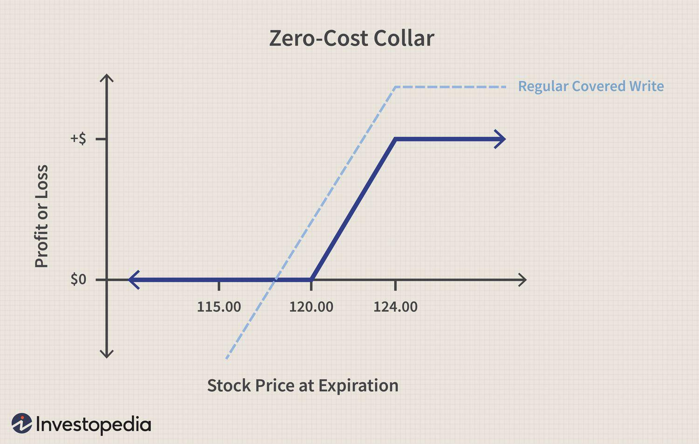

Options trading is a dynamic area of the financial markets, characterized by the continuous development of strategies designed to respond to shifting market demands. One such strategy, the zero-cost cylinder, has gained prominence as an effective means of managing risk without incurring initial costs. This strategy is particularly appealing because it allows traders to obtain protective option positions in a cost-neutral manner, thereby mitigating potential losses without a significant upfront expenditure.

The zero-cost cylinder achieves its namesake status by balancing the premiums of bought and sold options to create a net-zero initial outlay. Typically, this involves taking offsetting positions in options that are out-of-the-money, effectively establishing a range of price protection with flexible and adjustable strike prices. The strategic combination of buying and selling calls and puts ensures that the costs balance out, making it accessible for traders who are the cost-conscious or seeking structured betting on market movements within a predefined range.



In the current era dominated by rapid technological advancements, algorithmic trading has transformed the landscape of financial markets. The integration of strategies like the zero-cost cylinder within algorithmic trading systems offers traders enhanced precision and efficiency. Algorithmic trading systems, equipped with sophisticated algorithms, can execute trades at speeds and frequencies unattainable by manual human traders. This capability is crucial when implementing complex strategies that require precise timing and immediate response to market changes.

This article will explore the concept of the zero-cost cylinder strategy in options trading and its application within algorithmic trading frameworks. By understanding how these systems can amplify the effectiveness of the zero-cost cylinder strategy, traders can better navigate the financial markets with increased confidence and reduced risk.

## Table of Contents

## Understanding Zero-Cost Cylinder Strategy

The zero-cost cylinder strategy is a sophisticated technique used in options trading, aimed at providing financial protection without an initial cash outlay. This strategy is constructed by purchasing an out-of-the-money call option and simultaneously selling an out-of-the-money put option, or inversely, buying a put option and selling a call option. The key characteristic of this strategy is the careful selection of strike prices such that the premium received from the sold option effectively covers the cost of the purchased option, resulting in no net upfront cost.

Mathematically, the principal is to achieve:

$$
\text{Premium received from sold option} - \text{Premium paid for purchased option} \approx 0
$$

This arrangement capitalizes on the differing market assessments of upward and downward movements for the underlying asset. By selecting options that are out-of-the-money, a trader avails themselves of cheaper premium costs, thus facilitating the "zero-cost" aspect.

The primary objective of the zero-cost cylinder is to establish a range of protection against unfavorable price movements in the underlying asset. Suppose the strategy was configured by purchasing a call and selling a put. In that case, the investor is protected against the downside risk up to the put's strike price while allowing potential upside participation from the call's strike upwards. Conversely, if a put is bought and a call is sold, protection is afforded against the upside movement, with limited downside potential.

Consider a scenario where an investor believes an asset's price will stay within a given range over a defined period. By adopting the zero-cost cylinder strategy, they can hedge against substantial losses without an initial cash expenditure, provided the asset price remains between the strike prices of the call and put options.

Though it is an attractive strategy due to its lack of initial cost, the zero-cost cylinder requires traders to accept potential trade-offs. If the asset price moves beyond the predefined range established by the sold and bought options, the trader may forgo potential gains or incur losses, contingent upon the direction of movement versus the chosen calls or puts. Hence, the strategic setting of option strikes and expiration dates is paramount to the efficacy of this strategy.

Understanding and applying this strategy necessitates a comprehensive knowledge of options pricing, strike price selection, and the ability to forecast market movements accurately. Additionally, traders must be aware of implied [volatility](/wiki/volatility-trading-strategies), time decay, and other features that can impact options pricing and, subsequently, the effectiveness of the zero-cost cylinder strategy.

## Risks and Rewards of the Zero-Cost Cylinder

The zero-cost cylinder strategy in options trading offers distinct risks and rewards that traders must consider carefully. One of the primary risks associated with this strategy is the possibility of opportunity losses if the asset's price moves outside the predicted coverage range. In such cases, traders may miss out on potential profits or incur unexpected losses. For example, if a trader has established a zero-cost cylinder position expecting the asset's price to remain within a certain range, but the price breaks out significantly, the trader could face substantial losses on the options position.

Despite these risks, the zero-cost cylinder strategy offers significant rewards. A major advantage is the strategy's ability to protect against adverse price movements at no initial cost. By simultaneously buying and selling out-of-the-money options, the trader balances the option premiums, thus minimizing upfront expenses. This characteristic is highly beneficial for traders who seek exposure to the market without significant capital outlay.

Another reward of the zero-cost cylinder strategy is the inherent flexibility in adjusting strike prices to align with market outlooks and personal risk tolerance. Traders can choose different strike prices for the call and the put, tailoring the risk-reward profile to suit their strategies. This adaptability allows traders to respond dynamically to market changes and optimize their positions.

Understanding these risks and rewards is critical for making informed decisions about utilizing the zero-cost cylinder strategy. Traders should conduct a thorough evaluation of their market predictions and risk tolerance before implementing this strategy. By weighing the potential for opportunity losses against the protection and flexibility offered, traders can determine whether the zero-cost cylinder aligns with their trading objectives.

## Algo Trading and the Zero-Cost Cylinder

Algorithmic trading systems have transformed the landscape of financial markets by allowing traders to implement strategies with a degree of precision and speed that manual trading cannot match. One such strategy that benefits significantly from [algorithmic trading](/wiki/algorithmic-trading) is the zero-cost cylinder. This approach, which involves executing options trades that balance the costs of buying and selling via strategically chosen options positions, can be optimized using algorithms to manage trades effectively and at higher frequencies.

Automation in algorithmic trading systems offers the ability to efficiently monitor and control multiple positions while accounting for dynamic market conditions. By implementing the zero-cost cylinder strategy through automated systems, traders can handle complex decisions rapidly, minimizing the time delay associated with human decision-making. This is critical in options trading, where market prices can be highly volatile and time-sensitive decisions are crucial.

Algorithmic systems enable the execution of the zero-cost cylinder by using predefined rules and mathematical models. Such automation reduces human error, ensuring that trades adhere strictly to the specified strategy parameters. For example, an algorithm can be programmed to continuously analyze market conditions and execute the necessary trades when certain preset conditions are met, such as the underlying asset price reaching a specific threshold.

Here is a Python example using a simple rule-based approach to implement the zero-cost cylinder strategy in an algorithmic trading platform:

```python
class ZeroCostCylinderStrategy:
    def __init__(self, call_strike, put_strike, asset_price):
        self.call_strike = call_strike
        self.put_strike = put_strike
        self.asset_price = asset_price

    def execute_strategy(self):
        if self.asset_price > self.call_strike:
            self.buy_call_option()
        elif self.asset_price < self.put_strike:
            self.sell_put_option()

    def buy_call_option(self):
        # Simulate buying a call option
        print(f"Buying call option at strike {self.call_strike}")

    def sell_put_option(self):
        # Simulate selling a put option
        print(f"Selling put option at strike {self.put_strike}")

# Example Execution
strategy = ZeroCostCylinderStrategy(call_strike=105, put_strike=95, asset_price=100)
strategy.execute_strategy()
```

This example illustrates a simplified method of implementing the zero-cost cylinder strategy using a class-based structure in Python. The strategy involves buying a call option if the asset price exceeds a certain level and selling a put option if it falls below a specified level. Algorithmic platforms can execute similar strategies at scale, quickly adapting to real-time data inputs to align with market movements.

In summary, incorporating the zero-cost cylinder strategy into algorithmic trading systems offers enhanced precision and efficiency. These systems can monitor and manage options positions in real-time, allowing traders to harness the benefits of the zero-cost cylinder strategy while minimizing the potential for human error and optimizing overall trading results.

## Implementing Zero-Cost Strategies in Algorithmic Platforms

Integrating the zero-cost cylinder strategy into algorithmic platforms enables traders to leverage automation for precision and efficiency. This process often requires knowledge of programming languages such as Python, which is widely used due to its robust libraries and frameworks for financial analysis and algorithm development. Traders have the option to either code their strategies independently or employ systems developed by experts, which can be customized according to specific needs.

Backtesting is a critical step in implementing the zero-cost cylinder strategy on these platforms. It involves testing the strategy against historical data to evaluate its performance across different market conditions. This helps understand the strategy's potential risks and returns and refine it to optimize results. Python libraries such as Pandas for data manipulation, NumPy for numerical operations, and [backtrader](/wiki/backtrader) for [backtesting](/wiki/backtesting) provide an effective toolkit for this purpose. A typical backtesting script in Python may involve loading historical data, defining the strategy logic, and executing the strategy to review performance metrics.

Algorithmic platforms offer tools that allow customization and refinement of trading strategies, ensuring they align with prevailing market dynamics and the trader’s risk appetite. Features such as real-time data feeds, advanced charting capabilities, and performance analytics enable traders to adjust parameters such as strike price and expiration periods of options to meet their strategic objectives. By utilizing these tools, traders can fine-tune their strategies to handle volatility and unexpected market shifts, ensuring the zero-cost cylinder strategy remains effective over time.

For instance, the use of algorithmic platforms supports dynamic strategy adjustments, allowing the real-time optimization of the options' strike prices relative to the underlying asset's price movements. This adaptability is crucial in maintaining the strategy's zero-cost nature and balancing the associated risk and reward efficiently. In summary, integrating zero-cost strategies into algorithmic platforms provides traders with a structured approach to risk management, maximizing the strategic use of options without incurring initial costs.

## Conclusion

The zero-cost cylinder strategy presents itself as a valuable tool for traders looking for cost-effective methods to manage risk in options trading. By strategically offsetting the costs of buying and selling options, this approach allows traders to safeguard their investments without incurring an initial financial burden. This makes it particularly appealing in a market where cost efficiency is crucial.

Incorporating the zero-cost cylinder strategy within algorithmic trading systems capitalizes on the strengths of automation, offering traders enhanced precision and the ability to execute trades at a higher frequency than manual methods permit. Automated systems can continuously monitor market conditions and adjust positions dynamically, aligning with predefined trading goals and constraints. This integration minimizes human error and enables the efficient handling of complex trading executions, thereby optimizing results.

However, the key to successful implementation lies in comprehensively assessing one's risk tolerance before employing the strategy. Conducting thorough backtesting is essential to understanding how the strategy might perform across different market conditions. Backtesting ensures that the strategy is robust and can cope with market volatility, reducing the risk of unexpected losses and improving the confidence of the trader.

Overall, the zero-cost cylinder strategy offers a balanced approach for participating in the options market while minimizing initial costs. It empowers traders to manage risk effectively and benefits significantly from the precision and efficiency offered by algorithmic trading platforms. Proper assessment and testing increase the strategy’s reliability, making it a practical choice for both novice and experienced traders seeking to enhance their trading arsenal.

## References & Further Reading

[1]: ["Options, Futures, and Other Derivatives"](https://www.amazon.com/Options-Futures-Other-Derivatives-10th/dp/013447208X) by John C. Hull

[2]: ["Algorithmic Trading: Winning Strategies and Their Rationale"](https://www.wiley.com/en-us/Algorithmic+Trading%3A+Winning+Strategies+and+Their+Rationale-p-9781118746912) by Ernie Chan

[3]: Avellaneda, M., & Zhang, S. (2010). ["Path-Dependent Options: Pricing and Sensitivity Analysis."](https://www.scirp.org/reference/referencespapers?referenceid=1620027) SIAM Journal on Financial Mathematics, 1(1), 709-748.

[4]: ["Option Volatility and Pricing: Advanced Trading Strategies and Techniques"](https://www.amazon.com/Option-Volatility-Pricing-Strategies-Techniques/dp/0071818774) by Sheldon Natenberg

[5]: Narang, R. (2009). ["Inside the Black Box: The Simple Truth About Quantitative Trading."](https://onlinelibrary.wiley.com/doi/book/10.1002/9781118267738) Wiley.