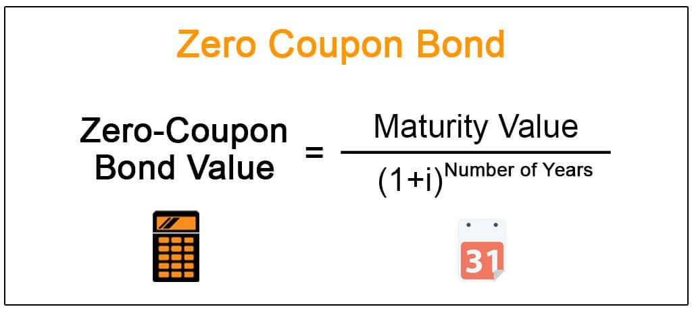

In the world of finance, fixed income investments such as bonds are fundamental for diversifying portfolios and managing risk. They provide a steady income stream and can act as a stabilizing factor, especially during economic volatility. Among the various types of bonds, zero coupon bonds, bond yields, and algorithmic trading are critical concepts that investors must understand to maximize returns and manage risks effectively.

Zero coupon bonds differ from traditional bonds as they do not offer periodic interest payments. Instead, they are issued at a discount and mature at their face value, allowing investors to benefit from the appreciation of the principal over time. This unique structure is particularly useful for long-term financial planning, such as funding future obligations like college tuition or retirement.



Understanding bond yields is essential, as they reflect the return an investor can expect from a bond. Bond yields are influenced by multiple factors, including prevailing interest rates, inflation, and overall economic conditions. For zero coupon bonds, the yield depends on the purchase price, face value, and time to maturity, requiring careful evaluation to optimize investment outcomes.

Algorithmic trading represents a significant advancement in financial technologies, employing computer algorithms to execute trades based on predefined criteria. In bond markets, this can enhance efficiency, improve liquidity, and enable the exploitation of pricing anomalies. Zero coupon bonds, with their predictable cash flows, are well-suited for algorithmic trading strategies. By staying informed about these technological advancements, investors can strategically integrate algorithmic trading into their fixed income investments, improving decision-making speed and transaction cost efficiency.

This article explores these key aspects, providing insights into the functioning of zero coupon bonds, the significance of bond yields, and the integration of algorithmic trading into fixed income investing strategies. Whether you are a seasoned investor or new to fixed income securities, understanding these concepts can significantly enhance portfolio performance.

## Table of Contents

## Understanding Fixed Income Investments

Fixed income investments, particularly bonds, serve as a key component in investors' portfolios by providing a stable and predictable income stream through interest payments. Typically, these income streams are issued in the form of semi-annual or annual coupon payments, attracting investors who seek to mitigate volatility and preserve capital. However, zero coupon bonds present a notable deviation from this traditional structure, offering unique investment opportunities and associated risks.

Unlike traditional bonds, zero coupon bonds do not provide investors with periodic interest payments. Instead, these bonds are issued at a substantial discount to their face value and mature at their nominal value. The difference between the purchase price and the face value constitutes the investor's return. This unique structure allows investors to plan for specific financial goals over the long term, leveraging the power of compounded growth. For instance, zero coupon bonds can be effectively utilized for funding future obligations such as college tuition or retirement funds, as they provide certainty of returns over a defined timeframe.

Nevertheless, the absence of regular interest payments in zero coupon bonds introduces unique risks for investors. One significant risk is the heightened sensitivity to [interest rate](/wiki/interest-rate-trading-strategies) fluctuations. Because zero coupon bonds generate returns solely through appreciation, changes in interest rates can significantly impact their market value. As interest rates rise, the present value of the future lump sum payment diminishes, leading to a decrease in the bond's price. Conversely, falling interest rates can enhance the bond’s appeal, increasing its market value.

Additionally, zero coupon bonds entail specific tax implications. Even though there are no periodic interest earnings, investors are subject to imputed interest taxation. This means that the bondholder must pay taxes on the accrued interest each year, even though the interest is not received until maturity. Such taxation can erode the effective yield if not strategically managed.

In conclusion, while zero coupon bonds present distinct advantages by providing predictable growth paths aligned with future financial needs, investors must be cognizant of the accompanying risks and tax obligations. Understanding these aspects enables investors to make informed decisions, aligning their investment strategies with long-term financial objectives.

## Exploring Zero Coupon Bonds

Zero coupon bonds are a unique type of fixed income security that are issued at a discount to their face value and do not make periodic interest payments. Instead, these bonds provide a return to investors through the appreciation of the principal amount. At maturity, the bondholder receives the face value of the bond, which is higher than the purchase price, reflecting the accumulated interest over the life of the bond.

### Key Characteristics

1. **Long-term Planning**: Since zero coupon bonds do not pay interest until maturity, investors must plan for a potentially long investment horizon, exercising patience as they wait to realize returns. This characteristic makes them a strategic choice for financing long-term liabilities, such as college tuition or retirement savings. By structuring bond purchases to match the timing of these future cash needs, investors can create a dependable source of funds when necessary.

2. **Attractiveness for Specific Financial Goals**: Zero coupon bonds are particularly appealing for investors looking to target specific financial goals. The predictable growth in value is advantageous for meeting set financial targets, provided the investment aligns with the investor's time frame. Additionally, due to their lower initial cost, investors can acquire face values at a discount, allowing for potentially greater gains at maturity.

### Risks

Investors considering zero coupon bonds need to be aware of several risks. A primary concern is **interest rate fluctuations**. Due to their long duration, zero coupon bonds are more sensitive to changes in interest rates compared to bonds that pay regular interest. If interest rates rise, the present value of a zero coupon bond's future cash flow decreases, making the bond less attractive on the secondary market, potentially leading to capital losses if sold before maturity.

Another pivotal aspect is **imputed interest taxation**. Even though the investor does not receive yearly interest payments, the Internal Revenue Service (IRS) requires the bondholder to pay taxes annually on the accrued interest, known as "phantom income." This imputed interest is calculated based on the bond's original issue discount (OID), necessitating careful tax planning, especially if the bond is held outside of a tax-advantaged account. 

Engaging in strategies to mitigate these risks, such as understanding the tax ramifications and considering the potential impact of interest rate trends, is essential for maximizing the effectiveness of zero coupon bonds in an investment portfolio. By comprehending both the benefits and the liabilities associated with zero coupon bonds, investors can better position themselves to meet their financial objectives effectively and efficiently.

## Bond Yields and Market Dynamics

Bond yields represent the expected return an investor can anticipate from a bond and are crucial for evaluating bond investments. Several factors influence bond yields, including interest rates, inflation, and broader economic conditions. These dynamics are particularly pronounced with zero coupon bonds, which do not provide periodic interest payments but instead yield a return based on their appreciation from a discounted purchase price to face value at maturity.

For zero coupon bonds, the yield to maturity (YTM) can be calculated using the formula:

$$

\text{YTM} = \left( \frac{\text{Face Value}}{\text{Purchase Price}} \right)^{\frac{1}{n}} - 1 
$$

Where:
- $\text{Face Value}$ is the amount paid at maturity.
- $\text{Purchase Price}$ is the initial investment cost.
- $n$ represents the number of years until maturity.

The yield effectively accounts for the time value of money, highlighting the impact of holding the bond until it matures. This measure provides a standard for comparison with other fixed-income securities.

Interest rates play a pivotal role in bond markets. Typically, when interest rates rise, bond prices decline, resulting in higher yields. Conversely, when rates fall, bond prices increase, leading to lower yields. This inverse relationship can be attributed to the fixed nature of bond coupon payments, making existing bonds with lower yields less attractive when new issues enter the market at higher yields.

Inflation is another critical [factor](/wiki/factor-investing) influencing bond yields. As inflation expectations increase, investors may demand higher yields to compensate for the potential erosion of purchasing power. Inflation-indexed bonds or interest rate swaps can be used as hedging instruments against inflationary pressures.

Economic conditions, including growth expectations and fiscal policies, further impact bond yields. Strong economic growth may lead to rising interest rates as central banks attempt to curb inflation, while economic slowdowns might lead to rate cuts, affecting yields accordingly.

Investors must carefully navigate these factors to maximize returns and maintain portfolio stability. Bond investing, particularly with zero coupon bonds, requires a nuanced understanding of market dynamics and economic indicators to optimize investment outcomes. By monitoring interest rates, inflation, and economic trends, investors can make informed decisions to exploit market conditions favorably.

## Algorithmic Trading in Bond Markets

Algorithmic trading in bond markets involves the use of computer algorithms to perform trades based on predefined criteria, allowing for rapid and precise transactions while minimizing human error. This technology-driven approach has become integral in modern financial markets, offering several benefits in the context of bond trading.

Firstly, [algorithmic trading](/wiki/algorithmic-trading) enhances market efficiency by streamlining the execution of trades. Automated systems can process large volumes of data much faster than human traders, identifying trends and executing trades within milliseconds. This increased speed not only reduces the time required to complete transactions but also helps decrease the costs associated with trading, as algorithms can optimize order execution to achieve favorable pricing.

Moreover, algorithmic trading boosts the [liquidity](/wiki/liquidity-risk-premium) of bond markets. By enabling continuous trading and providing a mechanism for rapid order matching, algorithms help maintain market activity and ensure that buyers and sellers can transact without significant delays. This improved liquidity is crucial for bond markets, which traditionally may have been less liquid compared to equity markets.

Zero coupon bonds, with their fixed cash flows and straightforward payment structure, are particularly suited to algorithmic trading strategies. These bonds do not offer periodic interest payments, which simplifies the modeling of their cash flows and price changes over time. Algorithms can be designed to exploit specific characteristics of zero coupon bonds, such as their sensitivity to interest rate changes and their predictable maturity value, allowing traders to devise strategies that take advantage of pricing discrepancies or [arbitrage](/wiki/arbitrage) opportunities.

The application of algorithms in bond trading underscores the importance for investors to remain knowledgeable about technological advancements and regulatory developments. As trading systems become more sophisticated, understanding how algorithms operate and the regulatory framework governing their use is essential for making informed investment decisions. Investors must also be aware of potential risks associated with algorithmic trading, including systemic risks that may arise from the high speed and automation of transactions.

In summary, algorithmic trading is transforming how bond markets operate by enhancing efficiency, improving liquidity, and enabling the execution of complex trading strategies, particularly with zero coupon bonds. This evolution necessitates that investors stay informed about technological and regulatory changes to effectively leverage these advanced trading tools.

## Tax Implications of Zero Coupon Bonds

Zero coupon bonds, despite not providing regular interest payments, present specific tax considerations due to the imputed interest taxation. This taxation arises from the bond's Original Issue Discount (OID), which indicates the difference between the bond's issue price and its maturity value. The Internal Revenue Service (IRS) treats a portion of this discount as taxable income each year, even though no actual cash is received until maturity. This requires investors to report and pay taxes on the accrual of imputed interest annually.

To mitigate tax liabilities, investors can leverage tax-advantaged accounts, such as Individual Retirement Accounts (IRAs) or 401(k) plans, where investments can grow tax-deferred or tax-free. Another strategy involves investing in tax-exempt bonds, such as municipal bonds, which may offer similar benefits without the associated federal tax on imputed interest. However, it's essential to confirm the tax-exempt status of such investments at a state or local level.

Understanding the Original Issue Discount (OID) method is crucial for investors holding zero coupon bonds. The OID is typically calculated using the formula:

$$
\text{OID Accretion} = \frac{\text{Maturity Value} - \text{Purchase Price}}{\text{Number of Years to Maturity}}
$$

This formula helps investors determine the amount of interest they need to report as income each year, thus facilitating precise tax planning.

By optimizing these tax strategies, investors can significantly enhance their after-tax returns. For instance, adjusting the holding period of zero coupon bonds to align with income variations can reduce tax burden impacts. Investors should remain informed on tax regulations and consider consulting with a tax advisor to effectively navigate these complexities and maximize returns from zero coupon bond investments.

## Integrating Zero Coupon Bonds and Algo Trading

Integrating zero coupon bonds into a diversified investment portfolio can effectively balance risk and reward, particularly when complemented by algorithmic trading strategies. Zero coupon bonds, by their nature, do not pay periodic interest but offer a lump sum at maturity. This characteristic makes them relatively less volatile compared to other investments, providing predictable growth over the term of the bond. They act as a hedge against more volatile assets in a portfolio, offering a stability anchor that mitigates risk.

Algorithmic trading leverages computer algorithms to execute trades based on pre-defined criteria, facilitating high-speed transactions with minimal human intervention. This approach is beneficial in the bond markets as it enhances trading efficiency, reduces transaction costs, and improves decision-making accuracy. Zero coupon bonds fit well with algorithmic strategies due to their predictable cash flows and clear valuation points, specifically the zero-coupon yield to maturity (YTM), which can be calculated as:

$$

YTM = \left(\frac{F}{P}\right)^{\frac{1}{n}} - 1 
$$

where $F$ is the face value, $P$ is the present price, and $n$ is the number of years until maturity.

Investors employing algorithmic trading can use advanced data analytics and [machine learning](/wiki/machine-learning) to identify patterns and pricing anomalies in the bond markets, allowing for more informed trading decisions. For instance, algorithms can detect discrepancies between the expected yield of zero coupon bonds and market movements, providing opportunities to capitalize on short-term pricing inefficiencies.

A Python example illustrating a simple setup for an algorithmic trading strategy could include the use of libraries like NumPy and pandas for numerical computations and data manipulation. For instance:

```python
import numpy as np
import pandas as pd

# Simulated bond pricing data
bond_data = pd.DataFrame({
    'price': np.random.normal(95, 5, size=100),  # Simulated bond prices
    'face_value': 100,  # Assume constant face value
    'years_to_maturity': np.linspace(1, 20, 100)  # Simulated time to maturity
})

# Calculate Zero-Coupon Yield to Maturity
bond_data['ytm'] = (bond_data['face_value'] / bond_data['price'])**(1/bond_data['years_to_maturity']) - 1

def identify_trading_opportunities(data):
    # Simple strategy: Buy if YTM > 5%
    buy_signals = data[data['ytm'] > 0.05]
    return buy_signals

opportunities = identify_trading_opportunities(bond_data)
```

This code snippet calculates the YTM for a series of zero-coupon bonds with varying prices and maturities, then identifies opportunities where the YTM exceeds a specified threshold, suggesting potential buying decisions.

Through the integration of zero coupon bonds and algorithmic trading, investors can enhance portfolio performance by taking advantage of the stability offered by zero coupon bonds and the efficiency and precision introduced by technological trading solutions. This combination allows for a more dynamic allocation strategy, effectively addressing the intricacies of bond market investments.

## Conclusion

Fixed income investments, zero coupon bonds, bond yields, and algorithmic trading are significant components of a comprehensive investment strategy. Understanding these elements empowers investors to effectively manage the complexities associated with financial markets. Fixed income investments provide a steady income stream and lower [volatility](/wiki/volatility-trading-strategies) compared to equities, acting as a reliable anchor for diversified portfolios.

Zero coupon bonds add another dimension by offering a lump sum return at maturity, serving specific needs like funding future obligations. The absence of periodic interest payments simplifies cash flow management for investors who can tolerate the long wait for maturity. However, the sensitivity of these instruments to interest rate fluctuations and tax considerations necessitates a thorough assessment to avoid unexpected financial impacts.

Bond yields represent the expected returns on investments and are vital for assessing the attractiveness of various fixed income securities. They are influenced by macroeconomic factors such as prevailing interest rates and inflation. Investors who comprehend these dynamics can make more informed decisions, balancing potential returns with inherent risks.

Algorithmic trading introduces efficiency, precision, and speed, transforming the landscape of bond trading. It reduces transaction costs and allows for rapid adaptation to market movements. The integration of algorithmic strategies in bond trading exploits pricing anomalies, enhancing liquidity and potentially improving investment outcomes.

Therefore, a modern investment strategy should include a blend of traditional and technological approaches. By leveraging fixed income instruments alongside advanced trading techniques, investors can optimize returns while managing risks. A commitment to continuous learning and adaptation to market trends and regulatory changes is essential to maintain a competitive edge and achieve sustained investment success.

## References & Further Reading

Explore comprehensive guides and resources on bond markets, algorithmic trading, and fixed income securities to deepen your understanding and enhance your investment strategies. For an authoritative overview on bond markets and fixed income investments, consider reading "Fixed Income Analysis" by Frank J. Fabozzi, which provides detailed coverage of fixed income instruments, valuation, and portfolio management strategies.

Additionally, Bruce Tuckman's "Fixed Income Securities: Tools for Today's Markets" offers insights into the mechanics, risk management, and trading of fixed income securities, making it an essential resource for both novice and seasoned investors. For those particularly interested in the intersection of technology and finance, "Algorithmic and High-Frequency Trading" by Álvaro Cartea and colleagues provides a comprehensive exploration of algorithmic trading strategies, market microstructure, and risk management techniques.

Staying informed about the latest research and innovations in these fields is crucial. Journals such as the "Journal of Fixed Income" and the "Journal of Financial Markets" regularly publish cutting-edge research on both traditional and algorithmic trading strategies. Online platforms like the CFA Institute and Coursera also offer courses on bond markets and trading technologies, providing practical knowledge and updates on the latest industry trends.

Commitment to continuous learning and adaptation to technological advancements and market conditions will empower investors to optimize their portfolios and achieve robust financial success.