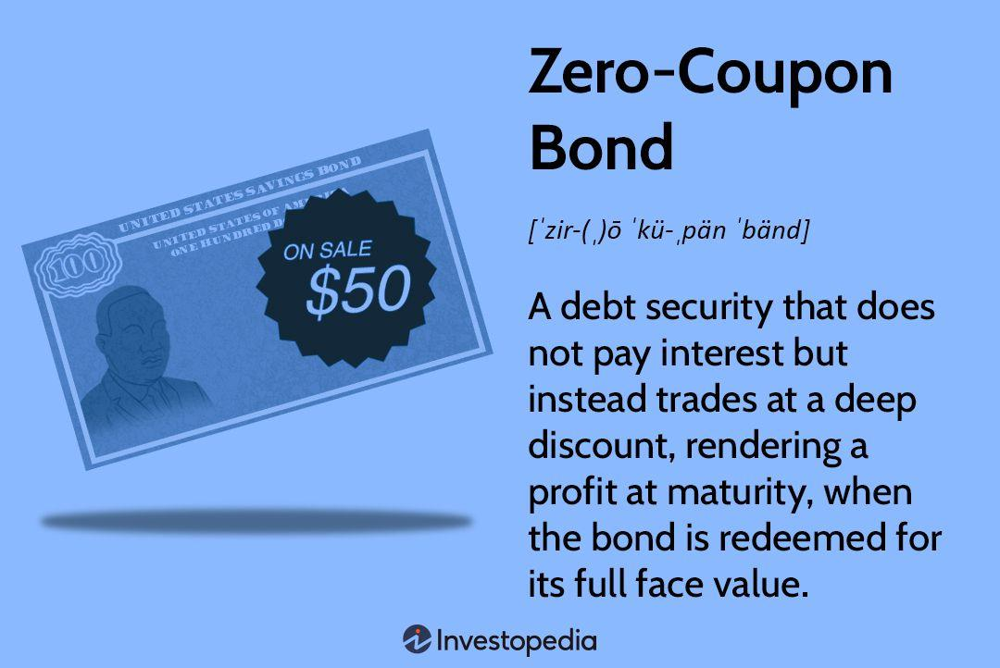

## Table of Contents

## What is a zero-coupon bond?

A zero-coupon bond is a type of bond that does not pay interest during its term. Instead, it is sold at a discount and then redeemed at its full face value when it matures. For example, you might buy a zero-coupon bond for $800, but when it matures, you get back $1,000. The difference between what you paid and what you get back is your earnings.

These bonds are popular because they are simple and predictable. Since there are no interest payments along the way, you know exactly how much money you will receive at the end. This makes them a good choice for people saving for a specific future goal, like paying for college or planning for retirement. However, because you don't get any money until the bond matures, they can be riskier if you need money sooner.

## How does a zero-coupon bond differ from a regular bond?

A zero-coupon bond and a regular bond both represent loans that you give to a company or government. But they work a bit differently. A regular bond pays you interest every year until it reaches its maturity date. This interest is like a reward for lending your money. When the bond matures, you get your original money back. So, with a regular bond, you get money along the way and at the end.

On the other hand, a zero-coupon bond doesn't give you any interest payments while you wait. Instead, you buy it for less than its face value. For example, you might buy a $1,000 zero-coupon bond for $800. When it matures, you get the full $1,000 back. The difference between what you paid and what you get back is your profit. This makes zero-coupon bonds simpler because you don't get any money until the end, but you know exactly how much you'll get.

So, the main difference is that a regular bond gives you interest payments over time, while a zero-coupon bond gives you all your earnings at the end. Zero-coupon bonds are good if you want to know exactly what you'll get in the future, but they can be riskier if you need money before they mature.

## What are the key features of a zero-coupon bond?

A zero-coupon bond is a type of bond that doesn't pay any interest while you own it. Instead, you buy it for less than what it's worth. For example, you might buy a $1,000 bond for $800. When the bond reaches its end date, or matures, you get the full $1,000 back. The difference between what you paid and what you get back is your profit. This makes zero-coupon bonds very simple and predictable because you know exactly how much money you'll get at the end.

Zero-coupon bonds are popular for people who are saving for a specific goal in the future, like paying for college or retirement. Since you don't get any money until the bond matures, it's important to be sure you won't need that money before then. If you do need it early, you might have to sell the bond before it matures, which could mean you get less money than you expected. So, while zero-coupon bonds are great for long-term savings, they can be riskier if your plans change.

## How are zero-coupon bonds priced?

Zero-coupon bonds are priced based on what they'll be worth when they mature and how long you have to wait until then. Let's say you want to buy a zero-coupon bond that will be worth $1,000 in 10 years. The price you pay now is less than $1,000, maybe something like $800. This lower price is what makes zero-coupon bonds different. You're not getting any interest payments along the way, so the bond is sold at a discount to make up for that.

The exact price of a zero-coupon bond depends on something called the yield to maturity. This is a fancy way of saying the interest rate you're getting if you keep the bond until it matures. If the yield to maturity is high, the price of the bond will be lower because you're getting a bigger reward for waiting. If the yield to maturity is low, the price of the bond will be higher. So, when you're buying a zero-coupon bond, you're figuring out how much less you need to pay now to get a certain amount of money later, based on what the interest rate would be if you were getting paid along the way.

## What is the process of buying a zero-coupon bond?

Buying a zero-coupon bond is pretty straightforward. First, you need to find a place to buy the bond. You can usually buy them from a bank, a brokerage firm, or even online. Once you've found a place to buy from, you'll need to decide how much money you want to invest and which zero-coupon bond you want. They come in different amounts and have different maturity dates, so you'll need to pick one that fits your savings goal.

After you've picked your bond, you'll need to pay for it. Remember, zero-coupon bonds are sold for less than what they're worth when they mature. So, if you want a bond that will be worth $1,000 in 10 years, you might only pay $800 for it now. Once you've paid, you just need to wait until the bond matures. When it does, you'll get the full amount the bond is worth. It's a simple way to save for the future because you know exactly how much money you'll get at the end.

## Who typically invests in zero-coupon bonds and why?

People who typically invest in zero-coupon bonds are often saving for a specific goal in the future, like paying for college or planning for retirement. These bonds are popular with parents saving for their kids' education because they know exactly how much money they'll get when the bond matures. It's like a savings account where you know what you'll have at the end. Retirees also like them because they can plan their finances knowing exactly how much they'll have at a certain time.

Investors choose zero-coupon bonds because they're simple and predictable. You don't get any interest payments along the way, so there's no need to worry about reinvesting that money. Instead, you buy the bond at a lower price and get the full amount when it matures. This makes it easier to plan for the future. However, since you don't get any money until the end, zero-coupon bonds can be riskier if you need money sooner. That's why they're best for people who are sure they won't need the money before the bond matures.

## What are the tax implications of investing in zero-coupon bonds?

Even though zero-coupon bonds don't pay interest while you own them, you still have to pay taxes on the money you'll make from them. The IRS treats the difference between what you paid for the bond and what you'll get when it matures as if it were interest. This means you have to pay taxes on this "interest" every year, even though you won't actually get the money until the bond matures. It's like the government is saying you're earning interest, even though you're not getting any payments.

This can be a bit tricky because you have to come up with money to pay taxes on income you haven't received yet. For example, if you bought a zero-coupon bond for $800 that will be worth $1,000 in 10 years, you'd have to pay taxes on the $200 difference over those 10 years, even though you won't get that $200 until the bond matures. This can make zero-coupon bonds less attractive for people in higher tax brackets because they have to pay more in taxes each year.

## How do interest rate changes affect zero-coupon bonds?

Interest rate changes can have a big impact on zero-coupon bonds. When interest rates go up, the price of zero-coupon bonds goes down. This happens because new bonds that are issued will have higher interest rates, making the older zero-coupon bonds less attractive. If you want to sell your zero-coupon bond before it matures, you'll have to sell it for less than what you paid for it. On the other hand, when interest rates go down, the price of zero-coupon bonds goes up. This is because your bond, with its fixed return, becomes more valuable compared to new bonds that are issued with lower interest rates.

Because zero-coupon bonds don't pay any interest until they mature, they are more sensitive to changes in interest rates than regular bonds. This means that even small changes in interest rates can cause big changes in the price of your zero-coupon bond. If you're planning to hold onto your bond until it matures, these price changes don't matter much. But if you need to sell your bond before it matures, you could end up losing money if interest rates have gone up since you bought it.

## What are the risks associated with zero-coupon bonds?

One risk with zero-coupon bonds is that you don't get any money until the bond matures. This means if you need money before then, you might have to sell the bond early. If you sell it before it matures, you could get less money than you paid for it, especially if interest rates have gone up. This is because new bonds will have higher interest rates, making your bond less valuable to other people.

Another risk is that you have to pay taxes on the money you'll make from the bond every year, even though you won't actually get that money until the bond matures. This can be tough because you have to find money to pay those taxes without getting any payments from the bond. This makes zero-coupon bonds less attractive if you're in a higher tax bracket because you'll have to pay more in taxes each year.

Lastly, zero-coupon bonds can be affected a lot by changes in interest rates. If interest rates go up, the price of your bond goes down. This can be a big deal if you need to sell your bond before it matures. On the other hand, if interest rates go down, the price of your bond goes up. But since you don't get any interest payments until the end, zero-coupon bonds are more sensitive to these changes than regular bonds.

## Can zero-coupon bonds be used in retirement planning?

Zero-coupon bonds can be a good choice for retirement planning because they help you save for the future in a simple and predictable way. When you buy a zero-coupon bond, you pay less than what it's worth when it matures. For example, you might buy a bond for $800 that will be worth $1,000 in 10 years. This means you know exactly how much money you'll have at a certain time, which is helpful when you're planning for retirement. You can buy a bond that matures right when you need the money, making it easier to plan your finances.

However, there are some risks to think about. If you need money before the bond matures, you might have to sell it early. If interest rates have gone up since you bought the bond, you could get less money back than you paid. Also, even though you don't get any money until the bond matures, you still have to pay taxes on the money you'll make from it every year. This can be tricky because you have to find money to pay those taxes without getting any payments from the bond. So, zero-coupon bonds can be good for retirement planning if you're sure you won't need the money before they mature and you're prepared for the tax situation.

## How do zero-coupon bonds fit into a diversified investment portfolio?

Zero-coupon bonds can be a useful part of a diversified investment portfolio because they offer a predictable return at a specific time in the future. When you buy a zero-coupon bond, you pay less than what it will be worth when it matures. For example, you might buy a $1,000 bond for $800, and when it matures in 10 years, you get the full $1,000. This makes them a good choice if you're saving for a specific goal, like retirement, because you know exactly how much money you'll have at a certain time. Adding zero-coupon bonds to your portfolio can help balance out riskier investments like stocks, since they provide a guaranteed amount of money at maturity.

However, there are some things to consider when including zero-coupon bonds in your portfolio. If you need to sell the bond before it matures, its price can go up or down depending on interest rates. If interest rates have gone up since you bought the bond, you might get less money back than you paid. Also, you have to pay taxes on the money you'll make from the bond every year, even though you won't actually get that money until it matures. This can be a challenge because you need to find money to pay those taxes without getting any payments from the bond. So, while zero-coupon bonds can add stability and predictability to your portfolio, it's important to weigh these risks and consider how they fit with your overall investment strategy.

## What advanced strategies can be employed with zero-coupon bonds?

One advanced strategy with zero-coupon bonds is called "laddering." This means you buy several zero-coupon bonds that mature at different times. For example, you could buy one bond that matures in 5 years, another in 10 years, and another in 15 years. This way, you get money at different times, which can help you plan for different financial goals. Laddering can also help you manage interest rate risk because if rates go up, you'll have some bonds maturing soon that you can reinvest at the higher rate. If rates go down, you still have bonds that were bought at higher rates maturing later.

Another strategy is using zero-coupon bonds to match future liabilities. This is called "immunization." If you know you'll need a certain amount of money at a specific time in the future, like for a child's college tuition or a big retirement expense, you can buy a zero-coupon bond that matures right when you need the money. This can help you avoid the risk of having to sell other investments at a bad time. By matching the bond's maturity to your financial need, you ensure you have the right amount of money at the right time, which can be very helpful in planning your finances.

## What is the valuation of zero-coupon bonds?

Zero-coupon bonds, unlike traditional bonds that pay periodic interest, offer a single payment at maturity. This distinct characteristic requires a unique approach to their valuation. The formula used to determine the price of a zero-coupon bond is:

$$
\text{Price} = \frac{M}{(1 + r)^n}
$$

Where:
- $M$ is the maturity value or face value of the bond.
- $r$ represents the annual required rate of return or interest rate.
- $n$ is the number of years until the bond matures.

### Factors Affecting Bond Pricing

1. **Maturity Value (M):** The fixed amount paid to the bondholder at maturity, which directly affects pricing. Higher maturity values yield higher bond prices under constant interest rate and time to maturity assumptions.

2. **Required Rate of Interest (r):** This is the market-driven interest rate demanded by investors. An increase in the interest rate reduces the present value of the bond's maturity amount, thus lowering the bond's price. Conversely, a decrease in interest rates raises the bond price.

3. **Time to Maturity (n):** The duration until the bond's maturity significantly impacts its present value. A longer time to maturity means that the bond’s maturity value is discounted over a longer period, which can lead to a lower bond price. Conversely, as the bond nears its maturity date, its price will approach the maturity value.

### Pricing Calculations

**Example 1:**
Consider a zero-coupon bond with a maturity value of $1,000, a required rate of interest of 5% per annum, and a time to maturity of 10 years.

$$
\text{Price} = \frac{1000}{(1 + 0.05)^{10}} = \frac{1000}{1.6289} \approx 613.91
$$

This calculation shows that an investor would pay approximately $613.91 today for a zero-coupon bond that will be worth $1,000 in ten years at a 5% [interest rate](/wiki/interest-rate-trading-strategies).

**Example 2:**
If the same bond had a required rate of interest of 7% instead of 5%, the price would be:

$$
\text{Price} = \frac{1000}{(1 + 0.07)^{10}} = \frac{1000}{1.9672} \approx 508.35
$$

Here, the increased rate leads to a lower bond price, demonstrating the inverse relationship between interest rates and bond prices.

These examples illustrate how variations in the time to maturity and interest rates influence the valuation of zero-coupon bonds. By understanding these components, investors can make informed decisions about their bond investments.

## What are the tax implications and strategies?

Zero-coupon bonds, also known as discount bonds, have unique tax implications due to their nature. Unlike traditional bonds that pay periodic interest, zero-coupon bonds do not offer interest payments over the bond's life. Instead, they are issued at a significant discount to their face value, and the return is realized when the bond matures at its full face value. This results in what's known as "imputed interest," or "phantom income," which can be taxable annually even though the investor does not receive physical cash payments until maturity.

### Imputed Interest Taxation

Imputed interest refers to the annual accrued interest that is considered taxable income. This interest must be reported to the Internal Revenue Service (IRS) each year, despite not being received by the bondholder. The IRS uses a method known as Original Issue Discount (OID) to calculate and tax this interest. The OID amount is determined by amortizing the difference between the bond’s purchase price and its maturity value over the bond’s term.

For example, consider a zero-coupon bond purchased for $750 with a face value of $1,000 and a maturity period of 5 years. The annual imputed interest is calculated through the following formula:

$$
\text{Imputed Interest} = \frac{\text{Face Value} - \text{Purchase Price}}{n}
$$

In this case:

$$
\text{Imputed Interest} = \frac{1000 - 750}{5} = 50
$$

Thus, the investor is required to report $50 of interest income each year.

### Strategies for Minimizing Tax Liabilities

To reduce the tax impact of owning zero-coupon bonds, investors can consider several strategies:

1. **Tax-Advantaged Accounts**: Placing zero-coupon bonds in tax-advantaged accounts such as Individual Retirement Accounts (IRAs) or 401(k) plans can shield the investor from the annual tax on imputed interest. These accounts defer taxes until withdrawals are made, potentially during retirement when the investor might be in a lower tax bracket.

2. **Tax-Exempt Bonds**: Some zero-coupon bonds, such as municipal bonds, may be exempt from federal and sometimes state and local taxes. Although they typically offer lower yields compared to taxable bonds to reflect the tax advantage, they can be beneficial for investors in high tax brackets.

3. **Laddering Strategy**: Investors may employ a bond laddering strategy, which involves purchasing bonds with different maturities. This can provide steady returns and help manage liquidity and tax liabilities more effectively by spreading out the maturity dates and tax impact over several years.

### Considerations for Tax Planning

When investing in zero-coupon bonds, it's essential to consider the implications of potential tax liabilities and planning opportunities:

- **Investment Horizon**: Align the maturity of the bonds with financial goals and expected tax scenarios. Consider how changes in tax laws or personal income can affect long-term investment returns.

- **Yield Comparison**: Evaluate the after-tax yield of zero-coupon bonds relative to other fixed-income securities. Ensure that the tax-adjusted return meets investment objectives.

- **Consult Financial Advisors**: Engage with tax professionals or financial advisors who can provide tailored advice based on individual financial situations, helping optimize tax efficiency.

Careful tax planning is crucial for maximizing the returns on zero-coupon bond investments and ensuring they contribute positively to an investor’s overall financial strategy.

## References & Further Reading

[1]: ["Bond Markets, Analysis, and Strategies"](https://books.google.com/books/about/Bond_Markets_Analysis_and_Strategies_ten.html?id=bQpNEAAAQBAJ) by Frank J. Fabozzi

[2]: ["Fixed Income Securities: Tools for Today's Markets"](https://www.wiley.com/en-us/Fixed+Income+Securities%3A+Tools+for+Today%27s+Markets%2C+4th+Edition-p-9781119835554) by Bruce Tuckman

[3]: ["The Handbook of Fixed Income Securities"](https://www.amazon.com/Handbook-Fixed-Income-Securities-Ninth/dp/1260473899) by Frank J. Fabozzi

[4]: ["Algorithmic and High-Frequency Trading"](https://assets.cambridge.org/97811070/91146/frontmatter/9781107091146_frontmatter.pdf) by Álvaro Cartea, Sebastian Jaimungal, and José Penalva

[5]: ["Quantitative Financial Analytics: The Path to Investment Profits"](https://www.amazon.com/Quantitative-Financial-Analytics-Investment-Profits/dp/9813224258) by Edward E. Williams and John A. Dobelman

[6]: ["The Little Book of Common Sense Investing: The Only Way to Guarantee Your Fair Share of Stock Market Returns"](https://www.amazon.com/Little-Book-Common-Sense-Investing/dp/1119404509) by John C. Bogle

[7]: U.S. Internal Revenue Service. ["Publication 1212: Guide to Original Issue Discount (OID) Instruments."](https://www.irs.gov/publications/p1212) 

[8]: ["Interest Rate Markets: A Practical Approach to Fixed Income"](https://onlinelibrary.wiley.com/doi/book/10.1002/9781119200949) by Siddhartha Jha