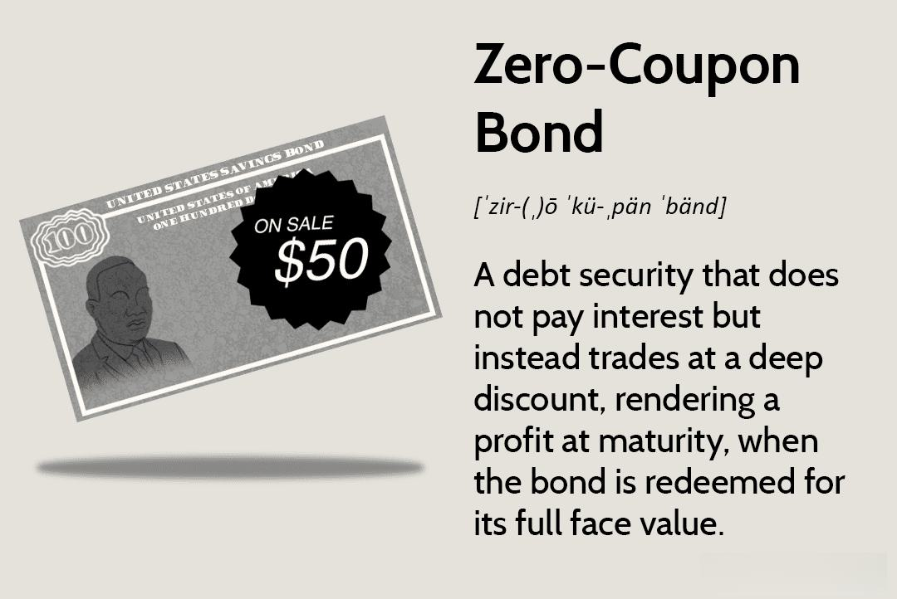

Zero-coupon bonds are a unique type of fixed-income security that offer certain advantages and challenges to investors. Unlike traditional bonds that pay periodic interest, zero-coupon bonds are issued at a discount to their face value and pay no interest during their term. Instead, the bondholder receives a lump sum payment at maturity that includes the initial investment and the accrued interest. This distinctive feature allows zero-coupon bonds to provide predictable returns and profit from compounded growth over time.

The focus of this article is to explore the investment opportunities associated with zero-coupon bonds, delve into the mathematical methodologies for their valuation, and consider the burgeoning role of algorithmic trading techniques in optimizing such investments. By understanding the nuances of zero-coupon bond investment, including its valuation and tax considerations, investors can potentially enhance their portfolio's performance.

Key themes of this exploration include a comprehensive understanding of zero-coupon bonds, an examination of the principles and formulas pertinent to their valuation, and an analysis of how algorithmic trading can be harnessed to improve investment strategies. As bond markets increasingly integrate technological advances, algorithmic trading presents a significant potential to enhance the efficiency and effectiveness of zero-coupon bond investments, reducing human error and facilitating sophisticated investment strategies. This article aims to equip investors with the knowledge required to navigate and leverage the complexities associated with zero-coupon bonds and modern trading techniques.

## Table of Contents

## Understanding Zero-Coupon Bonds

Zero-coupon bonds are a unique type of debt security that distinguishes itself from traditional bonds primarily through its payment structure. Unlike conventional bonds, which pay periodic interest, or coupon payments, to bondholders, zero-coupon bonds do not distribute any interest throughout their life. Instead, they are issued at a significant discount to their face value and mature at their full face value. The profit for the bondholder is realized as the difference between the purchase price and the amount received at maturity.

For example, a zero-coupon bond with a face value of $1,000 might be issued at $700. The investor would receive no interest payments, but at maturity, they would receive the full $1,000, thus generating $300 in profit.

### Advantages of Zero-Coupon Bonds

1. **Predictable Returns**: The return on zero-coupon bonds is straightforward to calculate since it is based solely on the difference between the purchase price and the face value. This aspect provides investors with a clear understanding of the growth of their investment over time.

2. **Compounded Growth**: Since zero-coupon bonds do not pay periodic interest, the interest that would have been paid is reinvested automatically, compounding the investment over time. This compounding effect can lead to significant accumulation of wealth, particularly if the bond is held for an extended period.

### Risks Involved

1. **Interest Rate Sensitivity**: Zero-coupon bonds have heightened sensitivity to changes in interest rates compared to their coupon-bearing counterparts. Since all returns are realized at maturity, the bond’s price is substantially affected by interest rate fluctuations. An increase in interest rates will lead to a decrease in the bond's price, potentially resulting in significant losses if the bond were to be sold before maturity.

2. **Taxation of Imputed Interest**: Despite not receiving periodic interest, investors of zero-coupon bonds are subject to tax on the imputed interest each year. Imputed interest is the interest that accrues on a bond and is reported as taxable income, even though it is not received until maturity. This can create a tax liability annually, which requires careful tax planning.

3. **Liquidity Risk**: These bonds can be less liquid than other types of bonds, which may pose challenges for investors needing to sell before maturity.

Understanding the characteristics of zero-coupon bonds, including their advantages and risks, is crucial for investors looking to include them in their portfolios. Balancing predictable returns and compounded growth with potential risks can make zero-coupon bonds a strategic choice for meeting long-term investment goals.

## Valuation of Zero-Coupon Bonds

Zero-coupon bonds, unlike traditional bonds that pay periodic interest, offer a single payment at maturity. This distinct characteristic requires a unique approach to their valuation. The formula used to determine the price of a zero-coupon bond is:

$$
\text{Price} = \frac{M}{(1 + r)^n}
$$

Where:
- $M$ is the maturity value or face value of the bond.
- $r$ represents the annual required rate of return or interest rate.
- $n$ is the number of years until the bond matures.

### Factors Affecting Bond Pricing

1. **Maturity Value (M):** The fixed amount paid to the bondholder at maturity, which directly affects pricing. Higher maturity values yield higher bond prices under constant interest rate and time to maturity assumptions.

2. **Required Rate of Interest (r):** This is the market-driven interest rate demanded by investors. An increase in the interest rate reduces the present value of the bond's maturity amount, thus lowering the bond's price. Conversely, a decrease in interest rates raises the bond price.

3. **Time to Maturity (n):** The duration until the bond's maturity significantly impacts its present value. A longer time to maturity means that the bond’s maturity value is discounted over a longer period, which can lead to a lower bond price. Conversely, as the bond nears its maturity date, its price will approach the maturity value.

### Pricing Calculations

**Example 1:**
Consider a zero-coupon bond with a maturity value of $1,000, a required rate of interest of 5% per annum, and a time to maturity of 10 years.

$$
\text{Price} = \frac{1000}{(1 + 0.05)^{10}} = \frac{1000}{1.6289} \approx 613.91
$$

This calculation shows that an investor would pay approximately $613.91 today for a zero-coupon bond that will be worth $1,000 in ten years at a 5% [interest rate](/wiki/interest-rate-trading-strategies).

**Example 2:**
If the same bond had a required rate of interest of 7% instead of 5%, the price would be:

$$
\text{Price} = \frac{1000}{(1 + 0.07)^{10}} = \frac{1000}{1.9672} \approx 508.35
$$

Here, the increased rate leads to a lower bond price, demonstrating the inverse relationship between interest rates and bond prices.

These examples illustrate how variations in the time to maturity and interest rates influence the valuation of zero-coupon bonds. By understanding these components, investors can make informed decisions about their bond investments.

## Algorithmic Trading and Zero-Coupon Bonds

Algorithmic trading, characterized by the use of computer algorithms to execute trading strategies, has increasingly influenced the dynamics of bond markets, including zero-coupon bonds. These advanced algorithms analyze market data more efficiently than human traders and can execute trades at high speed, which is particularly advantageous in the fast-paced world of finance.

In the context of zero-coupon bonds, algorithms can optimize investment strategies through techniques such as statistical [arbitrage](/wiki/arbitrage), [trend following](/wiki/trend-following), and mean reversion. Statistical arbitrage, for example, involves the use of quantitative techniques to trade on price inefficiencies of bonds. This can be particularly useful for zero-coupon bonds, which often exhibit pricing anomalies due to their lack of periodic interest payments. Algorithms can scan historical and real-time data to identify and exploit these temporary price discrepancies.

Trend-following strategies might analyze historical bond prices to determine trends in interest rate movements or investor sentiment that affect bond pricing. Algorithms detect such trends and automatically execute buy or sell orders to capitalize on predicted future price movements. Mean reversion strategies operate on the principle that asset prices, including zero-coupon bonds, tend to revert to their historical mean over time. Algorithms can identify deviations from these mean prices, offering entry and [exit](/wiki/exit-strategy) signals for traders.

The potential benefits of [algorithmic trading](/wiki/algorithmic-trading) in zero-coupon bonds are notable. Efficiency is significantly enhanced, as algorithms can process vast amounts of data in real-time and make decisions based on complex models that would be impractical for human traders to deploy consistently. This can lead to better pricing accuracy and more timely execution of trades, which is crucial in a market where interest rates and yield curves are constantly fluctuating.

Moreover, algorithmic trading reduces human error by eliminating the psychological factors that often hinder decision-making in trading scenarios. Algorithms follow strict rules and execute strategies exactly as programmed, which can lead to more consistent returns and a reduction in the likelihood of costly mistakes that stem from emotional biases.

In conclusion, the integration of algorithmic trading strategies in the zero-coupon bond market can substantially improve investment outcomes through the optimization of trading strategies and enhanced execution efficiency, offering investors a powerful tool to navigate these complex financial instruments.

## Tax Implications and Strategies

Zero-coupon bonds, also known as discount bonds, have unique tax implications due to their nature. Unlike traditional bonds that pay periodic interest, zero-coupon bonds do not offer interest payments over the bond's life. Instead, they are issued at a significant discount to their face value, and the return is realized when the bond matures at its full face value. This results in what's known as "imputed interest," or "phantom income," which can be taxable annually even though the investor does not receive physical cash payments until maturity.

### Imputed Interest Taxation

Imputed interest refers to the annual accrued interest that is considered taxable income. This interest must be reported to the Internal Revenue Service (IRS) each year, despite not being received by the bondholder. The IRS uses a method known as Original Issue Discount (OID) to calculate and tax this interest. The OID amount is determined by amortizing the difference between the bond’s purchase price and its maturity value over the bond’s term.

For example, consider a zero-coupon bond purchased for $750 with a face value of $1,000 and a maturity period of 5 years. The annual imputed interest is calculated through the following formula:

$$
\text{Imputed Interest} = \frac{\text{Face Value} - \text{Purchase Price}}{n}
$$

In this case:

$$
\text{Imputed Interest} = \frac{1000 - 750}{5} = 50
$$

Thus, the investor is required to report $50 of interest income each year.

### Strategies for Minimizing Tax Liabilities

To reduce the tax impact of owning zero-coupon bonds, investors can consider several strategies:

1. **Tax-Advantaged Accounts**: Placing zero-coupon bonds in tax-advantaged accounts such as Individual Retirement Accounts (IRAs) or 401(k) plans can shield the investor from the annual tax on imputed interest. These accounts defer taxes until withdrawals are made, potentially during retirement when the investor might be in a lower tax bracket.

2. **Tax-Exempt Bonds**: Some zero-coupon bonds, such as municipal bonds, may be exempt from federal and sometimes state and local taxes. Although they typically offer lower yields compared to taxable bonds to reflect the tax advantage, they can be beneficial for investors in high tax brackets.

3. **Laddering Strategy**: Investors may employ a bond laddering strategy, which involves purchasing bonds with different maturities. This can provide steady returns and help manage liquidity and tax liabilities more effectively by spreading out the maturity dates and tax impact over several years.

### Considerations for Tax Planning

When investing in zero-coupon bonds, it's essential to consider the implications of potential tax liabilities and planning opportunities:

- **Investment Horizon**: Align the maturity of the bonds with financial goals and expected tax scenarios. Consider how changes in tax laws or personal income can affect long-term investment returns.

- **Yield Comparison**: Evaluate the after-tax yield of zero-coupon bonds relative to other fixed-income securities. Ensure that the tax-adjusted return meets investment objectives.

- **Consult Financial Advisors**: Engage with tax professionals or financial advisors who can provide tailored advice based on individual financial situations, helping optimize tax efficiency.

Careful tax planning is crucial for maximizing the returns on zero-coupon bond investments and ensuring they contribute positively to an investor’s overall financial strategy.

## Integrating Zero-Coupon Bonds into a Diversified Portfolio

Zero-coupon bonds play a significant role in portfolio diversification by offering a unique balance of risk and reward. Unlike conventional bonds, zero-coupon bonds do not pay periodic interest. Instead, they are issued at a substantial discount to their face value and mature at par. This characteristic provides investors with a predictable growth trajectory, making them especially appealing for long-term investment strategies focused on capital appreciation.

**Balancing Risk and Reward**

The fixed maturity value of zero-coupon bonds allows investors to know exactly how much they will receive at maturity, which simplifies the planning of future financial goals. This predictability can be beneficial in balancing a portfolio's overall risk and reward. Zero-coupon bonds are typically more sensitive to changes in interest rates than their coupon-paying counterparts. This sensitivity can be a double-edged sword: while it can lead to substantial price appreciation in a declining interest rate environment, it also implies higher [volatility](/wiki/volatility-trading-strategies) when rates rise. Therefore, zero-coupon bonds can introduce interest rate risk into a portfolio, but they also have the potential for higher returns if market conditions are favorable.

Investors looking to mitigate risk might choose to include zero-coupon bonds as a hedge against other, more volatile portfolio components such as stocks. Given their lack of reinvestment risk, these bonds can stabilize a portfolio's income flow, especially during periods of market instability.

**Guidance on Selecting Zero-Coupon Bonds**

When selecting zero-coupon bonds, investors should consider their risk tolerance and investment objectives. For instance, younger investors with a longer investment horizon might favor longer-dated zero-coupon bonds, which typically offer higher potential returns due to their increased sensitivity to interest rate fluctuations. Conversely, investors closer to retirement might opt for bonds with shorter maturities to reduce exposure to interest rate volatility.

Investors should also assess the credit quality of the issuing entity. High-quality bonds from reliable issuers can provide safety and security, whereas bonds with lower credit ratings may offer higher yields but come with increased default risk. Tools such as credit ratings and yield curves can assist investors in making informed decisions.

Another consideration is the alignment of bond maturities with specific financial goals. By matching the maturity of zero-coupon bonds to expected monetary needs, investors can ensure that funds are available when required without the need to sell assets at potentially disadvantageous times.

In summary, integrating zero-coupon bonds into a diversified portfolio requires careful attention to the trade-offs between risk and reward, alignment with financial goals, and the assessment of credit risk. By tailoring the bond selection to individual circumstances, investors can enhance portfolio stability while simultaneously pursuing growth opportunities.

## Conclusion

Zero-coupon bonds present a unique investment opportunity, characterized by distinct features that set them apart from traditional bonds. A clear understanding of bond valuation is crucial, given the formula used to determine the price of zero-coupon bonds: $\text{Price} = \frac{M}{(1 + r)^n}$. Here, the maturity value (M), the required rate of interest (r), and the time to maturity (n) are key determinants affecting bond pricing. Accurate bond valuation enables investors to make informed decisions and optimize their investment portfolios.

Tax implications are another critical aspect of investing in zero-coupon bonds. The taxation of imputed interest can significantly impact returns, making it vital for investors to devise strategies to minimize tax liabilities. Utilizing tax-advantaged accounts and engaging in proactive tax planning can shelter some portion of gains from taxation, preserving the investor's capital growth over time.

Furthermore, the integration of algorithmic trading strategies offers promising enhancements to the investment process in zero-coupon bonds. Algorithms can manage complex datasets efficiently and reduce human error, leading to optimized investment strategies. Incorporating these advanced techniques can facilitate improved decision-making and portfolio management.

In summary, a comprehensive grasp of bond valuation and tax considerations is indispensable for investors eyeing zero-coupon bonds. The potential application of algorithmic trading can further refine investment strategies, aligning them with the investor's financial goals while maximizing returns.

## References & Further Reading

[1]: ["Bond Markets, Analysis, and Strategies"](https://books.google.com/books/about/Bond_Markets_Analysis_and_Strategies_ten.html?id=bQpNEAAAQBAJ) by Frank J. Fabozzi

[2]: ["Fixed Income Securities: Tools for Today's Markets"](https://www.wiley.com/en-us/Fixed+Income+Securities%3A+Tools+for+Today%27s+Markets%2C+4th+Edition-p-9781119835554) by Bruce Tuckman

[3]: ["The Handbook of Fixed Income Securities"](https://www.amazon.com/Handbook-Fixed-Income-Securities-Ninth/dp/1260473899) by Frank J. Fabozzi

[4]: ["Algorithmic and High-Frequency Trading"](https://assets.cambridge.org/97811070/91146/frontmatter/9781107091146_frontmatter.pdf) by Álvaro Cartea, Sebastian Jaimungal, and José Penalva

[5]: ["Quantitative Financial Analytics: The Path to Investment Profits"](https://www.amazon.com/Quantitative-Financial-Analytics-Investment-Profits/dp/9813224258) by Edward E. Williams and John A. Dobelman

[6]: ["The Little Book of Common Sense Investing: The Only Way to Guarantee Your Fair Share of Stock Market Returns"](https://www.amazon.com/Little-Book-Common-Sense-Investing/dp/1119404509) by John C. Bogle

[7]: U.S. Internal Revenue Service. ["Publication 1212: Guide to Original Issue Discount (OID) Instruments."](https://www.irs.gov/publications/p1212) 

[8]: ["Interest Rate Markets: A Practical Approach to Fixed Income"](https://onlinelibrary.wiley.com/doi/book/10.1002/9781119200949) by Siddhartha Jha