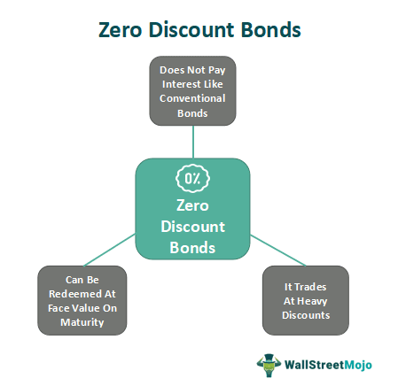

Convertible bonds are financial instruments that possess characteristics of both debt and equity, making them a popular choice for investors seeking fixed income security alongside potential equity gains. Essentially, they serve as bonds with an embedded option, allowing the holder to convert the bond into a predetermined number of shares of the issuer's common stock. Convertible bonds thus provide the dual benefit of income generation from bond coupons and the flexibility to convert into equities should the issuer's stock performance prove favorable.

Zero-coupon convertible bonds represent a specialized subset of convertible bonds, distinguished by their lack of periodic interest payments. Instead of receiving regular interest, these bonds are issued at a discount to their face value. The investor receives the face value at maturity, with the difference between the purchase price and the face value representing the bond's accrued interest. This structure offers capital appreciation potential without the traditional income stream provided by regular coupon payments.



This article seeks to explore the intricacies of zero-coupon convertible bonds, emphasizing their role and impact in algorithmic trading. Within financial markets, algorithmic trading employs sophisticated models and automated systems to execute trades rapidly and accurately, leveraging mathematical and statistical methods to optimize decision-making. Zero-coupon convertibles present distinct challenges and opportunities for these trading systems, particularly due to their unique pricing structures and hybrid characteristics. By examining the nature of these bonds and their interaction with algorithmic trading methodologies, the article aims to provide insights into managing these investments effectively, balancing the risks and rewards inherent in their structure.

## Table of Contents

## Understanding Zero-Coupon Convertible Bonds

Zero-coupon convertible bonds are a distinct class of hybrid securities that combine features of both bonds and stocks. Unlike traditional bonds, zero-coupon bonds do not make periodic interest payments (coupons). Instead, they are issued at a significant discount to their face value, with the face value being paid at maturity. This structure allows investors to potentially benefit from capital appreciation, as the bond's value increases over time toward its face value.

One of the defining attributes of zero-coupon convertible bonds is their conversion feature, which provides the holder with the option to convert the bond into a predefined number of shares of the issuer's common stock. This conversion option imbues the bond with an equity component, allowing investors to benefit from potential upside in the issuer's stock price. The conversion ratio dictates how many shares of stock the investor receives in exchange for one bond.

The hybrid nature of zero-coupon convertible bonds means they simultaneously offer characteristics of fixed income securities and equities. On one side, they provide a measure of security by promising repayment of the bond's face value at maturity, functioning as a zero-coupon bond. On the other, the opportunity to convert the bond into stock aligns with potential capital appreciation, akin to owning stock. 

The pricing of these bonds involves considerations similar to those used in options pricing, given the embedded option to convert the bond into equity. Investors evaluate the expected return of holding the bond to maturity against the potential benefits of conversion. This dual nature of potential returns, from both the bond and equity perspectives, makes zero-coupon convertible bonds an attractive investment vehicle while also adding complexity to their valuation and risk assessment. 

In summary, zero-coupon convertible bonds provide a blend of fixed income stability and equity upside, thereby catering to a diverse range of investment strategies and risk appetites.

## The Role of Algorithmic Trading in Convertible Bond Pricing

Algorithmic trading has transformed the landscape of convertible bond pricing, especially for zero-coupon convertibles. These securities necessitate intricate pricing methodologies due to their hybrid nature, combining elements of both bonds and stocks. The use of [algorithmic trading](/wiki/algorithmic-trading) involves deploying sophisticated mathematical models to achieve precise pricing and efficient trading strategies.

Zero-coupon convertible bonds, which do not pay periodic interest, present additional challenges in valuation. Fundamental to this process is the application of option pricing theories, such as the Black-Scholes model. The Black-Scholes model provides a framework for determining the theoretical value of options, and its formulas are crucial for pricing the convertible feature of these bonds. In the context of a zero-coupon convertible bond, the key variables include the current stock price, exercise price, time to maturity, risk-free [interest rate](/wiki/interest-rate-trading-strategies), and stock [volatility](/wiki/volatility-trading-strategies). The formula for the Black-Scholes model is:

$$
C = S_0 N(d_1) - Xe^{-rt}N(d_2)
$$

where:

- $d_1 = \frac{\ln(\frac{S_0}{X}) + (r+\frac{\sigma^2}{2})t}{\sigma \sqrt{t}}$
- $d_2 = d_1 - \sigma \sqrt{t}$

In these equations, $C$ is the call option price, $S_0$ is the current stock price, $X$ is the exercise price, $r$ is the risk-free rate, $\sigma$ is the volatility, and $t$ is the time to maturity. $N(d)$ is the cumulative distribution function of the standard normal distribution.

Automated trading systems leverage these models to determine fair values and execute trades without human intervention. These systems can swiftly process vast amounts of data and react to market changes, enhancing pricing accuracy and [liquidity](/wiki/liquidity-risk-premium). By continuously updating based on incoming market information, these algorithms can identify and exploit pricing inefficiencies.

In summary, the integration of algorithmic trading in pricing zero-coupon convertible bonds allows investors to manage the inherent complexities of these instruments effectively. By utilizing advanced mathematical frameworks such as the Black-Scholes model, market participants can achieve improved pricing precision and optimal trading strategies.

## Special Considerations in Trading Zero-Coupon Convertibles

Zero-coupon convertible bonds present unique characteristics that make them more volatile, primarily due to the absence of periodic interest payments. Unlike traditional bonds that provide regular coupon payments, zero-coupon convertibles are issued at a discount and accrue interest by building up towards their face value at maturity. This structure inherently increases the sensitivity of zero-coupon convertibles to changes in interest rates and market conditions.

**Credit Risk and Market Conditions**  
Investors must pay careful attention to the credit risk associated with zero-coupon convertibles. Since these securities do not offer regular income through coupon payments, their value is heavily reliant on the issuer's creditworthiness and the potential for conversion into stock. If the issuer faces financial difficulties, the lack of interim payments can heighten the risk of not recovering the investment. Furthermore, macroeconomic conditions such as interest rate fluctuations, inflation, and economic instability can have pronounced effects on zero-coupon convertibles. Given that they do not pay periodic interest, their prices are more susceptible to shifts in the economic environment, which can affect their attractiveness relative to other fixed-income securities.

**Issuer's Stock Volatility**  
The potential to convert bonds into equity introduces another level of complexity, necessitating careful consideration of the issuer's stock volatility. The value of the conversion option embedded in a zero-coupon convertible bond is directly linked to the volatility of the issuer's stock. High volatility increases the potential upside of converting the bond into equity, but it also raises uncertainty and risk. Investors must therefore evaluate how stock price fluctuations might influence the conversion feature and impact overall returns.

**Algorithmic Models in Trading**  
To navigate these complexities, algorithmic trading models are essential. These models can automatically adjust trading strategies based on real-time data regarding credit risk, market conditions, and stock volatility. Advanced algorithms employ option pricing theories, such as the Black-Scholes model, to estimate the fair value of the conversion feature and to determine optimal trading tactics. By incorporating variables such as volatility, interest rates, and issuer credit ratings, algorithmic systems can dynamically re-adjust trading positions to mitigate risks and capture opportunities.

**Mathematical and Computational Approaches**  
These models can leverage financial mathematics to exploit market inefficiencies. For instance, using stochastic calculus, models can simulate a wide array of market scenarios and predict bond pricing outcomes. Python libraries such as NumPy or SciPy offer tools for complex calculations and modeling, facilitating more accurate predictions and strategy implementations. Continuous monitoring and the ability to re-calibrate models in response to shifting market landscapes are crucial for maintaining portfolio stability and optimizing performance in the volatile market of zero-coupon convertible bonds.

## Advantages and Risks of Zero-Coupon Convertible Bonds

Zero-coupon convertible bonds are financial instruments that present both opportunities and challenges for investors, particularly in the context of algorithmic trading. One of their primary advantages is the potential for high yields. By purchasing these bonds at a discount to their face value, investors can potentially realize significant capital gains if the bonds are held to maturity. Additionally, in the event of an issuer's bankruptcy, bondholders are prioritized over equity holders, providing a layer of protection in such scenarios. This creditor status is particularly valuable, as it increases the likelihood of recouping the initial investment compared to shareholders.

However, zero-coupon convertible bonds [carry](/wiki/carry-trading) inherent risks that require careful consideration. A significant risk is issuer default, where the issuer may fail to meet their obligations, impacting the investor's principal return. The absence of periodic interest payments exacerbates this risk, as investors do not receive interim cash flows that can mitigate potential losses. Furthermore, these bonds exhibit a complex and volatile nature, partly due to their hybrid characteristics and sensitivity to the issuer's stock performance. The conversion feature's value can fluctuate substantially based on the stock's market price, adding a layer of complexity to the bond's valuation.

In the context of automated trading, understanding these trade-offs is vital for effective risk management. Sophisticated algorithmic trading platforms must incorporate models that account for credit risk, interest rate changes, and stock volatility. This can be achieved through a comprehensive risk management framework, where algorithms are designed to dynamically adjust trading strategies based on real-time market data. Effective algorithms may use stochastic models for pricing securities or Monte Carlo simulations to forecast potential outcomes under various scenarios. By continuously monitoring market conditions and recalibrating strategies, algorithmic trading can enhance the management of zero-coupon convertible bonds, maximizing returns while mitigating potential risks. Such advanced methodologies underscore the importance of balancing potential rewards with inherent risks, ensuring that investments in these unique financial instruments are both informed and strategic.

## Successful Algorithmic Strategies for Convertible Bond Trading

Successful algorithmic strategies for trading convertible bonds, particularly zero-coupon convertibles, include approaches such as delta hedging, volatility [arbitrage](/wiki/arbitrage), and interest rate hedging. These strategies seek to optimize trading outcomes by addressing the specific characteristics and challenges presented by these hybrid securities.

Delta hedging is a strategy used to reduce the risk associated with price movements of the underlying stock. Delta ($\Delta$) represents the sensitivity of an option's price to a $1 change in the price of the underlying asset. By maintaining a delta-neutral position, traders can mitigate the impact of stock price volatility. This involves adjusting the number of convertible bonds and their underlying shares held to keep the overall delta close to zero. The implementation of delta hedging can be illustrated with a simple Python snippet:

```python
def calculate_delta(option_price, stock_price, volatility, time_to_expiration):
    """Calculates the delta of an option."""
    from scipy.stats import norm
    from math import log, sqrt

    d1 = (log(stock_price / option_price) + (0.5 * volatility**2) * time_to_expiration) / (volatility * sqrt(time_to_expiration))
    delta = norm.cdf(d1)
    return delta
```

Volatility arbitrage involves exploiting discrepancies between the forecasted volatility of the stock and the implied volatility reflected in the pricing of options. Traders can capitalize on these discrepancies by establishing positions that are expected to benefit as actual market volatility converges towards their forecast. This process often employs sophisticated mathematical models and requires consistent recalibration using accurate market data.

Interest rate hedging is crucial for managing the interest rate risk inherent in convertible bonds. Since convertible bonds have characteristics of both debt and equity, their value is sensitive to changes in interest rates. By using derivatives, like interest rate swaps or futures, algorithmic trading systems can hedge against adverse movements in interest rates, thereby protecting the bond's value.

To ensure the effectiveness of these strategies, models must access accurate and timely market data, and incorporate robust risk assessment features. Algorithms need to be adaptive, continuously analyzing market conditions to adjust strategies in response to new data. This might involve [machine learning](/wiki/machine-learning) techniques, where models learn from historical market behavior to predict future trends and adapt strategies accordingly.

Continuous monitoring and real-time adjustments of these algorithms are essential. As markets fluctuate, so do the parameters affecting convertible bond valuations. Hence, leveraging technologies like machine learning and real-time analytics enables traders to reassess risk exposures and recalibrate algorithms promptly, ensuring that the convertible bond trading remains optimized for prevailing market conditions.

## Conclusion

Zero-coupon convertible bonds present investors with a distinctive blend of opportunities and challenges. Their dual nature as both fixed-income securities and potential sources of equity capital appreciation makes them an attractive investment choice. The absence of periodic interest payments adds complexity but also the prospect of higher yields due to issuance at a discount.

Algorithmic trading emerges as an essential tool in effectively managing zero-coupon convertibles. Through sophisticated mathematical models and algorithms, investors can price these securities with greater precision, accounting for their embedded equity options and market volatilities. Algorithms can dynamically adjust trading strategies, optimizing for factors such as issuer credit risk and stock price volatility, which are critical to maximizing returns.

Achieving the best results with zero-coupon convertible bonds necessitates a thorough understanding of their unique characteristics and the application of advanced trading techniques. Investors must engage with complex models like Black-Scholes for option pricing, and continually update their strategies based on real-time market data. This intricate approach not only helps in mitigating potential risks but also in magnifying the potential rewards that these bonds can offer.

In conclusion, zero-coupon convertible bonds provide a compelling investment opportunity for those equipped to navigate their complexities. Effective algorithmic trading acts as a powerful ally in this process, enhancing the ability to manage these investments and ultimately aiming to deliver optimized financial returns.

## References & Further Reading

[1]: ["Convertible Securities: A Complete Guide to Investment and Corporate Financing Strategies"](https://www.amazon.com/Convertible-Securities-Investment-Corporate-Strategies/dp/1260462900) by Tracy V. Maitland and Thomas C. Noddings

[2]: ["Options, Futures, and Other Derivatives"](https://www.amazon.com/Options-Futures-Other-Derivatives-9th/dp/0133456315) by John C. Hull

[3]: ["Quantitative Value, + Web Site: A Practitioner's Guide to Automating Intelligent Investment and Eliminating Behavioral Errors"](https://www.amazon.com/Quantitative-Value-Web-Site-Practitioners/dp/1118328078) by Wesley R. Gray and Tobias E. Carlisle

[4]: Black, F., & Scholes, M. (1973). ["The Pricing of Options and Corporate Liabilities"](https://www.cs.princeton.edu/courses/archive/fall09/cos323/papers/black_scholes73.pdf). Journal of Political Economy, 81(3), 637-654.

[5]: ["Convertible Bond Markets: An Introduction"](https://www.investopedia.com/investing/introduction-convertible-bonds/) by David Wessel and Greg Milton

[6]: ["Dynamic Hedging: Managing Vanilla and Exotic Options"](https://archive.org/details/dynamichedgingma0000tale) by Nassim Nicholas Taleb

[7]: ["Algorithmic Trading and DMA: An introduction to direct access trading strategies"](https://archive.org/details/algorithmictradi0000john) by Barry Johnson