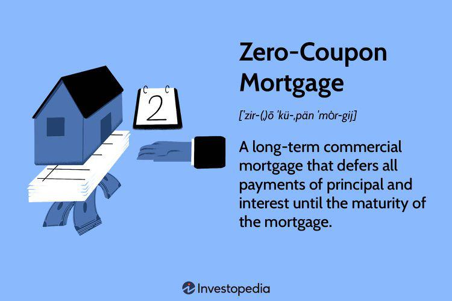

Real estate finance encompasses a broad range of funding mechanisms, each tailored to meet diverse project and investment needs. Among these numerous financial options is the zero-coupon mortgage—an intriguing type of mortgage loan that defers all payments until maturity, contrasting starkly with traditional payment structures. For both seasoned investors and new entrants in the real estate market, understanding the nuances of zero-coupon mortgages is an essential skill. This article is dedicated to demystifying zero-coupon mortgages, along with unveiling insights into mortgage finance as a whole, and the transformative role of algorithmic trading in contemporary finance.

Zero-coupon mortgages are distinct financial instruments. They are structured in such a way that the interest accrues over time and payment is rendered at the end of the mortgage term. This approach can offer substantial benefits, such as lower initial cash flow requirements, but it also carries inherent risks, primarily related to the borrower’s ability to meet a sizable payment at maturity. Grasping how zero-coupon mortgages operate, including the benefits and potential pitfalls, positions stakeholders to make more informed financial decisions.



Parallel to traditional mortgage systems, the landscape of mortgage finance is experiencing a shift driven by technological advancements, notably through the implementation of algorithmic trading. Algorithmic trading uses automated and sophisticated pre-programmed instructions for placing trades. In mortgage finance, algorithmic trading brings enhancements in speed and precision, while also potentially reducing transaction costs. Despite these advantages, it presents challenges such as system failures and increased market volatility that must be carefully managed.

This exploration aims to equip readers with a thorough understanding of zero-coupon mortgages alongside the broader trends in mortgage finance, thereby enabling smarter investment choices and risk management. The interplay between emerging financial instruments and digital innovation underscores the necessity for ongoing education and adaptability within the financial community.

## Table of Contents

## Understanding Zero-Coupon Mortgages

A zero-coupon mortgage represents a distinctive financial instrument in the mortgage industry, primarily due to its unique structure in comparison to traditional mortgages. Unlike conventional mortgages, where periodic payments comprising both interest and principal are made throughout the loan term, zero-coupon mortgages defer all payments until maturity. This means that the borrower does not make any monthly or periodic payments during the life of the loan. Instead, the interest accumulates over time, rolling into the outstanding principal amount.

**Structure as Accrual Notes**

Zero-coupon mortgages are structured as accrual notes. In these financial vehicles, interest accrues over the life of the loan, and the borrower is responsible for paying the total accumulated amount at maturity. The accrual nature implies that the interest is compounded, significantly increasing the final payment obligation. Mathematically, the amount owed at maturity can be expressed as:

$$

A = P(1 + r)^n 
$$

where $A$ is the amount due at maturity, $P$ is the principal amount, $r$ is the periodic interest rate, and $n$ is the number of compounding periods. This compounding effect results in a significant increase in the outstanding amount, highlighting the need for thorough financial planning by the borrower.

**Implications of Interest Accumulation**

The interest rolling into the principal has important implications for the borrower. While there is no immediate cash outflow during the mortgage term, the borrower must be prepared for a substantial payment upon maturity. This structure can benefit businesses anticipating increased cash flows in the future or expecting to refinance their obligations before the maturity of the zero-coupon mortgage.

**Applications in Commercial Projects**

Zero-coupon mortgages can be particularly useful in certain commercial projects. For instance, large-scale developments or infrastructure projects that require significant upfront investment yet anticipate limited initial cash flows could benefit from such a mortgage structure. By deferring payments, developers can allocate resources more effectively to ensure the completion of the project before addressing the repayment obligation.

**Types of Borrowers and Lenders**

Typically, zero-coupon mortgages are attractive to borrowers who anticipate substantial future cash inflows. These may include property developers, commercial real estate investors, or entities involved in long-term infrastructure projects. 

On the lending side, institutions offering zero-coupon mortgages are often those with a distinct capacity or willingness to manage increased risk, such as investment banks or specialized funds. These entities might perceive potential in reselling these mortgage notes, bundling them into mortgage-backed securities, or holding them as part of a diversified investment portfolio.

Zero-coupon mortgages offer a unique funding mechanism with specific benefits under the right circumstances. However, the significant deferred cost underscores the importance of comprehensive financial analysis and prudent risk management for both borrowers and lenders.

## How Zero-Coupon Mortgages Work

Zero-coupon mortgages are a specialized financial instrument sharing several similarities with zero-coupon bonds. Both involve a single payment at maturity rather than periodic interest payments throughout the term. In the case of zero-coupon bonds, the bondholder receives the face value upon maturity, with the bond initially issued at a discount to this value. Similarly, a zero-coupon mortgage defers the complete payment of both principal and accrued interest until maturity.

The mechanics of zero-coupon mortgages involve the compounding of interest over the life of the loan. Interest is not paid periodically; instead, it is rolled into the outstanding principal balance. The total payment obligation upon maturity consists of the initial loan amount plus the accumulated interest. This can be represented mathematically as follows:

$$
M = P \times (1 + r)^n
$$

Where:
- $M$ is the maturity amount to be paid.
- $P$ is the principal amount.
- $r$ is the annual interest rate.
- $n$ is the number of years until maturity.

Financial considerations for projects such as sports stadiums often make zero-coupon mortgages an attractive option. These projects may not generate immediate cash flow, as revenue streams may only begin once the facility is operational. A zero-coupon structure allows developers to defer payments until revenue is realized, aligning payment obligations with expected income.

Despite their benefits, zero-coupon mortgages [carry](/wiki/carry-trading) significant risks. The primary risk is credit risk, or the borrower's ability to fulfill the lump-sum payment at maturity. Given the potentially large final payment, lenders must carefully assess the borrower's creditworthiness and future cash flow projections. Additionally, these mortgages are generally offered in environments where economic conditions suggest borrowers will have sufficient means to meet the payment requirements by the end of the loan term.

A hypothetical case study illustrates these concepts: Imagine a developer planning to build a new sports stadium. The project will not generate significant revenue for the first five years until completion. A zero-coupon mortgage allows the developer to focus financial resources on construction without immediate payment obligations. If the principal were $100 million, with a 5% annual [interest rate](/wiki/interest-rate-trading-strategies) over 5 years, the maturity payment would be:

```python
# Python code to calculate maturity amount
P = 100e6  # Principal amount
r = 0.05   # Interest rate
n = 5      # Number of years

M = P * (1 + r)**n
M
```

Upon evaluating this equation, the maturity payment would be approximately $127.6 million. This scenario highlights both the strategic benefit of deferred payments and the necessity of robust financial planning to meet substantial future obligations.

In conclusion, while zero-coupon mortgages offer strategic advantages in specific contexts, such as aligning payment structures with project revenue timelines, they also require careful consideration of associated credit risks and borrower financial prudence.

## Investing in Zero-Coupon Mortgage Notes

Zero-coupon mortgage notes are investment vehicles that provide distinct opportunities for investors seeking specific benefits in real estate financing. Unlike traditional mortgages where regular interest payments are made, zero-coupon mortgage notes defer all interest and principal payments until the contract's maturity date. This characteristic renders these notes attractive under particular financial strategies.

Investors are often drawn to zero-coupon mortgage notes due to the prospect of purchasing them at a significant discount to their face value. The discount occurs because the interest compounds and accrues over time, rather than being paid out periodically. For example, an investor might acquire a zero-coupon mortgage note with a face value of $100,000 for $70,000. Over the life of the mortgage, interest will accumulate, and the note will ultimately be redeemed at its full face value upon maturity, providing the investor with a $30,000 gain.

The volatile nature of zero-coupon mortgage notes can present both advantages and challenges. One primary advantage is their potential for substantial growth, given the compounding interest effect. However, they are also subject to market fluctuations, interest rate changes, and credit risk, all of which can significantly impact the note's value. Moreover, investors must consider that until the note matures, they do not receive any cash flow, which can be a downside for those requiring [liquidity](/wiki/liquidity-risk-premium).

Taxation is another crucial aspect to consider when investing in these notes. The accrued interest on zero-coupon mortgage notes is typically treated as taxable income, even though no actual interest payments are received until maturity. This is known as "phantom income," requiring investors to pay taxes on income they do not yet possess. Understanding these tax implications is vital for effective financial planning.

In specific market conditions, zero-coupon mortgage notes can be financially advantageous. For instance, during periods of lower interest rates, zero-coupon notes can offer higher returns compared to traditional fixed-income securities. Additionally, they may serve as an effective hedge against inflation, as the fixed redemption value at maturity can preserve purchasing power.

These instruments can also play a strategic role in retirement accounts such as Individual Retirement Accounts (IRAs). By holding zero-coupon mortgage notes in a tax-advantaged account, investors may defer taxes on interest accruals until distributions are taken, allowing for the potential of enhanced compounding benefits without immediate tax liabilities.

Investing in zero-coupon mortgage notes necessitates a thorough understanding of their unique mechanics and potential risks. Sophisticated investors who can navigate these complexities may find them to be a valuable addition to a diversified investment portfolio.

## The Role of Algorithmic Trading in Mortgage Finance

Algorithmic trading, often referred to as algo-trading, involves the use of pre-programmed trading instructions that account for variables such as time, price, and [volume](/wiki/volume-trading-strategy) to execute orders in financial markets. In the context of mortgage finance, [algorithmic trading](/wiki/algorithmic-trading) can significantly enhance the efficiency and effectiveness of trading operations.

**Definition and Applications in Mortgage Finance**

Algorithmic trading in mortgage finance refers to the use of computer algorithms to manage the buying and selling of mortgage-backed securities (MBS). These algorithms can process vast amounts of data faster than any human, allowing for real-time decision-making and execution. For example, an algorithm might analyze interest rates and housing market trends to execute trades that maximize returns on MBS.

**Optimization through Technology**

The implementation of technology in mortgage trading operations, through algorithms, allows for optimized trading strategies that can automatically adjust to market conditions. For instance, [machine learning](/wiki/machine-learning) models can predict market trends and adjust trading operations accordingly, enhancing asset-liability management and improving the overall profitability of mortgage portfolios.

**Benefits**

1. **Speed**: Algorithms can execute trades at speeds orders of magnitude faster than manual trading. This rapid execution is crucial in volatile markets where price movements happen in microseconds.

2. **Accuracy**: Automated trading reduces human errors. Algorithms follow strict programming, ensuring trades are executed precisely as intended without the bias or emotional involvement a human trader might bring.

3. **Reduced Costs**: By automating trading strategies, firms can cut down on transaction costs through efficient order handling and reduced need for human intervention across trading cycles.

**Potential Downsides**

While algorithmic trading brings numerous advantages, it is not without risks. System failures are a significant concern—software bugs or unexpected algorithm behaviors in extreme market conditions can lead to substantial financial losses. Market [volatility](/wiki/volatility-trading-strategies) can also amplify these risks as algorithms may react quickly to price changes, potentially contributing to further instability.

**Real-World Examples and Implications**

One real-world example is the use of high-frequency trading ([HFT](/wiki/high-frequency-trading-strategies)) algorithms by large financial institutions to trade mortgage-backed securities. These algorithms strategically place trades within milliseconds to gain advantages over slower market participants. Moreover, institutions use predictive analytics and machine learning to tailor trading strategies that adapt to ongoing market trends, thus optimizing their mortgage portfolios.

In conclusion, algorithmic trading has ingrained itself as an integral component of modern mortgage finance, offering significant advantages in terms of speed, accuracy, and cost-effectiveness. However, it necessitates robust risk management strategies to mitigate system failures and market volatility impacts. As technology advances, algorithmic trading will likely continue to evolve, shaping the future landscape of mortgage finance.

## Conclusion

Zero-coupon mortgages and algorithmic trading are instrumental in shaping the future of real estate finance. These concepts offer transformative pathways for investors and borrowers, altering the landscape of financial strategy and project management. Zero-coupon mortgages, by deferring payment obligations until maturity, provide the advantage of lower initial cash outlays. However, they require careful assessment of associated risks, such as the accrual of compounding interest, which can significantly increase the total repayment amount by maturity.

Algorithmic trading, on the other hand, introduces efficiency and precision into mortgage finance. By leveraging technology to optimize trading operations, it enables faster and more accurate transactions, reducing costs and enhancing liquidity in the market. Nevertheless, this approach demands rigorous oversight to mitigate potential downsides, such as system failures or increased market volatility due to automated decision-making processes.

Staying informed about these financial tools equips individuals and businesses with the ability to navigate complex financial landscapes effectively. As the market continues to evolve rapidly, maintaining a strong foundation of knowledge and adaptability remains critical to achieving successful outcomes. By harnessing the advantages offered by zero-coupon mortgages and algorithmic trading, stakeholders can strategically position themselves for future growth and resilience in the ever-changing world of real estate finance.

## References & Further Reading

[1]: ["Advances in Financial Machine Learning"](https://www.amazon.com/Advances-Financial-Machine-Learning-Marcos/dp/1119482089) by Marcos Lopez de Prado

[2]: Fabozzi, F. J. (1997). ["Mortgage-Backed Securities"](https://academic.oup.com/book/7943). Wiley.

[3]: Lhabitant, F. S. (2004). ["Hedge Funds: Quantitative Insights"](https://www.wiley.com/en-us/Hedge+Funds%3A+Quantitative+Insights-p-9780470687772). Wiley.

[4]: ["Zero-Coupon Securities: Applications and Investment Strategies"](https://www.financestrategists.com/wealth-management/bonds/zero-coupon-bonds/) by CFA Institute

[5]: ["Quantitative Trading: How to Build Your Own Algorithmic Trading Business"](https://www.amazon.com/Quantitative-Trading-Build-Algorithmic-Business/dp/1119800064) by Ernest P. Chan