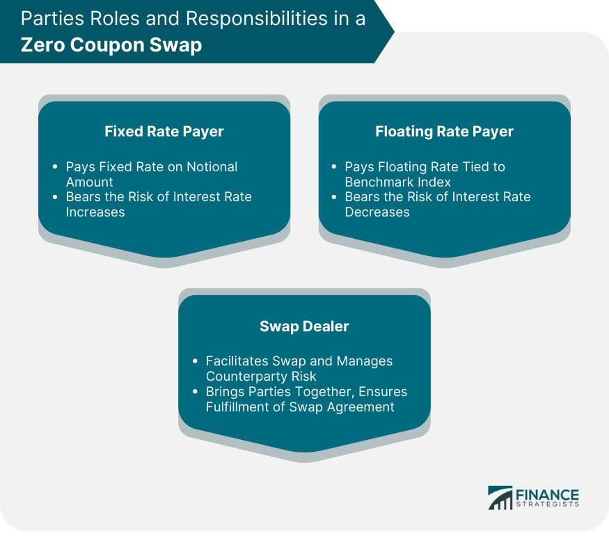

## Table of Contents

## What is a Zero-Coupon Swap?

A Zero-Coupon Swap is a type of financial agreement where one party agrees to pay a lump sum at the end of the swap period, while the other party makes regular payments throughout the period. Unlike regular swaps where payments are exchanged periodically, in a zero-coupon swap, only one large payment is made at the end. This can be useful for companies that want to manage their cash flow more effectively because they don't have to worry about making payments until the end.

These swaps are often used to hedge against interest rate risks. For example, if a company expects interest rates to rise, it might enter into a zero-coupon swap to lock in current rates. The company would receive regular payments based on a floating rate and then pay a single, larger amount at the end based on a fixed rate. This way, the company can plan its finances better, knowing exactly what it will owe in the future, even if rates go up.

## How does a Zero-Coupon Swap differ from a regular swap?

A Zero-Coupon Swap and a regular swap both help manage financial risks, but they work a bit differently. In a regular swap, two parties agree to exchange payments over time. One might pay a fixed rate, while the other pays a floating rate. These payments happen regularly, like every month or every year. This can be good for businesses that need to balance their cash flow regularly.

On the other hand, a Zero-Coupon Swap is simpler because it involves only one big payment at the end. One party makes no payments until the swap ends, while the other party might make regular payments or none at all during the period. At the end, the first party pays a lump sum. This can be useful if a company wants to avoid making regular payments and prefers to settle everything at once. It's like saving up all your payments and paying them all at the end instead of bit by bit.

## What are the main components of a Zero-Coupon Swap?

A Zero-Coupon Swap has a few key parts that make it work. The first part is the notional amount, which is like the size of the deal. It's the amount of money the swap is based on, but it's not actually exchanged. Instead, it's used to figure out the payments. The second part is the fixed rate, which is agreed upon at the start. This rate helps determine how much the lump sum payment will be at the end.

The third part is the floating rate, which can change over time. This rate is usually linked to something like the LIBOR or another benchmark interest rate. One party in the swap will receive payments based on this floating rate throughout the swap's life. Finally, there's the maturity date, which is when the swap ends. On this date, the party that didn't make payments during the swap has to pay a big lump sum based on the fixed rate and the notional amount.

## Who are the typical participants in a Zero-Coupon Swap?

The typical participants in a Zero-Coupon Swap are usually big companies and financial institutions like banks. Companies might use these swaps to manage their money better. For example, a company that knows it will have a lot of money at the end of a project might use a Zero-Coupon Swap to lock in today's interest rates. This way, they don't have to worry about rates going up before they have to pay.

Banks and other financial institutions often participate in Zero-Coupon Swaps too. They might use these swaps to help their clients manage risk or to balance their own financial portfolios. For banks, these swaps can be a way to make money by charging a fee for setting up the swap or by taking a small part of the payments. Both companies and banks see Zero-Coupon Swaps as useful tools for planning and managing money in the future.

## What are the benefits of using a Zero-Coupon Swap?

One big benefit of using a Zero-Coupon Swap is that it helps companies plan their money better. Instead of making payments every month or year, a company can wait until the end of the swap to make one big payment. This can be really helpful if a company knows it will have a lot of money at the end of a project or at a certain time. It's like saving up all the payments and paying them all at once, which can be easier to manage.

Another benefit is that Zero-Coupon Swaps can help companies lock in today's interest rates. If a company thinks interest rates might go up in the future, they can use a Zero-Coupon Swap to make sure they pay based on the rates now. This way, they don't have to worry about rates going up and their payments getting bigger. It's a way to keep their money plans safe and predictable.

## What are the risks associated with Zero-Coupon Swaps?

One risk with Zero-Coupon Swaps is that they can be tricky if interest rates move in ways you didn't expect. If rates go down instead of up, the company that agreed to pay the big lump sum at the end might end up paying more than they would have with regular payments. This can be tough if they were counting on rates staying the same or going up.

Another risk is that because you're not making payments until the end, you might forget about the big payment coming up. It can be a surprise if you're not keeping track of it. If the company doesn't have enough money when the swap ends, it could be in big trouble. They need to make sure they save up or plan well to have the money ready.

Also, Zero-Coupon Swaps can be complicated to set up and understand. If you don't fully get how they work, you might make a mistake that costs a lot of money. It's important to work with people who really know what they're doing when you're dealing with these kinds of financial agreements.

## How is the pricing of a Zero-Coupon Swap determined?

The pricing of a Zero-Coupon Swap depends on a few key things. The first thing is the notional amount, which is the size of the deal. The bigger the notional amount, the bigger the final payment will be. The second thing is the fixed rate that's agreed upon at the start. This rate helps figure out how much the lump sum payment will be at the end of the swap. The third thing is the floating rate, which can change over time and is usually based on something like the LIBOR. The difference between the fixed rate and the average floating rate over the swap's life is what really matters for pricing.

To figure out the final price, you need to look at how the floating rate changes during the swap. If the floating rate is usually lower than the fixed rate, the party that makes the lump sum payment at the end might end up paying more than they would have with regular payments. On the other hand, if the floating rate is higher, they could end up paying less. The timing of when the swap ends also matters because the longer the swap lasts, the more time there is for the floating rate to change. All these things together help decide how much the final payment will be.

## Can you explain the cash flow mechanics in a Zero-Coupon Swap?

In a Zero-Coupon Swap, the cash flow works differently from regular swaps. One party, let's call them Party A, doesn't make any payments until the very end of the swap. Instead, Party A waits until the swap's maturity date to make one big payment. This payment is based on a fixed rate that was agreed upon when the swap started and the notional amount of the swap. The notional amount is like the size of the deal but isn't actually exchanged.

The other party, Party B, usually makes regular payments based on a floating rate during the life of the swap. These payments are calculated using the notional amount and the current floating rate, which can change over time. Party B's payments help Party A because they give Party A a steady stream of money while they wait to make their big payment at the end. At the end of the swap, Party A pays the lump sum to Party B, and the swap is done. This way, both parties can manage their money better, with Party A saving up for one big payment and Party B making smaller payments over time.

## What are some common strategies involving Zero-Coupon Swaps?

One common strategy with Zero-Coupon Swaps is to lock in interest rates. If a company thinks interest rates will go up, they can use a Zero-Coupon Swap to make sure they pay based on today's rates. They won't have to worry about rates going up and their payments getting bigger. This is helpful for planning their money because they know exactly what they'll owe at the end, even if rates change.

Another strategy is to manage cash flow. A company might not want to make regular payments and prefer to save up for one big payment at the end. This can be useful if they know they'll have a lot of money at the end of a project or at a certain time. By using a Zero-Coupon Swap, they can avoid having to pay anything until the swap ends, which helps them keep more money in their pocket until then.

## How do regulatory requirements impact Zero-Coupon Swaps?

Regulatory requirements can have a big effect on Zero-Coupon Swaps. Rules like the ones from the Dodd-Frank Act in the United States make sure that swaps are done safely and openly. These rules might say that swaps need to be reported to a special place called a swap data repository. This helps keep track of all the swaps and makes sure everyone is playing by the rules. Companies also have to show that they understand the risks of the swaps they're using. This can make setting up a Zero-Coupon Swap more complicated and might cost more money because of all the extra work.

Another way regulations impact Zero-Coupon Swaps is through capital requirements. Banks and other financial institutions might need to keep more money on hand if they're involved in swaps. This is to make sure they can cover any losses if things go wrong. These rules can make banks think twice about offering Zero-Coupon Swaps or might make them charge more for them. So, while regulations help keep the financial system safe, they can also make Zero-Coupon Swaps a bit harder to use and more expensive.

## What are the accounting treatments for Zero-Coupon Swaps?

When it comes to accounting for Zero-Coupon Swaps, companies need to keep track of them on their books. The big payment at the end of the swap is a liability for the company that has to pay it. They need to show this on their balance sheet as a future obligation. As time goes by, they might need to adjust this amount based on changes in interest rates or other factors. This helps make sure their financial statements are accurate and show what they really owe.

Another part of accounting for Zero-Coupon Swaps is dealing with the regular payments that the other party makes. These payments can be shown as income over the life of the swap. The company receiving these payments needs to record them in their income statement, usually as interest income. This way, they can show how the swap is helping their cash flow while they wait to make the big payment at the end. Keeping good records of all these things is important for clear and honest financial reporting.

## How do Zero-Coupon Swaps fit into broader financial market strategies?

Zero-Coupon Swaps are a useful tool in the bigger picture of financial market strategies. They help companies and banks manage their money better by allowing them to lock in interest rates for the future. If a company thinks rates will go up, they can use a Zero-Coupon Swap to make sure they pay based on today's rates. This can be a smart move because it helps them plan their money better and not worry about rates changing. It's like making a deal now to avoid surprises later.

These swaps also fit into strategies for managing cash flow. Some companies might not want to make regular payments and prefer to save up for one big payment at the end. This can be helpful if they know they'll have a lot of money at a certain time, like at the end of a big project. By using a Zero-Coupon Swap, they can keep more money in their pocket until the swap ends. This way, they can use their money for other things during the swap and still take care of their financial obligations when it's time.

## What is the valuation of zero-coupon swaps?

Valuing a zero-coupon swap necessitates calculating the present value of expected cash flows, primarily employing the interest rate from a zero-coupon bond. Unlike typical interest rate swaps with periodic payments, zero-coupon swaps involve a lump-sum payment at maturity on the fixed leg. Consequently, accurate valuation of these swaps requires a keen understanding of interest rate dynamics and sophisticated financial modeling.

The essential step in valuing a zero-coupon swap is determining the appropriate discount factors for both the fixed and floating legs. For the fixed leg, the cash flow at maturity is discounted using the zero-coupon interest rate, represented as follows:

$$
PV_{\text{fixed}} = \frac{F}{(1 + r)^T}
$$

Where $PV_{\text{fixed}}$ is the present value of the fixed leg's payment, $F$ is the lump-sum payment to be made at maturity, $r$ is the zero-coupon interest rate, and $T$ is the time to maturity.

Calculating the present value of the floating leg requires estimating cash flows tied to a benchmark rate such as LIBOR or EURIBOR. Here, the challenge lies in estimating accurate spot and forward rates. The floating cash flows are generally expressed as:

$$
PV_{\text{floating}} = \sum_{i=1}^{n} \frac{C_i}{(1 + f_i)^{t_i}}
$$

Where each $PV_{\text{floating}}$ is the present value of each floating cash flow $C_i$, calculated using forward rates $f_i$ at corresponding time periods $t_i$. 

To estimate these spot and forward rates, financial analysts often utilize a method called bootstrapping. This involves constructing a yield curve from market data on interest rates, effectively allowing analysts to extract zero rates for all necessary maturities.

A basic bootstrapping implementation in Python might look like this:

```python
import numpy as np

def bootstrap_yield_curve(cash_flows, prices):
    zero_rates = []
    for i in range(len(prices)):
        p = prices[i]
        cf = np.array(cash_flows[i])
        sum_cf = sum([cf[j] / (1 + zero_rates[j]) ** (j + 1) for j in range(i)])
        zero_rate = ((cf[-1]) / (p - sum_cf)) ** (1 / (i + 1)) - 1
        zero_rates.append(zero_rate)
    return zero_rates

# Example data
cash_flows = [[100], [5, 105], [5, 5, 105]]
prices = [99, 98, 97]

print(bootstrap_yield_curve(cash_flows, prices))
```

This code calculates zero rates using cash flow and price data inputs, providing the basis for present value calculations of floating cash flows. 

In summary, the valuation of zero-coupon swaps relies on the precise calculation of these present values and requires a sophisticated understanding of interest rate environments, projected future rate movements, and the use of bootstrapping to construct comprehensive yield curves. These elements collectively inform the decision-making processes of financial analysts engaged in swap valuation.

## References & Further Reading

[1]: ["Over-the-Counter Derivatives: A Practical Guide to Swaps"](https://www.investopedia.com/ask/answers/052815/what-overthecounter-derivative.asp) by Robert E. Whaley

[2]: Hull, J. C. (2018). ["Options, Futures, and Other Derivatives"](https://www.semanticscholar.org/paper/Options%2C-Futures%2C-and-Other-Derivatives-Hull/89bdee500c8623864fc9eb7a471546aa713acc44). Pearson Education.

[3]: ["Interest Rate Swaps and Other Derivatives"](https://cupola.columbia.edu/3c8e3f.pdf) by Howard Corb

[4]: Dodd-Frank Wall Street Reform and Consumer Protection Act. [Full Text of the Dodd-Frank Act](https://www.congress.gov/bill/111th-congress/house-bill/4173/text)

[5]: ["Algorithmic Trading: Winning Strategies and Their Rationale"](https://www.amazon.com/Algorithmic-Trading-Winning-Strategies-Rationale-ebook/dp/B00CY5HC0U) by Ernest P. Chan

[6]: ["The European Market Infrastructure Regulation: An Introduction"](https://en.wikipedia.org/wiki/European_Market_Infrastructure_Regulation) by the European Central Bank 

[7]: ["Swaps and Other Derivatives"](https://www.investopedia.com/ask/answers/060215/what-difference-between-derivatives-and-swaps.asp) by Richard Renner