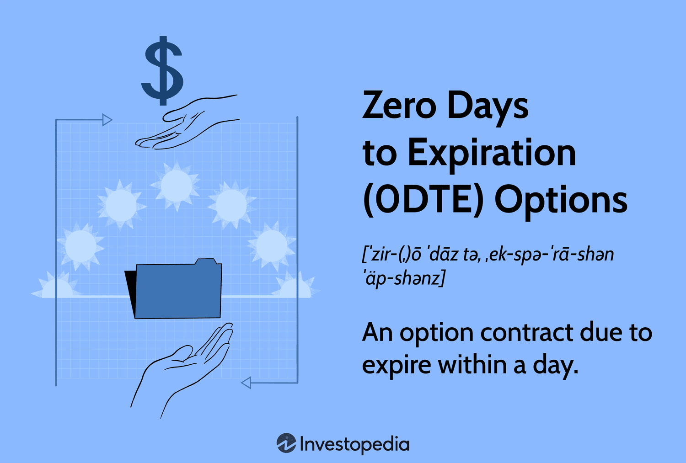

## Table of Contents

## What are Zero Days to Expiration (0DTE) options?

Zero Days to Expiration (0DTE) options are a type of financial option that expire on the same day they are traded. This means that once you buy or sell a 0DTE option, it will either be worth something or be worthless by the end of the trading day. These options are popular among traders who want to make quick decisions based on the day's market movements. Because they expire so quickly, they can be very risky but also offer the potential for high rewards if the market moves in the right direction.

0DTE options are often used by experienced traders who are comfortable with the fast-paced nature of these options. They can be used to speculate on short-term market movements or to hedge other positions in a portfolio. However, because of their short lifespan, 0DTE options require constant monitoring and quick decision-making. This makes them less suitable for beginners who might not have the time or experience to manage such rapid trades effectively.

## How do 0DTE options differ from traditional options?

0DTE options and traditional options both give you the right to buy or sell an asset at a certain price, but they have a big difference: when they expire. Traditional options can last from a few days to several months or even years. This gives you more time to decide what to do with them. On the other hand, 0DTE options expire on the same day you trade them. This means you need to act fast and make decisions quickly because there's no time to wait and see what happens.

Because 0DTE options expire so quickly, they can be much riskier than traditional options. If the market moves against you, you could lose your money in just one day. But if the market moves in your favor, you could make a big profit in a short time. Traditional options give you more time to be right about your prediction, so they can be less risky. People who trade 0DTE options often do so to take advantage of quick market changes or to make fast money, while those who trade traditional options might be looking at longer-term trends.

## What are the key benefits of trading 0DTE options?

Trading 0DTE options can be exciting because they let you make money quickly. Since these options expire on the same day, you can take advantage of fast changes in the market. If you think a stock will go up or down a lot in just one day, 0DTE options let you bet on that movement and possibly make a big profit in a short time. This is great for traders who like to act fast and make quick decisions.

Another benefit is that 0DTE options can help you save on costs. Traditional options can be expensive because they last longer, but 0DTE options are cheaper since they only last one day. This means you can start trading with less money. Also, if you already own stocks, you can use 0DTE options to protect your investments from sudden drops in the market. This way, you can manage your risks better and feel more secure about your trading choices.

## What are the risks associated with 0DTE options?

Trading 0DTE options can be very risky because they expire on the same day you buy them. If the market doesn't move the way you expect, you could lose all your money in just one day. This is much faster than with traditional options, where you have more time to see if your prediction is right. Because 0DTE options are so short, you need to watch the market very closely and be ready to make quick decisions, which can be stressful and hard for many people.

Another big risk is that 0DTE options can be hard to predict. The market can change quickly, and small news or events can make big differences in the price of the option. This makes it tough to guess if you'll make money or lose it. If you're wrong, you don't have time to fix your mistake because the option expires so fast. This kind of trading is usually best for people who know a lot about the market and can handle the pressure of making fast choices.

## How can beginners start trading 0DTE options?

For beginners interested in trading 0DTE options, it's important to start with a solid understanding of the basics. First, you need to open a brokerage account that allows you to trade options. Many online brokers offer this service, but make sure to choose one that is reputable and user-friendly. Once your account is set up, you'll need to get approved for options trading, which might involve filling out a questionnaire about your experience and risk tolerance. It's a good idea to start with a practice account or a simulator to get a feel for how 0DTE options work without risking real money.

After you're comfortable with the basics, you can start trading 0DTE options. Remember, these options expire on the same day you buy them, so you need to keep a close eye on the market and be ready to act quickly. Start with small amounts of money to limit your risk. It's also helpful to set clear goals and have a plan for when to buy and sell. Since 0DTE options can be very risky, it's wise to learn as much as you can and maybe even talk to more experienced traders or take a [course](/wiki/best-algorithmic-trading-courses) to improve your skills.

## What strategies are effective for trading 0DTE options?

When trading 0DTE options, one effective strategy is to focus on market trends and news that can move the market quickly. Since these options expire on the same day, you need to pay close attention to events that might affect stock prices, like earnings reports or economic news. If you think a stock will go up or down a lot in one day, you can buy a 0DTE option to bet on that movement. This can help you make money fast if you're right, but it's also very risky because the market can change suddenly.

Another strategy is to use 0DTE options as a way to hedge your other investments. If you own stocks and you're worried about a sudden drop in the market, you can buy 0DTE options to protect your money. For example, if you think the market might go down today, you can buy a put option that will increase in value if the market falls. This way, even if your stocks lose value, your 0DTE option might make up for some of that loss. It's like having insurance for your investments, but remember, it's still a risky move because you have to get your timing right.

## How does the pricing of 0DTE options work?

The pricing of 0DTE options is based on how likely it is for the option to be worth something at the end of the trading day. This is called the option's "probability of expiring in-the-money." If people think there's a good chance the stock will move in the right direction before the option expires, the option will be more expensive. The price also depends on how much the stock is expected to move that day, which is known as "implied volatility." If the market expects big moves, the option's price goes up because it's riskier.

Another thing that affects the price of 0DTE options is the time left until they expire. Since 0DTE options only last one day, the time value is very small compared to longer-term options. This means the price of a 0DTE option is mostly based on the stock's current price and how much it's expected to move that day. As the trading day goes on, the time value gets smaller and smaller, which can make the option's price change quickly. So, when you're trading 0DTE options, you need to keep an eye on the clock and the market to understand how the price might change.

## What impact does market volatility have on 0DTE options?

Market volatility has a big impact on 0DTE options. When the market is very volatile, it means that stock prices are moving a lot in a short time. This makes 0DTE options more expensive because there's a bigger chance the stock will move enough to make the option worth something by the end of the day. Traders expect more ups and downs, so they're willing to pay more for the chance to make money from these quick changes.

Because 0DTE options only last one day, they're very sensitive to how the market is acting right now. If the market is calm and not moving much, 0DTE options will be cheaper because there's less chance for big price swings. But if something big happens, like a surprise news event, and the market starts to move a lot, the price of 0DTE options can change quickly. This makes trading them exciting but also risky because you need to be ready to act fast.

## How do professional traders utilize 0DTE options in their portfolios?

Professional traders often use 0DTE options to take advantage of quick market moves. They might buy these options if they think a stock will go up or down a lot in just one day. Because 0DTE options expire so fast, they can make money quickly if their guess is right. But they also know it's very risky, so they use these options carefully. They might only use a small part of their money on 0DTE options and keep the rest in safer investments.

Another way professional traders use 0DTE options is to protect their other investments. If they own stocks and think the market might drop suddenly, they can buy 0DTE put options. This can help them lose less money if the market goes down. It's like having insurance for their stocks, but only for one day. They watch the market closely and are ready to make quick decisions, because with 0DTE options, there's no time to wait and see what happens.

## What are the tax implications of trading 0DTE options?

Trading 0DTE options can have special tax rules that you need to know about. If you make money from trading these options, you have to pay taxes on it. The money you make is usually treated as short-term capital gains because you hold the options for less than a year, often just one day. This means you'll pay taxes on your gains at your regular income tax rate, which can be higher than the tax rate for long-term capital gains.

Keeping good records is really important when you trade 0DTE options. You need to write down when you buy and sell the options, how much you paid, and how much you made. This helps you figure out your taxes correctly. If you lose money on your trades, you might be able to use those losses to lower your taxes. But the rules can be tricky, so it's a good idea to talk to a tax professional to make sure you're doing everything right.

## How does the timing of trading 0DTE options affect outcomes?

The timing of trading 0DTE options is really important because these options only last one day. If you buy them early in the morning, you have the whole day to see if the market moves the way you think it will. But if you wait until the afternoon, you have less time for the market to move in your favor. So, trading early can give you more chances to make money, but it also means you have to watch the market all day.

If you trade 0DTE options near the end of the day, the price can change a lot in the last few hours. This is because the time value of the option gets smaller as it gets closer to expiring. If the market moves a lot right before the end of the day, you might make more money, but it's also riskier because you have less time to react. So, the timing of when you buy and sell 0DTE options can make a big difference in whether you win or lose.

## What advanced techniques can be used to maximize returns from 0DTE options?

One advanced technique for maximizing returns from 0DTE options is to use a strategy called "straddles." This means you buy both a call option and a put option on the same stock at the same time. You do this when you think the stock will move a lot, but you're not sure which way. If the stock goes up a lot, the call option makes money. If it goes down a lot, the put option makes money. This can help you make money no matter which way the market moves, as long as it moves enough.

Another technique is to use "delta hedging." This is a bit more complicated, but it means you keep changing your options to balance out the risk. If you own a stock and you buy a 0DTE put option to protect it, you might need to adjust that option as the stock price changes. By doing this, you can keep your risk low and still have a chance to make money if the market moves the right way. Both of these techniques need a lot of watching and quick thinking, but they can help you get the most out of trading 0DTE options.

## What is the understanding of Financial Derivatives and Options?

Financial derivatives are financial instruments whose value is determined by the value of an underlying asset, such as stocks, indices, commodities, or currencies. These derivatives enable investors to gain exposure to asset price movements without directly owning the asset itself. As a result, derivatives provide significant flexibility in financial markets for managing risks and creating profit opportunities.

Options are a prominent type of financial derivative. They grant the holder the right, but not the obligation, to buy (call option) or sell (put option) an underlying asset at a predetermined price—known as the strike price—before the option's expiration date. This flexibility offers investors various strategic possibilities, including hedging against potential losses in their portfolios or profiting from anticipated asset price movements.

The pricing and risk level of options are influenced by several key factors. First is the expiration date, which determines the time frame within which the option can be exercised. As an option approaches its expiration, its time value decreases, a phenomenon known as time decay. Volatility is another crucial [factor](/wiki/factor-investing); it signifies the degree of variation in the price of the underlying asset. Higher [volatility](/wiki/volatility-trading-strategies) generally increases the option's value due to the wider range of possible future price movements. Lastly, time-value, a component of the option's overall price, reflects the option's premium over its intrinsic value due to the time remaining until expiration. These elements are often modeled using the Black-Scholes option pricing formula and other similar models. The Black-Scholes formula, for example, is expressed as follows:

$$
C = S_0N(d_1) - Xe^{-rt}N(d_2)
$$

where:

- $C$ is the call option price
- $S_0$ is the current stock price
- $X$ is the strike price
- $r$ is the risk-free interest rate
- $t$ is the time to expiration
- $N$ is the cumulative distribution function of the standard normal distribution
- $d_1$ and $d_2$ are calculated as follows:

$$
d_1 = \frac{\ln(S_0/X) + (r + \sigma^2/2)t}{\sigma\sqrt{t}}
$$

$$
d_2 = d_1 - \sigma\sqrt{t}
$$

in which $\sigma$ represents the volatility of the asset.

Financial derivatives, including options, serve diverse purposes in the market. They are extensively utilized for hedging, allowing investors to mitigate potential losses from adverse market moves. Derivatives also facilitate speculation, enabling traders to take positions based on their predictions of future price adjustments. Additionally, they can be leveraged to exploit price volatility, offering the potential for significant gains, albeit with associated risks. Understanding the mechanics and pricing influences of derivatives and options is fundamental for traders looking to strategically harness these financial tools in their investment strategies.

## References & Further Reading

[1]: Bergstra, J., Bardenet, R., Bengio, Y., & Kégl, B. (2011). ["Algorithms for Hyper-Parameter Optimization."](https://papers.nips.cc/paper/4443-algorithms-for-hyper-parameter-optimization) Advances in Neural Information Processing Systems 24.

[2]: ["Advances in Financial Machine Learning"](https://www.amazon.com/Advances-Financial-Machine-Learning-Marcos/dp/1119482089) by Marcos Lopez de Prado

[3]: ["Evidence-Based Technical Analysis: Applying the Scientific Method and Statistical Inference to Trading Signals"](https://www.amazon.com/Evidence-Based-Technical-Analysis-Scientific-Statistical/dp/0470008741) by David Aronson

[4]: ["Machine Learning for Algorithmic Trading"](https://github.com/stefan-jansen/machine-learning-for-trading) by Stefan Jansen

[5]: ["Quantitative Trading: How to Build Your Own Algorithmic Trading Business"](https://www.amazon.com/Quantitative-Trading-Build-Algorithmic-Business/dp/1119800064) by Ernest P. Chan