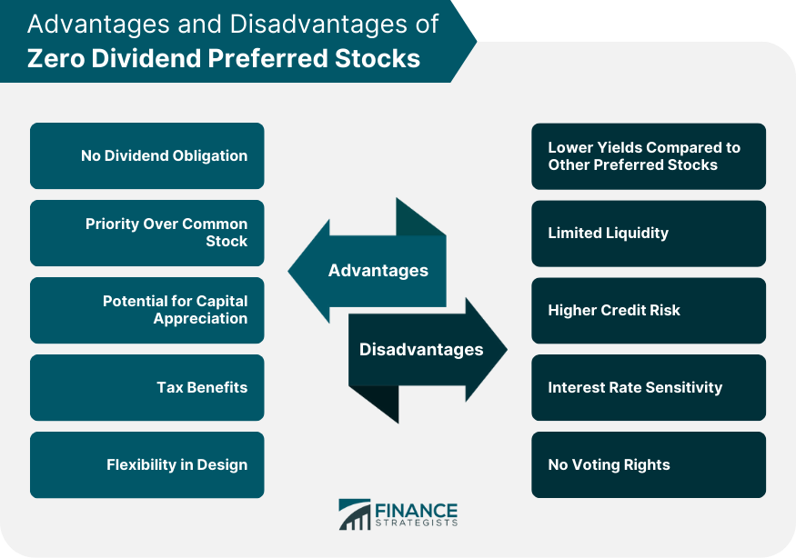

## Table of Contents

## What is Zero-Dividend Preferred Stock?

Zero-Dividend Preferred Stock is a type of stock that does not pay any dividends to its shareholders. Instead, the value of this stock comes from the potential increase in its price over time. Investors buy this stock hoping that its price will go up, allowing them to sell it later for a profit. This type of stock is often used by companies that want to raise money without the obligation of paying regular dividends.

These stocks are less common than traditional dividend-paying preferred stocks, but they can be attractive to certain investors. Since they don't provide regular income, they are usually more appealing to investors who are looking for growth rather than income. Companies might issue zero-dividend preferred stock if they are in a growth phase and want to reinvest all their earnings back into the business rather than paying out dividends.

## How does Zero-Dividend Preferred Stock differ from traditional preferred stock?

Zero-Dividend Preferred Stock and traditional preferred stock are different in a few key ways. The main difference is that zero-dividend preferred stock does not pay any dividends to its shareholders. This means that if you own this type of stock, you won't get any regular payments from the company. On the other hand, traditional preferred stock does pay dividends, usually at a fixed rate. This makes traditional preferred stock more attractive to investors who want a steady income from their investments.

Another difference is the reason why companies issue these stocks. Companies might issue zero-dividend preferred stock if they are in a growth phase and want to keep all their earnings to reinvest in the business. This type of stock appeals to investors who are looking for the stock price to go up over time so they can sell it for a profit. In contrast, companies issue traditional preferred stock to attract investors who want a reliable income stream. These investors are often more interested in the regular dividend payments than in the potential for the stock price to increase.

## What are the key features of Zero-Dividend Preferred Stock?

Zero-Dividend Preferred Stock is a type of stock that does not give any money to its owners as dividends. Instead, people who buy this stock hope that its price will go up over time. They want to sell it later for more money than they paid for it. This kind of stock is good for people who want their money to grow, not for those who need regular payments.

Companies might choose to offer Zero-Dividend Preferred Stock when they are growing and want to use all their money to make the business bigger. This stock can be attractive to investors who believe in the company's future and are willing to wait for the stock price to increase. Unlike regular preferred stock, which pays a fixed amount of money regularly, Zero-Dividend Preferred Stock focuses on the potential for the stock's value to rise.

## Who typically issues Zero-Dividend Preferred Stock?

Zero-Dividend Preferred Stock is usually issued by companies that are in a growth phase. These companies want to use all their money to make their business bigger and better. They don't want to pay out money as dividends because they believe they can make more money by reinvesting it in the company. This type of stock helps them raise money without the obligation to pay regular dividends.

Investors who buy Zero-Dividend Preferred Stock are often looking for their investment to grow over time. They believe in the company's future and are willing to wait for the stock price to go up. This stock is not for people who need regular income from their investments, but for those who are happy to take a risk for a potentially bigger reward later.

## What are the advantages of investing in Zero-Dividend Preferred Stock for investors?

One advantage of investing in Zero-Dividend Preferred Stock is that it can offer the potential for the stock price to go up a lot. If you believe in the company and think it will grow, this stock can be a good choice. You won't get any regular payments, but if the company does well, the value of your stock could increase a lot. This means you could sell it later for more money than you paid for it.

Another advantage is that this type of stock can be good for people who don't need regular income from their investments. If you are okay with waiting and don't need money right away, Zero-Dividend Preferred Stock can be a way to invest in a growing company. It lets you be part of the company's growth without the company having to pay out money as dividends. This can be a smart choice if you are looking for your investment to grow over time.

## What are the potential disadvantages of Zero-Dividend Preferred Stock for investors?

One big disadvantage of Zero-Dividend Preferred Stock is that you don't get any regular money from the company. If you need money to live on or pay bills, this type of stock might not be good for you. You have to wait for the stock price to go up to make money, and there's no guarantee that will happen. If the company doesn't do well, the stock price might go down instead of up, and you could lose money.

Another disadvantage is that this stock can be riskier than other types of stocks. Because you're not getting any dividends, all your potential profit comes from the stock price going up. If the company doesn't grow as expected, you might not see any return on your investment for a long time, or at all. This makes Zero-Dividend Preferred Stock less appealing if you want a safer investment or need to see some return on your money sooner rather than later.

## How does Zero-Dividend Preferred Stock impact a company's financial strategy?

Zero-Dividend Preferred Stock can help a company keep more money to grow its business. When a company issues this type of stock, it doesn't have to pay out money as dividends. This means the company can use all its earnings to make the business bigger and better. This can be really helpful for companies that are in a growth phase and want to reinvest all their money back into the company.

However, there are also some challenges for the company. Investors who buy Zero-Dividend Preferred Stock are betting on the company's future growth. If the company doesn't do well, the stock price might not go up, and investors could get upset. This could make it harder for the company to raise money in the future. So, while Zero-Dividend Preferred Stock can help a company keep more money now, it also puts more pressure on the company to perform well and grow.

## What are the tax implications of holding Zero-Dividend Preferred Stock?

Holding Zero-Dividend Preferred Stock can have different tax implications compared to other types of stocks. Since this stock doesn't pay any dividends, you won't have to pay taxes on dividend income. This can be a good thing if you want to avoid paying taxes on regular payments from your investments.

However, if you sell your Zero-Dividend Preferred Stock for a profit, you might have to pay capital gains tax. The amount of tax you pay depends on how long you held the stock before selling it. If you held it for more than a year, you might pay a lower tax rate on the profit than if you sold it within a year. So, while you don't have to worry about taxes on dividends, you still need to think about taxes if you make money by selling the stock.

## How does the valuation of Zero-Dividend Preferred Stock work?

The valuation of Zero-Dividend Preferred Stock is different from other stocks because it doesn't pay any dividends. Instead, its value comes from how much people think the stock price will go up in the future. Investors look at the company's growth potential and how well it's doing to decide if the stock is worth buying. If they believe the company will do well and the stock price will go up a lot, they might be willing to pay more for the stock.

To figure out the value, investors might use different methods. One common way is to look at the company's future earnings and how fast it's growing. They might also compare the stock to similar stocks in the market to see if it's a good deal. Since there are no dividends to help with the valuation, it's all about guessing how much the stock price might increase. This makes the valuation of Zero-Dividend Preferred Stock more about the company's future potential than its current earnings.

## What are the risks associated with Zero-Dividend Preferred Stock?

One big risk of Zero-Dividend Preferred Stock is that you don't get any regular money from the company. If you need money to live on or pay bills, this type of stock might not be good for you. You have to wait for the stock price to go up to make money, and there's no guarantee that will happen. If the company doesn't do well, the stock price might go down instead of up, and you could lose money.

Another risk is that this stock can be more risky than other types of stocks. Because you're not getting any dividends, all your potential profit comes from the stock price going up. If the company doesn't grow as expected, you might not see any return on your investment for a long time, or at all. This makes Zero-Dividend Preferred Stock less appealing if you want a safer investment or need to see some return on your money sooner rather than later.

## How can Zero-Dividend Preferred Stock be used in corporate restructuring or acquisitions?

Companies can use Zero-Dividend Preferred Stock in corporate restructuring or acquisitions to raise money without having to pay regular dividends. When a company is going through a big change or buying another company, it might need a lot of money. By issuing Zero-Dividend Preferred Stock, the company can get the money it needs without the added cost of paying dividends. This can be really helpful because the company can use all its earnings to make the restructuring or acquisition work better.

Investors who buy Zero-Dividend Preferred Stock during a restructuring or acquisition are betting on the company's future success. They believe that after the big change or acquisition, the company will grow and the stock price will go up. If the company does well, these investors can sell their stock for a profit. But if the restructuring or acquisition doesn't go as planned, the stock price might not go up, and investors could lose money. So, it's a way for companies to raise money, but it comes with risks for both the company and the investors.

## What are some real-world examples of companies that have issued Zero-Dividend Preferred Stock and the outcomes?

One example of a company that issued Zero-Dividend Preferred Stock is Tesla. Back in 2010, Tesla issued this type of stock to raise money for its growth. Investors who bought the stock believed in Tesla's future and were willing to wait for the stock price to go up. Over time, Tesla did very well, and the stock price went up a lot. People who held onto their Zero-Dividend Preferred Stock made a lot of money when they sold it.

Another example is a company called Rocket Lab, which is in the space industry. In 2021, Rocket Lab issued Zero-Dividend Preferred Stock to help fund its growth and new projects. Investors who bought this stock were betting on Rocket Lab's future success in the space industry. As of now, Rocket Lab is still growing, and the stock price has gone up, but it's still early to say how much money investors will make in the long run. Both examples show how companies can use Zero-Dividend Preferred Stock to raise money and how it can be a good or risky investment depending on the company's success.

## References & Further Reading

[1]: Marcos Lopez de Prado. ["Advances in Financial Machine Learning"](https://www.amazon.com/Advances-Financial-Machine-Learning-Marcos/dp/1119482089), Wiley, 2018.

[2]: David Aronson. ["Evidence-Based Technical Analysis: Applying the Scientific Method and Statistical Inference to Trading Signals"](https://www.amazon.com/Evidence-Based-Technical-Analysis-Scientific-Statistical/dp/0470008741), Wiley, 2006.

[3]: Stefan Jansen. ["Machine Learning for Algorithmic Trading"](https://github.com/stefan-jansen/machine-learning-for-trading), Packt Publishing, 2018.

[4]: Ernest P. Chan. ["Quantitative Trading: How to Build Your Own Algorithmic Trading Business"](https://www.amazon.com/Quantitative-Trading-Build-Algorithmic-Business/dp/0470284889), Wiley, 2008.