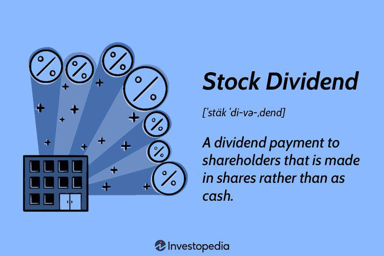

This article will explore the nuances of zero-dividend preferred stock as a financial instrument, highlighting its investment pros and cons. Zero-dividend preferred stocks are distinct because they do not provide regular income through dividends, offering investors different benefits such as potential capital appreciation over time. Understanding both the merits and detractions of these financial instruments will enable investors to make informed decisions about their inclusion in investment portfolios.

The discussion extends to the utilization of algorithmic trading within the context of preferred stock investments. Algorithmic trading, driven by technology, is transforming the financial landscape by enabling decisions based on precise, predefined criteria. This evolution in trading practice allows for efficient execution that surpasses human capabilities. Applying these systems to preferred stock investments, particularly zero-dividend varieties, provides possibilities for optimizing the timing of trades, and consequently, securing capital gains.



With the surge in automated trading systems, gaining familiarity with these strategies becomes imperative for contemporary investors. Such understanding ensures that they remain competitive in a rapidly evolving market environment. Investors can achieve a comprehensive overview of zero-dividend preferred stocks and the positioning of these stocks within an algorithm-driven trading strategy, enhancing the potential for maximizing investment returns.

This article aims to assist investors in making astute decisions about integrating zero-dividend preferred stocks into their portfolios, taking into account the influence of algorithmic trading strategies. By exploring these topics, the article provides valuable insights, ultimately guiding investors on the compatibility of zero-dividend preferred stocks with algorithmic trading frameworks. Insights on the strategic alignment of these investments with broader portfolio objectives will be examined in the final section.

## Table of Contents

## Understanding Zero-Dividend Preferred Stock

Zero-dividend preferred stock is a specific category of preferred shares that deviates from the traditional dividend-paying structure. Unlike regular preferred shares, which are known for providing steady dividend payments to investors, zero-dividend preferred stocks do not offer these regular income streams. Instead, they provide potential capital appreciation benefits, with investors potentially receiving a lump-sum payment at the end of the investment term. This structure positions zero-dividend preferred stocks closer to zero-coupon bonds, given that both types of securities are designed to benefit predominantly from appreciation in value rather than income generation over time.

A notable advantage of zero-dividend preferred stocks is their seniority in the corporate capital structure. In the unfortunate event of liquidation, these stocks have a higher claim on assets than common stockholders. This priority makes them a relatively safer option compared to common stocks, which can be crucial in financial downturns when a company's worst-case scenarios become a reality.

From the issuer's perspective, zero-dividend preferred stocks are an attractive means of raising capital. They provide companies with the necessary funding without the ongoing obligation of cash outflows associated with regular dividend distributions. This can be particularly advantageous for firms that anticipate cash flow constraints or prefer to reinvest profits back into the company rather than distributing them to shareholders. Additionally, this form of [capital raising](/wiki/hedge-fund-capital-raising) imposes fewer restrictive covenants compared to traditional debt instruments, offering companies greater operational flexibility.

The similarities between zero-dividend preferred stocks and zero-coupon bonds lie in their fundamental investment nature. Both securities tend to be priced below their face value at issuance and aim to reward investors primarily through capital appreciation. Over the term of the investment, the value of these securities typically increases as they approach maturity, reflecting the accrual of the implied interest or dividend that is not distributed on a regular basis. This makes them appealing to investors seeking long-term growth rather than immediate income.

In summary, zero-dividend preferred stock serves as a sophisticated financial instrument that caters to both corporate needs for capital infusion and investor desires for capital appreciation. Its characteristics of prioritized liquidation rights and the absence of immediate cash flow obligations make it a unique asset in an investor's portfolio.

## Pros and Cons of Investing in Zero-Dividend Preferred Stock

Zero-dividend preferred stock offers both advantages and disadvantages as an investment vehicle. One of the primary benefits is the potential for tax efficiency. As these stocks do not distribute regular dividends, any profits made from such an investment are often in the form of capital gains. In many jurisdictions, capital gains are taxed at a lower rate than dividend income, making this an attractive option for investors looking to reduce their tax liability.

During periods of market [volatility](/wiki/volatility-trading-strategies), zero-dividend preferred stocks can serve as stable investment options. Their relative insulation from regular income fluctuations can make them less susceptible to short-term market swings, allowing investors to maintain a more stable portfolio. However, this stability does not imply immunity to market dynamics. In bullish market conditions where equities experience significant appreciation, zero-dividend preferred stocks may underperform, limiting potential gains for investors who are not diversified across other asset classes.

The lack of regular dividend disbursements is a crucial drawback, as it deprives investors of a consistent income stream that many rely on for cash flow or reinvestment. This limitation necessitates a more long-term perspective focused on capital appreciation rather than immediate income.

Moreover, zero-dividend preferred stocks are not entirely devoid of risks tied to economic factors such as inflation. As inflation increases, the purchasing power of capital gains could diminish unless the investment's value appreciates at a similar or higher rate. To counteract this, investors must employ strategic management and possibly integrate hedging techniques or more dynamic components into their investment framework to combat inflationary pressures.

In summary, while investing in zero-dividend preferred stocks may offer tax advantages and relative stability, it is essential for investors to weigh these benefits against the inherent risks of missing regular income and potential susceptibility to unfavorable market conditions and inflation. This balance demands a careful strategic approach to make the most of these investment opportunities.

## Algorithmic Trading in the Context of Zero-Dividend Preferred Stocks

Algorithmic trading, a sophisticated method of executing trades, employs computer algorithms to execute orders rapidly and efficiently. By leveraging this technology, traders can execute trades based on pre-set criteria, enabling speeds and efficiencies that surpass human capabilities. When integrating zero-dividend preferred stocks into [algorithmic trading](/wiki/algorithmic-trading) systems, there are unique opportunities and challenges due to their distinct characteristics. 

Zero-dividend preferred stocks, which do not offer regular dividend payments, primarily reward investors through capital appreciation. Consequently, the timing of trades becomes crucial. Algorithmic trading systems can be programmed to optimize the timing for buying and selling these stocks, aiming to capture maximum capital gains. For example, algorithmic strategies can be designed to identify favorable market conditions based on historical data patterns and indicators, executing trades precisely when the potential for appreciation is highest.

One of the key advantages of algorithmic trading is its ability to monitor market conditions persistently. As these systems operate 24/7, they can respond instantly to price fluctuations, a benefit particularly relevant for non-dividend paying stocks like zero-dividend preferred stocks. Such immediate response capabilities are critical to leveraging short-term capital gains while maintaining long-term investment stability.

The ability of algorithms to analyze vast amounts of data and execute trades based on complex strategies mitigates the risks associated with manual, delayed transactions. In the context of zero-dividend preferred stocks, this means algorithms can incorporate various market indices, [interest rate](/wiki/interest-rate-trading-strategies) changes, and economic indicators into their trading criteria to minimize risk and maximize returns, ensuring trades are executed at optimal times.

Consider a basic algorithmic model for zero-dividend preferred stock trading using Python. The algorithm may employ technical indicators such as moving averages to detect trend shifts, where a simple decision rule can be implemented:

```python
def trade_signal(prices, short_window=40, long_window=100):
    signals = pd.DataFrame(index=prices.index)
    signals['signal'] = 0.0

    # Creating short and long simple moving averages
    signals['short_mavg'] = prices.rolling(window=short_window, min_periods=1, center=False).mean()
    signals['long_mavg'] = prices.rolling(window=long_window, min_periods=1, center=False).mean()

    # Generating signals
    signals['signal'][short_window:] = np.where(signals['short_mavg'][short_window:] 
                                                > signals['long_mavg'][short_window:], 1.0, 0.0)   
    # Creating trading orders
    signals['positions'] = signals['signal'].diff()

    return signals
```

This sample code generates buy/sell signals based on moving average crossovers, a common technique in algorithmic trading applicable to zero-dividend preferred stocks. This blend of long-term stability and short-term capital gain opportunities requires investors to continuously adjust and refine their algorithmic strategies, incorporating both historical insights and real-time data analytics to align with overall portfolio goals and market conditions.

In conclusion, the synergy between algorithmic trading strategies and zero-dividend preferred stocks provides a strategic advantage to investors. Algorithms not only facilitate timely and efficient trade executions but also bolster decision-making with data-driven insights, ensuring that investment strategies are adaptable and responsive to evolving market dynamics.

## Conclusion and Investment Strategies

Zero-dividend preferred stocks offer a unique investment opportunity, combining elements of both equity and fixed-income securities without providing periodic income through dividends. Instead, they promise potential capital appreciation and, often, a return of capital or a lump sum at a future date. This structure creates a distinct risk and reward profile that investors must carefully consider.

Algorithmic trading can enhance the performance of these investments by optimizing entry and [exit](/wiki/exit-strategy) points to maximize potential returns. Algorithms can rapidly analyze vast amounts of data and execute trades based on predetermined criteria. This capability is particularly beneficial for capturing price appreciation in zero-dividend preferred stocks, which rely heavily on capital gains rather than yield returns.

Investors should weigh several factors when considering zero-dividend preferred stocks. One advantage is the potential for tax savings, as capital gains are often taxed at a lower rate than dividends. Additionally, these stocks have priority over common stock in asset distribution during liquidation, which can provide a level of security in turbulent markets.

However, these advantages must be balanced against market risk and the impact of inflation. Without periodic dividend income, the real value of the return could be eroded over time. Market fluctuations also pose challenges, and these stocks may underperform if broader markets experience significant upswings.

For those utilizing algorithmic trading, focusing on data-driven insights is critical. Algorithms like moving average crossovers or [momentum](/wiki/momentum) indicators can help identify optimal trading opportunities. For example, using Python, an investor can implement a basic moving average crossover strategy as follows:

```python
import pandas as pd
import numpy as np

# Example stock price data (for demonstration purposes)
data = {'Date': ['2023-01-01', '2023-01-02', '2023-01-03'], 'Price': [100, 102, 101]}
df = pd.DataFrame(data)

# Calculate short-term and long-term moving averages
short_window = 2
long_window = 3
df['Short_MA'] = df['Price'].rolling(window=short_window, min_periods=1).mean()
df['Long_MA'] = df['Price'].rolling(window=long_window, min_periods=1).mean()

# Identify buy/sell signals
df['Signal'] = np.where(df['Short_MA'] > df['Long_MA'], 1, -1)

print(df)
```

This code snippet shows how to calculate moving averages and generate buy/sell signals, supporting timing decisions for zero-dividend preferred stocks.

Investors need to align these investments with their overall portfolio strategy, ensuring that risk and return potentials fit within their broader financial goals. Understanding personal risk tolerance and market conditions can help in making informed investment choices. To maximize returns, investors should also consider diversifying holdings to mitigate risks associated with individual positions or market segments.

## References & Further Reading

[1]: Marcos Lopez de Prado. ["Advances in Financial Machine Learning"](https://www.amazon.com/Advances-Financial-Machine-Learning-Marcos/dp/1119482089), Wiley, 2018.

[2]: David Aronson. ["Evidence-Based Technical Analysis: Applying the Scientific Method and Statistical Inference to Trading Signals"](https://www.amazon.com/Evidence-Based-Technical-Analysis-Scientific-Statistical/dp/0470008741), Wiley, 2006.

[3]: Stefan Jansen. ["Machine Learning for Algorithmic Trading"](https://github.com/stefan-jansen/machine-learning-for-trading), Packt Publishing, 2018.

[4]: Ernest P. Chan. ["Quantitative Trading: How to Build Your Own Algorithmic Trading Business"](https://www.amazon.com/Quantitative-Trading-Build-Algorithmic-Business/dp/0470284889), Wiley, 2008.