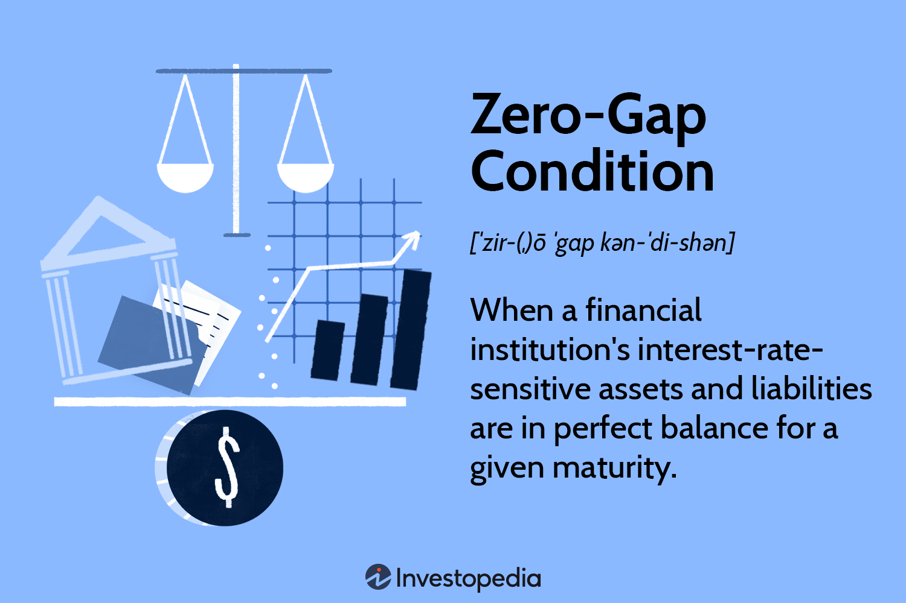

## Table of Contents

## What is the Zero-Gap Condition?

The Zero-Gap Condition is a rule in finance that helps keep markets fair and open. It says that when a stock is traded, the price of the stock should be the same no matter where it is bought or sold. This means there should be no difference, or "gap," between the buying and selling prices at different places or times.

This condition is important because it stops people from making unfair profits by buying a stock at a lower price in one place and selling it at a higher price somewhere else. By making sure the prices are the same everywhere, the Zero-Gap Condition helps everyone in the market have a fair chance to trade.

## Why is the Zero-Gap Condition important in quantum mechanics?

In quantum mechanics, the Zero-Gap Condition is important because it helps us understand how particles behave in certain materials. Imagine you have a material where electrons can move freely without any barriers. The Zero-Gap Condition means there's no energy difference, or "gap," that the electrons need to overcome to move around. This is really important in materials like semiconductors, where we want electrons to move easily to make things like computer chips work better.

When there's no energy gap, it means the material can conduct electricity really well, almost like a metal. This is useful for making new kinds of electronic devices. Scientists study these zero-gap materials to find new ways to make technology faster and more efficient. So, the Zero-Gap Condition in quantum mechanics is all about making sure electrons can move freely, which is key for developing advanced materials and technologies.

## How does the Zero-Gap Condition relate to the energy levels of a system?

The Zero-Gap Condition in quantum mechanics means there's no difference in energy levels that electrons need to jump over to move around in a material. Imagine a staircase where some steps are missing, making it hard to go up or down. In a zero-gap material, it's like all the steps are there, so electrons can move freely without needing extra energy to hop over a gap. This makes the material really good at conducting electricity, much like a metal.

This condition is super important for making things like computer chips and other electronic devices. When electrons can move easily, the devices can work faster and use less energy. Scientists study these zero-gap materials to find new ways to improve technology. So, the Zero-Gap Condition helps us understand how to make materials that can lead to better and more efficient electronics.

## Can you explain the Zero-Gap Condition using a simple example?

Imagine you have a playground with two slides. One slide has a big gap in the middle that you need to jump over to get to the bottom. The other slide is smooth all the way down, with no gaps at all. In a material with a Zero-Gap Condition, it's like the second slide. Electrons can move from the top to the bottom without having to jump over any gaps. They don't need any extra energy to keep moving, so they can flow freely.

This is really important for things like making computer chips. When electrons can move easily without gaps, the chips can work faster and use less energy. It's like having a super smooth highway for electrons, where they can zoom along without any roadblocks. Scientists study these zero-gap materials to make our technology better and more efficient.

## What are the mathematical expressions used to describe the Zero-Gap Condition?

The Zero-Gap Condition in quantum mechanics can be described using the concept of the band structure of materials. In a material, electrons move in what we call energy bands. The Zero-Gap Condition happens when the highest energy band where electrons are (the valence band) and the next band where they can move to (the conduction band) touch each other. This touching point means there's no energy difference, or gap, between them. Mathematically, this can be shown as the energy difference, E_g, being zero: E_g = 0.

This condition is important because it means electrons can move from the valence band to the conduction band without needing any extra energy. In simple terms, if we think of energy levels as steps, a zero-gap material is like having no steps at all, so electrons can move freely. This is often represented in equations that describe the energy [dispersion](/wiki/dispersion-trading) relation, where the energy (E) of an electron depends on its [momentum](/wiki/momentum) (k). For a zero-gap material, the equation might look like E(k) = ℏ^2k^2 / (2m*), where ℏ is the reduced Planck's constant, k is the wave vector, and m* is the effective mass of the electron. When this equation shows no gap between the bands, it confirms the Zero-Gap Condition.

## How is the Zero-Gap Condition experimentally verified?

Scientists use different ways to check if a material follows the Zero-Gap Condition. One common way is to use a tool called a spectrometer, which can tell us about the energy levels in the material. When they shine light on the material, they look for any signs of an energy gap. If there's no gap, it means electrons can move freely, which is what the Zero-Gap Condition says. They also use electrical tests, where they measure how well the material conducts electricity. If it conducts really well, it's a sign that there's no energy gap stopping the electrons.

Another way to verify the Zero-Gap Condition is by using a technique called angle-resolved photoemission spectroscopy (ARPES). This method lets scientists see how electrons are moving inside the material. If they see that electrons can move from one energy level to another without any jump, it confirms there's no energy gap. By combining these different methods, scientists can be sure that the material they're studying really has the Zero-Gap Condition, which is important for making new and better electronic devices.

## What are the practical applications of the Zero-Gap Condition in technology?

The Zero-Gap Condition is super important for making better electronic devices, like computer chips. When a material has no energy gap, electrons can move around easily, just like cars on a smooth highway. This makes the devices work faster and use less power. Scientists use these zero-gap materials to make things like smartphones and computers run better. For example, in a computer chip, having no energy gap means the chip can process information more quickly, which is great for gaming or running heavy programs.

Another practical use of the Zero-Gap Condition is in making new kinds of sensors. These sensors can detect tiny changes in their environment because the electrons in zero-gap materials are so sensitive. This can be useful for things like medical devices that need to measure very small signals in the body. By using zero-gap materials, these sensors can be more accurate and help doctors make better decisions. So, the Zero-Gap Condition isn't just a cool science idea; it's helping to make our technology better and more useful every day.

## How does the Zero-Gap Condition affect the behavior of semiconductors?

The Zero-Gap Condition is really important for semiconductors because it changes how they work. Normally, semiconductors have a small energy gap that electrons need to jump over to move around and conduct electricity. But when a semiconductor has no energy gap, it means electrons can move freely without needing any extra energy. This makes the semiconductor act more like a metal, where electricity can flow easily. So, a zero-gap semiconductor can conduct electricity much better, which is great for making fast and efficient electronic devices.

Scientists use zero-gap semiconductors to make things like computer chips and sensors work better. For example, in computer chips, having no energy gap means the chip can process information faster and use less power. This is really helpful for things like smartphones and laptops, where we want them to be quick and save battery life. Also, zero-gap semiconductors can be used in sensors that need to be very sensitive. These sensors can pick up tiny signals in the environment, which is useful for medical devices that need to measure small changes in the body. So, the Zero-Gap Condition helps make our technology faster, more efficient, and more useful.

## What are the differences between the Zero-Gap Condition and the Band Gap?

The Zero-Gap Condition and the Band Gap are two important ideas in materials science, especially when we talk about how electrons move in materials. The Band Gap is like a step that electrons need to jump over to move from one energy level to another. In a normal material, this step, or energy gap, makes it harder for electrons to move around, which is why some materials don't conduct electricity well. On the other hand, the Zero-Gap Condition means there is no step at all. Electrons can move freely from one energy level to another without needing any extra energy, making the material conduct electricity really well, just like a metal.

When we look at semiconductors, the difference between having a Band Gap and a Zero-Gap Condition is huge. A semiconductor with a Band Gap is like a material with a small step that electrons can sometimes jump over if they get enough energy. This is useful for controlling how electricity flows in devices like computer chips. But a semiconductor with the Zero-Gap Condition has no step at all, so electrons can move around easily all the time. This makes the semiconductor work faster and use less power, which is great for making better electronic devices like smartphones and sensors.

## How do theoretical models incorporate the Zero-Gap Condition in their calculations?

In theoretical models, scientists use math to understand how electrons move in materials. When they want to include the Zero-Gap Condition, they make sure their equations show that there's no energy difference between the levels where electrons can move. They do this by setting the energy gap, or E_g, to zero in their calculations. This means the equations they use to describe how electrons move will show that electrons can go from one level to another without needing any extra energy. It's like saying there are no steps for electrons to jump over, so they can move freely.

These models help scientists predict how zero-gap materials will behave in real life. For example, they use equations like E(k) = ℏ^2k^2 / (2m*) to describe how the energy of an electron changes as it moves. When this equation shows no gap between energy levels, it confirms the Zero-Gap Condition. By using these models, scientists can design new materials and devices that work better because electrons can move around easily. This is really important for making things like faster computer chips and more sensitive sensors.

## What challenges are faced in maintaining the Zero-Gap Condition in real-world applications?

Keeping the Zero-Gap Condition in real-world applications can be tough. One big challenge is that zero-gap materials can be sensitive to things like temperature and pressure. If the temperature changes, it might create an energy gap that wasn't there before, which means electrons can't move as freely. Also, making these materials in a lab is hard because even tiny mistakes can mess up the zero-gap property. Scientists have to be super careful to keep everything just right.

Another challenge is that zero-gap materials can be hard to use in everyday devices. They often need special conditions to work properly, like being really cold or having a perfect structure. This makes it tricky to use them in things like smartphones or computers, where we want the devices to work no matter where they are. Scientists are working on finding new ways to make zero-gap materials more stable and easier to use, but it's a slow process that needs a lot of research and testing.

## What are the latest research findings on the Zero-Gap Condition and its implications for future technologies?

Recent research on the Zero-Gap Condition has shown exciting possibilities for future technologies. Scientists have found new ways to make materials that have no energy gap, which means electrons can move around more easily. These materials can be used to make computer chips that work faster and use less power. For example, researchers have been working on materials called topological insulators, which have zero-gap properties on their surfaces. These could help make new kinds of electronics that are more efficient and use less energy, which is great for things like smartphones and laptops.

Another big finding is that zero-gap materials can be used to make better sensors. These sensors can pick up very small changes in their environment because the electrons in zero-gap materials are so sensitive. This could be really useful for medical devices that need to measure tiny signals in the body, like heartbeats or brain activity. Scientists are also looking at how zero-gap materials can help with quantum computing, where having no energy gap can make the computers work better and faster. As research continues, these findings could lead to new technologies that make our devices more powerful and efficient.

## What is Understanding Zero-Gap Mechanics?

Zero-gap mechanics represent a state wherein a financial institution’s interest-rate-sensitive assets and liabilities are perfectly aligned, effectively immunizing it from interest rate risks. This concept is integral for maintaining an institution's financial stability, particularly in the face of fluctuating interest rates.

At the heart of zero-gap mechanics lies the concept of interest rate risk management. Interest rate risk arises from the difference between the timings of cash flows from assets and liabilities. A zero-gap position means that any changes in interest rates do not lead to an unexpected surplus or shortfall, thus safeguarding the institution from potential financial distress caused by interest rate [volatility](/wiki/volatility-trading-strategies). A zero-gap condition is achieved when the weighted average maturity of assets matches the weighted average maturity of liabilities. Mathematically, this can be expressed as:

$$
\sum_{i=1}^{n} A_i \times D_{a_i} = \sum_{j=1}^{m} L_j \times D_{l_j}
$$

where $A_i$ and $L_j$ denote individual assets and liabilities, respectively, and $D_{a_i}$ and $D_{l_j}$ represent their corresponding durations.

A precise balance between these parameters ensures that the net interest margin, which is the difference between interest earned and interest paid, remains stable even when interest rates shift. This precision is crucial for entities like banks and pension funds that depend on long-term financial commitments. In large banks, this balance helps preserve net worth, whereas for pension funds, it assures the availability of resources for long-term payouts.

Interest rate fluctuations can be particularly challenging in environments where rates are volatile or undergoing significant policy-driven changes. A zero-gap condition provides stability by preventing mismatches that could otherwise lead to financial strain. By aligning asset and liability maturities, institutions can protect themselves against scenarios where an increase or decrease in interest rates might otherwise lead to an imbalance, affecting profitability and capital adequacy.

Implementing zero-gap mechanics within a financial institution requires a robust understanding of asset-liability management (ALM) techniques and the use of various hedging strategies. The application of financial derivatives such as [interest rate](/wiki/interest-rate-trading-strategies) swaps can be integral in achieving a zero-gap position, allowing institutions to adjust their exposure dynamically in response to market conditions.

In summary, zero-gap mechanics play a pivotal role in the financial stability of institutions by ensuring that interest rate risks are managed effectively. Achieving and maintaining a zero-gap condition requires the strategic alignment of asset and liability cash flows, enabling institutions to remain resilient amid the uncertainties of interest rate changes. This balance is crucial for both safeguarding the net worth of large financial entities and ensuring the fulfillment of long-term financial obligations.

## References & Further Reading

[1]: ["Advances in Financial Machine Learning"](https://www.amazon.com/Advances-Financial-Machine-Learning-Marcos/dp/1119482089) by Marcos Lopez de Prado

[2]: ["Evidence-Based Technical Analysis: Applying the Scientific Method and Statistical Inference to Trading Signals"](https://www.amazon.com/Evidence-Based-Technical-Analysis-Scientific-Statistical/dp/0470008741) by David Aronson

[3]: ["Machine Learning for Algorithmic Trading"](https://github.com/stefan-jansen/machine-learning-for-trading) by Stefan Jansen

[4]: ["Quantitative Trading: How to Build Your Own Algorithmic Trading Business"](https://www.amazon.com/Quantitative-Trading-Build-Algorithmic-Business/dp/1119800064) by Ernest P. Chan

[5]: ["Interest Rate Risk Modeling"](https://www.communitybankingconnections.org/Articles/2024/R1/interest-rate-risk-modeling) by Sanjay K. Nawalkha, Gloria M. Soto, and Natalia A. Beliaeva