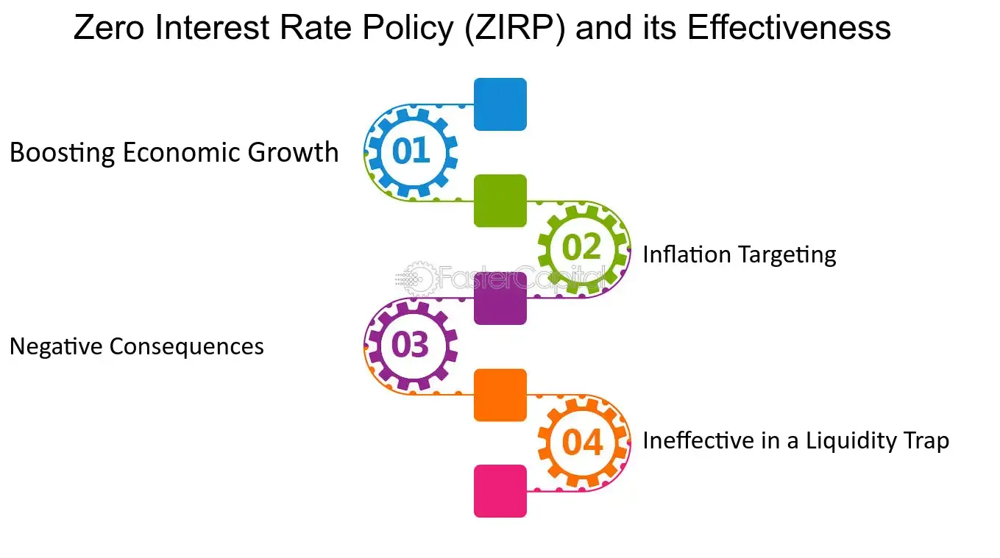

## Table of Contents

## What is a Zero Interest-Rate Policy (ZIRP)?

A Zero Interest-Rate Policy, or ZIRP, is when a country's central bank sets the interest rate at zero percent. This means that banks can borrow money from the central bank without paying any interest. The goal of ZIRP is to encourage more spending and investment in the economy. When interest rates are zero, people and businesses are more likely to borrow money because it's cheaper. This can help boost economic activity, especially during times when the economy is struggling.

However, ZIRP can also have some downsides. For one, it can make it hard for people who rely on interest from savings, like retirees, because they earn no money from their savings accounts. Also, if ZIRP lasts too long, it might lead to too much borrowing and spending, which can cause inflation. Central banks have to be careful and watch the economy closely to decide when to end a ZIRP and start raising interest rates again.

## How does a Zero Interest-Rate Policy work?

A Zero Interest-Rate Policy, or ZIRP, is when a country's central bank decides to set the interest rate at zero percent. This means that banks can borrow money from the central bank without having to pay any interest on it. The main goal of ZIRP is to make borrowing cheaper, so people and businesses are more likely to take out loans. When people borrow more, they spend more, which can help the economy grow. This is especially useful when the economy is not doing well and needs a boost.

However, ZIRP can also have some problems. For example, people who save money in the bank, like retirees, might find it hard because they don't earn any interest on their savings. Also, if ZIRP goes on for too long, it can lead to too much borrowing and spending, which can cause prices to go up too fast, a situation known as inflation. Central banks need to keep a close eye on the economy to know when to stop ZIRP and start raising interest rates again to keep things balanced.

## What are the primary objectives of implementing a ZIRP?

The main goal of a Zero Interest-Rate Policy, or ZIRP, is to help the economy grow when it's not doing well. When the central bank sets the [interest rate](/wiki/interest-rate-trading-strategies) at zero, it makes borrowing money cheaper. This encourages people and businesses to take out loans and spend more money. When people spend more, it can help businesses sell more products and services, which can lead to more jobs and a stronger economy.

However, ZIRP can also have some downsides. For example, people who save their money in the bank might not like ZIRP because they don't earn any interest on their savings. This can be tough for people like retirees who rely on the interest from their savings to live. Also, if ZIRP lasts too long, it might cause prices to go up too fast, which is called inflation. Central banks need to watch the economy carefully to decide when to stop ZIRP and start raising interest rates again to keep everything balanced.

## Can you explain the historical context in which ZIRPs have been used?

Zero Interest-Rate Policies have been used by central banks during times when economies were struggling. One of the most well-known examples is Japan, which started using ZIRP in the late 1990s. Japan's economy was going through a tough time called the "Lost Decade," where growth was slow and many businesses were having problems. The Bank of Japan hoped that by setting interest rates at zero, it would encourage people and businesses to borrow and spend more money, which could help the economy recover.

Another important time when ZIRP was used was after the global financial crisis in 2008. Many countries, including the United States, faced big economic problems. The Federal Reserve in the U.S. decided to use ZIRP to help the economy get back on its feet. By making borrowing cheaper, the Fed wanted to encourage spending and investment to help businesses grow and create jobs. These examples show how central banks use ZIRP as a tool to help their economies during tough times.

## What are the potential benefits of a Zero Interest-Rate Policy for an economy?

A Zero Interest-Rate Policy, or ZIRP, can help an economy in many ways. When the central bank sets the interest rate at zero, it makes borrowing money very cheap. This encourages people and businesses to take out loans and spend more money. When people spend more, businesses sell more products and services, which can help them grow and create more jobs. This boost in spending can help the economy recover when it's not doing well.

However, ZIRP is not a perfect solution. It can have some problems too. For example, people who save their money in the bank might not earn any interest on their savings. This can be hard for people like retirees who depend on that interest to live. Also, if ZIRP lasts too long, it might cause prices to go up too fast, which is called inflation. Central banks need to watch the economy closely to know when to stop ZIRP and start raising interest rates again to keep everything balanced.

## What are the potential drawbacks or risks associated with ZIRP?

A Zero Interest-Rate Policy, or ZIRP, can have some problems. One big issue is that it can be hard for people who save their money in the bank. When interest rates are at zero, they don't earn any money on their savings. This can be tough for people like retirees who rely on the interest from their savings to live. They might have to find other ways to make money, which can be difficult.

Another risk of ZIRP is that it might cause prices to go up too fast, which is called inflation. When borrowing money is very cheap, people and businesses might borrow and spend too much. This can lead to too much money chasing too few goods, which makes prices go up. If inflation gets out of control, it can hurt the economy. Central banks need to watch the economy closely to know when to stop ZIRP and start raising interest rates again to keep everything balanced.

## How does ZIRP affect savers and borrowers differently?

ZIRP, or Zero Interest-Rate Policy, affects savers and borrowers in very different ways. For savers, ZIRP can be tough because they don't earn any interest on the money they keep in the bank. This means that if someone is saving up for something or relying on their savings to live, like many retirees, they won't see their savings grow at all. It can make it harder for them to plan for the future or cover their living expenses.

On the other hand, ZIRP is good for borrowers. When interest rates are at zero, it's much cheaper to borrow money. This means that people and businesses can take out loans without having to pay a lot of interest. They might use these loans to buy things they need, start new projects, or grow their businesses. This can help the economy grow because when people borrow and spend more, it can lead to more jobs and more money moving around.

## What role does ZIRP play in monetary policy?

ZIRP, or Zero Interest-Rate Policy, is a tool that central banks use to help the economy when it's not doing well. When the central bank sets the interest rate at zero, it makes borrowing money very cheap. This encourages people and businesses to take out loans and spend more money. When people spend more, businesses sell more products and services, which can help them grow and create more jobs. This boost in spending can help the economy recover when it's struggling.

However, ZIRP can also have some problems. It can be hard for people who save their money in the bank because they don't earn any interest on their savings. This can be tough for people like retirees who rely on that interest to live. Also, if ZIRP lasts too long, it might cause prices to go up too fast, which is called inflation. Central banks need to watch the economy closely to know when to stop ZIRP and start raising interest rates again to keep everything balanced.

## How do central banks implement and manage a Zero Interest-Rate Policy?

Central banks implement a Zero Interest-Rate Policy, or ZIRP, by setting the interest rate they charge banks for borrowing money at zero percent. This means that banks can borrow from the central bank without paying any interest. The central bank does this by announcing the new interest rate and making sure that all banks know about it. They also use other tools, like buying government bonds, to make sure that the interest rates stay low across the whole economy. This encourages banks to lend more money to people and businesses because it's cheaper for them to get money from the central bank.

Managing a ZIRP is tricky because central banks need to watch the economy closely to see if it's working. They look at things like how much people are spending, how many people have jobs, and if prices are going up too fast. If the economy starts to get better, the central bank might decide to slowly raise interest rates again. But if the economy is still struggling, they might keep the interest rates at zero for longer. It's a balancing act because they want to help the economy grow without causing problems like too much inflation or making it hard for people who save money.

## What are the challenges faced by central banks in maintaining a ZIRP?

Keeping a Zero Interest-Rate Policy, or ZIRP, going can be hard for central banks. One big challenge is making sure that the economy gets better without causing too many problems. When interest rates are at zero, people and businesses might borrow and spend too much money. This can make prices go up too fast, which is called inflation. Central banks have to watch the economy closely to see if prices are going up too quickly and decide when to start raising interest rates again to keep things balanced.

Another challenge is that ZIRP can be tough on people who save their money in the bank. When interest rates are at zero, savers don't earn any money on their savings. This can be hard for people like retirees who rely on the interest from their savings to live. Central banks need to think about how ZIRP affects different people in the economy and try to find ways to help everyone. It's a tricky job because they want to help the economy grow but also need to make sure that people who save money are not hurt too much.

## How does ZIRP influence inflation and deflation?

ZIRP, or Zero Interest-Rate Policy, can affect inflation by making borrowing money very cheap. When people and businesses can borrow money without paying interest, they might spend more. This can lead to more money chasing the same amount of goods and services, which can push prices up. If this happens too much, it can cause inflation, where prices go up too fast. Central banks need to watch this carefully because too much inflation can hurt the economy.

On the other hand, ZIRP can also help fight deflation, which is when prices keep going down. When the economy is not doing well, people might not spend much money, and businesses might lower their prices to sell more. This can lead to a cycle where prices keep falling, and people wait for even lower prices before buying anything. By making borrowing cheaper, ZIRP encourages people to spend more, which can help stop prices from falling and prevent deflation.

## What are the long-term economic implications of prolonged use of ZIRP?

When a central bank uses a Zero Interest-Rate Policy, or ZIRP, for a long time, it can have big effects on the economy. One big effect is that it can make people and businesses borrow and spend too much money. This can lead to prices going up too fast, which is called inflation. If inflation gets out of control, it can make things more expensive and hurt the economy. Also, when interest rates are at zero for a long time, it can make it hard for banks to make money because they don't earn much from lending. This can make the whole banking system weaker.

Another long-term effect of using ZIRP for a long time is that it can be tough on people who save their money. When interest rates are at zero, savers don't earn any money on their savings. This can be hard for people like retirees who rely on the interest from their savings to live. They might have to find other ways to make money, which can be difficult. Also, if people get used to borrowing money at zero interest, it can be hard to go back to normal interest rates without causing problems. Central banks need to be careful and watch the economy closely to know when to stop using ZIRP and start raising interest rates again to keep everything balanced.

## References & Further Reading

[1]: Blinder, A. S. (2010). ["Quantitative Easing: Entrance and Exit Strategies"](https://gceps.princeton.edu/wp-content/uploads/2017/01/204blinder.pdf). Federal Reserve Bank of St. Louis Review, 92(6), 465-479.

[2]: Aldridge, I. (2013). ["High-Frequency Trading: A Practical Guide to Algorithmic Strategies and Trading Systems"](https://www.ahmetbeyefendi.com/wp-content/uploads/2020/07/High-Frequency-Trading-Irene-Aldridge.pdf). Wiley.

[3]: Bernanke, B. S. (2004). ["The Great Moderation"](https://www.federalreserve.gov/boarddocs/speeches/2004/20040220/). Speech at the Eastern Economic Association, Federal Reserve Board of Governors.

[4]: Investopedia. (n.d.). ["Zero Interest-Rate Policy (ZIRP)"](https://www.investopedia.com/articles/investing/031815/what-zero-interestrate-policy-zirp.asp). Available at: Investopedia.

[5]: Mishkin, F. S. (2018). *Financial Markets and Institutions, 9th Edition*. Pearson. Available at [Amazon](https://www.pearson.com/en-us/subject-catalog/p/financial-markets-and-institutions/P200000005990/9780137554508).

[6]: Lopez de Prado, M. (2018). ["Advances in Financial Machine Learning"](https://www.amazon.com/Advances-Financial-Machine-Learning-Marcos/dp/1119482089). Wiley.