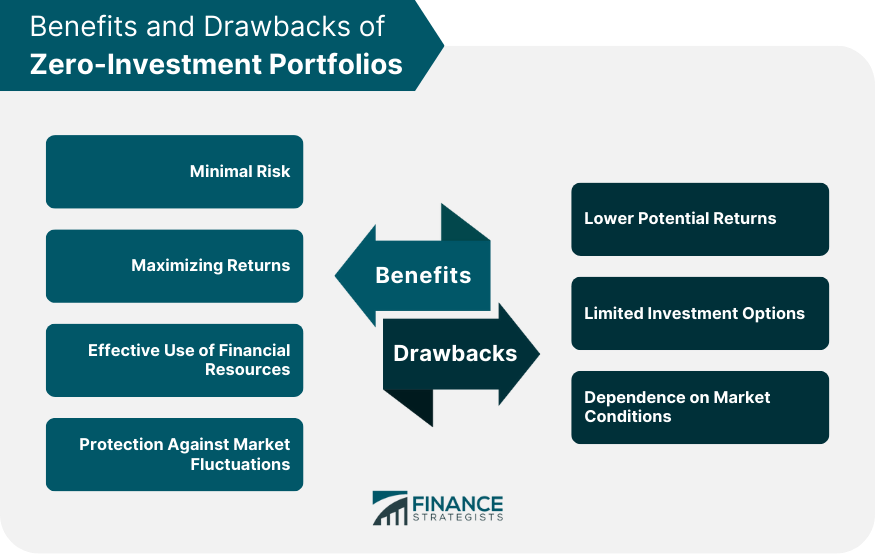

## Table of Contents

## What is a zero-investment portfolio?

A zero-investment portfolio is a type of investment strategy where you don't need to put in any money to start. It works by balancing investments so that the total cost is zero. This is often done by using both long and short positions in the market. For example, you might buy some stocks (going long) and sell other stocks you don't own (going short) at the same time. The money you get from selling the stocks you short can be used to buy the stocks you go long on, so you don't need any extra money to start.

This kind of portfolio is popular in financial strategies like arbitrage, where you try to make money from small price differences between similar assets. It's also used in hedging, where you want to protect other investments from losing value. Because you're not putting in any money, the risk can be different from other types of investments. If things go well, you can make money without spending any. But if things go badly, you could end up owing money. So, it's important to understand the risks and how these portfolios work before trying them out.

## How does a zero-investment portfolio work?

A zero-investment portfolio works by balancing your investments so that you don't need to spend any money to start. Imagine you want to invest in the stock market but you don't have any money to buy stocks. With a zero-investment portfolio, you can do this by using a strategy called "short selling." This means you borrow stocks from someone else, sell them, and then buy them back later, hopefully at a lower price. The money you get from selling the borrowed stocks can be used to buy other stocks you think will go up in value. This way, you're not putting in any of your own money.

The goal is to make money from the difference between the stocks you bought and the ones you sold short. If the stocks you bought go up in value and the ones you sold short go down, you can make a profit. But it's important to be careful because if the stocks you bought go down and the ones you sold short go up, you could lose money. This kind of portfolio is often used in strategies like [arbitrage](/wiki/arbitrage), where you try to make money from small price differences between similar assets, or hedging, where you try to protect other investments from losing value. It's a way to invest without spending money upfront, but it comes with its own risks.

## What are the benefits of using a zero-investment portfolio?

One big benefit of a zero-investment portfolio is that you can start investing without any money. This is great if you don't have a lot of cash to spend on stocks or other investments. By using short selling, you can borrow stocks, sell them, and use that money to buy other stocks you think will do well. This way, you can try to make money from the stock market without spending your own money.

Another benefit is that zero-investment portfolios can be used to make money from small price differences in the market. This is called arbitrage. For example, if you see that the same stock is selling for a little more on one exchange than another, you can buy it on the cheaper exchange and sell it on the more expensive one. You can also use a zero-investment portfolio to protect other investments, which is called hedging. If you own a stock and you're worried it might go down, you can short sell a similar stock to balance out any losses. This can help you manage risk without spending more money.

## Can you provide an example of a zero-investment portfolio?

Imagine you think that Company A's stock is going to go up, but you also think that Company B's stock is going to go down. You don't have any money to buy stocks, but you want to try to make money from the stock market. With a zero-investment portfolio, you can do this by short selling Company B's stock. This means you borrow Company B's stock from someone else, sell it, and use the money you get to buy Company A's stock.

Now, you're hoping that Company A's stock goes up and Company B's stock goes down. If this happens, you can sell Company A's stock for a profit and use that money to buy back Company B's stock at a lower price. Then, you return the borrowed stock and keep the difference as your profit. This way, you've made money without spending any of your own cash to start.

But remember, this strategy can be risky. If Company A's stock goes down and Company B's stock goes up, you could lose money. You might have to buy back Company B's stock at a higher price than you sold it for, which means you'll owe money. So, it's important to be careful and understand the risks before trying a zero-investment portfolio.

## What are the key components of a zero-investment portfolio?

The key parts of a zero-investment portfolio are long positions and short positions. A long position means you buy a stock because you think its price will go up. A short position means you borrow a stock, sell it, and hope to buy it back later at a lower price. By using both long and short positions, you can balance your investments so that you don't need to spend any of your own money to start.

The other important part is the idea of arbitrage or hedging. Arbitrage means you try to make money from small price differences between similar assets. For example, if a stock is cheaper on one exchange than another, you can buy it on the cheaper exchange and sell it on the more expensive one. Hedging is when you use a zero-investment portfolio to protect other investments. If you own a stock and you're worried it might go down, you can short sell a similar stock to balance out any losses. This way, you can manage risk without spending more money.

## How do you construct a zero-investment portfolio?

To build a zero-investment portfolio, you start by finding stocks or assets that you think will go up in value and others that you think will go down. You then use a strategy called short selling. This means you borrow a stock that you think will go down, sell it, and use the money you get to buy a stock that you think will go up. The goal is to make money from the difference between the stock you bought and the one you sold short. If the stock you bought goes up and the one you sold short goes down, you can make a profit without spending any of your own money.

The key to a zero-investment portfolio is balancing your long and short positions so that the total cost is zero. This means the money you get from selling the borrowed stock should be enough to buy the stock you think will go up. You can use this strategy to try to make money from small price differences in the market, which is called arbitrage. Or you can use it to protect other investments, which is called hedging. Remember, this kind of portfolio can be risky. If the stocks you bought go down and the ones you sold short go up, you could lose money. So, it's important to understand the risks and how these portfolios work before trying them out.

## What are the risks associated with zero-investment portfolios?

Zero-investment portfolios can be risky because you're using short selling to start. This means you borrow a stock, sell it, and hope to buy it back later at a lower price. But if the stock you borrowed goes up instead of down, you have to buy it back at a higher price. This can cost you more money than you made from selling it in the first place. So, you could end up owing money instead of making a profit.

Another risk is that the stocks you buy with the money from short selling might not go up in value as you hoped. If the stock you bought goes down and the one you sold short goes up, you could lose money on both sides. This can be a big problem because you're trying to balance your investments without spending any of your own money. If things don't go as planned, you might find yourself in a tough spot financially.

## How does a zero-investment portfolio compare to traditional investment strategies?

A zero-investment portfolio is different from traditional investment strategies because it lets you start investing without spending any of your own money. In traditional investing, you usually need to put in money to buy stocks or other assets. With a zero-investment portfolio, you use short selling to borrow stocks, sell them, and use that money to buy other stocks. This way, you can try to make money from the stock market without spending your own cash. It's like a way to play the market without having to pay to get in.

But zero-investment portfolios come with their own risks that are different from traditional investing. In traditional investing, the most you can lose is the money you put in. With a zero-investment portfolio, you could end up owing money if the stocks you borrowed go up in price. This is because you have to buy them back at a higher price than you sold them for. Also, if the stocks you bought with the borrowed money go down, you could lose money on both sides. So, while zero-investment portfolios can be a way to start investing without money, they can be riskier than traditional strategies.

## What are the tax implications of a zero-investment portfolio?

The tax rules for a zero-investment portfolio can be a bit tricky. When you make money from a zero-investment portfolio, you have to pay taxes on your profits. This is called capital gains tax. If you hold your investments for less than a year, you'll pay a higher short-term capital gains tax rate. If you hold them for more than a year, you'll pay a lower long-term capital gains tax rate. But if you lose money, you might be able to use those losses to lower your taxes. This is called a tax loss harvest.

Another thing to think about is that short selling, which is a big part of zero-investment portfolios, can have different tax rules. When you short sell a stock, you have to pay taxes on any money you make from it. But if you have to buy back the stock at a higher price, you can use that loss to lower your taxes. Also, if you're borrowing stocks to short sell, you might have to pay taxes on any dividends or interest you get from those stocks. So, it's a good idea to talk to a tax expert to understand all the tax rules that apply to your zero-investment portfolio.

## How can zero-investment portfolios be used for arbitrage?

Zero-investment portfolios can be used for arbitrage by taking advantage of small price differences between similar assets. Imagine you see that the same stock is selling for a little more on one stock exchange than another. With a zero-investment portfolio, you can buy the stock on the cheaper exchange and sell it on the more expensive one at the same time. You don't need to put in any of your own money because you're using the money you get from selling the stock on the more expensive exchange to buy it on the cheaper one. This way, you can make a small profit from the difference in prices without spending any money.

But there are risks to this strategy. If the price difference between the two exchanges changes quickly, you might not make as much money as you hoped, or you could even lose money. Also, if the stock you bought goes down in value and the one you sold goes up, you could lose money on both sides. So, while zero-investment portfolios can be a clever way to make money from small price differences, it's important to understand the risks and be careful when using them for arbitrage.

## What advanced strategies can be applied to enhance the performance of a zero-investment portfolio?

One advanced strategy to enhance the performance of a zero-investment portfolio is called pairs trading. This means you find two stocks that usually move together in price, like two companies in the same industry. You go long on one stock that you think will do better than the other and short sell the other stock. If you're right, you can make money from the difference in their performance. This can help you make more money because you're not just betting on one stock going up or down, but on how two stocks will perform compared to each other.

Another strategy is to use options. Options are contracts that give you the right to buy or sell a stock at a certain price. You can use options to make your zero-investment portfolio work better. For example, you can buy a call option on a stock you think will go up and sell a put option on a stock you think will go down. This can help you make more money if your predictions are right, and it can also limit how much you might lose if things don't go as planned. But options can be tricky, so it's important to understand them well before using them.

Lastly, you can use leverage to try to make more money. Leverage means borrowing money to invest more than you have. With a zero-investment portfolio, you can use the money you get from short selling to buy more stocks or options than you could with just the money from selling the borrowed stock. This can help you make more money if your investments do well, but it also means you could lose more if they don't. So, it's important to be careful and understand the risks when using leverage.

## How do regulatory environments affect the implementation of zero-investment portfolios?

Regulatory environments can have a big impact on how you can use zero-investment portfolios. Different countries have different rules about short selling, which is a key part of zero-investment portfolios. Some places might have strict rules that make it hard to borrow stocks or limit how much you can short sell. This can make it harder to start a zero-investment portfolio because you might not be able to do the short selling you need. Also, some regulators might keep a close eye on arbitrage strategies, which are often used in zero-investment portfolios. If they think you're doing something that's not fair, they might stop you from doing it.

Another way regulations can affect zero-investment portfolios is through taxes and reporting rules. In some places, you might have to pay special taxes on the money you make from short selling or arbitrage. This can take a big bite out of your profits. Also, you might have to report all your trades to the government, which can be a lot of work. If you don't follow the rules, you could get in trouble. So, it's really important to know the rules in your country and make sure you're following them when you're trying to use a zero-investment portfolio.

## What is the key to understanding financial markets and investment strategies?

Financial markets serve as multifaceted platforms where a variety of securities, including stocks, bonds, commodities, and derivatives, are traded. These markets are crucial for facilitating the allocation of resources and capital formation in an economy. They offer investors opportunities to participate in the growth of companies and governments, providing [liquidity](/wiki/liquidity-risk-premium), price discovery, and a mechanism for risk management.

Investment strategies within these markets vary widely, adapting to investor objectives ranging from wealth accumulation to income generation and risk minimization. The choice of strategy is a reflection of an investor's financial goals, time horizon, and risk tolerance. Two prominent investment strategies that exist at nearly opposite ends of the spectrum are long-term investing and high-frequency trading.

Long-term investing involves the purchase of assets with the intention of holding them for an extended period, often years or decades. This strategy is predicated on the belief that, despite short-term market [volatility](/wiki/volatility-trading-strategies), asset values will increase over the long term, rewarding patient investors with significant returns. Long-term investors often focus on [fundamental analysis](/wiki/fundamental-analysis), evaluating economic indicators, industry conditions, and company metrics like earnings, dividends, and growth prospects.

Conversely, high-frequency trading ([HFT](/wiki/high-frequency-trading-strategies)) involves executing many trades in fractions of a second to capitalize on minor price discrepancies that may exist only briefly. HFT is characterized by the use of sophisticated algorithms and technology to gain competitive advantages in terms of speed and efficiency. While capable of generating substantial profits, this strategy also entails high levels of risk given its reliance on precise timing and execution.

Each investment strategy demands a nuanced understanding of risk and return. Investors are required to strike a delicate balance between potential returns and the tolerance for risk they can afford to take, often represented by the risk-return trade-off. The capital asset pricing model (CAPM) serves as a cornerstone in assessing this tradeoff, positing that the expected return on a portfolio or asset should equal the risk-free rate plus a risk premium, proportionate to the asset's systematic risk, as measured by beta ($\beta$).

$$
E(R_i) = R_f + \beta_i (E(R_m) - R_f)
$$

Where:
- $E(R_i)$ is the expected return on the asset.
- $R_f$ is the risk-free rate.
- $\beta_i$ is the beta of the asset.
- $E(R_m)$ is the expected return of the market.

In summary, while financial markets foster the trading of various securities, investment strategies within them range extensively based on investor goals and risk appetites. Whether employing a long-term or high-frequency trading approach, the essence of successful investing lies in careful planning and a thorough analysis of risk, return, and individual financial objectives.

## References & Further Reading

[1]: Barry Johnson. ["Algorithmic Trading and DMA: An Introduction to Direct Access Trading Strategies"](https://www.amazon.com/Algorithmic-Trading-DMA-introduction-strategies/dp/0956399207). 4Myeloma Press.

[2]: Andrew W. Lo. ["Adaptive Markets: Financial Evolution at the Speed of Thought"](https://www.amazon.com/Adaptive-Markets-Financial-Evolution-Thought/dp/0691135142). Princeton University Press.

[3]: Ernest P. Chan. ["Quantitative Trading: How to Build Your Own Algorithmic Trading Business"](https://www.amazon.com/Quantitative-Trading-Build-Algorithmic-Business/dp/0470284889). Wiley.

[4]: Marcos Lopez de Prado. ["Advances in Financial Machine Learning"](https://www.amazon.com/Advances-Financial-Machine-Learning-Marcos/dp/1119482089). Wiley.

[5]: David Aronson. ["Evidence-Based Technical Analysis: Applying the Scientific Method and Statistical Inference to Trading Signals"](https://www.amazon.com/Evidence-Based-Technical-Analysis-Scientific-Statistical/dp/0470008741). Wiley.

[6]: Stefan Jansen. ["Machine Learning for Algorithmic Trading"](https://github.com/stefan-jansen/machine-learning-for-trading). Independently published.