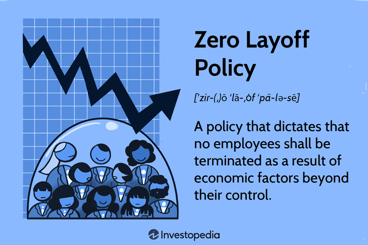

## Table of Contents

## What is a Zero Layoff Policy?

A Zero Layoff Policy is when a company promises not to fire any workers, even during tough times. This means that no matter what happens in the economy or the company, everyone keeps their job. It's a way for a company to show that it cares about its workers and wants to keep them safe and secure.

This policy can make workers feel more loyal to the company because they know their job is safe. It can also help the company keep good workers and avoid the costs of hiring and training new people. But, it can be hard for a company to keep this promise if it's losing a lot of money. Sometimes, they might have to find other ways to save money, like cutting hours or pay, instead of letting people go.

## How does a Zero Layoff Policy differ from traditional layoff practices?

A Zero Layoff Policy is when a company decides it will never fire workers, even if things get tough. This is different from traditional layoff practices, where companies might let people go when they are not doing well financially or need to cut costs. In traditional layoffs, workers can lose their jobs suddenly if the company decides it needs to save money or if there is less work to do.

With a Zero Layoff Policy, the company promises to find other ways to handle tough times without letting anyone go. This can make workers feel more secure and loyal to the company because they know their job is safe no matter what happens. On the other hand, traditional layoffs can make workers feel worried and unsure about their jobs, which can affect their work and how they feel about the company.

While a Zero Layoff Policy sounds good for workers, it can be challenging for a company to keep this promise if it's losing a lot of money. In those cases, the company might need to cut hours or pay instead of firing people. Traditional layoffs, however, allow a company to quickly reduce costs by letting people go, but this can lead to losing experienced workers and the costs of hiring and training new ones.

## What are the benefits of implementing a Zero Layoff Policy for employees?

When a company has a Zero Layoff Policy, it means that employees don't have to worry about losing their jobs, even if the company is going through tough times. This makes employees feel safe and secure at work. They know that no matter what happens, they will still have a job. This can make them feel happier and less stressed about their future.

Feeling secure at work can also make employees more loyal to the company. They might work harder and stay with the company longer because they trust that the company cares about them. This can lead to a better work environment where everyone feels valued and supported. Overall, a Zero Layoff Policy can make a big difference in how employees feel about their jobs and their company.

## What are the potential challenges companies might face when adopting a Zero Layoff Policy?

When a company decides to adopt a Zero Layoff Policy, it might face some big challenges. One big challenge is money. If the company is not doing well and needs to save money, it can't just let people go like other companies might do. Instead, it has to find other ways to cut costs, which can be hard. For example, the company might need to reduce hours or lower pay, but these changes can make employees unhappy and might not save as much money as letting people go.

Another challenge is keeping the business running smoothly. If the company is struggling, it might need to change what it does or how it does it. But with a Zero Layoff Policy, the company can't easily get rid of workers who might not be the best fit for these changes. This means the company has to find ways to train or move workers around, which can take time and money. It can also be hard to bring in new people with the skills the company needs if it can't let anyone go.

Overall, a Zero Layoff Policy shows that a company cares about its workers, but it can be tough to stick to this promise. The company needs to be very careful with its money and think creatively about how to keep everyone working without hurting the business too much. It's a balancing act that requires a lot of planning and effort.

## Can you provide examples of companies that have successfully implemented a Zero Layoff Policy?

One example of a company that has successfully used a Zero Layoff Policy is Southwest Airlines. They have promised to never lay off workers, even during tough times like the 2001 terrorist attacks and the 2008 financial crisis. Southwest Airlines found other ways to save money, like asking workers to take time off without pay or reducing hours. This helped them keep their promise to their employees and made workers feel more loyal and secure.

Another company that has done well with a Zero Layoff Policy is Lincoln Electric. They have a long history of not laying off workers, even during hard economic times. Lincoln Electric focuses on keeping their workers by sharing profits with them and giving them bonuses based on how well the company does. This approach has helped them keep a strong, loyal workforce and maintain their reputation as a good place to work.

## How does a Zero Layoff Policy impact company culture and employee morale?

A Zero Layoff Policy can make a big difference in how people feel at work. When employees know they won't lose their jobs, they feel safer and more secure. This can make them happier and less stressed about their future. They might also feel more loyal to the company because they know the company cares about them. This can lead to a better work environment where everyone feels valued and supported.

On the other hand, a Zero Layoff Policy can also change how the company works. Knowing that their job is safe no matter what can make employees feel more confident and willing to work together. They might be more open to trying new things and helping the company grow because they know they won't be let go if things don't work out. Overall, this policy can create a positive and supportive company culture where everyone feels like they are part of a team.

## What strategies can companies use to maintain financial stability while adhering to a Zero Layoff Policy?

Companies can use several strategies to keep their money stable while sticking to a Zero Layoff Policy. One way is to cut costs in other areas, like reducing hours or asking workers to take time off without pay. This can help save money without letting anyone go. Another way is to find new ways to make money, like starting new projects or selling new products. By doing this, the company can bring in more money to help cover costs and keep everyone employed.

Another strategy is to share profits with workers. This means giving bonuses or extra pay when the company does well. It can make workers feel more connected to the company's success and more willing to help find ways to save money or make more money. Companies can also focus on training and moving workers to different jobs within the company. This way, they can use their workers' skills in the best way possible without having to hire new people.

## How does a Zero Layoff Policy affect hiring practices and workforce planning?

A Zero Layoff Policy can change how a company hires new people. Since the company promises not to let anyone go, it needs to be very careful about who it hires. The company might hire fewer people to start with because it knows it can't easily let them go if things change. This means the company has to plan ahead and think about what skills it really needs for the future. It also might take more time to find the right people because the company wants to make sure they will fit well and stay with the company for a long time.

Workforce planning also becomes more important with a Zero Layoff Policy. The company needs to think about how to use its workers in the best way possible. This might mean training workers to do different jobs or moving them around within the company. The company has to be ready to change how it works without letting anyone go. This can be challenging, but it also means the company can keep a strong team that knows the business well. By planning carefully, the company can keep everyone working and happy, even when things are tough.

## What role does employee development and training play in supporting a Zero Layoff Policy?

Employee development and training are very important for a company that wants to keep a Zero Layoff Policy. When a company promises not to let anyone go, it needs to make sure its workers can do different jobs. Training helps workers learn new skills and be ready to change roles if the company needs them to. This way, the company can keep everyone working, even if some jobs are not needed anymore. It also helps workers feel more valuable and confident because they know they can do different things.

By focusing on training, a company can also help its workers grow and do better at their jobs. When workers learn more and get better at what they do, they can help the company find new ways to make money or save costs. This is important for keeping the company strong and able to stick to its promise of not laying anyone off. Overall, training and development make sure that the company and its workers can handle changes and keep everyone employed.

## How can a Zero Layoff Policy be integrated into broader corporate social responsibility initiatives?

A Zero Layoff Policy can be a big part of a company's corporate social responsibility (CSR) plan. CSR is all about how a company helps its workers, the community, and the environment. By promising not to lay off workers, a company shows it cares about its employees' well-being. This can make the company look good to customers and investors who care about social issues. It's a way for the company to say, "We're not just about making money, we also care about our people."

Including a Zero Layoff Policy in CSR initiatives can also help the company work on other social goals. For example, the company can focus on training and developing its workers, which is another way to support them. The company can also use its stable workforce to help the community, like by doing volunteer work or supporting local projects. By showing that it cares about its workers and the community, the company can build a strong, positive image that makes everyone feel good about being part of it.

## What are the legal and ethical considerations companies must address when implementing a Zero Layoff Policy?

When a company decides to have a Zero Layoff Policy, it needs to think about the law. Some places have rules about how companies can treat their workers. For example, a company might need to be careful about changing workers' hours or pay to save money. If the company doesn't follow these rules, it could get in trouble. Also, the company needs to make sure it treats everyone fairly. If it only changes things for some workers and not others, that could be seen as unfair or even against the law.

There are also important ethical things to think about. A Zero Layoff Policy shows that a company cares about its workers and wants to do the right thing. But, the company needs to be honest about what it can do. If it promises not to lay off workers but then can't keep that promise, it could hurt trust. The company also needs to think about how changes to save money might affect workers. If cutting hours or pay makes life hard for workers, that's an ethical problem. The company needs to balance saving money with taking care of its workers in a fair way.

## How can the effectiveness of a Zero Layoff Policy be measured and evaluated over time?

To measure how well a Zero Layoff Policy is working, a company can look at different things over time. One way is to see if workers stay with the company longer. If more people are staying, it might mean they feel safe and happy because of the policy. Another way is to check how happy and motivated workers are. The company can ask workers how they feel about their jobs and if they feel secure. If workers are happier and more motivated, it's a good sign that the policy is helping.

The company can also look at its money to see if the policy is working. If the company can save money in other ways without laying off workers, that's a good thing. The company should also see if it can still make money and grow, even with the policy. If the company is doing well financially and keeping everyone working, then the Zero Layoff Policy is likely working well. By looking at these things regularly, the company can see if the policy is helping and make changes if needed.

## How does the impact on employee morale affect corporate culture?

Job security plays a crucial role in fostering a collaborative and positive work environment, significantly enhancing the overall corporate culture. The assurance that one's job is secure allows employees to focus more on their roles without the looming fear of unemployment. This security fosters an atmosphere of trust and openness, which is essential for cultivating a supportive and collaborative workplace.

Employees who are not preoccupied with job insecurity are more inclined to share innovative ideas and take calculated risks. When employees feel safe in their roles, they are more willing to contribute unreservedly to business improvements and operational innovations. This fearless exchange of ideas frequently leads to the identification of more efficient methods of work and the development of innovative products and services, resulting in a competitive advantage for the organization.

Zero layoff policies are instrumental in boosting employee morale, which, in turn, leads to overall business success. High morale creates a workforce that is energetically engaged and motivated. Employees are more committed to their tasks and are more likely to go above and beyond to achieve the company's goals. This commitment is directly linked to higher productivity, better job performance, and ultimately, improved business outcomes. The relationship between morale and business success can be visually depicted through a simple linear equation where Business Success (BS) correlates with Employee Morale (EM):

$$
BS = \alpha + \beta \times EM
$$

Here, $\alpha$ represents an intercept and $\beta$ the coefficient indicating the strength of the relationship between employee morale and business success.

For instance, companies like Lincoln Electric, which has implemented a zero layoff policy for decades, are often cited as exemplars of how such strategies cultivate a motivated and engaged workforce. Lincoln Electric's employees, assured of their job security, consistently deliver high-quality work and are deeply invested in the company's prosperity. This example demonstrates how such policies contribute to nurturing an environment where employees feel valued and respected, which further drives their willingness to engage and innovate.

In conclusion, zero layoff policies significantly impact corporate culture by creating a foundation where employees feel secure enough to innovate and collaborate. This, in turn, builds a workforce characterized by high morale and engagement, crucial drivers of business success. As companies continue to recognize the value of maintaining employee confidence and morale, the adoption of such policies could become more prevalent, reinforcing stability and resilience in organizational culture.

## References & Further Reading

[1]: Pfeffer, J. (1998). ["The Human Equation: Building Profits by Putting People First."](https://jeffreypfeffer.com/books/the-human-equation/) Harvard Business School Press.

[2]: Noe, R. A. (2017). ["Employee Training & Development."](https://onlinelibrary.wiley.com/doi/full/10.1002/hrdq.21333) McGraw-Hill Education.

[3]: Heskett, J. L. (2011). ["The Culture Cycle: How to Shape the Unseen Force that Transforms Performance."](https://archive.org/details/culturecyclehowt0000hesk) FT Press.

[4]: Waber, B. (2013). ["People Analytics: How Social Sensing Technology Will Transform Business and What It Tells Us about the Future of Work."](https://ptgmedia.pearsoncmg.com/images/9780133158311/samplepages/0133158314.pdf) FT Press.

[5]: Brynjolfsson, E., & McAfee, A. (2014). ["The Second Machine Age: Work, Progress, and Prosperity in a Time of Brilliant Technologies."](https://www.tandfonline.com/doi/full/10.1080/14697688.2014.946440) W.W. Norton & Company.