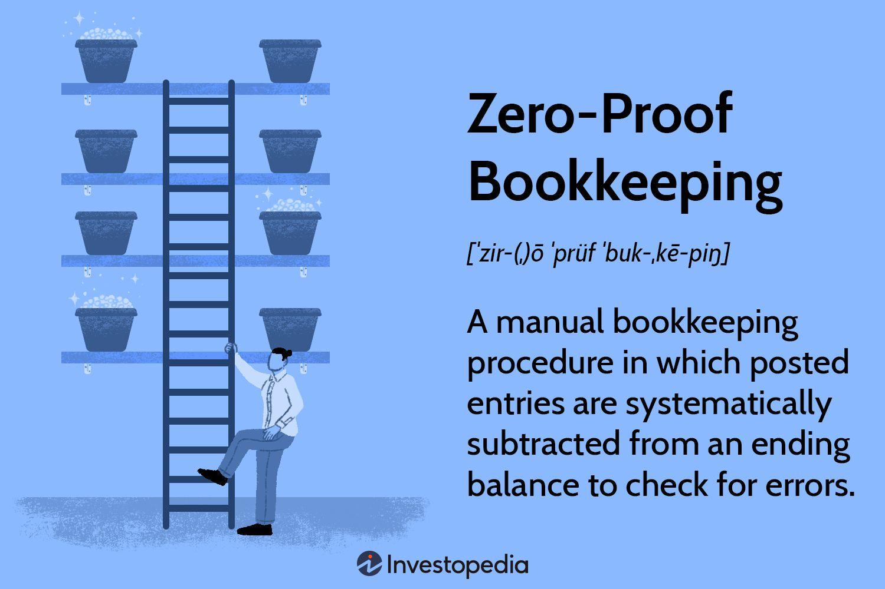

## Table of Contents

## What is zero-proof bookkeeping?

Zero-proof bookkeeping is a way to keep track of money where the total of all the money coming in and going out should always be zero. This means that if you add up all your income and subtract all your expenses, the result should be zero. This method helps make sure that every transaction is recorded correctly. If the total isn't zero, it means there might be a mistake somewhere in the records.

This type of bookkeeping is useful because it makes it easier to spot errors. For example, if you buy something for your business, you record the money going out as an expense and the item coming in as an asset. These two entries should balance each other out. By keeping the books balanced, businesses can quickly find and fix any mistakes, making their financial records more accurate and reliable.

## How does zero-proof bookkeeping differ from traditional bookkeeping?

Zero-proof bookkeeping and traditional bookkeeping both aim to keep accurate financial records, but they do it in different ways. In zero-proof bookkeeping, the main idea is to make sure that the total of all money coming in and going out equals zero. This means every transaction is recorded with two entries that balance each other out. For example, if you buy a computer for your business, you record the money spent as an expense and the computer as an asset. This method helps quickly spot any errors because if the books don't balance to zero, something is wrong.

Traditional bookkeeping, on the other hand, focuses more on recording transactions in a single entry system or a double-entry system without the strict requirement of the total being zero. In a single-entry system, you might just record money coming in and going out without worrying about balancing them. In a double-entry system, you record both sides of a transaction, but the focus is more on keeping track of different accounts like assets, liabilities, and equity, rather than ensuring the total is zero. This method can still catch errors, but it might take more time to find them compared to zero-proof bookkeeping.

## What are the basic principles of zero-proof bookkeeping?

Zero-proof bookkeeping is based on the idea that all money coming in and going out should balance to zero. This means that for every transaction, you record two entries that cancel each other out. For example, if you buy something for your business, you record the money spent as an expense and the item as an asset. This way, if you add up all your entries, the total should be zero. If it's not zero, it means there might be a mistake in your records.

The main principle of zero-proof bookkeeping is to make it easy to spot errors. When you keep your books balanced, any mistake will show up as a difference from zero. This helps you find and fix errors quickly. It's a simple but effective way to keep your financial records accurate and reliable. By using this method, businesses can make sure their money is being tracked correctly and that they can trust their financial statements.

## What tools or software are commonly used in zero-proof bookkeeping?

Many businesses use different tools and software to help with zero-proof bookkeeping. Some popular ones are QuickBooks, FreshBooks, and Xero. These programs make it easy to record transactions and keep the books balanced. They have features that help you enter money coming in and going out, and they show you if your books are not adding up to zero. This way, you can quickly find and fix any mistakes.

These software tools are user-friendly and often come with support and tutorials to help you learn how to use them. They also have reports and dashboards that show you how your business is doing financially. By using these tools, you can keep your financial records accurate and make sure that every transaction is recorded correctly, making it easier to manage your business's money.

## How can zero-proof bookkeeping help in detecting errors or fraud?

Zero-proof bookkeeping helps in detecting errors or fraud by making sure that every transaction is balanced. If you buy something for your business, you record the money spent as an expense and the item as an asset. These two entries should cancel each other out, making the total zero. If the total is not zero, it means there might be a mistake or someone might be trying to cheat. This method makes it easy to spot problems because any error or fraud will show up as a difference from zero.

By using zero-proof bookkeeping, businesses can quickly find and fix mistakes. For example, if someone tries to take money without recording it properly, the books won't balance to zero. This can help businesses catch fraud early and take action to stop it. Keeping the books balanced also makes it easier to trust the financial records, which is important for making good decisions and keeping the business running smoothly.

## What are the steps to implement zero-proof bookkeeping in a small business?

To start using zero-proof bookkeeping in a small business, you first need to understand that every transaction needs to be recorded in two places. For example, if you buy a computer, you record the money spent as an expense and the computer as an asset. This way, the total of all your records should be zero. You can use software like QuickBooks or FreshBooks to help you keep track of these entries. Make sure everyone in your business knows how to use the software and understands the importance of keeping the books balanced.

Once you have the software set up, start entering all your transactions. Every time money comes in or goes out, record it in the right places. Check your records often to make sure they add up to zero. If they don't, look for mistakes and fix them. Over time, this will help you keep your financial records accurate and make it easier to spot any errors or fraud. By keeping your books balanced, you can trust your financial statements and make better decisions for your business.

## What are the advantages of using zero-proof bookkeeping for financial management?

Zero-proof bookkeeping helps keep your money records accurate and easy to check. In this method, every time money comes in or goes out, you record it in two places so that the total always adds up to zero. This makes it simple to see if there are any mistakes. If your records don't add up to zero, you know something is wrong and can fix it quickly. This way, you can trust your financial statements and make good decisions for your business.

Using zero-proof bookkeeping also helps you catch fraud early. If someone tries to take money without recording it correctly, the books won't balance to zero. This makes it easier to spot dishonest actions and stop them before they cause big problems. By keeping your books balanced, you can feel confident that your financial records are honest and reliable, which is important for running a successful business.

## Can zero-proof bookkeeping be integrated with other accounting systems?

Yes, zero-proof bookkeeping can be integrated with other accounting systems. Many businesses use software like QuickBooks, FreshBooks, or Xero for zero-proof bookkeeping, and these programs can work together with other accounting tools. For example, you might use zero-proof bookkeeping to make sure every transaction balances to zero, and then use another system to create detailed financial reports or manage taxes. This way, you can keep your books balanced and still get all the other benefits of different accounting systems.

Integrating zero-proof bookkeeping with other systems can help you manage your business's money more effectively. By using zero-proof bookkeeping to catch errors and fraud, you can make sure your financial records are accurate. Then, you can use other accounting systems to analyze your finances in more detail, plan for the future, and meet legal requirements. This combination makes it easier to keep your business running smoothly and make smart financial decisions.

## What are the common challenges faced when adopting zero-proof bookkeeping?

When a small business starts using zero-proof bookkeeping, one of the biggest challenges is making sure everyone understands how it works. Every time money comes in or goes out, you need to record it in two places so the total adds up to zero. If people don't know how to do this, they might make mistakes, and the books won't balance. It can take time and training to get everyone on the same page, especially if they're used to a different way of keeping track of money.

Another challenge is keeping up with all the transactions. In a busy business, there can be a lot of money coming in and going out every day. It's important to record everything correctly and check the books often to make sure they still add up to zero. If you don't keep up, it can be hard to find mistakes later. Using software can help, but you still need to make sure it's set up right and that everyone knows how to use it properly.

## How does zero-proof bookkeeping comply with international accounting standards?

Zero-proof bookkeeping follows the same basic ideas as international accounting standards, like making sure every transaction is recorded correctly and keeping the books balanced. In zero-proof bookkeeping, every time money comes in or goes out, you record it in two places so that the total adds up to zero. This is similar to the double-entry system used in many international standards, where every transaction affects at least two accounts. By keeping the books balanced, zero-proof bookkeeping helps make sure the financial records are accurate, which is a key part of international accounting rules.

However, zero-proof bookkeeping might need some adjustments to fully comply with specific international standards. For example, some standards require detailed reports and disclosures that go beyond just making sure the books balance to zero. To meet these requirements, a business might need to use zero-proof bookkeeping to keep the books balanced and then use additional accounting tools to create the detailed reports needed. By doing this, businesses can use zero-proof bookkeeping while still following international accounting standards.

## What advanced techniques can be applied to enhance the efficiency of zero-proof bookkeeping?

One way to make zero-proof bookkeeping work better is by using automation. Software like QuickBooks or FreshBooks can automatically record transactions in two places, making sure the total adds up to zero. This saves time and reduces mistakes. You can set up rules in the software to handle common transactions, so you don't have to enter them manually every time. This way, you can focus on other parts of your business while the software keeps your books balanced.

Another technique is to use real-time monitoring. With modern software, you can see your financial records as they change, which helps you spot errors or fraud quickly. If something doesn't add up to zero, you can fix it right away. This also lets you keep an eye on your business's money all the time, so you can make smart decisions faster. By combining automation and real-time monitoring, zero-proof bookkeeping can be more efficient and help your business run smoothly.

## What future trends are expected in the field of zero-proof bookkeeping?

In the future, zero-proof bookkeeping is likely to become even more automated. Software will get better at recording transactions in two places automatically, making sure the total always adds up to zero. This means businesses will spend less time on bookkeeping and make fewer mistakes. New technology like artificial intelligence (AI) could help by learning how a business works and setting up rules to handle common transactions without anyone having to do it manually. This would make zero-proof bookkeeping faster and more accurate.

Another trend we might see is more real-time monitoring and reporting. With better software, businesses will be able to see their financial records change as transactions happen. This helps them spot errors or fraud right away and fix them quickly. Real-time data can also help businesses make decisions faster and keep their finances in good shape. As these technologies improve, zero-proof bookkeeping will become an even more powerful tool for managing money in small businesses.

## What are the key aspects of understanding accounting methods and bookkeeping systems?

Accounting methods and bookkeeping systems provide the structural foundation necessary for effective business financial management. At the core of these systems are two fundamental frameworks: single-entry and double-entry bookkeeping. Each of these systems is suited to different operational complexities and serves distinct roles in the financial management ecosystem.

Single-entry bookkeeping is a straightforward method, typically utilized by small businesses or those with simple financial transactions. It functions similarly to a checkbook register, with each transaction recorded as a single entry in the financial records. The simplicity of this system offers an easy-to-maintain record, yet it lacks the depth required to reveal the complete financial picture. Consequently, it is limited in its ability to provide a comprehensive view of a company's financial health.

In contrast, double-entry bookkeeping is a more sophisticated and comprehensive method widely adopted by larger organizations. This system operates on the principle that every financial transaction affects at least two accounts: one by a debit and the other by a corresponding credit. The fundamental equation of double-entry bookkeeping can be expressed as:

$$
\text{Assets} = \text{Liabilities} + \text{Equity}
$$

This dual recording mechanism ensures that the accounting equation remains balanced, enhancing the accuracy of financial records. This method not only supports detailed financial analysis but also aids in the detection of errors or fraudulent activities through its systematic approach.

Within double-entry bookkeeping, zero-proof bookkeeping emerges as a critical technique. This process involves manually verifying that the total debits equal the total credits in the accounting records. By doing so, it ensures the accuracy and integrity of financial data. This is akin to maintaining a balanced balance sheet, where the equation:

$$
\text{Total Debits} = \text{Total Credits}
$$

serves as a foundational check for financial accuracy. Zero-proof bookkeeping is particularly vital in high-stakes environments, such as those employing algorithmic trading, where precision is non-negotiable.

These bookkeeping systems are not just about record-keeping; they play a crucial role in maintaining financial transparency and accuracy. By systematically recording transactions and ensuring the balancing of [books](/wiki/algo-trading-books), these systems provide the data integrity necessary for sound financial decision-making. They allow businesses to present truthful and complete financial statements, which are essential for internal decision-making and for meeting regulatory requirements.

Sound bookkeeping underpins strategic management by offering accurate financial snapshots that guide executive decisions, forecast future financial outcomes, and shape business strategies. Particularly in complex financial structures, precise bookkeeping lays the groundwork for informed decisions, ranging from asset management to investment strategies.

In sum, understanding and implementing robust accounting methods and bookkeeping systems is crucial for ensuring accuracy, facilitating transparency, and supporting strategic decision-making. Whether through the simplicity of single-entry or the thoroughness of double-entry systems, effective bookkeeping practices are indispensable in the pursuit of financial precision and transparency.

## What is Zero-Proof Bookkeeping?

Zero-proof bookkeeping is a meticulous manual verification process within accounting practices aimed at identifying and mitigating errors. The primary objective of this method is to ensure that the financial data recorded in accounting books is accurate and reliable, particularly for purposes where high levels of precision are critical, such as [algorithmic trading](/wiki/algorithmic-trading).

The core concept of zero-proof bookkeeping involves a systematic balancing of all posted entries against an ending balance. The method can be mathematically represented as:

$$
\text{Ending Balance} - \sum(\text{All Posted Entries}) = 0
$$

In this formula, the sum of all posted entries is subtracted from the ending balance. If the result is zero, it indicates that the entries have been accurately recorded, with no discrepancies. This process of subtraction and verification serves as a powerful tool for maintaining the integrity of financial data.

Zero-proof bookkeeping essentially functions as an error-checking mechanism, similar to the maintenance of a balance sheet. In double-entry bookkeeping, every financial transaction affects at least two accounts, represented as debits and credits. Zero-proof bookkeeping ensures that the debits and credits are balanced, helping to spot errors such as misposted transactions or incorrect computations.

Moreover, the methodology is invaluable when implementing algorithmic trading systems. These trading platforms require precise and trustworthy financial records to make effective data-driven decisions. By employing zero-proof bookkeeping, businesses can optimize their accounting practices, thereby enhancing the algorithms' performance.

The organized process of balancing credits and debits is integral to zero-proof bookkeeping. It establishes that the recorded financial information aligns accurately across all accounts. For instance, if a company lists a $500 sale as both an increase in revenue and a corresponding increase in cash or accounts receivable, zero-proof bookkeeping will verify these entries against the overall financial position, ensuring consistency and accuracy.

Overall, zero-proof bookkeeping constitutes a vital element of error detection within accounting systems. Its application supports the accuracy of financial records, which is crucial in environments reliant on precise data for strategic financial management and automated decision-making processes.

## References & Further Reading

[1]: Bergstra, J., Bardenet, R., Bengio, Y., & Kégl, B. (2011). ["Algorithms for Hyper-Parameter Optimization."](https://dl.acm.org/doi/10.5555/2986459.2986743) Advances in Neural Information Processing Systems 24.

[2]: ["Advances in Financial Machine Learning"](https://www.amazon.com/Advances-Financial-Machine-Learning-Marcos/dp/1119482089) by Marcos Lopez de Prado

[3]: ["Evidence-Based Technical Analysis: Applying the Scientific Method and Statistical Inference to Trading Signals"](https://www.amazon.com/Evidence-Based-Technical-Analysis-Scientific-Statistical/dp/0470008741) by David Aronson

[4]: ["Machine Learning for Algorithmic Trading"](https://github.com/stefan-jansen/machine-learning-for-trading) by Stefan Jansen

[5]: ["Quantitative Trading: How to Build Your Own Algorithmic Trading Business"](https://www.amazon.com/Quantitative-Trading-Build-Algorithmic-Business/dp/1119800064) by Ernest P. Chan