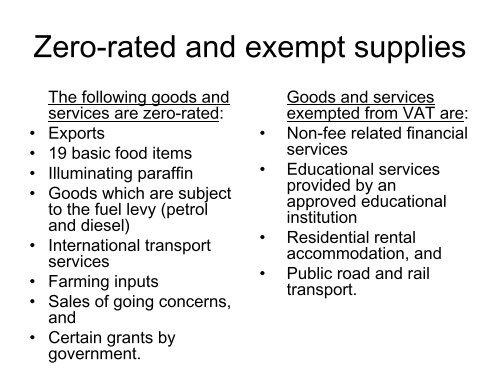

The world of taxation is complex and ever-changing. Navigating it necessitates a thorough comprehension of varied taxation concepts, including Value-Added Tax (VAT), zero-rated goods, and the implications of automated trading on tax liabilities. Value-Added Tax is an essential element across global taxation systems due to its broad influence on pricing structures and consumer spending behaviors. As a consumption tax levied at each stage of the supply chain, VAT eventually falls on the final consumer, significantly impacting how products and services are priced.

Within the VAT framework, zero-rated goods represent a unique category subject to a VAT rate of 0%, allowing businesses to reclaim the input VAT paid. These goods often include essentials such as specific food items and medical supplies. Despite frequently being misconstrued as VAT-exempt, zero-rated goods hold distinct ramifications for businesses and consumers, distinguishing them from entirely VAT-free services. Zero-rating alleviates financial pressure, particularly benefiting lower-income consumers by reducing overall living costs.



In examining these taxation elements, this article intends to outline their significance concerning algorithmic trading—a rapidly evolving sector leveraging technology to automate trading strategies. As automated trading adjusts transaction volumes and service fees, it also influences tax calculations, particularly VAT. Understanding these components is crucial for businesses and traders striving to formulate optimal tax strategies that minimize liabilities.

By exploring VAT, zero-rated goods, and the impact of algorithmic trading, we will offer insights into potential strategies aligned with current tax structures, ultimately enhancing tax efficiency and compliance for businesses and investors alike.

## Table of Contents

## Understanding Value-Added Tax (VAT)

Value-Added Tax (VAT) is a consumption-based levy applied at various stages of production and distribution of goods and services. Unlike other forms of sales tax which are only imposed at the point of final sale, VAT is incremental and collected along the entire supply chain. Its unique mechanism ensures that the tax burden is ultimately borne by the end consumer, as businesses pass on the costs through pricing.

The process entails businesses adding VAT to the price of goods or services sold at each transaction point. For instance, if a manufacturer sells a product to a retailer, VAT is added to the sale price. When the retailer subsequently sells the product to a customer, VAT is added once more. The critical component of this system is that businesses are responsible for collecting VAT and remitting it to the government, thereby performing a pivotal role in tax collection.

Businesses engaged in activities subject to VAT can reclaim the VAT they incur on business inputs, known formally as input VAT. This deduction mechanism is vital, as it prevents the cascading effect of tax-on-tax and preserves the destination principle of taxation—where the tax is collected from the location of consumption rather than production. The net amount a business pays to the government is calculated as the difference between the output VAT (collected on sales) and the input VAT (paid on purchases).

Globally, VAT structures are not uniform, introducing complexities for international trade and operations. Most countries employ a standard VAT rate, but reduced rates are often applied to certain goods and services to lower the consumer burden. For example, essentials like food and children's clothing are sometimes subject to reduced or zero rates. Zero-rated goods are part of a distinctive category where goods are taxed at 0%, allowing businesses to reclaim input VAT, while VAT-exempt goods do not permit input VAT recovery, affecting business cash flow.

These variations necessitate a thorough understanding by businesses operating internationally to manage compliance effectively. The differences in VAT rates and the classification of goods under these rates can affect pricing strategies and the competitiveness of businesses, particularly in cross-border trade settings. Moreover, national regulations periodically undergo revisions, which requires businesses to stay updated to maintain their tax strategies' effectiveness.

## What Are Zero-Rated Goods?

Zero-rated goods are an essential component of Value-Added Tax (VAT) systems, characterized by a VAT rate of 0%. While businesses do not charge VAT on the sale of these items, they retain the ability to reclaim VAT paid on input costs. This VAT mechanism is particularly advantageous for businesses as it helps maintain cash flow by offsetting the VAT paid during the supply and production processes.

Typically, zero-rated goods encompass essential products that are deemed important for alleviating the financial strain on consumers, especially those belonging to lower-income groups. Common examples include basic food items, key medical supplies, and goods destined for export markets. These categories aim to ensure that essential goods remain affordable, promoting public welfare and supporting economic activities.

The classification of zero-rated goods, however, is not universally consistent and is subject to national or regional tax regulations. For instance, while certain food products may be zero-rated in one country, they could be taxed at a different rate in another. This variability necessitates meticulous attention from businesses to ensure compliance with applicable VAT laws in their respective jurisdictions. Failure to accurately identify and classify zero-rated goods can result in incorrect VAT reporting and potential legal repercussions.

Businesses operating in multiple regions must navigate these differing classifications by establishing robust systems for tax compliance. This involves maintaining precise records of input taxes paid and ensuring that claimed VAT deductions align with local zero-rated provisions. Accurate compliance not only supports legal adherence but also facilitates optimal financial outcomes by leveraging available tax benefits related to zero-rated goods.

## Zero-Rated vs. VAT Exempt Goods

Distinguishing between zero-rated and VAT-exempt goods is crucial for businesses aiming to manage their VAT liabilities effectively. These two categories, although seemingly similar, have distinct implications for business operations, particularly concerning cash flow and cost management.

Zero-rated goods are those on which a VAT is applied at a rate of 0%. This unique status allows businesses to reclaim the input VAT paid on purchases related to these goods. As a result, zero rating does not increase costs for businesses in terms of VAT, enabling them to maintain a healthier cash flow. The ability to reclaim input VAT provides a financial advantage, as businesses can offset the VAT paid on inputs against the broader spectrum of taxable sales. Typical examples of zero-rated goods include essential items such as certain food products, prescribed medicines, and exports. These goods are often zero-rated to alleviate economic burdens on consumers, particularly in lower-income segments, by reducing overall purchasing costs without affecting business profitability.

By contrast, VAT-exempt goods are not subject to VAT, meaning that suppliers do not charge VAT on their sales. However, businesses dealing with VAT-exempt items cannot reclaim the input VAT incurred during production or procurement. This inability to recover input VAT can lead to increased operational costs, making exemption less favorable from a cash flow perspective. Common VAT-exempt sectors include healthcare, education, and certain financial services where charging VAT could further burden consumers for essential services. Exemptions help maintain stable pricing structures for these crucial services by eliminating additional VAT expenses, thus ensuring accessibility for all consumers, but they introduce considerations for businesses regarding unrecovered input tax.

Understanding these differences is essential for businesses to formulate strategies that optimize VAT recovery. Implementing accurate accounting systems to track input and output VAT, coupled with strategic planning, can help businesses navigate these classifications effectively. In this context, consulting with tax specialists can provide tailored advice, ensuring compliance with relevant VAT laws while minimizing tax liabilities and enhancing cash flow management.

## Impact of VAT on Algo Trading

Algorithmic trading, or algo trading, employs automated systems to execute trading strategies at high speed and [volume](/wiki/volume-trading-strategy), presenting unique challenges and implications for Value-Added Tax (VAT) considerations. VAT implications hinge on the structure and nature of transactions performed, particularly regarding the commission and service fees charged by trading platforms and intermediaries. These costs can be viewed differently across jurisdictions, which complicates VAT compliance and strategy formulation for trading firms and investors.

Digital transactions in [algorithmic trading](/wiki/algorithmic-trading) can vary significantly from traditional financial transactions, both in process and in taxation. The rapid execution and [high frequency](/wiki/high-frequency-trading) of trades often associated with algorithmic systems lead to complexities in determining the locus of the tax liabilities. For instance, while traditional brokerage services might clearly delineate VAT in service charges, the automated nature of algo trading blurs these lines, impacting the assignment of VAT rates. The application of VAT in such digital contexts can impact the cost efficiency of the trades, influencing the profitability and competitive stance of a trading entity.

Additionally, the VAT treatment of automation plays a significant role in broader financial planning. As algo trading firms allocate resources to technology infrastructure that facilitates automated trades, they face decisions regarding VAT recovery on software acquisitions and maintenance. Countries with comprehensive digital service VAT laws may mandate that such services are taxable under VAT regulations, potentially creating a fiscal burden if not properly accounted for. Here, strategic financial planning can mitigate unnecessary tax outflows, thereby aligning trading activities with tax-efficient practices.

To address these challenges, trading firms need to employ robust accounting systems that enable precise tracking of VAT liabilities. This can involve leveraging advanced tax compliance software capable of handling the intricate nature of high-volume trading transactions. Furthermore, consulting tax specialists who are adept in understanding the nuances of VAT laws applicable to digital and algorithmic trading operations can provide critical insights. Such strategic consultations ensure firms maintain compliance while optimizing their trading operations against a backdrop of varying international VAT laws. Consequently, careful VAT planning and management become integral to sustaining the operational and financial efficiency of algorithmic trading firms.

## Strategic Considerations

Navigating the complexities of international VAT laws is essential for companies engaged in cross-border trading to optimize VAT recovery and maintain competitiveness. A critical component to achieving this is the implementation of robust accounting systems and tax compliance practices. These systems are integral for accurately capturing input VAT, a prerequisite for ensuring proper adherence to zero-rating protocols and optimizing tax positions.

Implementing an effective accounting system involves automating the tracking and recording of VAT-related transactions. Advanced software solutions can assist in real-time data processing, reducing manual errors, and enhancing the efficiency of VAT reporting. For example, a Python-based solution could automate the extraction of VAT data from invoices, perform necessary calculations, and prepare tax returns. Here's a simple conceptual example using Python:

```python
import pandas as pd

# Sample data: a list of transactions with input and output VAT
data = {'Transaction': ['Invoice 1', 'Invoice 2'],
        'Input_VAT': [100, 200],
        'Output_VAT': [150, 250]}

df = pd.DataFrame(data)

# Calculate VAT to remit (output VAT - input VAT)
df['VAT_Remittance'] = df['Output_VAT'] - df['Input_VAT']

print(df)
```

Alongside technological solutions, consulting with tax specialists offers strategic advantages. These professionals provide insights into navigating local and international VAT regulations efficiently, assisting in minimizing liabilities. Expertise from tax consultants can be particularly beneficial in tailoring strategies that align with diverse regulatory environments, thereby ensuring that trading activities remain compliant and tax-effective.

Given the varied nature of VAT laws across jurisdictions, a nuanced understanding of country-specific regulations is imperative. For instance, some countries offer VAT refunds on certain cross-border transactions, providing opportunities for cash flow improvements. Companies must stay informed about such opportunities and align their trading strategies accordingly.

Therefore, adopting a dual approach that combines robust technological systems with expert consultation allows companies to manage their VAT responsibilities effectively. This approach not only aids in maximizing VAT recovery but also supports sustained competitiveness in the global market. Leveraging these strategies ensures that businesses can focus on growth and expansion without being encumbered by regulatory challenges.

## Conclusion

Value-Added Tax (VAT), zero-rated goods, and algorithmic trading collectively shape the financial and tax environments in considerable ways. Each element carries distinct implications for economic activities, business operations, and fiscal policies, necessitating a thorough understanding by all stakeholders involved. 

Grasping the intricacies of VAT, including the benefits offered by zero-rated goods, is essential for businesses and investors who aim to optimize their tax strategies and minimize liabilities. VAT, as a consumption tax, requires careful accounting and adherence to varying global standards, while zero-rated goods offer unique advantages with input VAT recovery. The proper classification and management of these goods can enhance business cash flow and reduce consumer costs.

Algorithmic trading adds another layer of complexity, impacting tax considerations through automated strategies and digital transactions. Understanding how VAT applies to transaction volumes and service fees in this context can aid in cost-effective trading and broader financial planning.

Expert consultation and ongoing education are prudent strategies for navigating the ever-evolving tax landscape. By staying informed about changes in legislation and best practices, businesses and investors can safeguard against compliance issues and make informed decisions that align with their financial goals. In conclusion, an integrated approach towards understanding VAT-related concepts and trading strategies is pivotal for maintaining competitive advantage and achieving optimal economic outcomes.

## References & Further Reading

[1]: ["Value Added Tax: A Comparative Approach in Theory and Practice"](https://www.jstor.org/stable/44014518) by Ben Terra and Julie Kajus

[2]: Keen, M., & Lockwood, B. (2010). ["The Value Added Tax: Its Causes and Consequences."](https://www.imf.org/external/pubs/ft/wp/2007/wp07183.pdf) Journal of Economic Perspectives, 24(4), 147-168.

[3]: ["EU Value Added Tax Law: A Commentary"](https://news.bloombergtax.com/tax-insights-and-commentary/eu-vat-reforms-trade-short-term-business-costs-for-future-benefit) by K. Bacon

[4]: Büttner, T., & Madzharova, B. (2017). ["EU VAT rates misalignments and fiscal coordination."](https://www.aeaweb.org/articles?id=10.1257/pol.20170708) Directorate-General for Economic and Financial Affairs, European Commission.

[5]: ["Algorithmic and High-Frequency Trading"](https://assets.cambridge.org/97811070/91146/frontmatter/9781107091146_frontmatter.pdf) by Alvaro Cartea, Sebastian Jaimungal, and José Penalva