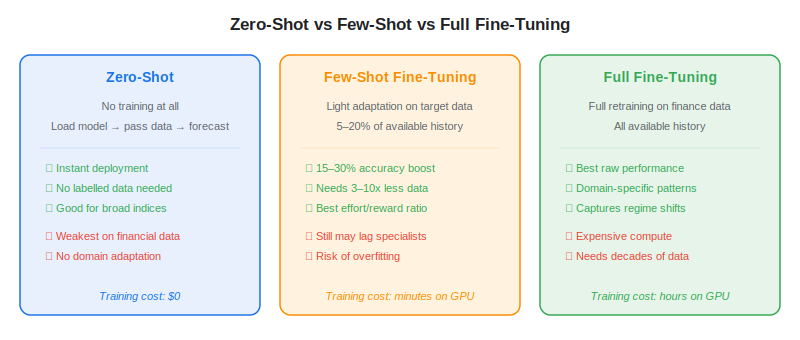
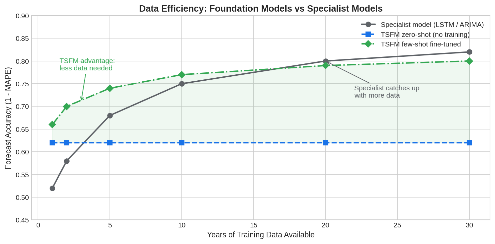

**Zero-shot forecasting** means using a pre-trained model to generate predictions on data it has never seen during training — with no additional training, fine-tuning, or parameter updates. You load the model, pass in a raw time series, and get a forecast. For algo traders, this is the most radical promise of [time series foundation models](https://paperswithbacktest.com/wiki/time-series-foundation-models) (TSFMs): skip the entire model-development pipeline (feature engineering, hyperparameter tuning, cross-validation) and go straight from data to forecast. Models like Google's TimesFM 2.5, Amazon's Chronos-2, and Salesforce's MOIRAI-2 all support zero-shot inference out of the box. But how well does this actually work on financial data — and when is fine-tuning worth the extra effort?

## How Zero-Shot Forecasting Works

During pre-training, a TSFM ingests billions of time points from diverse domains — energy, weather, web traffic, retail, healthcare. The [transformer](https://paperswithbacktest.com/wiki/transformer) backbone learns general temporal patterns: trends, seasonality, mean reversion, autoregressive structure, and volatility clustering. These patterns are encoded in the model's weights.

At inference time, you provide a *context window* — a segment of historical data (typically 256–2,048 time steps) — and the model extrapolates forward. It has never seen your specific stock or asset class during training, yet it applies the temporal patterns it learned elsewhere to generate a forecast, often with probabilistic uncertainty bands.

This is zero-shot: zero additional training steps, zero domain-specific data used for fitting.

## Zero-Shot vs Few-Shot vs Full Fine-Tuning

The three adaptation levels represent a spectrum of effort versus performance:



**Zero-shot** requires no compute beyond inference. It works best when the target series resembles the pre-training distribution — broad market indices with clear trends, seasonal commodities, or ETFs that track well-known patterns. It is weakest on individual stocks with idiosyncratic behaviour, high-noise assets like crypto, or any series whose dynamics are far from the pre-training corpus.

**Few-shot fine-tuning** adapts the pre-trained weights using a small slice of the target domain (typically 5–20% of available history). Marconi et al. (2025) found this yields 15–30% improvement in forecast accuracy over zero-shot on financial tasks, while requiring 3–10x less data than training a specialist model from scratch. This is the sweet spot for most algo trading applications.

**Full fine-tuning** retrains all model parameters on the target dataset. It delivers the best raw performance but requires significant compute (hours on GPU) and enough data to avoid overfitting. For financial data with decades of history, this can match or exceed specialist models.

## What Works Zero-Shot on Financial Data

Not all financial forecasting tasks are equally difficult. Based on published evaluations and the properties of financial data, here is a practical ranking:

| Task | Zero-Shot Quality | Why |
|---|---|---|
| Macro indices (S&P 500, MSCI World) | Moderate | Trend-driven, lower noise, resembles pre-training data |
| Commodity prices (oil, gold) | Moderate | Seasonal components TSFMs recognise |
| ETF prices (SPY, QQQ) | Moderate | Smooth, trend-following dynamics |
| FX major pairs | Weak–Moderate | More noise, but some structure |
| Individual stock returns | Weak | Dominated by idiosyncratic noise, regime shifts |
| Crypto (BTC, ETH) | Very weak | Extreme noise, structural breaks, no seasonal pattern |

The pattern is clear: zero-shot works passably when the signal-to-noise ratio is relatively high and the dynamics resemble what the model learned in pre-training. It degrades as noise increases and domain-specific dynamics dominate.

## Python: Zero-Shot Forecast on the S&P 500

```python
import numpy as np
import yfinance as yf
from chronos import ChronosPipeline
import torch

# 1. Fetch S&P 500 data
df = yf.download("^GSPC", period="2y", progress=False)
close = df["Close"].squeeze().values.astype(np.float32)

# 2. Load Chronos (no training, just inference)
pipeline = ChronosPipeline.from_pretrained(
    "amazon/chronos-t5-base",
    device_map="auto",
    torch_dtype=torch.float32,
)

# 3. Zero-shot forecast: 20 trading days ahead
context = torch.tensor(close[-512:]).unsqueeze(0)
forecast = pipeline.predict(context, prediction_length=20, num_samples=100)

# 4. Extract point forecast and confidence interval
median = forecast.median(dim=1).values.squeeze().numpy()
p10 = forecast.quantile(0.1, dim=1).values.squeeze().numpy()
p90 = forecast.quantile(0.9, dim=1).values.squeeze().numpy()

print(f"20-day forecast (median): {median}")
print(f"80% confidence band: [{p10[0]:.1f}, {p90[0]:.1f}] to [{p10[-1]:.1f}, {p90[-1]:.1f}]")
```

This produces a probabilistic 20-day forecast with uncertainty bands — no feature engineering, no hyperparameter search. The entire pipeline from data download to forecast takes under 30 seconds on a consumer GPU.

## The Data-Efficiency Advantage

Even when zero-shot performance is mediocre, TSFMs have a less obvious but important benefit: **data efficiency**. When you fine-tune a TSFM on a small financial dataset, the pre-trained weights provide a far better starting point than random initialisation. The model converges faster and generalises better.



This matters most for data-scarce situations: newly IPO'd stocks with months of history, emerging-market assets with limited coverage, or novel instruments (new ETFs, tokenised assets) where specialist models simply do not have enough data to train on. In these scenarios, a few-shot TSFM can deliver useful forecasts where a specialist model cannot even get started.

## Practical Recommendations

For algo traders evaluating zero-shot forecasting:

**Use zero-shot as a baseline, not an endpoint.** Run a zero-shot forecast first to establish a floor. Then compare against a few-shot fine-tuned version on the same data. If the improvement is significant (it usually is for financial data), invest in fine-tuning.

**Combine with traditional signals.** A zero-shot TSFM forecast is best used as one input in a broader [systematic trading](https://paperswithbacktest.com/wiki/systematic-trading) framework — alongside momentum, value, volatility, and sentiment signals. It adds diversification to the signal mix rather than replacing proven approaches.

**Watch for overconfidence.** TSFM uncertainty bands may be poorly calibrated on financial data — the 90th percentile may not actually cover 90% of outcomes. Always validate calibration on held-out data before using confidence intervals for position sizing or risk management.

**Prefer Chronos-2 or TimesFM for zero-shot.** These have the largest and most diverse pre-training corpora, which improves zero-shot generalisation. MOIRAI-2 excels at multivariate tasks but may require fine-tuning to match on univariate financial series.

## Conclusion

Zero-shot forecasting for stock markets works — but with important caveats. It provides useful baselines for trend-following assets and broad indices, and it shines in data-scarce situations where specialist models cannot be trained. It does not replace domain-specific modelling for individual stock alpha or high-noise assets. The practical sweet spot for most algo traders is few-shot fine-tuning: starting from a pre-trained TSFM and adapting to your asset class with a modest amount of real financial data. This captures the generalisation benefits of massive pre-training while respecting the unique statistical properties of financial markets.

---

**Explore further on PapersWithBacktest:**
- Browse [backtested trading strategies](https://paperswithbacktest.com/strategies) with Python code and performance metrics
- Access [clean historical market data](https://paperswithbacktest.com/datasets) for equities, crypto, and futures — ready to fine-tune any TSFM
- Take the [algo trading course](https://paperswithbacktest.com/course) — 60+ video lessons and notebooks
- Related wiki pages: [Time Series Foundation Models Explained](https://paperswithbacktest.com/wiki/time-series-foundation-models) · [TimesFM vs Chronos vs MOIRAI](https://paperswithbacktest.com/wiki/timesfm-vs-chronos-vs-moirai) · [Why Foundation Models Struggle with Financial Time Series](https://paperswithbacktest.com/wiki/foundation-models-financial-time-series-challenges)
