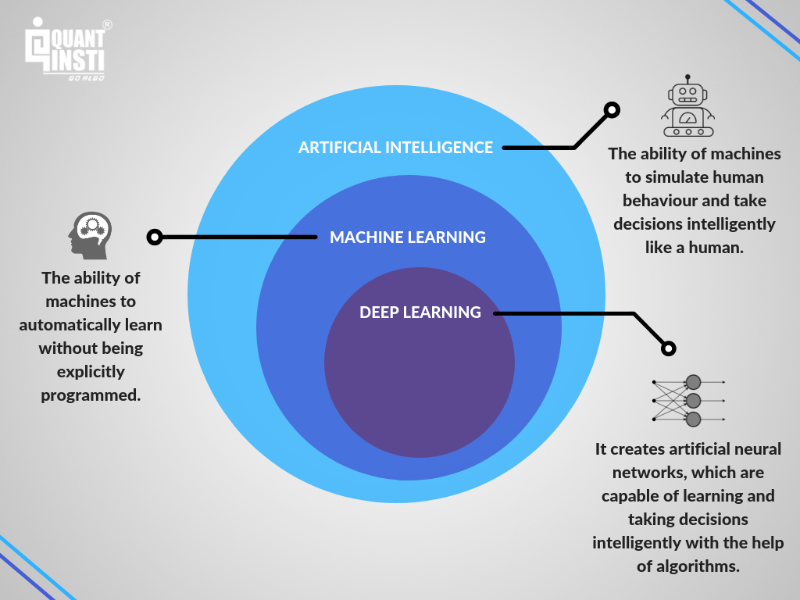

## Table of Contents

## What is zero-shot learning?

Zero-shot learning is a way for computers to recognize and understand new things without being specifically trained on them before. Imagine you've never seen a zebra, but you know what a horse looks like and you know zebras are like horses but with stripes. With zero-shot learning, a computer can use what it already knows about horses to guess what a zebra might look like, even if it has never seen a zebra before.

This type of learning is useful because it helps computers be more flexible and smart. Instead of needing lots of examples of every single thing it might encounter, the computer can use what it knows about similar things to make good guesses. This is important for tasks like understanding new words, recognizing new objects in pictures, or even translating languages the computer hasn't been trained on.

## How does zero-shot learning differ from traditional machine learning?

Zero-shot learning and traditional machine learning are different in how they learn new things. Traditional machine learning needs a lot of examples to learn. For example, if you want a computer to recognize cats, you have to show it many pictures of cats. The computer looks at these pictures and learns what cats look like. It needs these examples to do its job well. If you show it a picture of a cat it hasn't seen before, it can still recognize it because it has seen many other cats.

Zero-shot learning, on the other hand, doesn't need all those examples. It can use what it already knows to understand new things. For example, if the computer knows what a dog looks like and you tell it that a wolf is like a dog but lives in the wild, it can guess what a wolf might look like without seeing any pictures of wolves. This makes zero-shot learning very useful because it can handle new situations without needing more training data. It's like using clues to figure out something new, instead of needing to see it many times.

## What are the main components of a zero-shot learning system?

A zero-shot learning system has a few main parts that help it understand new things without needing lots of examples. One key part is a knowledge base or semantic space, which is like a big library of information about different things. This library tells the computer how things are related to each other. For example, it might know that a whale is a type of mammal that lives in the ocean. The computer uses this information to make guesses about new things it hasn't seen before.

Another important part is the model that can use this knowledge to make predictions. This model is usually good at understanding relationships and similarities between things. It takes what it knows from the knowledge base and applies it to new situations. For example, if the computer knows what a dog looks like and you tell it that a fox is like a dog but smaller and with a different color, it can use its model to guess what a fox might look like. This makes zero-shot learning very flexible and useful for handling new and unexpected situations.

## Can you explain the concept of semantic embedding in zero-shot learning?

Semantic embedding in zero-shot learning is a way to turn words or concepts into numbers that a computer can understand. Imagine you have a bunch of words like "dog," "cat," and "whale." Each word gets turned into a set of numbers, kind of like a special code. These codes, or embeddings, are placed in a big space where similar things are close to each other. So, the code for "dog" would be near the code for "cat" because they are both pets and animals.

The computer uses these embeddings to understand new things. If you want the computer to recognize a "tiger," it can look at the code for "tiger" and see that it's close to the codes for "cat" and "lion." This tells the computer that a tiger is probably a big cat, even if it has never seen a tiger before. By using these special codes, the computer can make smart guesses about new things without needing lots of examples.

## What are some common applications of zero-shot learning?

Zero-shot learning is used in many cool ways. One big use is in understanding new words and languages. Imagine you're learning a new language. You might know some words from that language and how they relate to words you already know in your own language. Zero-shot learning helps computers do the same thing. They can guess the meaning of new words or translate sentences in a language they haven't been trained on, just by using what they already know about similar words and languages.

Another common use is in recognizing new things in pictures. For example, if a computer knows what a car looks like and you tell it that a truck is like a car but bigger, it can use that information to spot a truck in a picture, even if it has never seen a truck before. This is really helpful in places like self-driving cars, where the computer needs to recognize all sorts of things on the road without being shown every single one beforehand.

Zero-shot learning is also used in recommending things to people. If a computer knows what kind of movies you like and you tell it that a new movie is similar to one you enjoyed, it can guess that you might like the new movie too. This makes recommendations more accurate and helpful, even for things the computer hasn't seen before.

## How do attribute-based methods work in zero-shot learning?

Attribute-based methods in zero-shot learning work by using specific details or characteristics about things. Imagine you want a computer to recognize animals it has never seen before. You can tell the computer about the animals' attributes, like "a zebra has stripes" or "a giraffe has a long neck." The computer learns these attributes and uses them to guess what new animals might look like. For example, if it knows that an animal with stripes is probably a zebra, it can look for stripes in a new picture to make a good guess.

These methods are helpful because they let the computer use what it knows about specific details to understand new things. If the computer knows that "furry" and "has a tail" are attributes of a cat, it can use those same attributes to recognize a new animal that also has fur and a tail. This makes zero-shot learning more flexible and smart, as it doesn't need to see every single animal to recognize them. It just needs to know the right attributes to make good guesses.

## What challenges are associated with implementing zero-shot learning?

One big challenge with zero-shot learning is getting the right information about how things are related. The computer needs a good knowledge base or semantic space to make smart guesses about new things. If the information in this knowledge base is wrong or not complete, the computer might make bad guesses. For example, if it thinks that all animals with stripes are zebras, it might get confused when it sees a tiger. So, making sure the computer has the right and full information is really important but can be hard.

Another challenge is that zero-shot learning can sometimes be less accurate than traditional machine learning. Traditional machine learning uses lots of examples to learn, so it can be very good at recognizing things it has seen before. But zero-shot learning tries to guess about new things without seeing them, so it might not always get it right. For example, if the computer knows about dogs but has to guess what a wolf looks like, it might not be as accurate as if it had seen many pictures of wolves. Balancing the flexibility of zero-shot learning with the need for accuracy is a big challenge.

## Can you describe the role of knowledge graphs in zero-shot learning?

Knowledge graphs play an important role in zero-shot learning by helping computers understand how different things are connected. Think of a knowledge graph like a big map that shows how things relate to each other. For example, it might show that a whale is a type of mammal and lives in the ocean. When a computer uses zero-shot learning, it can look at this map to make guesses about new things it hasn't seen before. If it knows about dolphins and sees that dolphins and whales are both mammals that live in the ocean, it can use that information to guess what a whale might be like.

The challenge with using knowledge graphs is making sure they are correct and complete. If the map has wrong information or is missing important connections, the computer might make bad guesses. For example, if the knowledge graph says that all animals with stripes are zebras, the computer might get confused when it sees a tiger. So, keeping the knowledge graph accurate and up-to-date is really important for zero-shot learning to work well. This can be hard, but it's key to helping computers make smart guesses about new things.

## How has zero-shot learning evolved over the years?

Zero-shot learning started as a way for computers to guess about new things without needing lots of examples. In the beginning, it was mostly about recognizing new objects in pictures. Researchers found ways to teach computers about the relationships between things, like how a dog is similar to a wolf. They used special codes called embeddings to help the computer understand these relationships. Over time, zero-shot learning got better as computers got smarter and more information became available.

As zero-shot learning grew, it started being used in more places. It became helpful for understanding new words and languages, and even for making better recommendations. Computers could use what they knew about one thing to guess about another, even if they had never seen it before. This made zero-shot learning very useful and flexible. Researchers kept working to make it more accurate and reliable, so it could be used in more real-life situations like self-driving cars and helping people learn new languages.

## What are the latest advancements in zero-shot learning algorithms?

The latest advancements in zero-shot learning have focused on making the algorithms smarter and more accurate. One big step forward is the use of more advanced language models, like those used in artificial intelligence chatbots. These models can understand and use a lot more information about how words and things are related. This helps them make better guesses about new things. For example, if a computer knows about different types of animals and their features, it can use this knowledge to recognize a new animal it hasn't seen before, like a kangaroo, by understanding its attributes and how it relates to other animals.

Another important advancement is in the use of more detailed and accurate knowledge graphs. These graphs help computers understand how different things are connected, which is really important for zero-shot learning. Researchers have been working on making these graphs bigger and more complete, so the computer has more information to work with. This helps the computer make better guesses about new things. For instance, if the computer knows that a whale is a mammal and lives in the ocean, it can use that information to guess about other sea mammals it hasn't seen before. These advancements are making zero-shot learning more useful and reliable in real-life situations.

## How can zero-shot learning be evaluated and what metrics are used?

Evaluating zero-shot learning is about seeing how well a computer can guess about new things it hasn't seen before. To do this, researchers use special tests where they show the computer pictures or words it has never seen and ask it to recognize or understand them. They compare the computer's guesses to what is actually correct. This helps them see if the computer is making good guesses or if it needs to learn more.

The main way to measure how well zero-shot learning is doing is by using accuracy. Accuracy is just a way to see how often the computer gets things right. For example, if the computer is shown 100 pictures of new animals and it guesses correctly 80 times, its accuracy would be 80%. Another important metric is the F1 score, which looks at both how many times the computer gets things right and how many times it misses things. This helps give a fuller picture of how well the computer is doing at zero-shot learning.

## What future directions are researchers exploring in zero-shot learning?

Researchers are working on making zero-shot learning even better by using bigger and smarter models. They are looking into using more advanced language models, like those used in chatbots, to help computers understand more about how things are related. These models can learn from a lot more information, which helps them make better guesses about new things. For example, if a computer knows about different types of fruits and their flavors, it can use this knowledge to guess what a new fruit might taste like, even if it has never seen it before. This makes zero-shot learning more useful in everyday situations.

Another direction researchers are exploring is improving the knowledge graphs that zero-shot learning uses. They want to make these graphs more detailed and correct, so the computer has more and better information to work with. By doing this, the computer can make smarter guesses about new things. For instance, if the computer knows that a penguin is a bird that can't fly and lives in cold places, it can use that information to guess about other flightless birds it hasn't seen before. These efforts are helping to make zero-shot learning more accurate and reliable for real-life uses.

## References & Further Reading

[1]: Xian, Y., Schiele, B., & Akata, Z. (2017). ["Zero-Shot Learning - A Comprehensive Evaluation of the Good, the Bad and the Ugly."](https://arxiv.org/abs/1707.00600) IEEE Transactions on Pattern Analysis and Machine Intelligence.

[2]: Silver, N., & Clark, D. (2012). ["The Signal and the Noise: Why So Many Predictions Fail—but Some Don't."](https://www.amazon.com/Signal-Noise-Many-Predictions-Fail/dp/0143125087) Penguin Group.

[3]: Lopez de Prado, M. (2018). ["Advances in Financial Machine Learning."](https://www.amazon.com/Advances-Financial-Machine-Learning-Marcos/dp/1119482089) Wiley.

[4]: Jansen, S. (2020). ["Machine Learning for Algorithmic Trading: Predictive models to extract signals from market and alternative data for systematic trading strategies with Python."](https://www.amazon.com/Machine-Learning-Algorithmic-Trading-alternative/dp/1839217715) Packt Publishing.