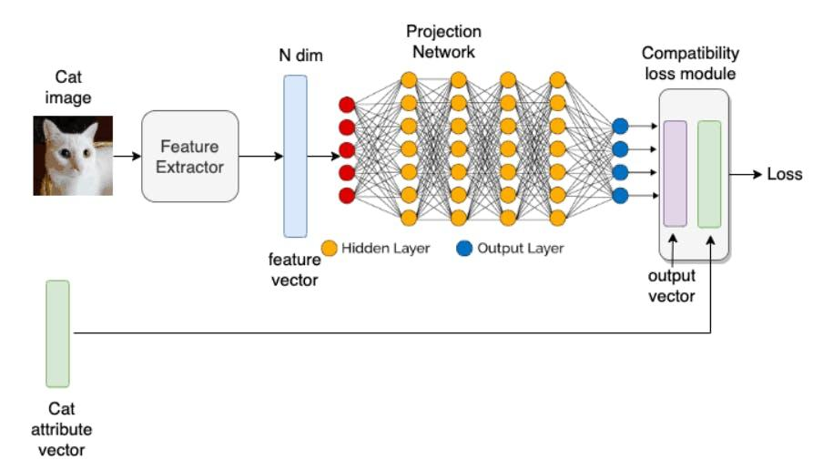

## Table of Contents

## What is zero-shot learning?

Zero-shot learning is a way for computers to recognize and understand things they have never seen before. Imagine you have never seen a zebra, but you know what a horse and a striped pattern look like. If someone tells you a zebra is like a horse with stripes, you can guess what a zebra looks like even though you've never seen one. That's similar to how zero-shot learning works. Computers use what they already know to make smart guesses about new things.

In zero-shot learning, computers use descriptions or other information to figure out new things. For example, if a computer knows about different animals and their features, it can use that knowledge to identify a new animal based on a description. This is useful because it means the computer doesn't need to be shown every single thing in the world to understand it. It can learn and adapt using the information it already has.

## How does zero-shot learning differ from traditional machine learning?

Zero-shot learning and traditional machine learning are different in how they learn and recognize things. Traditional machine learning needs to see lots of examples of something before it can recognize it. For example, if you want a computer to recognize cats, you have to show it many pictures of cats. The computer learns from these examples and then can tell if a new picture is a cat. This means the computer needs a lot of data to learn well.

On the other hand, zero-shot learning can recognize things it has never seen before. It uses what it already knows to make guesses about new things. For instance, if a computer knows about dogs and horses, and someone tells it that a zebra is like a horse with stripes, it can figure out what a zebra looks like without ever seeing one. This makes zero-shot learning very useful because it can work with less data and still understand new things.

In summary, traditional [machine learning](/wiki/machine-learning) relies heavily on having many examples to learn from, while zero-shot learning can use existing knowledge to understand new things without needing those examples. This difference makes zero-shot learning more flexible and efficient, especially when dealing with new or rare objects.

## What are the key components of a zero-shot learning system?

A zero-shot learning system has a few important parts that help it work. One key part is the knowledge base. This is like a big library of information that the system can use. It includes descriptions and features of different things, like animals or objects. For example, if the system knows that a tiger is a big cat with stripes, it can use this information to understand new things. Another important part is the way the system makes connections. It uses what it knows to guess about new things. If it knows about cats and stripes, it can guess what a tiger looks like even if it has never seen one.

The second key component is the model or algorithm that the system uses. This is like the brain of the system. It takes the information from the knowledge base and figures out how to use it to understand new things. The model needs to be good at understanding descriptions and making smart guesses. For example, if the system is told that a zebra is like a horse with stripes, the model uses this description to recognize a zebra. The model also needs to be able to learn and improve over time, so it gets better at understanding new things.

These components work together to make zero-shot learning possible. The knowledge base gives the system the information it needs, and the model uses this information to make guesses about new things. This way, the system can understand and recognize things it has never seen before, which makes it very useful and flexible.

## Can you explain the concept of semantic embeddings in zero-shot learning?

Semantic embeddings are a way to turn words and descriptions into numbers that a computer can understand. Imagine you have a bunch of words like "cat," "dog," and "tiger." Semantic embeddings help the computer see these words as points in a big space, where similar words are close together. For example, "cat" and "tiger" might be close because they are both big cats, while "dog" might be a bit further away. This helps the computer understand the meaning of words and how they relate to each other.

In zero-shot learning, semantic embeddings are really important. They let the computer use what it knows about words to guess about new things. For example, if the computer knows the embeddings for "horse" and "stripes," it can use these to understand what a "zebra" might be like, even if it has never seen one. By turning descriptions into numbers, the computer can make smart guesses and recognize new things without needing to see them first. This makes zero-shot learning more flexible and powerful.

## What are some common applications of zero-shot learning?

Zero-shot learning is used in many cool ways. One common use is in image recognition. Imagine you have a computer that can recognize lots of animals, but then you show it a picture of a new animal it has never seen before. With zero-shot learning, the computer can use what it knows about other animals to guess what the new animal might be. For example, if it knows about horses and stripes, it can figure out that a zebra is a horse-like animal with stripes, even if it has never seen a zebra before. This is really helpful for identifying rare or new things without needing lots of examples.

Another use of zero-shot learning is in natural language processing. This is when computers try to understand and use human language. If a computer knows about different topics and words, it can use zero-shot learning to understand new topics or questions. For example, if it knows about sports and cars, it can answer a question about a new type of sports car, even if it has never heard of that specific car before. This makes it easier for computers to talk to people and understand new things without needing to be taught everything from scratch.

Zero-shot learning is also used in recommendation systems. These are the systems that suggest things like movies or products to you. If a system knows about your interests and the things you like, it can use zero-shot learning to suggest new things that are similar, even if it has never recommended them before. For example, if you like action movies and the system knows about a new action movie, it can suggest that movie to you without needing to know everything about it first. This makes the recommendations more useful and personalized.

## How does zero-shot learning handle unseen classes during training?

Zero-shot learning is really good at figuring out new things it hasn't seen before. When a computer is trained, it usually sees lots of examples of different things, like pictures of cats and dogs. But with zero-shot learning, the computer can guess about new things, like a zebra, even if it has never seen a zebra during training. It does this by using what it already knows about other things, like horses and stripes. So, if someone tells the computer that a zebra is like a horse with stripes, it can use that information to understand what a zebra might look like.

This is really helpful because the computer doesn't need to see every single thing in the world to understand it. It can use descriptions and other information to make smart guesses about new things. For example, if the computer knows about different animals and their features, it can use that knowledge to identify a new animal based on a description. This makes zero-shot learning very flexible and useful, especially when dealing with new or rare objects that the computer hasn't been trained on before.

## What are the challenges faced in implementing zero-shot learning?

One big challenge in zero-shot learning is making sure the computer understands the descriptions well enough to make good guesses about new things. If the descriptions are not clear or if the computer doesn't have enough information, it might make wrong guesses. For example, if the computer knows about horses and stripes but doesn't know that zebras are black and white, it might think a zebra is a horse with any color stripes. This can lead to mistakes and make the computer less useful.

Another challenge is that zero-shot learning needs a lot of good data to work well. The computer needs a big library of information about different things to make smart guesses. If the data is not good or if there isn't enough of it, the computer might not be able to understand new things correctly. This means that people have to spend a lot of time and effort making sure the computer has the right information, which can be hard and expensive.

## What role do attribute-based methods play in zero-shot learning?

Attribute-based methods are really important in zero-shot learning. They help the computer understand new things by using descriptions of their features. For example, if the computer knows that a tiger has stripes and is a big cat, it can use these attributes to guess what a tiger looks like, even if it has never seen one. These methods turn the descriptions into numbers that the computer can understand and use to make smart guesses about new things. This makes zero-shot learning more flexible because the computer can use what it knows about different features to understand new objects.

One challenge with attribute-based methods is making sure the descriptions are clear and accurate. If the computer doesn't have good information about the attributes, it might make wrong guesses. For example, if the computer knows that a zebra has stripes but doesn't know they are black and white, it might think a zebra could have any color stripes. This can lead to mistakes. So, people need to make sure the computer has the right information about the attributes to help it understand new things correctly.

## How can zero-shot learning be evaluated and what metrics are used?

Evaluating zero-shot learning means checking how well the computer can guess about new things it has never seen before. One common way to do this is by using a test set that has examples of things the computer was not trained on. For example, if the computer was trained on pictures of cats and dogs, the test set might have pictures of zebras. The computer tries to guess what these new things are, and then people compare its guesses to the right answers to see how well it did.

There are different ways to measure how good the computer's guesses are. One popular metric is accuracy, which is just the percentage of guesses that were correct. Another metric is the F1 score, which looks at both how many correct guesses the computer made and how many it missed. The F1 score is good because it gives a balanced view of the computer's performance. People also use other metrics like precision and recall, which help understand different parts of the computer's guessing ability. By using these metrics, people can see how well zero-shot learning works and where it might need to improve.

## What advancements have been made in zero-shot learning algorithms recently?

Recently, there have been some cool advancements in zero-shot learning algorithms. One big improvement is in how computers understand and use descriptions. New methods help computers turn words and descriptions into numbers more accurately, which makes their guesses about new things better. For example, researchers have developed better ways to create semantic embeddings, which are like maps that show how words relate to each other. These improved embeddings help the computer understand the meaning of words more clearly, so it can make smarter guesses about new things it has never seen before.

Another advancement is in using more types of information to help the computer learn. Instead of just using pictures or words, new algorithms can use sounds, videos, and even touch to understand new things. This makes zero-shot learning more powerful because the computer can use different kinds of data to make its guesses. For example, if the computer knows what a dog looks like, sounds like, and feels like, it can use all this information to guess what a new type of dog might be like. These advancements are making zero-shot learning more flexible and useful in many different situations.

## How does transfer learning relate to zero-shot learning?

Transfer learning and zero-shot learning are both ways to help computers learn new things, but they do it a bit differently. Transfer learning is like when you learn something in one class and use that knowledge in another class. For example, if you learn math in school, you can use that math to help you understand science. In transfer learning, a computer learns from one task and uses that knowledge to do well in a new, similar task. It might be trained to recognize cats and then use that knowledge to help it recognize dogs, even if it hasn't seen as many dog pictures.

Zero-shot learning is a bit different. It's like if someone told you a zebra is a horse with stripes, and you can guess what a zebra looks like even if you've never seen one. In zero-shot learning, the computer uses descriptions and what it already knows to understand new things it has never seen before. It doesn't need to see examples of the new thing to recognize it. Both transfer learning and zero-shot learning help computers be more flexible and smart, but zero-shot learning can work with completely new things, while transfer learning usually needs some similar examples to start with.

## What future developments can we expect in the field of zero-shot learning?

In the future, we can expect zero-shot learning to get even better at understanding new things. One big change might be that computers will use more types of information, like sounds and videos, to help them learn. This means they can understand new things in more ways, making their guesses more accurate. Also, new ways to turn words and descriptions into numbers, called semantic embeddings, will get better. This will help computers understand the meaning of words more clearly, so they can make smarter guesses about new things they have never seen before.

Another thing we might see is zero-shot learning being used in more places. Right now, it's used in things like recognizing pictures and understanding language, but in the future, it could be used in more areas, like helping robots understand new objects or helping doctors diagnose new diseases. As computers get better at using what they know to understand new things, zero-shot learning will become more useful and important in our everyday lives.

## References & Further Reading

[1]: Xian, Y., Schiele, B., & Akata, Z. (2017). ["Zero-Shot Learning - A Comprehensive Evaluation of the Good, the Bad and the Ugly."](https://arxiv.org/abs/1707.00600) IEEE Transactions on Pattern Analysis and Machine Intelligence.

[2]: Silver, N., & Clark, D. (2012). ["The Signal and the Noise: Why So Many Predictions Fail—but Some Don't."](https://www.amazon.com/Signal-Noise-Many-Predictions-Fail/dp/0143125087) Penguin Group.

[3]: Lopez de Prado, M. (2018). ["Advances in Financial Machine Learning."](https://www.amazon.com/Advances-Financial-Machine-Learning-Marcos/dp/1119482089) Wiley.

[4]: Jansen, S. (2020). ["Machine Learning for Algorithmic Trading: Predictive models to extract signals from market and alternative data for systematic trading strategies with Python."](https://www.amazon.com/Machine-Learning-Algorithmic-Trading-alternative/dp/1839217715) Packt Publishing.