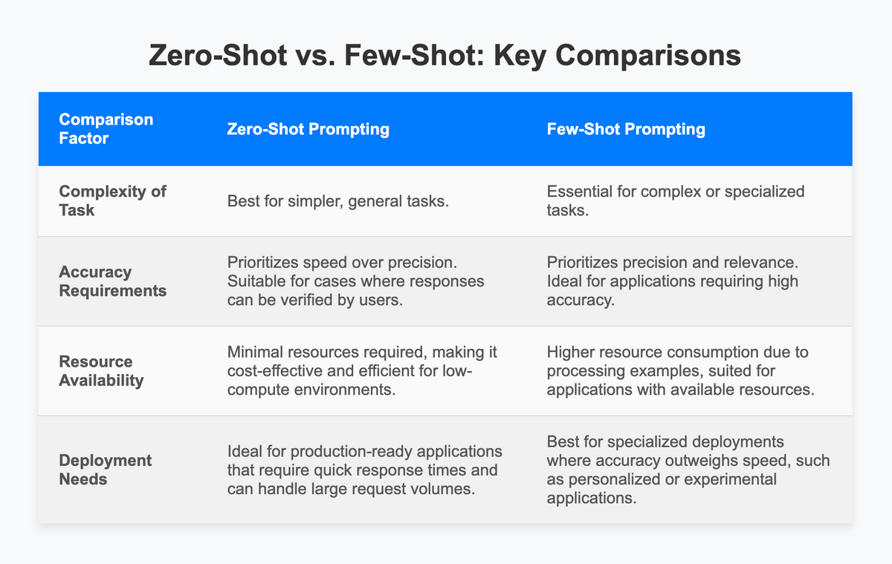

## Table of Contents

## What is Zero-Shot Prompting in machine learning?

Zero-Shot Prompting is a way to use machine learning models, especially big language models, to do tasks they haven't been specifically trained for. Imagine you have a model that knows a lot about different topics. With zero-shot prompting, you can ask this model to do something new, like translating a sentence from English to French, even if it wasn't trained to translate. You just give it a prompt, like "Translate the following English sentence to French:", and it tries its best to do what you asked.

This method is really useful because it lets you use the same model for many different tasks without needing to train it again for each one. For example, you could use the same model to summarize a news article, answer questions about history, or even generate a poem. The key is in how you write your prompt to guide the model to do what you want. However, the results might not always be perfect because the model is doing something it wasn't specifically trained for, but it can still be surprisingly good and save a lot of time and effort.

## How does Zero-Shot Prompting differ from traditional machine learning methods?

Zero-Shot Prompting is different from traditional machine learning methods because it doesn't need special training for each new task. In traditional machine learning, if you want a model to do something new, like recognizing different types of flowers, you would need to gather a lot of data about flowers, label it, and then train the model on this data. This process can take a lot of time and resources. With Zero-Shot Prompting, you can use a model that's already been trained on a wide range of topics and just ask it to do the new task by giving it a clear instruction or prompt. For example, you could tell the model, "Identify the type of flower in this picture," and it would try to do that without any specific training on flowers.

Another big difference is how flexible Zero-Shot Prompting is. Traditional methods are usually good at one thing they were trained for, but not so good at other things. If you trained a model to recognize cats, it might not be able to recognize dogs without more training. With Zero-Shot Prompting, the same model can try to do many different tasks just by changing the prompt. This makes it much easier to use one model for lots of different jobs, saving time and effort. However, the results might not be as accurate as a model that was specifically trained for a task, but it's often good enough and very convenient.

## What are the key components required for implementing Zero-Shot Prompting?

To implement Zero-Shot Prompting, you need a large language model that has been trained on a diverse set of data. This model should have a good understanding of many different topics and tasks because it will be used to do new things without further training. The model's ability to generalize from its existing knowledge is crucial. You can use models like those from the transformer family, such as BERT or GPT, which are known for their broad understanding and adaptability.

The second key component is the prompt itself. The prompt is the instruction or question you give to the model to guide it toward the task you want it to perform. Crafting an effective prompt is important because it helps the model understand what you're asking for. The prompt should be clear and specific, like "Summarize the following article:" or "Translate this sentence to Spanish:". The better the prompt, the more likely the model is to give you a good answer.

Lastly, you need a way to interact with the model, usually through an API or a user interface. This allows you to send the prompt to the model and receive its response. For example, you might use a Python script to send a prompt to a model hosted on a cloud service and then process the response. The ease of interaction makes it possible to use Zero-Shot Prompting in many different applications, from simple text processing to more complex tasks like generating creative content.

## Can you explain a simple example of Zero-Shot Prompting in natural language processing?

Imagine you have a big language model that knows a lot about different things. You want to use this model to translate a sentence from English to French, but the model was not specifically trained to translate languages. With Zero-Shot Prompting, you can still do this by giving the model a clear instruction. You could write a prompt like, "Translate the following English sentence to French: 'The cat is on the table.'" The model will then try its best to translate the sentence into French, even though it wasn't trained for this exact task.

For example, you might send the prompt to the model and get back a response like, "Le chat est sur la table." This shows that the model understood your instruction and used its general knowledge to perform the translation. Zero-Shot Prompting is useful because it lets you use the same model for many different tasks without needing to train it again for each new task. It's like asking a smart friend who knows a lot of things to help you with something new; they might not be perfect, but they can still give you a good answer.

## What are the advantages of using Zero-Shot Prompting over other approaches?

Zero-Shot Prompting has several advantages over traditional [machine learning](/wiki/machine-learning) approaches. One big advantage is that it's very flexible. With Zero-Shot Prompting, you can use the same model for many different tasks just by changing the prompt. For example, you can use the same model to summarize an article, translate a sentence, or answer a question about history. This saves a lot of time and effort because you don't need to train a new model every time you want to do something different. Traditional methods often need a lot of specific data and training for each new task, which can be slow and expensive.

Another advantage of Zero-Shot Prompting is that it can be very quick to implement. Once you have a good language model, you can start using it for new tasks right away. All you need to do is write a clear prompt, and the model will try to do what you ask. This makes it easy to experiment with different tasks and find out what the model can do without a lot of extra work. While the results might not always be perfect, they can often be good enough for many uses, making Zero-Shot Prompting a handy tool for many applications.

## What are the limitations or challenges faced when using Zero-Shot Prompting?

One big challenge with Zero-Shot Prompting is that the results might not always be very accurate. Since the model is doing something it wasn't specifically trained for, it can make mistakes. For example, if you ask the model to translate a sentence into a language it doesn't know well, the translation might be wrong. The model is trying its best with the knowledge it has, but it might not be enough for some tasks. This means you need to check the results carefully and be ready to fix any mistakes.

Another challenge is that the quality of the results can depend a lot on how you write the prompt. If your prompt is not clear or specific enough, the model might not understand what you want it to do. For example, if you ask the model to "summarize this," it might not know what "this" is referring to. You need to spend time figuring out how to write good prompts, which can take practice. Even with a good prompt, the model might still struggle with tasks that are very different from what it was trained on, so you have to be careful about what you expect it to do.

## How can Zero-Shot Prompting be applied in different domains such as image recognition and text classification?

In image recognition, Zero-Shot Prompting can be used to identify objects or scenes in pictures without specific training for those objects. Imagine you have a model that knows a lot about different things from text data. You can ask this model to describe what it sees in an image by giving it a prompt like, "What is in this picture?" Even though the model wasn't trained to recognize images, it can use its understanding of the world to make a guess. For example, if you show it a picture of a cat, it might say, "There is a cat in the picture." This method is useful because it lets you use the same model for different types of images without training it again for each new object.

In text classification, Zero-Shot Prompting can help categorize text into different groups without needing specific training for each category. Let's say you want to sort emails into "urgent" and "not urgent." You can use a language model and give it a prompt like, "Is this email urgent?" The model will then try to understand the email's content and decide if it's urgent or not. This is helpful because you don't need to train the model on thousands of examples of urgent and non-urgent emails; you just need to write a good prompt. However, the model might make mistakes if the prompt is not clear or if the task is too different from what it was trained on.

## What role do pre-trained models play in Zero-Shot Prompting?

Pre-trained models are very important for Zero-Shot Prompting. They are big language models that have already learned a lot from a huge amount of data. When you use Zero-Shot Prompting, you're asking these models to do new tasks they haven't been trained for specifically. The model uses what it already knows to try and do what you ask. For example, if you ask it to translate a sentence, it will use its understanding of different languages to make a guess, even if it wasn't trained to translate.

The quality of the results in Zero-Shot Prompting depends a lot on how good the pre-trained model is. A model that has been trained on a wide range of topics and data will be better at understanding and doing new tasks. If the model knows a lot about the world, it can make better guesses when you give it a new prompt. However, even the best models might make mistakes because they are trying to do something they weren't specifically trained for. So, the pre-trained model is the key to making Zero-Shot Prompting work, but it's not perfect and you need to be ready for some errors.

## How can the performance of Zero-Shot Prompting be evaluated and improved?

To evaluate the performance of Zero-Shot Prompting, you can use different tests to see how well the model does on new tasks. One way is to compare the model's answers to the right answers, called ground truth. You can count how many times the model gets it right or wrong. For example, if you ask the model to translate sentences, you can check how many translations are correct. Another way is to use scores like accuracy, precision, and recall to see how good the model is. These scores help you understand if the model is doing well or if it needs to be better. You can also ask people to look at the model's answers and say if they are good or not. This can give you a better idea of how useful the model's answers are in real life.

To improve the performance of Zero-Shot Prompting, you can try different things. One way is to make the prompts better. If you write clearer and more specific prompts, the model might understand what you want better and give better answers. You can also try using a bigger or better pre-trained model. A model that knows more about the world might do better at new tasks. Sometimes, you can also give the model a few examples of what you want it to do, which is called few-shot learning. This can help the model understand the task better without needing a lot of training. By trying these things, you can make the model's answers more accurate and useful for new tasks.

## What are some of the latest research developments in Zero-Shot Prompting?

Recent research in Zero-Shot Prompting has focused on improving the way models understand and follow prompts. One big development is the use of better prompt engineering techniques. Researchers have found that by carefully designing prompts, they can get much better results from the same model. For example, instead of just saying "Translate this sentence," they might say, "Translate this sentence from English to French, keeping the meaning the same." This helps the model understand exactly what to do. Another area of research is using few-shot learning, where the model is given a few examples before being asked to do the task. This can help the model do better on new tasks without needing a lot of training.

Another exciting development is the use of more advanced pre-trained models. These models are trained on even bigger and more diverse datasets, which helps them understand a wider range of topics and tasks. For example, models like the latest versions of GPT have been trained on huge amounts of text from the internet, [books](/wiki/algo-trading-books), and other sources. This makes them better at Zero-Shot Prompting because they have a deeper understanding of the world. Researchers are also working on ways to combine different types of models, like language models and image recognition models, to do even more complex tasks. This could mean using Zero-Shot Prompting to not just understand text, but also to describe pictures or even create new images based on text prompts.

## How does Zero-Shot Prompting handle tasks with no training data?

Zero-Shot Prompting lets a model do new tasks without any specific training data. Imagine you have a big language model that knows a lot about different things. You can ask this model to do something new, like translating a sentence or describing a picture, just by giving it a clear instruction or prompt. The model uses what it already knows to try and do what you ask. For example, if you tell it to "Translate this sentence to French," it will use its understanding of different languages to make a guess, even though it wasn't trained to translate.

The key to making Zero-Shot Prompting work is having a good pre-trained model and writing clear prompts. The model needs to be trained on a lot of different data so it can understand many topics. When you give it a new task, the model tries its best with the knowledge it has. If your prompt is clear and specific, the model is more likely to understand what you want and give you a good answer. While the model might not always be perfect because it's doing something it wasn't trained for, it can still be very helpful and save a lot of time and effort.

## What future advancements can we expect in the field of Zero-Shot Prompting?

In the future, we can expect Zero-Shot Prompting to get even better and more useful. Researchers are working on ways to make prompts clearer and more specific, which will help models understand what we want them to do better. They are also training models on bigger and more diverse sets of data, so the models will know more about the world and be able to handle new tasks better. For example, models might be able to describe pictures more accurately or translate languages they don't know well now. This means Zero-Shot Prompting could be used in more places, like helping doctors understand medical reports or helping people learn new languages.

Another exciting thing that might happen is combining different types of models, like language models and image recognition models, to do even more complex tasks. This could let us use Zero-Shot Prompting to not just understand text, but also to create new images or even videos based on what we write. As these technologies keep improving, Zero-Shot Prompting will become a powerful tool that can help us in many different ways, making it easier to use one model for many tasks without needing a lot of training data.