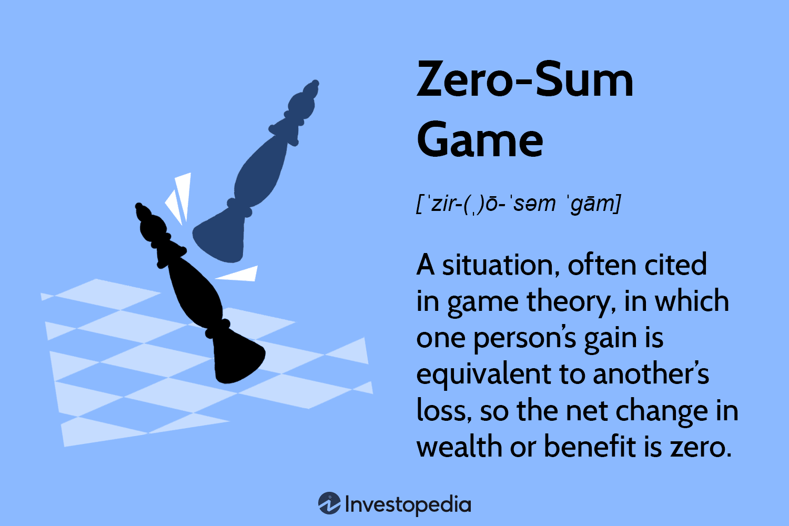

In the financial world, the concept of a zero-sum game frequently emerges, particularly within the domains of trading and investment. A zero-sum game represents a situation where one participant's gain or loss is exactly balanced by the losses or gains of another participant. This concept is primarily observed in financial markets, where profits and losses are consistently redistributed among participants. For example, in futures and options trading, the profit of one party equates directly to the loss of another, creating a zero-sum framework for the involved parties.

This article endeavors to explore the intricate balance between financial strategies, zero-sum games, and algorithmic trading, offering insights into these essential aspects of finance. The interplay between these elements is crucial for understanding market dynamics and formulating effective financial strategies tailored to the competitive landscape of trading and investment.



Algorithmic trading, which employs sophisticated algorithms to make trading decisions at high speeds, is a growing area of interest for investors seeking to exploit market inefficiencies that are characteristic of zero-sum environments. By comprehensively grasping zero-sum dynamics, individual investors and large financial institutions can enhance their market positions, improve risk management practices, and optimize resource allocation.

Understanding these concepts is pivotal not only for those aiming to maximize returns but also for anyone involved in the broader financial ecosystem. Insights from zero-sum game strategies and algorithmic trading are integral for navigating the complexities of modern financial markets, where rapid technological advancements continue to shape traditional and emerging paradigms of trading and investment.

## Table of Contents

## Understanding Zero-Sum Games in Finance

A zero-sum game in finance describes a situation where one participant's gain is exactly balanced by another participant's loss. This concept is prevalent in various financial instruments and markets, where trades are executed such that the net wealth change among participants is zero. One clear example of a zero-sum game is found in futures and options trading. 

In futures contracts, two parties agree to buy and sell an asset at a predetermined price at a future date. If the asset's price moves in favor of one party, resulting in a gain, the counterparty will experience a loss of equivalent magnitude. Similarly, options trading involves contracts that give the holder the right, but not the obligation, to buy or sell an asset at a specified price. The profitability of these contracts for one trader means a corresponding loss for the other involved party.

The implications of zero-sum games in financial contexts extend into areas like trading and portfolio management. For traders, understanding the zero-sum nature of certain financial markets is critical for strategizing potential gains while acknowledging the inherent risk of equivalent losses. Therefore, traders often engage in comprehensive market analysis and employ risk management techniques to mitigate potential downsides.

In portfolio management, the concept influences asset diversification and hedging strategies. Managers may choose to balance zero-sum constituents within a diversified portfolio to offset risk. For example, holding positions in both calls and puts in options markets can help neutralize potential losses, assuming price movements affect both strategies equally but in opposing directions.

Overall, zero-sum games underscore the competitive and compensatory nature of certain financial markets. Participants must leverage sound analytical methodologies and strategic execution to achieve desired financial outcomes.

## Zero-Sum vs. Positive-Sum Games

Zero-sum games and positive-sum games represent two fundamental concepts in game theory and economics, each with distinct implications for financial markets. Zero-sum games are characterized by a fixed amount of resources or wealth, meaning that one participant's gain is precisely equal to another participant's loss. This often manifests in financial instruments such as futures and options, where the net wealth in the system remains constant, merely redistributed among the players. Mathematically, a zero-sum game can be represented as:

$$
\sum_{i=1}^{n} u_i = 0
$$

where $u_i$ is the payoff to player $i$. For any gain by one player, there is an equivalent loss by another.

In contrast, positive-sum games emerge when the total wealth or value can increase, creating opportunities for win-win outcomes. Economic growth, innovation, or effective negotiation can result in enlarging the overall "pie," thereby allowing all participants to benefit. This is frequently seen in equity markets where efficient capital allocation and corporate growth can lead to an increase in shareholder value for all investors.

Financial markets often display both zero-sum and positive-sum dynamics. For instance, trading in derivatives like options can be a zero-sum game—as every dollar gained by one party results in an equivalent dollar lost by another. However, investing in stocks might be a positive-sum game since, in the long run, companies grow, innovate, and generate profits, thus increasing the overall value for investors. 

Understanding whether a scenario is a zero-sum or positive-sum game is crucial for constructing effective financial strategies. In a zero-sum situation, the focus might be on outperforming competitors through superior analysis or execution. Strategies such as hedging can be used to mitigate losses and capitalize on short-term market inefficiencies. Conversely, in a positive-sum environment, strategies may emphasize long-term growth, collaboration, and investing in innovation to maximize collective gains.

By aligning financial goals with an understanding of these game dynamics, investors and institutions can more strategically navigate markets to achieve desired outcomes.

## Game Theory and Its Application in Finance

Game theory provides a valuable framework for analyzing competitive interactions, especially in finance, where the outcomes depend not only on one's actions but also on those of others. In financial markets, this involves predicting competitors' behavior, assessing market conditions, and optimizing decision-making strategies.

Key concepts like Nash Equilibrium and strategic dominance are central in game theory. Nash Equilibrium occurs when no player can gain by unilaterally changing their strategy if the strategies of others remain unchanged. In financial markets, this translates to situations where market participants reach a balance of buy and sell actions, making substantial profits unlikely without a change in broader market conditions.

Strategic dominance involves selecting strategies that yield better payoffs regardless of what competitors do. In finance, this might mean choosing investment vehicles or trading strategies that outperform others consistently, irrespective of market fluctuations.

Algorithmic trading is an area where game theory significantly impacts financial strategies. Algorithms are crafted to exploit small inefficiencies in the market at high speeds, optimizing trades based on game theoretic principles. For example, in high-frequency trading, algorithms might anticipate the movements of other market participants, positioning orders in a way that captures favorable price changes.

Consider a simple [algorithmic trading](/wiki/algorithmic-trading) scenario involving two traders competing in a stock market. Each trader must decide whether to buy, sell, or hold stocks. The payoff depends on the price movement, which is influenced by both traders' actions. Using Nash Equilibrium, each trader predicts the other's moves and strategizes accordingly, achieving optimal payoffs over time.

Incorporating game theory into algorithmic trading involves advanced statistical techniques and [machine learning](/wiki/machine-learning) models to predict market conditions and participant behavior. Python, a popular language for algorithmic traders, provides libraries like NumPy and pandas for data analysis, and SciPy for optimization tasks. Below is a basic illustration of how game theory concepts might be coded in Python:

```python
import numpy as np
from scipy.optimize import minimize

# Define a simple payoff matrix for two traders
payoff_matrix = np.array([[4, 1], [2, 3]])

# Function to calculate the Nash Equilibrium
def nash_equilibrium(payoff):
    # Objective function to minimize negative payoffs
    def objective(x):
        return -np.min(np.dot(payoff, x))

    # Constraints for probabilities of strategies
    constraints = ({'type': 'eq', 'fun': lambda x: np.sum(x) - 1})

    # Bounds for each strategy's probability
    bounds = [(0, 1), (0, 1)]

    # Initial guess
    x0 = np.array([0.5, 0.5])

    # Solve for equilibrium probabilities
    result = minimize(objective, x0, bounds=bounds, constraints=constraints)
    return result.x

equilibrium = nash_equilibrium(payoff_matrix)
print(f"Nash Equilibrium probabilities: {equilibrium}")
```

This script showcases a simplified approach to calculate Nash Equilibrium for a given payoff matrix, a critical step in strategic decision-making in trading scenarios.

Game theory's integration into financial strategies allows traders and institutions to better anticipate competitor moves, optimize their actions, and ultimately gain competitive advantages in the complex landscape of financial markets.

## Algorithmic Trading: The Intersection of Strategy and Technology

Algorithmic trading refers to the use of computer algorithms to automate trading decisions, executing orders at speeds and frequencies that surpass human capabilities. This approach to trading leverages strategies based on predefined instructions, accounting for variables such as timing, price, and [volume](/wiki/volume-trading-strategy). The fast-paced nature of algorithmic trading allows for the capture of short-lived market inefficiencies, which are often integral to the zero-sum game aspects of financial markets.

In a zero-sum environment, the gain of one trader is directly offset by the loss of another. Algorithmic trading systems are designed to exploit these inefficiencies by quickly identifying [arbitrage](/wiki/arbitrage) opportunities, price discrepancies, and momentary mispricings. An example of this would be index arbitrage, where an algorithm could identify a divergence between the futures price of a stock index and its underlying equities, executing trades to exploit the price difference until equilibrium is restored.

Algorithmic trading fits into the broader framework of financial strategies by incorporating game theory principles. This involves anticipating the actions of other market participants and calibrating responses to achieve optimal outcomes. Algorithms can be programmed to simulate various strategic interactions, calculating the Nash Equilibrium or identifying dominant strategies within competitive scenarios. Strategies like [statistical arbitrage](/wiki/statistical-arbitrage) make use of historical data to project mean-reverting behaviors, thereby generating profits from marginal deviations in asset prices.

The integration of machine learning is further enhancing the capabilities of algorithmic trading. Algorithms can now learn from historical data patterns, adapting to evolving market conditions with minimal human intervention. For instance, [reinforcement learning](/wiki/reinforcement-learning) algorithms are being developed to optimize trading strategies by learning to adapt decisions based on feedback from previous trades.

Algorithmic trading's effectiveness lies in its ability to sift through vast amounts of market data in real time, making precise and calculated decisions. This technology-driven approach benefits from computational power and speed, ensuring that trading strategies are executed more efficiently and effectively than traditional methods. As financial markets continue to evolve, algorithmic trading remains a vital tool, enabling traders to navigate complex market dynamics with strategic precision.

## Examples of Zero-Sum Games in Financial Markets

Derivatives markets, most notably options and futures, represent quintessential examples of zero-sum games in finance. In these markets, every financial gain for one participant is matched by a corresponding loss for another. This direct transfer of wealth highlights the competitive nature of trading in these instruments.

### Options Trading

Options are financial derivatives that give the holder the right, but not the obligation, to buy or sell an underlying asset at a predetermined price on or before a certain date. There are two primary types of options: call options, which provide the right to purchase an asset, and put options, which provide the right to sell an asset. 

When an investor purchases a call option, they do so with the expectation that the underlying asset's price will exceed the strike price by more than the premium paid for the option. Conversely, the option writer (or seller) is betting that this situation will not occur. The payoff for a call option at expiration can be mathematically represented as:

$$
\text{Payoff} = \max(0, S - K) - C
$$

Where:
- $S$ is the spot price of the underlying asset at expiration,
- $K$ is the strike price of the option,
- $C$ is the premium paid for the option.

For the call writer, the payoff equation is simply the inverse:

$$
\text{Payoff} = C - \max(0, S - K)
$$

In this zero-sum framework, the gain realized by the option holder comes at the expense of the option writer, and vice versa.

### Futures Contracts

Futures are standardized contracts obligating one party to buy, and the other to sell, a specific quantity of an asset at a specific future date and price. As with options, futures contracts illustrate the zero-sum nature of certain financial instruments.

Consider a scenario where two parties enter into a futures contract for [crude oil](/wiki/crude-oil) at a fixed price of $70 per barrel, to be delivered in six months. If the market price at expiration is $75 per barrel, the buyer of the contract profits by purchasing below market rate, and the seller incurs an equivalent loss. The reverse is true if the market price drops to $65 per barrel.

In mathematical terms, the payoff for the futures buyer can be expressed as:

$$
\text{Payoff} = (S - F) \times Q
$$

Where:
- $S$ is the spot price at expiration,
- $F$ is the futures price agreed upon in the contract,
- $Q$ is the quantity of the asset.

For the futures seller, the payoff formula is the negative of the buyer's:

$$
\text{Payoff} = (F - S) \times Q
$$

### Real-World Examples

One striking example of the zero-sum nature of derivatives trading can be seen in the 2008 financial crisis, where many institutions that held large positions in mortgage-backed securities experienced significant losses that were gains for others who bet against those securities, such as through credit default swaps.

In summary, derivatives markets vividly illustrate the zero-sum game concept in finance. While opportunities exist to create profit, they are inherently tied to corresponding losses. Understanding these dynamics is essential for participants seeking to navigate these markets effectively. These examples underscore both the potential rewards and the substantial risks inherent in derivatives trading.

## Strategizing in a Zero-Sum Environment

In zero-sum environments such as options and futures markets, developing effective strategies necessitates a thorough understanding of the competitive landscape and recognizing one's position within it. The intrinsic nature of zero-sum games means that one investor's gain is precisely equal to another's loss. Consequently, success hinges on deploying well-considered strategies that account for this competitive equilibrium. 

**Risk Management**

In zero-sum games, risk management is paramount. Mitigating potential losses while maximizing gains is crucial. Investors can employ techniques such as stop-loss orders, which automatically sell a stock when its price falls below a predetermined level, thereby limiting potential losses. The concept of Value at Risk (VaR) is also pertinent, providing an estimate of the potential loss in value of a portfolio over a defined period for a given confidence interval. For example, a daily VaR of $1 million at 95% confidence level implies that there is a 5% chance the portfolio could lose more than $1 million in a day.

**Efficient Capital Allocation**

Another critical aspect is the efficient allocation of capital. Investors should identify the best opportunities to deploy their resources, maximizing returns relative to the risks. Portfolio diversification is one method, spreading investments across various financial instruments or sectors to minimize exposure to any single economic event. Consider the following formula for portfolio variance:

$$
\sigma_p^2 = \sum_{i=1}^{n} w_i^2 \sigma_i^2 + \sum_{i=1}^{n} \sum_{j \neq i} w_i w_j \sigma_i \sigma_j \rho_{ij}
$$

where $\sigma_p^2$ is the portfolio variance, $w_i$ and $w_j$ are the weights of assets $i$ and $j$, $\sigma_i$ and $\sigma_j$ are the standard deviations of the assets, and $\rho_{ij}$ is the correlation coefficient between assets $i$ and $j$. Reducing correlations between assets lowers the overall risk.

**Expectation Management**

Expectation management is equally essential. Investors must maintain realistic performance expectations based on market conditions and their strategies. Employing scenario analysis can assist in understanding potential outcomes under various market conditions, facilitating informed decision-making. This analysis might use simulations or historical data to project future performance and align expectations with quantitative insights.

By synthesizing these strategic approaches—risk management, efficient capital allocation, and expectation management—in zero-sum environments, investors can craft robust strategies aimed at maximizing their returns while navigating the inherent challenges of these competitive markets. This strategic alignment not only identifies and exploits market inefficiencies but also prepares investors to adapt quickly to emerging trends and market shifts.

## The Future of Zero-Sum Games in Finance

As technology continues its relentless advance, the nature of zero-sum games in the financial sector is undergoing significant transformations, primarily driven by [artificial intelligence](/wiki/ai-artificial-intelligence) (AI) and machine learning (ML). These technologies are not only increasing the speed and efficiency of trading decisions but are also redefining the strategic approaches within zero-sum environments.

AI and ML provide sophisticated data analysis capabilities, enabling traders to identify market patterns and inefficiencies that were previously undetectable. For instance, algorithms can process vast amounts of data better and faster than human analysts, leading to more informed decision-making. This technological shift is gradually moving trading from human intuition to data-driven strategies, thus increasing the precision and reducing the risk associated with zero-sum trades.

One of the key future trends is the personalization of trading algorithms. These algorithms can adapt to individual trader profiles, preferences, and risk tolerance, thereby optimizing performance. Moreover, AI's predictive analytics allow for the anticipation of market movements, providing traders a competitive edge in zero-sum games where timing is crucial. The use of natural language processing (NLP) to analyze news sentiment and social media discussions is another area of development, potentially influencing trading strategies based on real-time information flow.

Another innovation poised to impact zero-sum game strategies is the integration of blockchain technology with AI and ML. Blockchain offers transparency and security, reducing the likelihood of fraudulent activities that can distort market fairness, while AI and ML enhance trading strategies on this secure foundation.

The ethical considerations and regulatory challenges posed by AI in trading are also shaping the future of zero-sum games. As these technologies evolve, maintaining market integrity and protecting investors are paramount, necessitating adaptive regulatory frameworks to ensure fair play in zero-sum scenarios.

In conclusion, the convergence of AI and ML in financial trading presents both opportunities and challenges for zero-sum games. Traders who embrace these technological advancements stand to benefit from enhanced strategies and improved returns, while those who resist may find themselves at a disadvantage. As the landscape continues to evolve, staying informed of technological trends and regulatory changes will be crucial for success in future zero-sum financial markets.

## Conclusion

Understanding zero-sum games is essential for participants in the financial markets, as these games fundamentally define the competitive nature of trading and investing. In a zero-sum context, one participant's financial gain is precisely offset by another's loss, highlighting the direct adversarial relationships within these transactions. For instance, derivative trading, such as options and futures, exemplifies zero-sum conditions, where the payoff structure creates explicit winners and losers.

Game theory provides valuable insights into these dynamics by enabling investors to analyze the strategic interactions among market participants. Understanding concepts like Nash Equilibrium can help predict how rational players might behave, allowing traders to devise strategies that exploit these predictable actions. Algorithmic trading, at the intersection of finance and technology, leverages these principles to execute trades at optimal times, exploiting minute market inefficiencies that human traders might miss.

The ability to adapt and think strategically is paramount for success in zero-sum environments. Financial markets are dynamic, continuously influenced by technological progress and changing market conditions. Emerging technologies, such as artificial intelligence and machine learning, are reshaping trading strategies and enhancing the adaptability of algorithmic systems. By integrating these technologies, investors can maintain a competitive edge, adjusting strategies to the evolving landscape of zero-sum games.

Ultimately, navigating the complexities of zero-sum scenarios requires not only an understanding of strategic interactions and technology-driven solutions but also a readiness to adapt swiftly. Staying informed about market conditions and technological advances will allow investors to capitalize on opportunities and manage risks effectively, emphasizing the importance of continuous learning and strategic foresight in achieving financial success.

## References & Further Reading

[1]: Bergstra, J., Bardenet, R., Bengio, Y., & Kégl, B. (2011). ["Algorithms for Hyper-Parameter Optimization."](https://dl.acm.org/doi/10.5555/2986459.2986743) Advances in Neural Information Processing Systems 24.

[2]: ["Advances in Financial Machine Learning"](https://www.amazon.com/Advances-Financial-Machine-Learning-Marcos/dp/1119482089) by Marcos Lopez de Prado

[3]: ["Evidence-Based Technical Analysis: Applying the Scientific Method and Statistical Inference to Trading Signals"](https://www.amazon.com/Evidence-Based-Technical-Analysis-Scientific-Statistical/dp/0470008741) by David Aronson

[4]: ["Machine Learning for Algorithmic Trading"](https://github.com/PacktPublishing/Machine-Learning-for-Algorithmic-Trading-Second-Edition) by Stefan Jansen

[5]: ["Quantitative Trading: How to Build Your Own Algorithmic Trading Business"](https://www.amazon.com/Quantitative-Trading-Build-Algorithmic-Business/dp/1119800064) by Ernest P. Chan